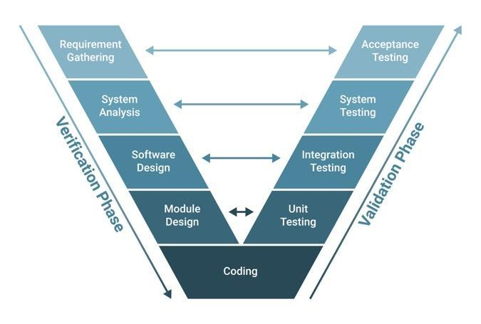

*ESTRUCTURACIÓN APP*

## *CORREDOR VIAL CHÍA -- MOSQUERA -- TOCAIMA -- GIRARDOT Y RAMAL AL MUNICIPIO DE SOACHA, VARIANTE DE COTA Y VÍAS COMPLEMENTARIAS*

### ENTREGABLE #19

# SISTEMAS INTELIGENTES DE TRANSPORTE (ITS)

## SECTOR - GENERAL

junio de 2026

  -------------------------------------------------------------------------------------------------------------------------------------------------------------------------------------
  {width="2.879965004374453in" height="0.6692913385826772in"}   {width="2.442979002624672in" height="0.6692913385826772in"}
  ------------------------------------------------------------------------------------------ ------------------------------------------------------------------------------------------

  -------------------------------------------------------------------------------------------------------------------------------------------------------------------------------------

**HOJA DE CONTROL:**

  ---------------------------------------------------------------------------------------------------------------------------------------------------
  **Contrato:**     Estudios de factibilidad para la construcción de la carretera Chía -- Girardot, variante Socha, variante Cota y vías colectoras
  ----------------- ---------------------------------------------------------------------------------------------------------------------------------
  **Cliente:**      International Finance Corporation - IFC.

  **Referencia:**   FC0CMG.

  **Productos:**    ENTREGABLE #19 - SISTEMAS INTELIGENTES DE TRANSPORTE (ITS)

  **Folios**        Documento contiene 275 folios.

  ---------------------------------------------------------------------------------------------------------------------------------------------------

**DATOS DEL DOCUMENTO**

+----------------------+------------------------------------------------------------+
| Título del documento | ENTREGABLE #19 - SISTEMAS INTELIGENTES DE TRANSPORTE (ITS) |
|                      |                                                            |
|                      | SECTOR - GENERAL                                           |
+======================+============================================================+
| Código del documento | FC0CMG-TEC-GEN-0000-IN-ITS-0001_V00                        |
+----------------------+------------------------------------------------------------+

Este Documento ha sido revisado y aprobado como se indica abajo. Las modificaciones realizadas se describen a continuación en el índice de modificaciones. Por favor destruir todas las revisiones previas.

**ÍNDICE DE MODIFICACIONES**

  --------------------------------------------------------------------------------------
  Revisión No.   Fecha        Sección modificada   Observaciones
  -------------- ------------ -------------------- -------------------------------------
  V00            11/05/2026   \-                   Versión Inicial

  V01            01/06/2026   \-                   Ajustes al documento

  --------------------------------------------------------------------------------------

**TABLA DE CONTENIDO**

Pág.

# 1. INTRODUCCIÓN

# 2. PROPÓSITO DEL DOCUMENTO

# 3. OBJETIVOS

## 3.1. OBJETIVO GENERAL

## 3.2. OBJETIVOS ESPECÍFICOS

# 4. REVISIÓN Y CLASIFICACIÓN DE SERVICIOS ITS.

## 4.1. MARCO NORMATIVO Y LEGAL DE LOS SERVICIOS ITS

4.1.1 Ley 1702 de 2013: El Cimiento Jurídico de la Inteligencia Vial 19

4.1.2 Decreto 2060 de 2015: Gobernanza y Soberanía del Dato 19

4.1.3 Resolución 28675 DE 2022: Plan Maestro de ITS (PMITS) 20

## 4.2. DEFINICIÓN TÉCNICA DE LOS SERVICIOS ITS

### 4.2.1. Metodología de Priorización y Consenso Técnico

4.2.2 Definición de 10 servicios ITS prioritarios 22

4.2.3 Incorporación de Servicios ITS complementarios bajo el estándar ISO 14813 29

### 4.2.4. Servicios ITS Complementarios Aplicables al Corredor Chía -- Girardot

## 4.3. ANÁLISIS DE APLICABILIDAD SERVICIOS ITS EN EL CORREDOR

### 4.3.1. Necesidades Operacionales y de Gestión del Corredor

4.3.2 Matriz de Aplicabilidad Servicios ITS (Prioritarios + Complementarios) 32

### 4.3.3. Exclusión Técnica -- Servicios ITS aplicable al corredor

### 4.3.4. Definición de los Servicios estratégicos ITS

#### 4.3.4.1. Marco de la jerarquía de valor

#### 4.3.4.2. Dominios ITS

#### 4.3.4.3. Áreas de Servicios ITS

#### 4.3.4.4. Servicios Estratégicos ITS

#### 4.3.4.5. Subsistemas ITS

#### 4.3.4.6. Función Técnica

#### 4.3.4.7. Componentes de Campo

# 5. ARQUITECTURA ITS

## 5.1. DEFINICIÓN CONCEPTUAL Y ALCANCE ESTRATÉGICO

### 5.1.1. Definición Conceptual y Alcance Estratégico

### 5.1.2. Propósito y Enfoque de la Arquitectura

### 5.1.3. Articulación de Servicios Estratégicos y Arquitectura ITS

### 5.1.4. Atributos de Calidad y Principios de Diseño

#### 5.1.4.1. Integración

#### 5.1.4.2. Interoperabilidad

#### 5.1.4.3. Compatibilidad

#### 5.1.4.4. Escalabilidad

#### 5.1.4.5. Neutralidad Tecnológica

#### 5.1.4.6. Estabilidad y Resiliencia

#### 5.1.4.7. Ciberseguridad y Protección de la Información

## 5.2. MARCO DE GOBERNANZA Y GESTIÓN INSTITUCIONAL

### 5.2.1. Gobernanza y Escalabilidad del Modelo

5.2.2 Mapa de Roles, Competencias Legales y Alcance 52

#### 5.2.2.1. Autoridad Regional Concedente (ICCU)

#### 5.2.2.2. Autoridad de Regulación Nacional (Ministerio de Transporte)

5.2.2.3 Autoridad de Inspección, Vigilancia y Control (Supertransporte) 52

#### 5.2.2.4. Autoridad de Control Operativa (DITRA)

#### 5.2.2.5. Autoridad Líder de la Política de Seguridad Vial (ANSV)

#### 5.2.2.6. Servicios de Emergencia (Salud/Bomberos)

#### 5.2.2.7. Interventoría del Proyecto (Interventoría)

#### 5.2.2.8. Responsable de la Gestión Integral (El Concesionario)

#### 5.2.2.9. Autoridades Territoriales Locales (Alcaldías)

5.2.2.10 Usuarios del Servicio y Actores Viales Vulnerables 53

### 5.2.3. Soberanía y Propiedad del Dato

## 5.3. MARCOS DE REFERENCIA

### 5.3.1. Arquitectura de Referencia ITS

### 5.3.2. Estándares para la Interoperabilidad

### 5.3.3. Seguridad de la información y Ciberseguridad

### 5.3.4. Gestión de Activos y Modelado de Información (BIM)

## 5.4. ARQUITECTURA ITS POR NIVELES

5.4.1 Nivel 1: Servicios Estratégicos ITS 57

5.4.2 Nivel 2: Vista Lógica del Sistema 58

5.4.3 Nivel 3: Vista Física de la Arquitectura 58

5.4.4 Nivel 4: Vista de Comunicaciones 58

6 CONCEPTO DE OPERACIÓN (CONOPS) 59

## 6.1. MODELO DE REFERENCIA OPERACIONAL

## 6.2. ARTICULACIÓN INTEGRAL ITS

### 6.2.1. Cadena De Valor Tecnológica

6.2.2 E.1 Dominio (Eslabón Estratégico) 61

6.2.3 E.2 Servicio Estratégico (Eslabón Operacional) 61

6.2.4 E.3 Función Técnica (Eslabón Lógico) 62

6.2.5 E.4. Subsistema (Eslabón Sistémico) 62

6.2.6 E.5. Componente De Campo / Elemento (Eslabón Físico) 62

6.2.7 Ejemplo De Aplicación: Trazabilidad Del Sistema Seguro 62

## 6.3. ARTICULACIÓN OPERATIVA DE LA GOBERNANZA

## 6.4. DINÁMICA DE INTERACCIÓN Y MODELO TRANSACCIONAL

6.4.1 El Binomio Operativo: Reflejo vs. Conciencia 63

### 6.4.2. Interacción de Actores en la Cadena de Valor

## 6.5. ESCENARIOS OPERATIVOS DE VALIDACIÓN (EOV)

6.5.1 EOV-01: GESTIÓN DE LA VIDA Y SEGURIDAD VIAL 65

6.5.2 EOV-02: GESTIÓN DE TRÁFICO Y MOVILIDAD 68

6.5.3 EOV-03: GESTIÓN DE CARGA Y PESAJE (WIM) 70

6.5.4 EOV-04: GESTIÓN DE RESILIENCIA CLIMÁTICA 72

6.5.5 EOV-05: RECAUDO PEAJE ELECTRÓNICO Y VALIDACIÓN OPERATIVA 74

6.5.6 EOV-06: SOBERANÍA DEL DATO Y CIBERSEGURIDAD 76

6.5.7 EOV-07: GESTIÓN DE MANTENIMIENTO E INFRAESTRUCTURA 78

6.5.8 EOV-08: CIBERSEGURIDAD Y RESILIENCIA DE RED 80

6.5.9 EOV-09: GESTIÓN DE FISCALIZACIÓN Y CONTROL 82

6.5.10 EOV-10: GESTIÓN DE ELECTROMOVILIDAD 84

6.5.11 EOV-11: TELEGESTIÓN Y EFICIENCIA ENERGÉTICA 86

# 7. DISEÑO Y ESPECIFICACIÓN DE LOS COMPONENTES ITS

7.1 CC-01:CCTV (Sistema de Videovigilancia) 89

### 7.1.1. Descripción Funcional / Técnica

### 7.1.2. Justificación Estratégica

### 7.1.3. Requerimientos Funcionales (RF)

### 7.1.4. Requisitos No Funcionales (RNF)

### 7.1.5. Indicadores Clave De Rendimiento (KPIs)

7.2 CC-02: AID (Detección de Incidentes) 92

### 7.2.1. Descripción Funcional / Técnica

### 7.2.2. Justificación Estratégica

### 7.2.3. Requerimientos Funcionales (RF)

### 7.2.4. Requisitos No Funcionales (RNF)

### 7.2.5. Indicadores Clave De Rendimiento (KPIs)

7.3 CC-03: DMS/VMS (Sistema de Mensajería Variable) 95

### 7.3.1. Descripción Funcional / Técnica

### 7.3.2. Justificación Estratégica

### 7.3.3. Requerimientos Funcionales (RF)

### 7.3.4. Requisitos No Funcionales (RNF)

### 7.3.5. Indicadores Clave De Rendimiento (KPIs)

7.4 CC-04: ECS/SOS (Sistema de Llamada de Emergencia) 98

### 7.4.1. Descripción Funcional / Técnica

### 7.4.2. Justificación Estratégica

### 7.4.3. Requerimientos Funcionales (RF)

### 7.4.4. Requisitos No Funcionales (RNF)

### 7.4.5. Indicadores Clave De Rendimiento (KPIs)

7.5 CC-05: VDS/TDS (Sistema de Detección de Tráfico) 101

### 7.5.1. Descripción Funcional / Técnica

### 7.5.2. Justificación Estratégica

### 7.5.3. Requerimientos Funcionales (RF)

### 7.5.4. Requisitos No Funcionales (RNF)

### 7.5.5. Indicadores Clave De Rendimiento (KPIs)

7.6 CC-06: EMS (Sistema de Monitoreo Ambiental) 104

### 7.6.1. Descripción Funcional / Técnica

### 7.6.2. Justificación Estratégica

### 7.6.3. Requerimientos Funcionales (RF)

### 7.6.4. Requisitos No Funcionales (RNF)

### 7.6.5. Indicadores Clave De Rendimiento (KPIs)

7.7 CC-07: WIM (Pesaje Dinámico) 107

### 7.7.1. Descripción Funcional / Técnica

### 7.7.2. Justificación Estratégica

### 7.7.3. Requerimientos Funcionales (RF)

### 7.7.4. Requisitos No Funcionales (RNF)

### 7.7.5. Indicadores Clave De Rendimiento (KPIs)

7.8 CC-08: GMS-I (Sistema de Monitoreo Geotécnico - Inclinometría) 111

### 7.8.1. Descripción Funcional / Técnica

### 7.8.2. Justificación Estratégica

### 7.8.3. Requerimientos Funcionales (RF)

### 7.8.4. Requisitos No Funcionales (RNF)

### 7.8.5. Indicadores Clave De Rendimiento (KPIs)

7.9 CC-09: WLS (Sistema de Monitoreo Hídrico) 114

### 7.9.1. Descripción Funcional / Técnica

### 7.9.2. Justificación Estratégica

### 7.9.3. Requerimientos Funcionales (RF)

### 7.9.4. Requisitos No Funcionales (RNF)

### 7.9.5. Indicadores Clave De Rendimiento (KPIs)

7.10 CC-10: AVI / ETC (Sistema de Peajes Electrónicos) 118

7.10.1 Descripción Funcional / Técnica 118

7.10.2 Justificación Estratégica 119

7.10.3 Requerimientos Funcionales (RF) 119

7.10.4 Requisitos No Funcionales (RNF) 120

7.10.5 Indicadores Clave De Rendimiento (KPIs) 121

7.11 CC- 11: ALPR / LPR (Reconocimiento Automático de Placas) 121

7.11.1 Descripción Funcional / Técnica 122

7.11.2 Justificación Estratégica 122

7.11.3 Requerimientos Funcionales (RF) 122

7.11.4 Requisitos No Funcionales (RNF) 123

7.11.5 Indicadores Clave De Rendimiento (KPIs) 124

7.12 CC-12: SPD (Radar Pedagógico) 125

7.12.1 Descripción Funcional / Técnica 125

7.12.2 Justificación Estratégica 125

7.12.3 Requerimientos Funcionales (RF) 126

7.12.4 Requisitos No Funcionales (RNF) 127

7.12.5 Indicadores Clave De Rendimiento (KPIs) 127

7.13 CC-13: VSL (Velocidad Variable) 128

7.13.1 Descripción Funcional / Técnica 128

7.13.2 Justificación Estratégica 128

7.13.3 Requerimientos Funcionales (RF) 129

7.13.4 Requisitos No Funcionales (RNF) 130

7.13.5 Indicadores Clave De Rendimiento (KPIs) 131

7.14 CC- 14: PAS (Sistema de Megafonía / Public Address) 131

7.14.1 Descripción Funcional / Técnica 132

7.14.2 Justificación Estratégica 132

7.14.3 Requerimientos Funcionales (RF) 132

7.14.4 Requisitos No Funcionales (RNF) 133

7.14.5 Indicadores Clave De Rendimiento (KPIs) 134

7.15 CC-15: EC (Teléfonos de Emergencia SOS / Emergency Call) 135

7.15.1 Descripción Funcional / Técnica 135

7.15.2 Justificación Estratégica 136

7.15.3 Requerimientos Funcionales (RF) 136

7.15.4 Requisitos No Funcionales (RNF) 137

7.15.5 Indicadores Clave De Rendimiento (KPIs) 138

7.16 CC-16: NTCIP (Protocolos de Comunicación ITS) 139

7.16.1 Descripción Funcional / Técnica 139

7.16.2 Justificación Estratégica 140

7.16.3 Requerimientos Funcionales (RF) 140

7.16.4 Requisitos No Funcionales (RNF) 141

7.16.5 Indicadores Clave De Rendimiento (KPIs) 142

7.17 CC- 17: FO (Red Troncal de Fibra Óptica) 143

7.17.1 Descripción Funcional / Técnica 143

7.17.2 Justificación Estratégica 143

7.17.3 Requerimientos Funcionales (RF) 144

7.17.4 Requisitos No Funcionales (RNF) 145

7.17.5 Indicadores Clave De Rendimiento (KPIs) 145

7.18 CC-18: CCO (Centro de Control y Operaciones) 146

7.18.1 Descripción Funcional / Técnica 146

7.18.2 Justificación Estratégica 147

7.18.3 Requerimientos Funcionales (RF) 147

7.18.4 Requisitos No Funcionales (RNF) 148

7.18.5 Indicadores Clave De Rendimiento (KPIs) 149

7.19 CC-19: WAR (Gestión de Zonas de Obra) 150

7.19.1 Descripción Funcional / Técnica 150

7.19.2 Justificación Estratégica 150

7.19.3 Requerimientos Funcionales (RF) 151

7.19.4 Requisitos No Funcionales (RNF) 152

7.19.5 Indicadores Clave De Rendimiento (KPIs) 153

7.20 CC -20: GI (Interfaz de Peaje y Control de Acceso) 153

7.20.1 Descripción Funcional / Técnica 154

7.20.2 Justificación Estratégica 154

7.20.3 Requerimientos Funcionales (RF) 155

7.20.4 Requisitos No Funcionales (RNF) 155

7.20.5 Indicadores Clave De Rendimiento (KPIs) 156

7.21 CC-21: UPS (Alimentación Ininterrumpida) 157

7.21.1 Descripción Funcional / Técnica 157

7.21.2 Justificación Estratégica 157

7.21.3 Requerimientos Funcionales (RF) 158

7.21.4 Requisitos No Funcionales (RNF) 159

7.21.5 Indicadores Clave De Rendimiento (KPIs) 160

7.22 CC-24: PTZ (Cámaras Domo Motorizadas) 160

7.22.1 Descripción Funcional / Técnica 160

7.22.2 Justificación Estratégica 161

7.22.3 Requerimientos Funcionales (RF) 161

7.22.4 Requisitos No Funcionales (RNF) 162

7.22.5 Indicadores Clave De Rendimiento (KPIs) 163

7.23 CC-23: GW (Gateway de Interconexión ITS) 163

7.23.1 Descripción Funcional / Técnica 164

7.23.2 Justificación Estratégica 164

7.23.3 Requerimientos Funcionales (RF) 165

7.23.4 Requisitos No Funcionales (RNF) 165

7.23.5 Indicadores Clave De Rendimiento (KPIs) 166

7.24 CC-24: TMS (Software de Gestión de Tráfico) 167

7.24.1 Descripción Funcional / Técnica 167

7.24.2 Justificación Estratégica 168

7.24.3 Requerimientos Funcionales (RF) 168

7.24.4 Requisitos No Funcionales (RNF) 169

7.24.5 Indicadores Clave De Rendimiento (KPIs) 170

7.25 CC-25: MOB (Sistemas Móviles y Portátiles) 170

7.25.1 Descripción Funcional / Técnica 171

7.25.2 Justificación Estratégica 171

7.25.3 Requerimientos Funcionales (RF) 172

7.25.4 Requisitos No Funcionales (RNF) 173

7.25.5 Indicadores Clave De Rendimiento (KPIs) 173

7.26 CC-26: BKP (Sistemas de Respaldo y Recuperación) 174

7.26.1 Descripción Funcional / Técnica 174

7.26.2 Justificación Estratégica 175

7.26.3 Requerimientos Funcionales (RF) 175

7.26.4 Requisitos No Funcionales (RNF) 176

7.26.5 Indicadores Clave De Rendimiento (KPIs) 177

7.27 CC-27: SLP (Alumbrado Público Inteligente) 178

7.27.1 Descripción Funcional / Técnica 178

7.27.2 Justificación Estratégica 179

7.27.3 Requerimientos Funcionales (RF) 179

7.27.4 Requisitos No Funcionales (RNF) 180

7.27.5 Indicadores Clave De Rendimiento (KPIs) 180

7.28 CC-28: PSS (Sistema de Protección Perimetral) 181

7.28.1 Descripción Funcional / Técnica 181

7.28.2 Justificación Estratégica 182

7.28.3 Requerimientos Funcionales (RF) 182

7.28.4 Requisitos No Funcionales (RNF) 183

7.28.5 Indicadores Clave De Rendimiento (KPIs) 184

7.29 CC-29: ADS (Sistema de Detección de Amenazas) 184

### Descripción Funcional / Técnica 184

7.29.1 Justificación Estratégica 185

7.29.2 Requerimientos Funcionales (RF) 186

7.29.3 Requisitos No Funcionales (RNF) 187

7.29.4 Indicadores Clave De Rendimiento (KPIs) 187

7.30 CC-30: MSG (Mensajería de Seguridad General) 188

7.30.1 Descripción Funcional / Técnica 188

7.30.2 Justificación Estratégica 189

7.30.3 Requerimientos Funcionales (RF) 189

7.30.4 Requisitos No Funcionales (RNF) 190

7.30.5 Indicadores Clave De Rendimiento (KPIs) 191

7.31 CC-31: E-LOG (Sistema de Registro Electrónico) 191

7.31.1 Descripción Funcional / Técnica 191

7.31.2 Justificación Estratégica 192

7.31.3 Requerimientos Funcionales (RF) 193

7.31.4 Requisitos No Funcionales (RNF) 193

7.31.5 Indicadores Clave De Rendimiento (KPIs) 194

# 8. CONCLUSIONES Y CIERRE DE LA FASE ESTRATÉGICA

REFERENCIAS BIBLIOGRÁFICAS 197

**ÍNDICE FIGURAS**

Pág.

Figura 1. Jerarquía y Marco Normativo ITS - Chia- Girardot. [54](#_Toc229070556)

Figura 2. Arquitectura ITS. [55](#_Toc229070557)

Figura 3. Concepto de Operaciones ( CONOPS). [67](#_Toc229070558)

Figura 4. Metodología V. [70](#_Toc229070559)

Figura 5. Escenario de Operación (EOV). [72](#_Toc229070560)

**ÍNDICE TABLAS**

Pág.

**LISTA DE ABREVIACIONES**

Para facilitar la lectura de este informe, a continuación, se presenta un listado de los acrónimos, siglas y abreviaturas que se emplean a lo largo de este documento:

Tabla . Lista de Abreviaciones.

  --------------------------------------------------------------------------------------------------------------------------------------------------
  **ACRÓNIMO, SIGLA O ABREVIATURA**   **DEFINICIÓN TÉCNICA**                                   **ACTO ADMINISTRATIVO / REFERENCIA LEGAL**
  ----------------------------------- -------------------------------------------------------- -----------------------------------------------------
  ANI                                 Agencia Nacional de Infraestructura                      Ley 1508 de 2012 (Marco de APP).

  ANSV                                Agencia Nacional de Seguridad Vial                       Ley 1702 de 2013 (Creación y funciones).

  CCO                                 Centro de Control de Operación                           Res. 20223040028675 (PMITS - Cap. Operación).

  DAI                                 Detección Automática de Incidentes                       Res. 20223040028675 (Catálogo de Servicios).

  ETP                                 Especificaciones Técnicas Particulares                   Anexo Técnico del Contrato de Concesión.

  ICCU                                Instituto de Caminos y Construcciones de Cundinamarca    Ordenanza Departamental (Entidad Supervisora).

  IPAS                                Interoperabilidad de Peajes con Estándares Abiertos      Res. 20223040028675 (Estándar Nacional de Recaudo).

  ITS                                 Sistemas Inteligentes de Transporte                      Ley 1702 de 2013, Art. 2 (Definición Formal).

  IVC                                 Inspección, Vigilancia y Control                         Decreto 2060 de 2015 (Gobernanza de Datos).

  PMITS                               Plan Maestro de Sistemas Inteligentes de Transporte      Res. 20223040028675 (Adopción del Plan).

  SOS                                 Sistema de Auxilio / Telefonía de Emergencia             Res. 20223040028675 (Servicio de Asistencia).

  TAG                                 Dispositivo de Identificación Electrónica                Res. 20213040035125 (Regulación de Telepeaje).

  V2I                                 Vehicle-to-Infrastructure (Vehículo a Infraestructura)   Decreto 2060 de 2015 (Ejes de Interoperabilidad).

  VMS                                 Variable Message Signs (Señalización Dinámica)           Res. 20223040028675 (Servicio de Información).

  WIM                                 Weigh-In-Motion (Pesaje en Movimiento)                   Res. 20223040028675 (Servicio de Preservación).
  --------------------------------------------------------------------------------------------------------------------------------------------------

Fuente: Elaboración propia.

**LISTA DE ESTÁNDARES**

Para facilitar la lectura de este informe, a continuación, se presenta un listado de estándares técnicos que se emplean a lo largo de este documento:

Tabla . Estándares.

  ------------------------------------ ------------------------------------------------------------------- -----------------------------------------------------------------------------------------------------------------------------
  **ESTÁNDAR / MARCO DE REFERENCIA**   **DOMINIO TÉCNICO**                                                 **PROPÓSITO ESTRATÉGICO**

  ARC-IT (ISO 14813)                   Arquitectura de referencia para ITS/C-ITS.                          Define la estructura funcional y las interfaces lógicas para evitar silos tecnológicos.

  DATEX II (v3.5)                      Modelo de intercambio de datos de tráfico y viajes (CEN TS 16157,   Establece el lenguaje común para el intercambio de datos con el núcleo nacional (SINITT).

  ISO/IEC 27001                        Gobernanza de Información                                           Asegurar la confidencialidad, integridad y disponibilidad de los activos digitales estratégicos.

  NIST Cybersecurity Framework         Resiliencia Operativa                                               Provee la metodología para identificar, proteger, detectar, responder y recuperarse ante incidentes.

  IEC 62443                            Seguridad en Campo (OT)                                             Blindaje específico para hardware de vía (sensores y controladores) contra intrusiones físicas o lógicas.

  ISO 19650                            Gestión de Información                                              Metodología BIM para la organización y digitalización de la información del activo durante su ciclo de vida.

  ISO 55001                            Requisitos para sistemas de gestión de activos.                     Establece los requisitos para el mantenimiento predictivo y la sostenibilidad financiera del hardware instalado.

  IFC (ISO 16739-1)                    Neutralidad del Dato                                                Garantiza que los modelos digitales sean legibles por sistemas abiertos, eliminando la dependencia de software propietario.

  IEEE 802.11p / C-V2X                 Comunicación Vehicular                                              Preparar la infraestructura para la movilidad cooperativa y la comunicación vehículo-infraestructura.
  ------------------------------------ ------------------------------------------------------------------- -----------------------------------------------------------------------------------------------------------------------------

Fuente: Elaboración propia.

# INTRODUCCIÓN

La presente consultoría desarrolla la estructuración técnica para la implementación de los Sistemas Inteligentes de Transporte (ITS) en el corredor regional Chía -- Mondoñedo -- Girardot. Este proyecto comprende 306 km de infraestructura crítica que interconecta el centro del país, subdivididos estratégicamente en una vía arterial principal de 158 km y una red de vías colectoras de 148 km.

En el contexto de los proyectos de infraestructura 5G, el despliegue de soluciones tecnológicas se orienta, primordialmente, hacia el cumplimiento de una responsabilidad social y contractual centrada en la protección de la vida. Bajo este enfoque, la tecnología se integra como el eje transversal de la gestión vial para garantizar estándares superiores de seguridad y alcanzar una eficiencia operativa óptima que responda a las demandas del corredor. De esta manera, los ITS actúan como componentes habilitadores para la sostenibilidad del contrato de concesión bajo la autoridad del Instituto de Caminos y Construcciones de Cundinamarca (ICCU), adoptando los estándares técnicos y metodológicos de la Agencia Nacional de Infraestructura (ANI) para garantizar la excelencia operativa y la viabilidad técnica a largo plazo.

El proyecto se desarrolla bajo una modalidad Brownfield, entendida como la intervención técnica y actualización operativa de una infraestructura existente que se encuentra en plena explotación. En un corredor con una extensión de 306 km y un Tráfico Promedio Diario Anual (TPDA) de aproximadamente [40,000]{.mark} [vehículos]{.mark}, la transición hacia una concesión de Quinta Generación (5G) exige un modelo de gestión que supere el enfoque reactivo y garantice una reducción sostenida de la siniestralidad.

En este contexto, el proceso de estructuración de la nueva concesión incorpora un enfoque integral de seguridad vial que trasciende el cumplimiento normativo convencional, posicionando la protección de la vida como el eje central y transversal del modelo contractual. Bajo esta premisa, el futuro Concesionario asume el compromiso no solo de cumplir con estándares físicos de infraestructura y el despliegue de servicios tecnológicos, sino de implementar un sistema articulado de obligaciones técnicas, operativas, institucionales y de gestión. Dichas obligaciones están orientadas a la identificación temprana de riesgos mediante analítica de datos, la adopción de medidas preventivas y la mejora continua del desempeño tecnológico durante toda la vigencia del contrato, asegurando la escalabilidad y disponibilidad de los sistemas.

Estos lineamientos planteados se fundamentan en las mejores prácticas y estándares promovidos por la International Finance Corporación (IFC), articulados la política pública vigente de transformación digital y conectividad del Ministerio de Tecnologías de la Información y las Comunicaciones (MINTIC), las políticas de transporte inteligente del Ministerio de Transporte (Mintransporte) y diversos referentes técnicos internacionales. Este marco de referencia fortalece la coherencia sistémica entre el diseño, la operación y la gestión del corredor, consolidando un ecosistema de infraestructura inteligente bajo el enfoque integral de los Sistemas Inteligentes de Transporte (ITS) y los principios del Sistema Seguro promovido por la Ley 2251 de 2022.

La arquitectura tecnológica propuesta para los 158 km de vía arterial y 148 km de vías colectoras se define como el eje habilitador de este modelo preventivo. El despliegue de servicios ITS permite materializar obligaciones contractuales claras y medibles, transformando la infraestructura física en un activo inteligente. Este proceso se fundamenta en dos ejes estratégicos que estructuran la propuesta técnica:

● **Eje de Intervención Tecnológica y de Campo:** Orientado al fortalecimiento de las condiciones de seguridad mediante la gestión activa de la velocidad, la protección de cruces peatonales y zonas escolares, y el monitoreo de condiciones operativas, todo ello soportado por dispositivos de telemetría y señalización dinámica.

● **Eje de Gestión Contractual e Institucional:** Centrado en la definición de obligaciones permanentes que incluyen el registro digital de siniestros, la fiscalización y monitoreo integral a través de un ecosistema de dispositivos ITS (sensores de tráfico, cámaras de analítica avanzada, sistemas de pesaje dinámico, radares de velocidad, sensores ambientales y estaciones de conectividad), así como la gestión de redes de fibra óptica y plataformas tecnológicas centralizadas en el Centro de Control de Operación (CCO) y zonas de servicios.

Finalmente, como factor determinante para la soberanía tecnológica del Estado, se establece la obligatoriedad de una Gobernanza de datos robusta. El Concesionario deberá garantizar que la información generada por los equipos ITS cumpla con los estándares técnicos y de reporte exigidos por el Ministerio de Transporte, la Superintendencia de Transporte (SuperTransporte) y la Agencia Nacional de Seguridad Vial (ANSV). Esta integración de datos no solo responde a las funciones misionales de Inspección, Vigilancia y Control (IVC) de la SuperTransporte, sino que constituye un insumo estratégico para que la ANSV y Mintransporte fortalezcan la planeación sectorial y la política pública nacional, asegurando que el dato se convierta en el activo más valioso de la infraestructura para la toma de decisiones basadas en evidencia.

# PROPÓSITO DEL DOCUMENTO

El propósito central del presente instrumento consiste en documentar y definir la hoja de ruta técnica y funcional para la estructuración de los Sistemas Inteligentes de Transporte (ITS) aplicables en el corredor regional Chía -- Mondoñedo -- Girardot. Con el fin primordial de materializar los principios de gestión del riesgo en pro de la prevención y la protección de la vida, este documento se constituye como la base técnica para garantizar una eficiencia operativa superior y actuar como el habilitador fundamental para la sostenibilidad del contrato de concesión se tomará de base el modelo de quinta generación (5G), bajo la supervisión del Instituto de Caminos y Construcciones de Cundinamarca (ICCU) y siguiendo los estándares metodológicos de la Agencia Nacional de Infraestructura (ANI).

El presente documento desarrolla tres ejes estructurantes clave para el diseño, desarrollo, implementación y despliegue de servicios ITS. Esta hoja de ruta técnica define una solución integral de ITS compuesto por hardware, software y servicios conexos que garantizan la sostenibilidad de servicios asociados en vía, así como el diseño funcional del Centro de Control y Operaciones (CCO) y las zonas de servicios que componen el corredor y las vías colectoras.

El desarrollo de este documento se fundamenta en los siguientes pilares técnicos coordinados:

-   **Eje 1. Clasificación y Caracterización de Servicios ITS:** Este componente aborda la revisión exhaustiva y definición de los servicios contemplados en el Plan Maestro de ITS, expedido bajo la Resolución 20223040028675 del Ministerio de Transporte. Se realiza un análisis de aplicabilidad técnica para el proyecto, estableciendo objetivos operativos claros, identificando los subsistemas tecnológicos vinculados. Asimismo, se determinan los elementos de equipamiento de campo y la infraestructura de oficina necesarios para garantizar la operatividad de cada servicio, bajo los más altos estándares de calidad y desempeño exigidos en un entorno de infraestructura, el cual se tomará de base el modelo de quinta generación (5G),

-   **Eje 2. Definición de la Arquitectura ITS Aplicable:** Este componente establece la estructura jerárquica y multinivel del sistema, instrumentando la interacción y el flujo bidireccional de datos entre la capa de servicios ITS, la capa de subsistemas lógicos (orientada al procesamiento masivo, almacenamiento seguro y analítica avanzada) y la capa de componentes físicos (que integra los dispositivos de campo y la red troncal de telecomunicaciones de alta capacidad). El diseño de esta arquitectura de misión crítica garantiza una infraestructura altamente disponible, confiable, integrable, interoperable, escalable y segura con la capacidad técnica necesaria para soportar la alta demanda de tráfico de datos, asegurando la integridad de la información en todo momento.

-   **Eje 3. Concepto de Operación (ConOps):** Fundamentado en la Metodología en V definida en el anexo técnico de la Resolución 28675 de 2022, se desarrolla el modelo operativo sistémico para el proyecto. Este eje define los procesos críticos para la gestión del tráfico y la atención de incidentes, estableciendo los escenarios de operación entre los diversos actores viales, servicios ITS y las soluciones tecnológicas desplegadas.

-   **Eje 4. Diseño y Especificaciones de los Componentes ITS:** Este eje materializa la capacidad sensorial y de actuación del proyecto a través de la definición técnica de los 42 Componentes de Campo (CC-01 al CC-42). Este componente asegura que cada equipo cuente con el respaldo de proyectos reales en ejecución, facilitando la estimación y la planificación de ciclos de vida útil y reposición tecnológica conforme a las exigencias de una APP de quinta generación.

-   **Eje 5. Definición de Requerimientos Funcionales y No Funcionales:** En alineación con la Metodología en V, este eje establece las condiciones de cumplimiento para la solución tecnológica integral. Los Requerimientos Funcionales definen las capacidades operativas y prestaciones esperadas de cada subsistema (detección, pesaje, información y comunicación), mientras que los Requerimientos No Funcionales blindan la infraestructura mediante estándares de interoperabilidad ciberseguridad industrial y, fundamentalmente, la Soberanía del Dato, garantizando que la información sea un activo inalienable del Estado y que el ecosistema tecnológico sea agnóstico al fabricante.

En consecuencia, la articulación de estos 5 ejes estratégicos orientará la construcción del concepto de una concesión inteligente **bajo el modelo de quinta generación (5G)** con una visión estratégica, se consolida la metodología BIM (Building Information Modeling) no solo como un estándar de diseño, sino como la infraestructura de datos base para la representación futura de todos los componentes ITS y activos desplegados en la infraestructura vial y presentados de manera digital en el corredor.

Esta arquitectura digital permitirá al futuro Concesionario ejecutar una Gestión de Activos avanzada, facilitando la implementación de simulaciones preventivas de siniestralidad y la optimización de la operación bajo un modelo de Business Intelligence. Este enfoque integral permite la anticipación de riesgos operativos y asegura, de manera ininterrumpida, la atención prioritaria y la seguridad de todos los usuarios de la vía, transformando el dato en el activo principal para la toma de decisiones en tiempo real.

# OBJETIVOS

## OBJETIVO GENERAL

Definir el marco técnico, funcional y operativo para la estructuración de los Sistemas Inteligentes de Transporte (ITS) en el corredor regional Chía -- Mondoñedo -- Girardot, estableciendo una hoja de ruta estratégica que priorice la protección de la vida, optimice la eficiencia operativa y garantice la sostenibilidad del contrato de concesión a través de la innovación tecnológica y la gestión inteligente de activos.

## OBJETIVOS ESPECÍFICOS

-   **Definir los servicios ITS aplicables:** Clasificar los servicios aplicables al corredor bajo los lineamientos de la Resolución 28675 de 2022, identificando el equipamiento de hardware y software (sensores, cámaras, pesaje, radares) necesario para cada tramo (arterial y colectoras).

-   **Diseñar una arquitectura ITS aplicable:** Establecer una estructura multinivel (capa física, lógica y de servicios) que garantice el flujo bidireccional de datos, la redundancia de las telecomunicaciones y la ciberseguridad del ecosistema digital del corredor.

-   **Desarrollar el Concepto de Operación (ConOps):** Estructurar el modelo operativo sistémico mediante la Metodología en V, definiendo los protocolos de respuesta, la interacción de los actores viales y la gestión de incidentes en tiempo real desde el Centro de Control de Operación (CCO).

-   **Establecer un esquema de Gobernanza de Datos Institucional:** Definir el ciclo de vida del dato para asegurar la soberanía tecnológica del Estado, garantizando que la información generada cumpla con los estándares de reporte para la toma de decisiones del Mintransporte, la ANSV y la SuperTransporte.

-   **Definir el diseño y especificaciones de los componentes ITS:** Desarrollar las fichas técnicas de los ITS, asegurando que el equipamiento cumpla con estándares industriales de alto desempeño y cuente con referencias de implementación en proyectos de infraestructura vial.

-   **Definir los requerimientos funcionales y no funcionales de los ITS:** Establecer los criterios de aceptación técnica y desempeño operativo para cada componente, garantizando la interoperabilidad, la resiliencia ante ciberataques y el control por parte de la entidad concedente.

# REVISIÓN Y CLASIFICACIÓN DE SERVICIOS ITS.

La estructuración tecnológica del componente tecnológico transversal del corredor Chía - Girardot no se concibe como una implementación aislada de dispositivos, sino que se fundamenta en un ecosistema normativo convergente que actúa como la arquitectura lógica de una infraestructura inteligente, garantizando la interoperabilidad, la seguridad jurídica y la eficiencia sistémica a largo plazo. Este capítulo establece la fundamentación normativa vigente en Colombia, la cual constituye el marco de referencia obligatorio para la definición, diseño y posterior ejecución de los servicios inteligentes que transformarán la operatividad del proyecto.

La necesidad de realizar una revisión y clasificación exhaustiva de los servicios ITS para el Corredor Chía - Girardot radica en la transición pragmática hacia el concepto de Infraestructura Inteligente. En un entorno Brownfield con una demanda de [40,000 vehículos diarios]{.mark}, la \"inteligencia\" de la vía no reside en la cantidad de sensores instalados, sino en la capacidad del sistema para integrar datos dispersos y convertirlos en decisiones predictivas.

Esta categorización asegura que cada componente ---desde la analítica de video hasta el pesaje dinámico--- hable un mismo lenguaje técnico bajo la Arquitectura Nacional ITS. Sin este ejercicio de articulación normativa, el corredor sería un conjunto de tecnologías silentes; con él, se convierte en un ecosistema capaz de alimentar la representación de todos los componentes ITS y activos desplegados en la infraestructura vial y presentados de manera digital en el corredor.

## MARCO NORMATIVO Y LEGAL DE LOS SERVICIOS ITS

### Ley 1702 de 2013: El Cimiento Jurídico de la Inteligencia Vial

Esta normativa constituye el pilar fundacional al declarar la implementación de los ITS como una prioridad de interés nacional, elevando la tecnología de campo al rango de servicio público esencial. Su trascendencia radica en que transforma la naturaleza de la vía: la infraestructura deja de ser un activo pasivo de concreto para convertirse en un ecosistema de información. Según su Artículo 2, los ITS se definen formalmente como:

> *\"Aplicaciones avanzadas diseñadas para ofrecer servicios innovadores relacionados con los diferentes modos de transporte y la gestión del tráfico, que permiten a los usuarios estar mejor informados y hacer un uso de las redes de transporte de forma más segura, coordinada e inteligente\".*

Bajo este mandato, la inteligencia en el Corredor Chía - Girardot se articula como un derecho del usuario a la información, transformando al conductor en un actor informado que interactúa con una infraestructura inteligente que posee la capacidad de sentir, procesar y comunicar su estado en tiempo real.

### Decreto 2060 de 2015: Gobernanza y Soberanía del Dato

El Decreto 2060 reglamenta la planeación, implementación, despliegue, operación y actualización de los ITS. Su implementación en el Corredor Chía - Girardot trasciende la mera instalación de equipos, pues reglamenta la planeación, operación y actualización de los sistemas bajo un concepto de vía inteligente. Para la estructuración del proyecto, este decreto actúa como el cerebro del sistema a través de dos dimensiones fundamentales:

-   **Soberanía del Dato y Utilidad Pública**: La normativa establece de manera taxativa que la información capturada por los dispositivos ITS (tráfico, incidentes, pesaje, velocidades) es un activo de utilidad pública. Pragmáticamente, esto significa que el futuro Concesionario deja de ser el \"propietario\" de la información para convertirse en su custodio técnico. Esta disposición garantiza que el flujo de datos sea bidireccional, auditable y reportable en tiempo real a las autoridades de Inspección, Vigilancia y Control (IVC) y el fortalecimiento de las políticas públicas. Lo anterior asegura que el corredor no sea una \"caja negra\" operativa, sino una fuente de datos abierta que permite la fiscalización y la planeación basada en evidencia técnica real, no en estimaciones.

-   **Interoperabilidad Tecnológica**: El decreto dicta la obligatoriedad de adoptar estándares abiertos y arquitecturas compatibles. En la extensión de los 306 km del Corredor Chía - Girardot, este mandato se traduce en la capacidad técnica de los nodos operativos para interactuar con plataformas externas, centros de control nacionales y otros corredores concesionados bajo un lenguaje común. Al imponer la interoperabilidad, el Decreto 2060 asegura que el sistema sea escalable y resiliente; es decir, garantiza que las innovaciones [disruptivas ---como]{.mark} la comunicación vehículo-infraestructura (V2I) o la integración de sistemas [cooperativos--- puedan]{.mark} incorporarse de manera orgánica sin necesidad de reemplazar la infraestructura base. Esta visión de \"arquitectura abierta\" blinda la vigencia tecnológica del corredor, asegurando que el ecosistema digital sea un activo flexible que evolucione al ritmo del transporte inteligente durante toda la vida de la concesión 5G.

-   **Institucionalidad y Responsabilidad Operativa**: Finalmente, el decreto define con precisión los roles de los actores, integrando el Centro de Control de Operación (CCO) del corredor como un nodo activo de la Red Nacional de Información. Este enfoque pragmático convierte al dato en la herramienta principal para la gestión de activos. El CCO no solo gestiona incidentes locales, sino que actúa como una central de inteligencia que alimenta los indicadores de seguridad vial y eficiencia logística, elevando el estándar de supervisión estatal a una fiscalización técnica en tiempo real.

### Resolución 28675 DE 2022: Plan Maestro de ITS (PMITS)

Mediante esta resolución se constituye el \"Manual de Ingeniería ITS\" del proyecto, El Plan Maestro de Infraestructura de Transporte - Sistemas Inteligentes de Transporte, define una estandarización técnica sin precedentes que garantiza que los proyectos de infraestructura vial sean una pieza calibrada y coherente dentro del ecosistema nacional de movilidad.

A continuación, se presenta las definiciones relevantes del Plan Maestro de ITS:

Definición del PMITS:

> *\"Es el instrumento de planeación estratégica que orienta la implementación y operación de los Sistemas Inteligentes de Transporte (ITS) en el territorio nacional, buscando la integración, interoperabilidad y estandarización tecnológica para mejorar la seguridad vial, la eficiencia y la sostenibilidad del transporte.\"*

Misión:

> *\"Orientar la planeación, implementación y operación de los ITS en Colombia, a través de la definición de lineamientos técnicos, arquitecturas de referencia y estándares que permitan la integración y el intercambio de información entre los actores del sector transporte.\"*

Visión:

> *\"En el año 2032, Colombia contará con una red de transporte conectada, segura, sostenible y eficiente, soportada en el uso de los Sistemas Inteligentes de Transporte, que contribuya a la competitividad del país y a la protección de la vida de todos los actores viales.\"*

Para la estructuración de los proyectos ITS, se define tres dimensiones relevantes en el diseño e implementación de ITS:

-   La Metodología en V: La resolución trasciende la simple instalación de dispositivos al instaurar la Metodología en V como el ciclo de vida obligatorio para la ingeniería de sistemas. Esta disposición obliga a transitar de un modelo reactivo de \"compra de equipos\" hacia un modelo proactivo de \"diseño basado en necesidades\", al exigir que cada solución pase por fases rigurosas de diseño conceptual, definición de requisitos y validación técnica, la norma actúa como un blindaje contra la obsolescencia técnica prematura. Esto asegura que la inversión tecnológica responda con precisión a los problemas de seguridad y flujo detectados, garantizando un sistema auditable en cada etapa de su implementación.

-   La Arquitectura Nacional de ITS: La Arquitectura Nacional ITS, es un marco de referencia jerárquico que organiza los ITS en capas (Física, Lógica, de Comunicaciones y de Servicios). En el Corredor Chía - Girardot, esto asegura que el despliegue no sea errático; cada cámara, radar o estación meteorológica debe estar integrada en un esquema donde el dato fluye de manera orquestada hacia el Centro de Control de Operación (CCO) y, simultáneamente, hacia las plataformas tecnológicas. Esta arquitectura jerárquica es la que permite que el corredor posea una representación de todos los componentes ITS y activos desplegados en la infraestructura vial y presentados de manera digital en el corredor, facilitando simulaciones de siniestralidad y optimizando la gestión de activos, al seguir estándares internacionales, la infraestructura vial deja de ser un silo de datos para convertirse en un activo digital escalable, capaz de integrar futuras innovaciones.

-   Estandarización del Catálogo de Servicios: Finalmente, la resolución establece un lenguaje común a través del Catálogo de Servicios. Esto es fundamental para la transparencia [contractual en una concesión 5G:]{.mark} el Concesionario no puede interpretar libremente qué es un \"servicio de información\"; debe ceñirse a la definición técnica y los indicadores de desempeño dictados por el Plan Maestro ITS. Esto garantiza que el usuario de la infraestructura vial reciba el mismo estándar de calidad tecnológica que encontraría en cualquier otra vía del país, consolidando la red nacional de transporte inteligente, así como una experiencia de usuario uniforme y de alta calidad, esto significa que la gestión del tráfico y la atención de incidentes no dependen de interpretaciones del operador, sino que se ajustan a parámetros de eficiencia de clase mundial, comparables con las autopistas inteligentes más avanzadas a nivel global.

## DEFINICIÓN TÉCNICA DE LOS SERVICIOS ITS

La identificación y priorización de los servicios inteligentes de transporte en Colombia responde a un ejercicio de planificación técnica centralizada, consignado en el Plan Maestro de ITS (PMITS). Esta selección fue el resultado de decisiones concertadas entre las entidades públicas, actores del sector transporte y el territorio. La motivación principal del Plan ITS fue elevar los estándares de seguridad vial, eficiencia logística y gobernanza de datos en toda la red vial nacional.

### Metodología de Priorización y Consenso Técnico

Para establecer el núcleo de los diez (10) servicios prioritarios que hoy rigen la normativa nacional ITS, se agotó un procedimiento de ingeniería y política pública que garantiza la sostenibilidad de la inversión:

1.  Análisis de Necesidades Críticas: Se identificaron las brechas operativas de la red vial, priorizando aquellas tecnologías que impactan directamente en la reducción de la siniestralidad y la optimización de los tiempos de viaje.

2.  Referenciación y Estándares Globales: La selección se alineó con arquitecturas de referencia internacional y estándares de interoperabilidad de la ISO, asegurando que el país adopte soluciones con madurez tecnológica probada.

3.  Evaluación de Impacto vs. Factibilidad: Cada servicio fue sometido a una matriz de evaluación que ponderó su capacidad para mitigar riesgos en la vía frente a la complejidad de su despliegue técnico, asegurando que los servicios elegidos sean implementables en diversos entornos geográficos.

4.  Validación Institucional: El catálogo definitivo fue validado por el Ministerio de Transporte, y sus entidades adscritas, consolidando un lenguaje común para todos los proyectos de infraestructura, independientemente de su modelo de financiación.

### Definición de 10 servicios ITS prioritarios

En estricta observancia del Catálogo de Servicios definido por la Resolución 28675 de 2022, se presentan a continuación las definiciones oficiales de los diez (10) servicios prioritarios. Estos conceptos representan el estándar técnico que rige la infraestructura tecnológica nacional:

Tabla . Servicios ITS Prioritarios.

  -------------------------------------------------------------------------------------------------------------------------------------------------------------------------------------------------------------------------------------------------------------------------------------------------------------------------------------------------------------------------------------------------------------------------------------------------------------------------------------------------------------------------------------------------------------------------------------------------------------------------------------------------------------------------------------------------------------------------------------------------------------------------------------
  Servicio ITS                                                     Descripción                                                                                                                                                                                                                                                                                                                                                                                                                                                                                                                                                                                       \#    Nombre de función
  ---------------------------------------------------------------- ------------------------------------------------------------------------------------------------------------------------------------------------------------------------------------------------------------------------------------------------------------------------------------------------------------------------------------------------------------------------------------------------------------------------------------------------------------------------------------------------------------------------------------------------------------------------------------------------- ----- ------------------------------------------------------------------------------------------------------------
  Servicio de suministro de información de tráfico                 Mediante este servicio se proporciona información de tráfico para que quienes viajen se muevan rápida y convenientemente y se analiza la información para que seleccionen la modalidad de transporte y rutas. De esta forma, proporciona comodidad a los usuarios de la carretera antes y durante el tránsito, en las modalidades que están sujetas a rutas y horarios. Permite, igualmente, identificar las condiciones del tráfico en tiempo real basándose en varios medios de recopilación instalados en la carretera y proporcionando información de tráfico analizada a través de estos.\   1     Gestión de datos adicionales
                                                                   A continuación, se indican las funciones a alto nivel del servicio, para más información consultar la arquitectura nacional de SIT                                                                                                                                                                                                                                                                                                                                                                                                                                                                      

                                                                                                                                                                                                                                                                                                                                                                                                                                                                                                                                                                                                                                                                     2     Gestión de datos de tráfico integrado

                                                                                                                                                                                                                                                                                                                                                                                                                                                                                                                                                                                                                                                                     3     Gestión de datos de la red vial.

                                                                                                                                                                                                                                                                                                                                                                                                                                                                                                                                                                                                                                                                     4     Detección de vehículos

                                                                                                                                                                                                                                                                                                                                                                                                                                                                                                                                                                                                                                                                     5     Procesamiento de datos de detección de vehículos

                                                                                                                                                                                                                                                                                                                                                                                                                                                                                                                                                                                                                                                                     6     Gestión de datos de identificación de vehículos

                                                                                                                                                                                                                                                                                                                                                                                                                                                                                                                                                                                                                                                                     7     Reconocimiento de la ubicación de vehículos

                                                                                                                                                                                                                                                                                                                                                                                                                                                                                                                                                                                                                                                                     8     Procesamiento de datos de ubicación de los vehículos

                                                                                                                                                                                                                                                                                                                                                                                                                                                                                                                                                                                                                                                                     9     Recepción de informes de estado del tráfico

                                                                                                                                                                                                                                                                                                                                                                                                                                                                                                                                                                                                                                                                     10    Filmación de video

                                                                                                                                                                                                                                                                                                                                                                                                                                                                                                                                                                                                                                                                     11    Recopilación y análisis de datos de tráfico

                                                                                                                                                                                                                                                                                                                                                                                                                                                                                                                                                                                                                                                                     12    Producción de información de flujo de tráfico

                                                                                                                                                                                                                                                                                                                                                                                                                                                                                                                                                                                                                                                                     13    Monitoreo de las condiciones del tráfico

                                                                                                                                                                                                                                                                                                                                                                                                                                                                                                                                                                                                                                                                     14    Visualización de información de flujo de tráfico

                                                                                                                                                                                                                                                                                                                                                                                                                                                                                                                                                                                                                                                                     15    Interfaz de viajero

                                                                                                                                                                                                                                                                                                                                                                                                                                                                                                                                                                                                                                                                     16    Organización de planes de viaje

                                                                                                                                                                                                                                                                                                                                                                                                                                                                                                                                                                                                                                                                     17    Cálculo de ruta óptima para viajeros

                                                                                                                                                                                                                                                                                                                                                                                                                                                                                                                                                                                                                                                                     18    Suministro de información para viajeros

                                                                                                                                                                                                                                                                                                                                                                                                                                                                                                                                                                                                                                                                     19    Suministro de información para conductores

                                                                                                                                                                                                                                                                                                                                                                                                                                                                                                                                                                                                                                                                     20    El reconocimiento de dispositivo de control en el vehículo

                                                                                                                                                                                                                                                                                                                                                                                                                                                                                                                                                                                                                                                                     21    Interfaz de controlador

                                                                                                                                                                                                                                                                                                                                                                                                                                                                                                                                                                                                                                                                     22    Cálculo de ruta óptima para conductores

  Servicio de pago electrónico vehicular de la tasa de peajes      Este servicio ayuda a reducir la congestión del tráfico y alivia los inconvenientes de los conductores al permitir el pago electrónico de la tasa de peajes y automatizar el proceso de pago.                                                                                                                                                                                                                                                                                                                                                                                                     23    Detección de vehículos que pasan

                                                                                                                                                                                                                                                                                                                                                                                                                                                                                                                                                                                                                                                                     24    Reconocimiento de vehículos

                                                                                                                                                                                                                                                                                                                                                                                                                                                                                                                                                                                                                                                                     25    Detección de identificación del dispositivo terminal

                                                                                                                                                                                                                                                                                                                                                                                                                                                                                                                                                                                                                                                                     26    Clasificación del tipo de vehículo

                                                                                                                                                                                                                                                                                                                                                                                                                                                                                                                                                                                                                                                                     27    Gestión de ingreso de información del vehículo

                                                                                                                                                                                                                                                                                                                                                                                                                                                                                                                                                                                                                                                                     28    Filmación de vehículos que pasan

                                                                                                                                                                                                                                                                                                                                                                                                                                                                                                                                                                                                                                                                     29    Comunicación con la estación

                                                                                                                                                                                                                                                                                                                                                                                                                                                                                                                                                                                                                                                                     30    Peaje

                                                                                                                                                                                                                                                                                                                                                                                                                                                                                                                                                                                                                                                                     31    Visualización del resultado del procesamiento

                                                                                                                                                                                                                                                                                                                                                                                                                                                                                                                                                                                                                                                                     32    Gestión de datos de peaje

                                                                                                                                                                                                                                                                                                                                                                                                                                                                                                                                                                                                                                                                     33    Búsqueda de vehículos

                                                                                                                                                                                                                                                                                                                                                                                                                                                                                                                                                                                                                                                                     34    Notificación de peaje impago

                                                                                                                                                                                                                                                                                                                                                                                                                                                                                                                                                                                                                                                                     35    Manejo de datos

                                                                                                                                                                                                                                                                                                                                                                                                                                                                                                                                                                                                                                                                     36    Gestión del sistema

  Servicio de gestión de operaciones de transporte público         Este servicio promueve la mejora de la puntualidad y la seguridad mediante el ajuste de los planes de operación utilizando la información de operación en tiempo real del transporte público.                                                                                                                                                                                                                                                                                                                                                                                                     37    Recolección de información de operaciones del vehículo

                                                                                                                                                                                                                                                                                                                                                                                                                                                                                                                                                                                                                                                                     38    Recolección de información del evento

                                                                                                                                                                                                                                                                                                                                                                                                                                                                                                                                                                                                                                                                     39    Recolección de información de ubicación del vehículo

                                                                                                                                                                                                                                                                                                                                                                                                                                                                                                                                                                                                                                                                     40    Transmisión de información

                                                                                                                                                                                                                                                                                                                                                                                                                                                                                                                                                                                                                                                                     41    Visualización de información de operación

                                                                                                                                                                                                                                                                                                                                                                                                                                                                                                                                                                                                                                                                     42    Visualización de \"siniestros viales\"

                                                                                                                                                                                                                                                                                                                                                                                                                                                                                                                                                                                                                                                                     43    Visualización de información de operación en violación de la ley

                                                                                                                                                                                                                                                                                                                                                                                                                                                                                                                                                                                                                                                                     44    Recepción de información

                                                                                                                                                                                                                                                                                                                                                                                                                                                                                                                                                                                                                                                                     45    Recolección de información

                                                                                                                                                                                                                                                                                                                                                                                                                                                                                                                                                                                                                                                                     46    Monitoreo de la información de ubicación del vehículo

                                                                                                                                                                                                                                                                                                                                                                                                                                                                                                                                                                                                                                                                     47    Detección de operación de violación

                                                                                                                                                                                                                                                                                                                                                                                                                                                                                                                                                                                                                                                                     48    Detección de accidentes de tránsito

                                                                                                                                                                                                                                                                                                                                                                                                                                                                                                                                                                                                                                                                     49    Distribución de vehículos

                                                                                                                                                                                                                                                                                                                                                                                                                                                                                                                                                                                                                                                                     50    Gestión de rutas de autobuses

                                                                                                                                                                                                                                                                                                                                                                                                                                                                                                                                                                                                                                                                     51    Suministro de información del autobús

                                                                                                                                                                                                                                                                                                                                                                                                                                                                                                                                                                                                                                                                     52    Gestión de datos

                                                                                                                                                                                                                                                                                                                                                                                                                                                                                                                                                                                                                                                                     53    Generación de datos para soporte administrativo

                                                                                                                                                                                                                                                                                                                                                                                                                                                                                                                                                                                                                                                                     54    Otras funciones gerenciales

  Servicio de suministro de información de transporte público      La información de la operación del autobús se recopila, procesa y analiza para mejorar el uso y operación de los autobuses.                                                                                                                                                                                                                                                                                                                                                                                                                                                                       55    Recolección de información de operación del vehículo

                                                                                                                                                                                                                                                                                                                                                                                                                                                                                                                                                                                                                                                                     56    Recolección de información del evento

                                                                                                                                                                                                                                                                                                                                                                                                                                                                                                                                                                                                                                                                     57    Recolección de información de ubicación del vehículo

                                                                                                                                                                                                                                                                                                                                                                                                                                                                                                                                                                                                                                                                     58    Transmisión de información

                                                                                                                                                                                                                                                                                                                                                                                                                                                                                                                                                                                                                                                                     59    Visualización de información de operación

                                                                                                                                                                                                                                                                                                                                                                                                                                                                                                                                                                                                                                                                     60    Visualización de accidentes de tránsito

                                                                                                                                                                                                                                                                                                                                                                                                                                                                                                                                                                                                                                                                     61    Visualización de información de operación de violación

                                                                                                                                                                                                                                                                                                                                                                                                                                                                                                                                                                                                                                                                     62    Recepción de información

                                                                                                                                                                                                                                                                                                                                                                                                                                                                                                                                                                                                                                                                     63    Colección de información

                                                                                                                                                                                                                                                                                                                                                                                                                                                                                                                                                                                                                                                                     64    Monitoreo de la información de ubicación del vehículo

                                                                                                                                                                                                                                                                                                                                                                                                                                                                                                                                                                                                                                                                     65    Detección de operación de violación

                                                                                                                                                                                                                                                                                                                                                                                                                                                                                                                                                                                                                                                                     66    Detección de accidentes de tránsito

                                                                                                                                                                                                                                                                                                                                                                                                                                                                                                                                                                                                                                                                     67    Despacho de vehículos

                                                                                                                                                                                                                                                                                                                                                                                                                                                                                                                                                                                                                                                                     68    Gestión de rutas de autobuses

                                                                                                                                                                                                                                                                                                                                                                                                                                                                                                                                                                                                                                                                     69    Suministro de información del autobús

                                                                                                                                                                                                                                                                                                                                                                                                                                                                                                                                                                                                                                                                     70    Manejo de datos

                                                                                                                                                                                                                                                                                                                                                                                                                                                                                                                                                                                                                                                                     71    Generación de datos para soporte administrativo

                                                                                                                                                                                                                                                                                                                                                                                                                                                                                                                                                                                                                                                                     72    Otras funciones gerenciales

                                                                                                                                                                                                                                                                                                                                                                                                                                                                                                                                                                                                                                                                     73    Colección de información

                                                                                                                                                                                                                                                                                                                                                                                                                                                                                                                                                                                                                                                                     74    Visualización de información

                                                                                                                                                                                                                                                                                                                                                                                                                                                                                                                                                                                                                                                                     75    Recepción de información

                                                                                                                                                                                                                                                                                                                                                                                                                                                                                                                                                                                                                                                                     76    Función de control remoto

  Servicio de control de semaforización en tiempo real             Este servicio se proporciona para garantizar el uso eficiente de las vías mediante el funcionamiento de las señales de tráfico en tiempo real basado en el volumen de tráfico.                                                                                                                                                                                                                                                                                                                                                                                                                    77    Entrada de fase de semáforo por plan

                                                                                                                                                                                                                                                                                                                                                                                                                                                                                                                                                                                                                                                                     78    Modificación del plan de semaforización

                                                                                                                                                                                                                                                                                                                                                                                                                                                                                                                                                                                                                                                                     79    Configuración de grupos de intersección

                                                                                                                                                                                                                                                                                                                                                                                                                                                                                                                                                                                                                                                                     80    Gestión del estado operativo

                                                                                                                                                                                                                                                                                                                                                                                                                                                                                                                                                                                                                                                                     81    Transmisión del plan de semáforo

                                                                                                                                                                                                                                                                                                                                                                                                                                                                                                                                                                                                                                                                     82    Recepción de registros de operación y resultados de inspección

                                                                                                                                                                                                                                                                                                                                                                                                                                                                                                                                                                                                                                                                     83    Monitoreo y gestión de operación de fase

                                                                                                                                                                                                                                                                                                                                                                                                                                                                                                                                                                                                                                                                     84    Monitoreo y gestión de la operación de la señal (enclavamiento)

                                                                                                                                                                                                                                                                                                                                                                                                                                                                                                                                                                                                                                                                     85    Control de tiempo de señal basado en TOD

                                                                                                                                                                                                                                                                                                                                                                                                                                                                                                                                                                                                                                                                     86    Control manual

                                                                                                                                                                                                                                                                                                                                                                                                                                                                                                                                                                                                                                                                     87    Determinación del control de actuación

                                                                                                                                                                                                                                                                                                                                                                                                                                                                                                                                                                                                                                                                     88    Rendimiento del control de actuación

                                                                                                                                                                                                                                                                                                                                                                                                                                                                                                                                                                                                                                                                     89    Terminación del control de actuación

                                                                                                                                                                                                                                                                                                                                                                                                                                                                                                                                                                                                                                                                     90    Generación de registros de control de actuación

                                                                                                                                                                                                                                                                                                                                                                                                                                                                                                                                                                                                                                                                     91    Función de control local (fuera de línea)

                                                                                                                                                                                                                                                                                                                                                                                                                                                                                                                                                                                                                                                                     92    Generación de registros de operación de señal

                                                                                                                                                                                                                                                                                                                                                                                                                                                                                                                                                                                                                                                                     93    Función de accionamiento de señal

                                                                                                                                                                                                                                                                                                                                                                                                                                                                                                                                                                                                                                                                     94    Función de parpadeo / parpadeo

                                                                                                                                                                                                                                                                                                                                                                                                                                                                                                                                                                                                                                                                     95    Aporte del personal de campo

                                                                                                                                                                                                                                                                                                                                                                                                                                                                                                                                                                                                                                                                     96    Función de sincronización de tiempo

                                                                                                                                                                                                                                                                                                                                                                                                                                                                                                                                                                                                                                                                     97    Función de inspección del controlador

                                                                                                                                                                                                                                                                                                                                                                                                                                                                                                                                                                                                                                                                     98    Descarga de fase de señal

                                                                                                                                                                                                                                                                                                                                                                                                                                                                                                                                                                                                                                                                     99    Transmisión del estado anormal del controlador

                                                                                                                                                                                                                                                                                                                                                                                                                                                                                                                                                                                                                                                                     100   Transmisión de registros de control de actuación

                                                                                                                                                                                                                                                                                                                                                                                                                                                                                                                                                                                                                                                                     101   Transmisión de registros de operaciones

                                                                                                                                                                                                                                                                                                                                                                                                                                                                                                                                                                                                                                                                     102   Recolección de información del vehículo

                                                                                                                                                                                                                                                                                                                                                                                                                                                                                                                                                                                                                                                                     103   Transmisión de la información recopilada

                                                                                                                                                                                                                                                                                                                                                                                                                                                                                                                                                                                                                                                                     104   Unidad de señal de tráfico

  Servicio de gestión de siniestros viales inesperados             Este servicio es para minimizar los daños y la congestión del tráfico causados por accidentes de tránsito a través de una pronta respuesta.                                                                                                                                                                                                                                                                                                                                                                                                                                                       105   Recepción del informe del accidente de tránsito

                                                                                                                                                                                                                                                                                                                                                                                                                                                                                                                                                                                                                                                                     106   Detección de accidentes de tránsito

                                                                                                                                                                                                                                                                                                                                                                                                                                                                                                                                                                                                                                                                     107   Confirmación de accidentes de tránsito

                                                                                                                                                                                                                                                                                                                                                                                                                                                                                                                                                                                                                                                                     108   Generación de información sobre accidentes de tránsito

                                                                                                                                                                                                                                                                                                                                                                                                                                                                                                                                                                                                                                                                     109   Monitoreo del progreso del accidente de tránsito

                                                                                                                                                                                                                                                                                                                                                                                                                                                                                                                                                                                                                                                                     110   Determinación de contramedidas

                                                                                                                                                                                                                                                                                                                                                                                                                                                                                                                                                                                                                                                                     111   Gestión del flujo de tráfico

                                                                                                                                                                                                                                                                                                                                                                                                                                                                                                                                                                                                                                                                     112   Manejo de accidentes de tránsito

                                                                                                                                                                                                                                                                                                                                                                                                                                                                                                                                                                                                                                                                     113   Cooperación con agencia relacionada

                                                                                                                                                                                                                                                                                                                                                                                                                                                                                                                                                                                                                                                                     114   Confirmación al cierre del caso accidente de tránsito

                                                                                                                                                                                                                                                                                                                                                                                                                                                                                                                                                                                                                                                                     115   Producción de informes sobre accidentes de tránsito

  Servicio de pago electrónico de pesaje para transporte público   Este servicio permite el cobro de tarifas de transporte público por medios electrónicos.                                                                                                                                                                                                                                                                                                                                                                                                                                                                                                          116   Detección de medios de pago

                                                                                                                                                                                                                                                                                                                                                                                                                                                                                                                                                                                                                                                                     117   Cálculo de tarifa

                                                                                                                                                                                                                                                                                                                                                                                                                                                                                                                                                                                                                                                                     118   Colección de tarifa

                                                                                                                                                                                                                                                                                                                                                                                                                                                                                                                                                                                                                                                                     119   Clasificación de medios de pago tipo

                                                                                                                                                                                                                                                                                                                                                                                                                                                                                                                                                                                                                                                                     120   Comprobación del saldo de la tarjeta prepaga

                                                                                                                                                                                                                                                                                                                                                                                                                                                                                                                                                                                                                                                                     121   Débito de tarifa

                                                                                                                                                                                                                                                                                                                                                                                                                                                                                                                                                                                                                                                                     122   Error

                                                                                                                                                                                                                                                                                                                                                                                                                                                                                                                                                                                                                                                                     123   Aprobación de tarjeta diferida

                                                                                                                                                                                                                                                                                                                                                                                                                                                                                                                                                                                                                                                                     124   Aprobación del pago de la tarifa

                                                                                                                                                                                                                                                                                                                                                                                                                                                                                                                                                                                                                                                                     125   No aprobación del pago de la tarifa

                                                                                                                                                                                                                                                                                                                                                                                                                                                                                                                                                                                                                                                                     126   Gestión de la información del historial de pagos de tarifas

                                                                                                                                                                                                                                                                                                                                                                                                                                                                                                                                                                                                                                                                     127   Visualización de resultados de procesamiento

  Servicio de control de infracción de exceso de velocidad         Este servicio busca ayudar a mejorar el cumplimiento del conductor con los límites de velocidad mediante la detección y el procesamiento de vehículos que violan los límites de velocidad y se emiten avisos para el pago de multas.                                                                                                                                                                                                                                                                                                                                                              128   Detección de la velocidad de los vehículos que pasan

                                                                                                                                                                                                                                                                                                                                                                                                                                                                                                                                                                                                                                                                     129   Determinación de violación de límite de velocidad

                                                                                                                                                                                                                                                                                                                                                                                                                                                                                                                                                                                                                                                                     130   Función de disparo (detector)

                                                                                                                                                                                                                                                                                                                                                                                                                                                                                                                                                                                                                                                                     131   Función de captura de imágenes fijas

                                                                                                                                                                                                                                                                                                                                                                                                                                                                                                                                                                                                                                                                     132   Función de recorte de imagen fija

                                                                                                                                                                                                                                                                                                                                                                                                                                                                                                                                                                                                                                                                     133   Reconocimiento del número de placa

                                                                                                                                                                                                                                                                                                                                                                                                                                                                                                                                                                                                                                                                     134   Transmisión al centro

                                                                                                                                                                                                                                                                                                                                                                                                                                                                                                                                                                                                                                                                     135   Búsqueda del historial del vehículo

                                                                                                                                                                                                                                                                                                                                                                                                                                                                                                                                                                                                                                                                     136   Cálculo de la sanción

                                                                                                                                                                                                                                                                                                                                                                                                                                                                                                                                                                                                                                                                     137   Procesamiento de datos

                                                                                                                                                                                                                                                                                                                                                                                                                                                                                                                                                                                                                                                                     138   Emisión de aviso

                                                                                                                                                                                                                                                                                                                                                                                                                                                                                                                                                                                                                                                                     139   Notificación de vehículo con alguna alerta

                                                                                                                                                                                                                                                                                                                                                                                                                                                                                                                                                                                                                                                                     140   Gestión de datos recopilados

                                                                                                                                                                                                                                                                                                                                                                                                                                                                                                                                                                                                                                                                     141   Monitoreo de la condición del controlador

                                                                                                                                                                                                                                                                                                                                                                                                                                                                                                                                                                                                                                                                     142   Ajuste de umbral

  Servicio de vigilancia de carriles exclusivos de autobús         Este servicio es para ayudar a mejorar el cumplimiento del conductor mediante la detección de vehículos en violación del carril exclusivo para autobuses, el procesamiento de información sobre violaciones y la emisión de avisos para el pago de multas.                                                                                                                                                                                                                                                                                                                                        143   Detección de vehículos que pasan

                                                                                                                                                                                                                                                                                                                                                                                                                                                                                                                                                                                                                                                                     144   Determinación de violación de carril exclusivo de autobús

                                                                                                                                                                                                                                                                                                                                                                                                                                                                                                                                                                                                                                                                     145   Filmación de video

                                                                                                                                                                                                                                                                                                                                                                                                                                                                                                                                                                                                                                                                     146   Función de captura de imágenes fijas

                                                                                                                                                                                                                                                                                                                                                                                                                                                                                                                                                                                                                                                                     147   Función de recorte de imagen fija

                                                                                                                                                                                                                                                                                                                                                                                                                                                                                                                                                                                                                                                                     148   Reconocimiento del número de lugar de la licencia

                                                                                                                                                                                                                                                                                                                                                                                                                                                                                                                                                                                                                                                                     149   Transmisión al centro

                                                                                                                                                                                                                                                                                                                                                                                                                                                                                                                                                                                                                                                                     150   Búsqueda del historial del vehículo.

                                                                                                                                                                                                                                                                                                                                                                                                                                                                                                                                                                                                                                                                     151   Procesamiento de datos de violación

                                                                                                                                                                                                                                                                                                                                                                                                                                                                                                                                                                                                                                                                     152   Emisión de aviso

                                                                                                                                                                                                                                                                                                                                                                                                                                                                                                                                                                                                                                                                     153   Notificación de vehículos con alguna alerta

                                                                                                                                                                                                                                                                                                                                                                                                                                                                                                                                                                                                                                                                     154   Gestión de datos recopilados.

                                                                                                                                                                                                                                                                                                                                                                                                                                                                                                                                                                                                                                                                     155   Monitoreo de la condición del controlador

  Servicio de apoyo a la administración de vehículos de carga      De acuerdo con la norma ISO 14813 este servicio aborda la gestión de operaciones de vehículos comerciales, gestión de los precios mínimos de referencia y flotas; las actividades que agilizan el proceso de autorización de carga en los límites nacionales y jurisdiccionales y agilizan los traslados transversales a carga autorizada                                                                                                                                                                                                                                                         156   Gestión integrada de datos de tráfico

                                                                                                                                                                                                                                                                                                                                                                                                                                                                                                                                                                                                                                                                     157   Gestión de datos adicionales

                                                                                                                                                                                                                                                                                                                                                                                                                                                                                                                                                                                                                                                                     158   Interfaz de controlador

                                                                                                                                                                                                                                                                                                                                                                                                                                                                                                                                                                                                                                                                     159   Suministro de información para conductores

                                                                                                                                                                                                                                                                                                                                                                                                                                                                                                                                                                                                                                                                     160   Búsqueda y recolección relacionada con la operación del estacionamiento combinado del centro de transporte

                                                                                                                                                                                                                                                                                                                                                                                                                                                                                                                                                                                                                                                                     161   Producción y búsqueda de registros de operaciones integradas

                                                                                                                                                                                                                                                                                                                                                                                                                                                                                                                                                                                                                                                                     162   Informe de la situación de los eventos en el centro de transporte combinado

                                                                                                                                                                                                                                                                                                                                                                                                                                                                                                                                                                                                                                                                     163   Comprobación del requisito de la fecha de entrada de la puerta

                                                                                                                                                                                                                                                                                                                                                                                                                                                                                                                                                                                                                                                                     164   Establecimiento de un plan de viaje

                                                                                                                                                                                                                                                                                                                                                                                                                                                                                                                                                                                                                                                                     165   Cálculo de ruta óptima

                                                                                                                                                                                                                                                                                                                                                                                                                                                                                                                                                                                                                                                                     166   Suministro de información para conductores

                                                                                                                                                                                                                                                                                                                                                                                                                                                                                                                                                                                                                                                                     167   Identificación de la ubicación del vehículo

                                                                                                                                                                                                                                                                                                                                                                                                                                                                                                                                                                                                                                                                     168   Transmisión de información del vehículo

                                                                                                                                                                                                                                                                                                                                                                                                                                                                                                                                                                                                                                                                     169   Recolección de información del vehículo

                                                                                                                                                                                                                                                                                                                                                                                                                                                                                                                                                                                                                                                                     170   Seguimiento de la ubicación del vehículo
  -------------------------------------------------------------------------------------------------------------------------------------------------------------------------------------------------------------------------------------------------------------------------------------------------------------------------------------------------------------------------------------------------------------------------------------------------------------------------------------------------------------------------------------------------------------------------------------------------------------------------------------------------------------------------------------------------------------------------------------------------------------------------------------

Fuente: Elaboración propia - Anexo Técnico de la Resolución 28675 de 2022 (Plan Maestro de ITS - PMITS) del Ministerio de Transporte

***Nota técnica:** El contenido de la presente tabla, incluyendo la denominación de los servicios y el rango de sus funciones (1 a 170), ha sido extraído de manera literal y explícita del Anexo Técnico de la Resolución 28675 de 2022 (Plan Maestro de ITS - PMITS) del Ministerio de Transporte. La adopción de este catálogo garantiza la alineación total del corredor con los lineamientos nacionales de interoperabilidad y asegura el cumplimiento de los requerimientos funcionales exigidos para los proyectos de infraestructura vial en el territorio nacional.*

### Incorporación de Servicios ITS complementarios bajo el estándar ISO 14813

Una vez revisados los diez (10) servicios prioritarios de la Resolución 28675 de 2022, se identifica la oportunidad de vincular servicios complementarios que, aunque no forman parte del núcleo inicial de priorización nacional, resultan esenciales para las particularidades geográficas y operativas del corredor Chía -- Girardot.

Esta inclusión permite al Concesionario implementar funciones de valor agregado bajo un marco legal y técnico inobjetable, fortaleciendo el concepto de \"Infraestructura Inteligente" y contar con una visión estratégica que trascienda los estándares operativos mínimos. En este escenario, la norma ISO 14813 (Sistemas Inteligentes de Transporte - Arquitectura de Referencia) se consolida como el marco global indispensable para asegurar la interoperabilidad, escalabilidad y eficiencia sistémica del proyecto.

La relevancia de este estándar internacional reside en su capacidad para proporcionar una taxonomía universal, organizando los servicios tecnológicos en áreas funcionales. Al cimentar la toma de decisiones en la ISO 14813 se garantiza el cumplimiento de la normativa nacional vigente y blinda la obsolescencia técnica.

La transición hacia estándares internacionales permitirá al Concesionario gestionar la infraestructura no solo como una vía física, sino como un activo digital de alto desempeño. Bajo este modelo, el dato se transforma en el habilitador principal gestión del riesgo en pro de la prevención y la protección de la vida y la optimización de la operación vial. En consecuencia, la integración de servicios complementarios resulta esencial dadas las particularidades geográficas y operativas del corredor Chía -- Girardot, permitiendo implementar funciones de valor agregado bajo un marco legal y técnico inobjetable que fortalece, de manera definitiva, el concepto de Infraestructura Inteligente.

### Servicios ITS Complementarios Aplicables al Corredor Chía -- Girardot

La siguiente matriz detalla los servicios seleccionados de la taxonomía ISO 14813, los cuales actúan de manera adicional e independiente a los servicios prioritarios. Es importante señalar que la identificación numérica de las áreas de servicio se mantiene fiel a la codificación original del estándar internacional para garantizar la trazabilidad técnica:

Tabla . Servicios ITS Prioritarios -- Complementarios.

  ---------------------------------------------------------------------------------------------------------------------------------------------------------
  **Área de Servicio (ISO 14813)**         **Servicio ITS Complementario**                  **\#**   **Nombre de función**
  ---------------------------------------- ------------------------------------------------ -------- ------------------------------------------------------
  **1. Información al viajero**            Monitoreo ambiental y meteorológico              171      Recolección de datos meteorológicos

                                                                                            172      Procesamiento de datos meteorológicos

                                                                                            173      Monitoreo de condiciones ambientales

                                                                                            174      Difusión de información meteorológica y ambiental

  **2. Gestión de la red y del tráfico**   Gestión de mantenimiento de la infraestructura   175      Gestión de inventario de activos viales

                                                                                            176      Monitoreo del estado de la infraestructura

                                                                                            177      Programación de mantenimiento preventivo

  **5. Gestión de emergencias**            Gestión de emergencias y desastres               178      Coordinación interinstitucional de emergencias

                                                                                            179      Gestión de planes de contingencia

                                                                                            180      Difusión de alertas de emergencia y protección civil

  **2. Gestión de la red y del tráfico**   Gestión de la demanda de transporte              181      Análisis de patrones de flujo y demanda

                                                                                            182      Implementación de estrategias de control de demanda

                                                                                            183      Ejecución de planes de desvío dinámico

  **1. Información al viajero**            Información de viaje multimodal                  184      Suministro de información de conexión multimodal

                                                                                            185      Interfaz de planificación de viaje y transferencia
  ---------------------------------------------------------------------------------------------------------------------------------------------------------

Fuente: Elaboración propia.

***Nota Técnica**: La clasificación en la columna \"Área de Servicio\" responde a la taxonomía funcional de las ocho (8) áreas estandarizadas por la norma internacional ISO 14813-1, adoptada por la Resolución 28675 de 2022. Por esta razón, dicha numeración corresponde al identificador del área y no a un orden secuencial de filas. Por su parte, la columna \"#\" continúa la numeración consecutiva de funciones del proyecto (iniciando en la 171), facilitando su integración en los futuros capítulos y documentos que hacen parte de la estructuración*.

La implementación de estos servicios complementarios es determinante para alcanzar la excelencia operativa en los 306 km de infraestructura, consolidando los pilares de una concesión de Quinta Generación (5G) - vías inteligentes:

-   **Resiliencia Climática y Mitigación Proactiva (Monitoreo Ambiental):** Dada la complejidad topográfica del corredor, especialmente en sus tramos de montaña, la infraestructura enfrenta riesgos meteorológicos constantes. La integración de este servicio permite al sistema transitar de una respuesta reactiva a una anticipación crítica. Mediante la detección temprana de condiciones adversas como baja visibilidad o calzada húmeda, se activan protocolos de seguridad automatizados que preservan los márgenes de seguridad vial y reducen drásticamente la probabilidad de siniestros por factores climáticos.

-   **Optimización del Ciclo de Vida y Gestión Predictiva (Mantenimiento de Infraestructura):** En un entorno eminentemente Brownfield, la gestión inteligente de activos es vital. El monitoreo digital permite una analítica predictiva sobre el estado del pavimento y las estructuras, permitiendo intervenciones precisas antes de que el deterioro comprometa la seguridad o genere sobrecostos operativos. Esta capacidad no solo garantiza el cumplimiento ininterrumpido de los niveles de servicio contractuales, sino que optimiza la eficiencia financiera del Concesionario a largo plazo.

-   **Soberanía Operativa y Seguridad de Estado (Emergencias y Desastres):** Como arteria logística vital para el centro del país, el corredor se cataloga como infraestructura crítica. El marco de la ISO 14813 dota a la vía de una arquitectura de interoperabilidad interinstitucional, permitiendo que el Centro de Control de Operación (CCO) actúe como un nodo de respuesta rápida coordinado con entidades nacionales de socorro. Esto asegura la continuidad del servicio y la protección de los usuarios ante eventos de gran magnitud o desastres naturales.

-   **Eficiencia Sistémica y Gestión Dinámica de la Demanda:** Con un [flujo de 40,000 vehículos]{.mark} diarios, la estabilidad del corredor depende de su capacidad de autorregulación. El sistema debe ser capaz de ejecutar una distribución inteligente de la carga vehicular entre la vía arterial y las colectoras. Esta gestión dinámica mitiga la saturación en puntos críticos y evita el colapso de la red durante temporadas de alto tráfico, garantizando una experiencia de viaje fluida y constante.

-   **Competitividad Regional e Integración Multimodal:** El corredor deja de ser una vía aislada para convertirse en un HUB logístico inteligente. Al facilitar la interconexión con otros modos de transporte, se potencia el desarrollo económico de Chía, Mondoñedo y Girardot. Esta visión transforma la infraestructura en un integrador de servicios modernos, elevando la competitividad de la región y consolidando un ecosistema de transporte eficiente y de clase mundial.

## ANÁLISIS DE APLICABILIDAD SERVICIOS ITS EN EL CORREDOR 

La estructuración de los Sistemas Inteligentes de Transporte (ITS) para el corredor vial Chía -- Girardot se fundamenta en un análisis de aplicabilidad técnica y funcional, diseñado para responder a la complejidad operativa de un proyecto tipo Brownfield con una demanda proyectada [de 40.000 vehículos diarios]{.mark}. Este proceso asegura que la implementación tecnológica represente una respuesta ajustada a la realidad geográfica y operativa de los 306 km de extensión del proyecto, optimizando la inversión y garantizando niveles de servicio superiores.

La determinación de los servicios ITS que integran el ecosistema digital del corredor se desarrolló a través de dos momentos de evaluación técnica complementaria:

-   **Evaluación de los 10 Servicios ITS Prioritarios:** En primera instancia, se realizó una revisión de los diez (10) servicios definidos como prioritarios en la Resolución 28675 de 2022. En esta etapa, se validó la pertinencia de las 170 funciones estandarizadas detalladas en la Tabla **2**, garantizando la alineación con el marco normativo nacional y los requisitos de soberanía del dato.

-   **Incorporación de Servicios ITS Complementarios (ISO 14813):** Con el propósito de generar un valor agregado que responda a las exigencias de una concesión de Quinta Generación (5G), se incorporó el estándar internacional ISO 14813. Esta revisión permitió la inclusión de cinco (5) servicios adicionales detallados en la Tabla 3, los cuales fortalecen la resiliencia del sistema ante riesgos climáticos y operativos específicos que no son cubiertos por el núcleo de servicios básicos.

### Necesidades Operacionales y de Gestión del Corredor

Las necesidades operacionales constituyen el punto de origen de la arquitectura ITS, permitiendo determinar la problemática de los actores estratégicos e identificar las condiciones necesarias para garantizar la correcta operación del servicio. Bajo este enfoque, la gestión del corredor se fundamenta en los siguientes requerimientos operativos:

-   **Supervisión de la Estabilidad e Integridad Estructural:** Se identifica la necesidad de monitorear de forma constante las condiciones físicas de los activos de infraestructura y las variaciones geomecánicas del terreno. Esta condición permite al sistema detectar tempranamente inestabilidades que podrían comprometer la seguridad o la continuidad del tránsito.

-   

-   **Regulación Conductual y Mitigación de Riesgos Operativos:** Para garantizar una correcta operación, el servicio ITS debe abordar la problemática del incumplimiento de los parámetros de velocidad. Se requiere una arquitectura que permita la retroalimentación dinámica al usuario para inducir comportamientos de conducción seguros con funciones de mensajería pedagógica.

-   **Protección y Gestión de la Coexistencia Multimodal:** El despliegue del servicio debe garantizar la seguridad en zonas de interfaz urbana donde interactúan diferentes modos de transporte. La necesidad operacional se centra en la detección y señalización prioritaria de usuarios no motorizados, integrando la visibilidad de estos flujos en los Servicios Estratégicos de monitoreo del centro.

-   **Continuidad Operativa ante Interferencias de Servicios Externos:** Se requiere supervisar la disponibilidad y el estado de las redes de servicios públicos e infraestructura de soporte vinculadas al corredor. El objetivo es identificar fallas externas que puedan impactar la prestación del servicio vial, asegurando que la arquitectura mantenga la interoperabilidad con los actores estratégicos del entorno.

-   **Detección Proactiva y Gestión Integral de Anomalías:** La operación demanda la identificación automática y en tiempo real de eventos que afecten el flujo vehicular, como objetos caídos o vehículos detenidos.

-   **Integridad y Sincronización Transaccional de la Información:** Existe la necesidad estratégica de garantizar que los flujos de datos fluyan sin interrupciones entre todas las capas de la arquitectura. Se debe asegurar la trazabilidad de cada evento, eliminando silos de información mediante una orquestación robusta que garantice la fidelidad de los datos operativos.

-   **Conciencia Situacional Avanzada y Modelado de la Operación:** Para una gestión de vanguardia, se requiere una representación digital de alta fidelidad que integre la dinámica de la vía. Esta necesidad permite visualizar escenarios actuales y predictivos sobre la representación de todos los componentes ITS y activos desplegados en la infraestructura vial y presentados de manera digital en el corredor, facilitando una respuesta coordinada ante incidentes complejos.

-   **Mantenimiento de la Disponibilidad y Salud de Activos:** El sistema debe contar con capacidades de autodiagnóstico para monitorear el estado operativo de sus propios componentes. La necesidad operacional es garantizar la permanencia del servicio ITS, programando intervenciones preventivas antes de que se afecte la capacidad de supervisión del corredor.

-   **Optimización de la Comunicación y Difusión Dinámica:** Finalmente, se identifica la necesidad de mantener al usuario informado sobre el estado del corredor y condiciones meteorológicas. Esto mejora la previsibilidad del tránsito y la satisfacción del viajero, cerrando el ciclo de gestión entre la infraestructura y el ciudadano.

### Matriz de Aplicabilidad Servicios ITS (Prioritarios + Complementarios)

Como resultado del análisis de los servicios prioritarios y complementarios, se presenta la matriz definitiva que define el despliegue funcional según la jerarquía vial del corredor y su categorización técnica:

Tabla . Evaluación de Servicios estratégicos ITS (Prioritarios + Complementarios).

  -----------------------------------------------------------------------------------------------------------------------------------------------------------------------------------------------------------------------------------------------------------------------------------------------------------------
  Categoría de Servicio ITS          \#           Servicio ITS                                                     ¿Aplica al proyecto?   Despliegue (Arterial vs. Colectora)                              Justificación Operativa
  ---------------------------------- ------------ ---------------------------------------------------------------- ---------------------- ---------------------------------------------------------------- --------------------------------------------------------------------------------------------------------
  Servicio ITS Prioritario (PMITS)   S1           Servicio de suministro de información de tráfico                 SÍ                     Ambas: Total en Arterial / Estratégica en Colectoras.            Fundamental para la gestión de flujos masivos y la selección de rutas en tiempo real.

                                     2            Servicio de pago electrónico vehicular de la tasa de peajes      SÍ                     Arterial: Estaciones de recaudo definidas.                       Garantiza la fluidez en los puntos de cobro, evitando cuellos de botella en la vía principal.

                                     3            Servicio de gestión de operaciones de transporte público         NO                     N/A                                                              Corresponde a la competencia operativa de las empresas prestadoras, no del concesionario vial.

                                     4            Servicio de suministro de información de transporte público      SÍ                     Colectoras: Zonas urbanas y paraderos.                           Mejora la conectividad y planificación del usuario en los municipios del área de influencia.

                                     [5]{.mark}   [Servicio de control de semaforización en tiempo real]{.mark}    [NO]{.mark}            [N/A]{.mark}                                                     [Incompatible con el diseño de flujo libre y alta velocidad de la infraestructura arterial.]{.mark}

                                     6            Servicio de gestión de siniestros viales inesperados             SÍ                     Ambas: Cobertura total del corredor.                             Pilar de la Ley 2251 para reducir tiempos de respuesta y liberar la vía de manera eficiente.

                                     7            Servicio de pago electrónico de pesaje para transporte público   NO                     N/A                                                              Servicio ajeno al alcance contractual de la infraestructura y operación de la vía.

                                     8            Servicio de control de infracción de exceso de velocidad         SÍ                     Ambas: Tramos críticos (Arterial) / Pasos urbanos (Colectora).   Herramienta esencial de control para mitigar la siniestralidad en puntos de alta criticidad.

                                     9            Servicio de vigilancia de carriles exclusivos de autobús         NO                     N/A                                                              El diseño del corredor no contempla carriles segregados para transporte masivo.

                                     10           Servicio de apoyo a la administración de vehículos de carga      SÍ                     Arterial: Accesos industriales y logísticos.                     Facilita la logística nacional y el monitoreo de dimensiones para la protección de la infraestructura.

  Servicios ITS\                     11           Monitoreo ambiental y meteorológico                              SÍ                     Arterial: Tramos de montaña y zonas de niebla.                   Anticipa riesgos meteorológicos, permitiendo la activación de alertas preventivas en paneles (VMS).
  Complementario ISO 14813                                                                                                                                                                                 

                                     12           Gestión de mantenimiento de la infraestructura                   SÍ                     Arterial: Puentes y estructuras críticas.                        Permite una gestión predictiva del activo, optimizando los ciclos de intervención técnica.

                                     13           Gestión de emergencias y desastres                               SÍ                     Transversal: Conexión CCO - Agencias externas.                   Asegura la resiliencia ante desastres naturales o eventos que afecten la conectividad nacional.

                                     14           Gestión de la demanda de transporte                              SÍ                     Colectoras: Intersecciones y retornos.                           Facilita el equilibrio de la carga vehicular mediante planes de desvío dinámico hacia vías alternas.

                                     15           Información de viaje multimodal                                  SÍ                     Nodos Logísticos: Chía, Mondoñedo y Girardot.                    Posiciona al corredor como un HUB inteligente al integrar datos con otros modos de transporte.
  -----------------------------------------------------------------------------------------------------------------------------------------------------------------------------------------------------------------------------------------------------------------------------------------------------------------

Fuente: Elaboración propia.

### Exclusión Técnica -- Servicios ITS aplicable al corredor

Una vez, analizados los 10 servicios ITS priorizados y definidos en la Resolución 28675 de 2022, se ha determinado **la exclusión de servicios ITS específicos cuya implementación no es técnica ni legalmente viable para el Corredor Chía -- Girardot.**

Esta delimitación asegura que el ecosistema ITS se concentre en áreas de alto impacto para la seguridad vial y la eficiencia operativa, evitando la dispersión de recursos en alcances ajenos al objeto contractual de la infraestructura vial.

Se ratifica **la no aplicabilidad de los siguientes servicios**, cuya ejecución trasciende la responsabilidad del concesionario vial:

1.  **Servicio de gestión de operaciones de transporte público** **(servicio ITS \# 3):** La administración de planes de operación, ajustes de frecuencias y despachos de vehículos de transporte masivo corresponde a la gestión interna de las empresas prestadoras y las autoridades de transporte competentes.

2.  **Servicio de pago electrónico de pesaje para transporte público** **(servicio ITS \# 5):** Los sistemas de recaudo de tarifas a pasajeros y los mecanismos de pesaje específicos para modalidades de transporte público no forman parte del alcance de la infraestructura de peaje y carga del proyecto.

3.  **Servicio de control de semaforización en tiempo real (servicio ITS \# 7):** Este servicio se excluye debido a que la infraestructura principal del corredor Chía -- Girardot está proyectada bajo un modelo de **flujo libre (free flow)** y alta velocidad. La implementación de dispositivos de semaforización en el eje arterial resultaría contraproducente para la seguridad vial, incrementando el riesgo de siniestralidad.

4.  **Servicio de vigilancia de carriles exclusivos de autobús (servicio ITS \# 9):** Dado que la sección transversal de la vía contempla calzadas de uso mixto para maximizar la capacidad ante la alta demanda vehicular, no se ha previsto la segregación de carriles para uso exclusivo de transporte público. En consecuencia, la función de vigilancia y detección de infracciones por invasión de carril exclusivo carece de objeto técnico dentro del diseño actual del proyecto.

### Definición de los Servicios estratégicos ITS

Una vez concluidos los análisis de pertinencia técnica, operativa y legal expuestos anteriormente, se establece que el ecosistema digital del Corredor Vial Chía -- Girardot no se concibe como una agregación aislada de dispositivos tecnológicos, sino como una **arquitectura sistémica jerarquizada** diseñada para garantizar la seguridad vial, la eficiencia operativa y la soberanía del dato. Esta estructura permite que cada componente técnico responda a una necesidad estratégica clara, asegurando la interoperabilidad y la escalabilidad del sistema a largo plazo.

#### Marco de la jerarquía de valor

Para lograr una gestión integral de los 306 km del corredor, el modelo se organiza bajo una jerarquía descendente de seis (6) niveles, alineada con los estándares internacionales de ingeniería de sistemas.

1.  **Dominio del Sistema (Nivel Estratégico - ISO 14813-1):** Representa el nivel superior de organización. Basado en la norma internacional, el dominio define el \"área de misión\" o contenedor estratégico (ej. Gestión de Tráfico, Seguridad). Su función es agrupar servicios con objetivos institucionales comunes, facilitando la gobernanza y la estructuración contractual de la APP.

2.  **Área de Servicio ITS (Clúster Funcional):** Es la categoría operativa que agrupa la intención del sistema. Permite organizar los recursos según el tipo de solución que se presta al corredor.

3.  **Servicios Estratégicos ITS (Nivel Operativo - PMITS):** Es el producto final que el sistema entrega al usuario o al Estado. Estos servicios, priorizados según el Plan Maestro de ITS de Colombia, son el eje para la medición de los Acuerdos de Niveles de Servicio (ANS). Es el nivel donde se define el \"qué\" se espera obtener de la tecnología.

4.  **Subsistema ITS (El \"Cerebro\" Lógico):** Representa la plataforma de software o lógica centralizada que reside en el CCO. Es el encargado de procesar la información, tomar decisiones automáticas y orquestar los dispositivos**.**

5.  **Función Mínima Técnica (Nivel Lógico - Nivel 2 de Arquitectura):** Constituye la unidad atómica de procesamiento y lógica. Representa el \"cómo\" el sistema procesa la información (ej. algoritmos de detección, validación de placas). Definir las funciones garantiza la soberanía tecnológica, impidiendo que el sistema sea una \"caja negra\" y asegurando que el Estado mantenga el control sobre la lógica del dato.

6.  **Componentes de Campo ITS (El \"Cuerpo\" Físico):** Es el hardware instalado en la vía (cámaras, sensores, paneles, radares) que captura el dato real o ejecuta la señalización al usuario.

#### Dominios ITS

Es el nivel superior de la arquitectura, basado en el estándar internacional ISO 14813-1. El Dominio define el ámbito legal y normativo donde se agrupan las misiones de transporte. Su función es proporcionar un marco de gobernanza que alinee los objetivos del proyecto con las políticas nacionales (como la Resolución 28675 de 2022).

Tabla . Dominios ITS.

  ---------------------------------------------------------------------------------------------------------------------------
  **COD**   **Dominio ITS**              **Descripción del Ámbito**
  --------- ---------------------------- ------------------------------------------------------------------------------------
  DOM-01    Gestión de Tráfico           Planificación, control y optimización del flujo vehicular y la capacidad vial.

  DOM-02    Gestión de Emergencias       Coordinación de respuestas ante incidentes, siniestros y desastres en el corredor.

  DOM-03    Información al Viajero       Suministro de datos para la toma de decisiones antes y durante el viaje.

  DOM-04    Seguridad y Cumplimiento     Vigilancia normativa, control de infracciones y protección de la vida.

  DOM-05    Recaudo y Pagos              Gestión de transacciones financieras por el uso de la infraestructura.

  DOM-06    Gestión de Infraestructura   Monitoreo de la salud de activos físicos y condiciones ambientales.
  ---------------------------------------------------------------------------------------------------------------------------

Fuente: Elaboración propia.

#### Áreas de Servicios ITS

Son los clústeres u organizaciones lógicas que agrupan los servicios estratégicos según su finalidad operativa. Actúan como el \"tejido conectivo\" que permite gestionar el corredor por especialidades funcionales en lugar de equipos aislados.

Tabla . Áreas de Servicios.

  -----------------------------------------------------------------------------------------------------------------------------------------------------------------------------------------------------------------------------------------------------------------------------------------------------------------------------------------------------------------------------------------------------------------------------------
  **Cod**   **Área de Servicio (AS)**                        **Descripción**
  --------- ------------------------------------------------ ------------------------------------------------------------------------------------------------------------------------------------------------------------------------------------------------------------------------------------------------------------------------------------------------------------------------------------------------------------------------
  AS-01     Gestión de incidentes y seguridad vial           Orquesta la detección automática de incidentes (DAI) y la respuesta coordinada ante eventos disruptivos. Su función es minimizar los tiempos de atención mediante el despacho de servicios de auxilio y la implementación de protocolos de protección activa que mitiguen el riesgo de colisiones secundarias, garantizando la preservación de la vida en el corredor.

  AS-02     Gestión de servicios de información              Administra el ciclo de vida del dato estratégico, desde su procesamiento en el CCO hasta su difusión omnicanal. Habilita modelos de Data as a Service (DaaS) y proporciona a los usuarios información en tiempo real sobre tiempos de viaje y estados de la vía, facilitando la toma de decisiones informadas antes y durante el trayecto.

  AS-03     Gestión de la operación y el tráfico             Ejecuta el control dinámico de flujos vehiculares para optimizar los Niveles de Servicio (LOS). Integra la analítica de velocidades, conteo de tráfico y gestión de carriles para prevenir la saturación en nodos críticos, asegurando una movilidad fluida y eficiente mediante la señalización variable y la gestión táctica de la demanda.

  AS-04     Servicios de transporte público y multimodal     Facilita la integración tecnológica con sistemas de transporte masivo e interurbano que operan en el corredor. Gestiona la información de rutas, paraderos inteligentes y la sincronización con nodos de transferencia modal, promoviendo el uso del transporte público y mejorando la conectividad regional para el pasajero.

  AS-05     Gestión de la demanda y electromovilidad         Administra la infraestructura de soporte para la transición energética, incluyendo estaciones de carga rápida (EVCS). Implementa estrategias de gestión de demanda basadas en la priorización de vehículos de bajas emisiones y el monitoreo de la disponibilidad energética del corredor para incentivar una movilidad sostenible.

  AS-06     Gestión de carga y vehículos comerciales         Especializada en el monitoreo cinemático y volumétrico del transporte pesado. Integra sistemas de pesaje dinámico (WIM) para proteger la integridad estructural de pavimentos y puentes, optimizando la logística nacional mediante la trazabilidad de vehículos comerciales y la prevención de sobrecargas.

  AS-07     Servicios de recaudo y pago de transporte        Gestiona el ecosistema de cobro electrónico de peajes (ETC) bajo estándares de interoperabilidad nacional. Asegura la integridad transaccional de las cuentas de usuario, la validación de TAGs en tiempo real y la compensación financiera entre operadores, garantizando un flujo continuo y auditable de los ingresos de la concesión.

  AS-08     Gestión de la movilidad personal                 Enfocada en la protección de los Usuarios Vulnerables de la Vía (VRU). Implementa sensores de detección de peatones y ciclistas en zonas de interfaz urbana y tramos de alta criticidad, activando alertas preventivas para evitar siniestros en puntos de interacción entre el tráfico motorizado y la micromovilidad.

  AS-09     Gestión de seguridad ciudadana y fiscalización   Provee soporte tecnológico a las autoridades para la vigilancia y el cumplimiento de la ley penal y de tránsito. Utiliza analítica ALPR para la detección de vehículos con requerimientos judiciales, SOAT vencido o revisión técnico-mecánica caducada, fortaleciendo la seguridad pública y el ordenamiento del corredor.

  AS-10     Gestión de SIG y clima                           Integra sensores de telemetría ambiental (ESS) y sistemas de información geográfica para la gestión proactiva de riesgos meteorológicos. Monitorea variables como visibilidad, lluvia y viento para activar planes de resiliencia climática, informando geoespacialmente sobre condiciones adversas que afecten la seguridad operativa.

  AS-11     Gestión de eficiencia y servicios de soporte     Administra la operatividad de los activos físicos mediante la telegestión de iluminación, eficiencia energética y monitoreo de salud estructural (SHM). Utiliza algoritmos predictivos para programar mantenimientos preventivos, asegurando que los sistemas de soporte vital de la vía funcionen con la máxima disponibilidad.

  AS-12     Gestión de infraestructura y comunicaciones      Constituye la capa de transporte y blindaje digital del proyecto. Administra la red de fibra óptica, los centros de datos y los protocolos de ciberseguridad industrial bajo modelos Zero Trust, garantizando la soberanía del dato, la baja latencia en la transmisión y la protección de la infraestructura crítica nacional.
  -----------------------------------------------------------------------------------------------------------------------------------------------------------------------------------------------------------------------------------------------------------------------------------------------------------------------------------------------------------------------------------------------------------------------------------

Fuente: Elaboración propia.

#### Servicios Estratégicos ITS

Un Servicio Estratégico ITS, son funcionalidades [provistas]{.mark} para usuarios de sistemas inteligentes de transporte, diseñados para incrementar la seguridad, sostenibilidad, eficiencia y/o confort, en el contexto de un proyecto de infraestructura vial, están destinadas a satisfacer una necesidad específica de movilidad, seguridad o gestión en el corredor vial.

Tabla . Servicios Estratégicos ITS.

  ----------------------------------------------------------------------------------------------------------------
  **Cod**     **Servicios Estratégicos ITS**                                **Categoría de Servicio ITS**
  ----------- ------------------------------------------------------------- --------------------------------------
  SE-ITS-1    Servicio de suministro de información de tráfico              **Servicio ITS Prioritario (PMITS)**

  SE-ITS-2    Servicio de pago electrónico vehicular de la tasa de peajes   **Servicio ITS Prioritario (PMITS)**

  SE-ITS-3    Servicio de suministro de información de transporte público   **Servicio ITS Prioritario (PMITS)**

  SE-ITS-4    Servicio de gestión de siniestros viales inesperados          **Servicio ITS Prioritario (PMITS)**

  SE-ITS-5    Servicio de control de infracción de exceso de velocidad      **Servicio ITS Prioritario (PMITS)**

  SE-ITS-6    Servicio de apoyo a la administración de vehículos de carga   **Servicio ITS Prioritario (PMITS)**

  SE-ITS-7    Monitoreo ambiental y meteorológico                           **Servicio ITS Prioritario (PMITS)**

  SE-ITS-8    Gestión de mantenimiento de la infraestructura                **Complementario ISO 14813**

  SE-ITS-9    Gestión de emergencias y desastres                            **Complementario ISO 14813**

  SE-ITS-10   Gestión de la demanda de transporte                           **Complementario ISO 14813**

  SE-ITS-11   Información de viaje multimodal                               **Complementario ISO 14813**
  ----------------------------------------------------------------------------------------------------------------

Fuente: Elaboración propia.

#### Subsistemas ITS

Representan el \"Cerebro\" del sistema. Es el software, plataforma o motor lógico residente en el CCO (o nube) que procesa los datos capturados en campo para convertirlos en información útil o acciones automáticas.

Tabla . Subsistemas ITS.

  -----------------------------------------------------------------------------------------------------------------------------------------------------------------------------------------------------------
  **Cod**   **Sigla (Estándar Internacional ITS/ISO)**   **Subsistema ITS**           **Descripción Técnica y Operativa (Alcance Exhaustivo)**
  --------- -------------------------------------------- ---------------------------- -----------------------------------------------------------------------------------------------------------------------
  SUB-01    TMS (Traffic Management System)              Gestión de Tráfico           Plataforma central para el monitoreo de flujos, niveles de servicio (LOS) y ejecución de planes de tráfico dinámicos.

  SUB-02    TIS (Traveler Information System)            Suministro de Información    Difusión de contenidos hacia PMV y canales digitales con soporte multimodal (Peatones/Ciclistas).

  SUB-03    EMS (Emergency Management System)            Gestión de Emergencias       Módulo de gestión de incidentes (IMS) que automatiza protocolos de respuesta y coordina el despacho de auxilio.

  SUB-04    VMS (Video Management System)                Gestión de Video             Administración de flujos de video, grabación, procesamiento de analítica DAI y visualización en Video Wall.

  SUB-05    EFC (Electronic Fee Collection)              Recaudo Electrónico          Back-office encargado del peaje interoperable (IPyG), validación de TAGs y gestión de transacciones.

  SUB-06    AMS (Asset Management System)                Gestión de Infraestructura   (Geotecnia/Urbanismo): Control de actuadores (bombas) y telemetría de salud de taludes, puentes y pavimentos.

  SUB-07    CVO (Commercial Vehicle Operations)          Gestión de Carga             Sistema de control de pesos y dimensiones que orquesta WIM, Básculas Estáticas y Preselección.

  SUB-08    TES (Traffic Enforcement System)             Cumplimiento y Seguridad     (Seguridad Vial): Gestión de radares pedagógicos, control de velocidad por tramos y recolección de evidencia.

  SUB-09    ESS-M (Environmental Sensor Management)      Gestión Ambiental            Procesamiento de clima, visibilidad, calidad del aire y niveles de inundación (Humedales Funza).

  SUB-10    ESB (Enterprise Service Bus)                 Bus de Integración (SB)      (Sist. Nervioso): Middleware de interoperabilidad que garantiza el flujo de datos entre todos los subsistemas.

  SUB-11    Gestión de Activos e Infraestructura         Activos Digitales (DT)       (Conciencia): Visualización 3D para análisis predictivo y gestión estratégica de la operación.

  SUB-12    NMS (Network Management System)              Gestión de Red y Ciber       Supervisión de la salud de la fibra óptica, nodos industriales y protocolos de seguridad informática.
  -----------------------------------------------------------------------------------------------------------------------------------------------------------------------------------------------------------

Fuente: Elaboración propia.

#### Función Técnica 

Estas funciones son el \"paso a paso\" algorítmico que ocurre dentro de los subsistemas. Sin estas funciones, los componentes de campo son solo fierros y los subsistemas son cajas vacías.

Tabla . Funciones Técnicas ITS.

  --------------------------------------------------------------------------------------------------------------------------------------------------------------------------------------------------------------------------------------------------------------------------------------------------------------------------------------------------------------------------------------------------------------------------------------------------------------------------------------------------------------------------------------------------------------------------------------------------------------------------------------------------------------------------------------------------------------------------------------------------------------------------------------------------------------------------------------------------------------------------------------------------------------------------------------------------------------------------------------------
  **COD**         **Nombre de función**                                                                                        **Descripción de la función**
  --------------- ------------------------------------------------------------------------------------------------------------ ---------------------------------------------------------------------------------------------------------------------------------------------------------------------------------------------------------------------------------------------------------------------------------------------------------------------------------------------------------------------------------------------------------------------------------------------------------------------------------------------------------------------------------------------------------------------------------------------------------------------------------------------------------------------------------------------------------------------------------------------------------------------------------------------------------------------------------------------------------------
  F-01            Gestión de datos adicionales                                                                                 Recopila, actualiza y almacena información adicional, como información local, información relacionada con la vida, etc.

  F-02            Gestión de datos de tráfico integrado                                                                        La información del tráfico por carretera y la información del transporte público se gestionan de manera integrada.

  F-03            Gestión de datos de la red vial.                                                                             El diseño geométrico de las carreteras y los datos de las instalaciones se actualizan y gestionan.

  F-04            Detección de vehículos                                                                                       Se detecta el estado de los vehículos.

  F-05            Procesamiento de datos de detección de vehículos                                                             Los datos recopilados de los detectores individuales se procesan, agregan y convierten a los datos de la sección de la carretera.

  F-06            Gestión de datos de identificación de vehículos                                                              Se identifican los vehículos de la sonda y se gestiona la información.

  F-07            Reconocimiento de la ubicación de vehículos                                                                  Se recopilan datos para el reconocimiento de la ubicación del vehículo.

  F-08            Procesamiento de datos de ubicación de los vehículos                                                         Los datos de ubicación del vehículo se procesan y agregan como datos de operación del vehículo.

  F-09            Recepción de informes de estado del tráfico                                                                  Los operadores de los centros de control ingresan información al recibir informes de estado del tráfico.

  [F-10]{.mark}   [Filmación de video]{.mark}                                                                                  [La situación de campo se filma utilizando CCTV.]{.mark}

  F-11            Recopilación y análisis de datos de tráfico                                                                  Los datos de varias fuentes se recopilan y analizan exhaustivamente. Determinación del estado del flujo de tráfico, producción del tiempo de viaje de la sección, etc.

  F-12            Producción de información de flujo de tráfico                                                                La información de tráfico se proporcionará a las agencias relevantes o se mostrará en VMS, sitios web, aplicaciones, etc. se produce de acuerdo con las estrategias de provisión de información.

  F-13            Monitoreo de las condiciones del tráfico                                                                     El operador monitorea las condiciones del flujo de tráfico utilizando videos e información de flujo de tráfico.

  F-14            Visualización de información de flujo de tráfico                                                             La información del flujo de tráfico y los datos de video se muestran en los medios de suministro de información.

  F-15            Interfaz de viajero                                                                                          Las consultas y preguntas son ingresadas por los viajeros y se muestra la información solicitada por los viajeros.

  F-16            Organización de planes de viaje                                                                              La información para ayudar a los viajeros a tomar decisiones relacionadas con la hora de salida, los medios de transporte, el viaje y rutas alternas se produce en base a las solicitudes de los viajeros.

  F-17            Cálculo de ruta óptima para viajeros                                                                         Se calcula la ruta óptima desde el punto de partida del viajero hasta el destino.

  F-18            Suministro de información para viajeros                                                                      Se integran datos adicionales y datos de tráfico para proporcionar la información solicitada por los viajeros.

  F-19            Suministro de información para conductores                                                                   Se integran datos adicionales y datos de tráfico para proporcionar la información a los conductores.

  F-20            El reconocimiento de dispositivo de control en el vehículo                                                   Mediante este dispositivo, se reconoce la ubicación actual del vehículo.

  F-21            Interfaz de controlador                                                                                      Herramienta a través de la cual, las consultas y preguntas son ingresadas por los conductores y la información solicitada por ellos es desplegada.

  F-22            Cálculo de ruta óptima para conductores                                                                      Ruta óptima desde la ubicación actual del conductor hasta el destino.

  F-23            Gestión de inventario de activos viales                                                                      El centro detecta los "siniestros" mediante CCTV

  F-24            Monitoreo del estado de la infraestructura                                                                   Cualquier "siniestro" reportado o detectado por el centro es confirmado por el operador.

  F-25            Programación de mantenimiento preventivo                                                                     El centro genera información (filmaciones y registro de "siniestros") relacionada con "siniestros" confirmados.

  F-26            Análisis de patrones de flujo y demanda                                                                      El operador controla el progreso del "siniestro" mediante CCTV.

  F-27            Implementación de estrategias de control de demanda                                                          Las contramedidas o el nivel de respuesta se determinan de acuerdo con la contra estrategia y el escenario establecido.

  F-28            Ejecución de planes de desvío dinámico                                                                       El nivel de respuesta se determina en función de la contra estrategia establecida y los mensajes de control se proporcionan a través de los medios de información.

  F-29            Detección de la velocidad de los vehículos que pasan                                                         Los datos procesados se almacenan, gestionan y utilizan.

  F-30            Determinación de violación de límite de velocidad                                                            Los datos recopilados se procesan y analizan para generar los datos necesarios para la administración de los autobuses.

  F-31            Función de disparo (detector)                                                                                Gestión de nodo / sistema de enlace

  F-32            Función de captura de imágenes fijas                                                                         La información como el error, el estado operativo del BIT, etc. se recopila y transmite al centro.

  F-33            Función de recorte de imagen fija                                                                            La información relacionada con la operación recopilada se muestra en los medios de visualización en BIT.

  F-34            Reconocimiento del número de placa                                                                           La información relacionada con la operación procesada en el centro es recibida por BIT.

  F-35            Transmisión al centro                                                                                        Conexión remota y función de control para materializar lo que necesita el centro en función de la información de estado operativo BIT transmitida al centro.

  F-36            Búsqueda del historial del vehículo                                                                          La longitud del ciclo semafórico, la longitud de la fase de las diferentes direcciones, la longitud de división y el enclavamiento se ingresan en función del plan de tiempo de la señal de semáforo.

  F-37            Cálculo de la sanción                                                                                        Mediante esta funcionalidad, la fase de la señal tráfico de entrada para diferentes planes pueden modificarse.

  F-38            Procesamiento de datos                                                                                       Los grupos de intersección se gestionan para aplicar el plan de fase semafórica y el enclavamiento.

  F-39            Emisión de aviso                                                                                             Se gestiona el historial de estado operativo del controlador y el detector.

  F-40            Notificación de vehículo con alguna alerta                                                                   Se transmiten los planes de fase para descargar al controlador.

  F-41            Gestión de datos recopilados                                                                                 Se reciben los registros de operación generados por el controlador y los resultados de la inspección del controlador.

  F-42            Monitoreo de la condición del controlador                                                                    Se gestionan los registros de operación de señal de semáforo recopilados del controlador.

  F-43            Ajuste de umbral                                                                                             El monitoreo se realiza para ver si los grupos de intersección están realmente enclavados de acuerdo con el registro de operación de la señal recopilada y el tiempo de sincronización.

  F-44            Gestión integrada de datos de tráfico                                                                        El centro, que cumple con la condición, activa las señales e implementa módulos de acuerdo con el tiempo de la señal descargada.

  F-45            Gestión de datos adicionales                                                                                 Cuando se necesita control especial o control manual, el personal operativo en el campo puede ajustar las señales de semáforo.

  F-46            Interfaz de controlador                                                                                      El control de actuación de la fase se determina en función de la información recopilada por el detector.

  F-47            Suministro de información para conductores                                                                   Cuando se cumple la condición de control de actuación, la fase del flujo de movimiento se termina antes de tiempo o se omite.

  F-48            Búsqueda y recolección relacionada con la operación del estacionamiento combinado del centro de transporte   El control de actuación finaliza cuando existe una condición para dicha finalización.

  F-49            Producción y búsqueda de registros de operaciones integradas                                                 Se producen resultados de control de actuación.

  F-50            Informe de la situación de los eventos en el centro de transporte combinado                                  Cuando no es posible comunicarse con el centro, las señales se operan según un plan de tiempo de señal preestablecido.

  F-51            Comprobación del requisito de la fecha de entrada de la puerta                                               Se genera el estado detallado de cada operación de señal (incluido el control de actuación).

  F-52            Establecimiento de un plan de viaje                                                                          Los datos de actuación de la señal de tráfico se transmiten realmente a unidades de señal de tráfico individuales.

  F-53            Cálculo de ruta óptima                                                                                       Cuando el controlador funciona mal, todas las señales parpadearán.

  F-54            Suministro de información para conductores                                                                   El plan de tiempo necesario se puede ingresar en el campo en caso de falla de comunicación.

  F-55            Identificación de la ubicación del vehículo                                                                  Se establece el tiempo de referencia.

  F-56            Transmisión de información del vehículo                                                                      El controlador inspecciona internamente los problemas de los componentes.

  F-57            Recolección de información del vehículo                                                                      Se recibe el plan de tiempo de señal establecido por el centro.

  F-58            Seguimiento de la ubicación del vehículo                                                                     Los resultados de la inspección del controlador se transmiten al centro.

  F-59            Recolección de datos meteorológicos                                                                          Los resultados de control de actuación informados (resultados de visualización de fase de señal) se transmiten al centro.

  F-60            Procesamiento de datos meteorológicos                                                                        Los registros de operación de la señal generada se transmiten al centro.

  F-61            Monitoreo de condiciones ambientales                                                                         Se recogen los pasos de vehículos en la carretera con detector.

  F-62            Difusión de información meteorológica y ambiental                                                            La información recopilada del vehículo se transmite al controlador.

  F-63            Suministro de información de conexión multimodal                                                             El tiempo de señal del controlador se muestra realmente en las unidades de señal de tráfico.

  F-64            Interfaz de planificación de viaje y transferencia                                                           Se reciben informes de "siniestros" de comunicadores SOS instalados en la ruta, teléfonos de emergencia, patrulleros, informantes, empresas privadas (Wave), etc.

  F-65            Recepción del informe del accidente de tránsito                                                              Visualización de la información generada por el centro relacionada con la información de operación, como el intervalo entre el vehículo y los vehículos adyacentes y las horas totales de operación, etc.

  F-66            Detección de accidentes de tránsito                                                                          Visualización de información de \"siniestros\" alrededor del vehículo recopilada por centro.

  F-67            Confirmación de accidentes de tránsito                                                                       Si se identifica cualquier operación en violación de la ley usando la información del evento transmitido a la central del vehículo, la información de alerta aparece en el conductor \" dispositivo terminal.

  F-68            Generación de información sobre accidentes de tránsito                                                       Se recibe diversa información procesada por el centro y mostrada en los dispositivos terminales de los conductores (información de operación, información de \"siniestros\", información de operación de violación, etc.).

  F-69            Monitoreo del progreso del accidente de tránsito                                                             Se recopila la información de ubicación del vehículo, la información del evento, la información de operación del vehículo, etc. proporcionada por los vehículos.

  F-70            Determinación de contramedidas                                                                               Las ubicaciones de todos los vehículos se identifican utilizando la información de operación recopilada de los vehículos.

  F-71            Gestión del flujo de tráfico                                                                                 Cualquier vehículo que opere en violación de la ley se detecta en función de la información de operación recopilada del vehículo.

  F-72            Manejo de accidentes de tránsito                                                                             El \"siniestro\" de cualquier vehículo se detecta en función de la información del evento recopilada del vehículo.

  F-73            Cooperación con agencia relacionada                                                                          Los vehículos se despachan según sea necesario analizando la información relacionada con la operación recopilada.

  F-74            Confirmación al cierre del caso accidente de tránsito                                                        Cuando se cambian las rutas del autobús, la información de la ruta se actualiza.

  F-75            Producción de informes sobre accidentes de tránsito                                                          La información procesada, como la ubicación del autobús en tiempo real, el tiempo estimado de llegada, los vehículos detectados mientras operan en violación de la ley, la respuesta a \"siniestros\", etc., se proporciona a los autobuses, el tablero de situación y el BIT.

  F-76            Coordinación interinstitucional de emergencias                                                               Se despacha personal para el manejo de "siniestros".

  F-77            Gestión de planes de contingencia                                                                            La información relacionada con el "siniestro" se proporciona a la agencia relacionada. La solicitud de manejo (cooperación) se envía a la agencia relacionada.

  F-78            Difusión de alertas de emergencia y protección civil                                                         El operador confirma la finalización del manejo del "siniestro" utilizando CCTV.

  F-79            Detección de vehículos que pasan                                                                             Los sistemas de campo transmiten la información de los vehículos que pasan por la estación.

  F-80            Reconocimiento de vehículos                                                                                  Cuando el vehículo se acerca, la estación comienza la comunicación usando la etiqueta RFID. Después de la transmisión de la información de identificación, el estado (normal / anormal) del vehículo se identifica localmente en la plaza de peaje. Normal: el saldo de peaje se verifica en la estación o banco. Anormal: el paso del vehículo se bloquea con una barrera.

  F-81            Detección de identificación del dispositivo terminal                                                         Los vehículos sin dispositivo (TAG RFID) se detectan en función de la información de paso del vehículo y la información del dispositivo del vehículo.

  F-82            Clasificación del tipo de vehículo                                                                           Se clasifican los tipos de vehículos que ingresan al carril de peaje.

  F-83            Gestión de ingreso de información del vehículo                                                               La información de los vehículos que ingresan se almacena y administra.

  F-84            Filmación de vehículos que pasan                                                                             Cuando se detecta un vehículo que pasa, se filma su imagen fija.

  F-85            Comunicación con la estación                                                                                 Toda la información recopilada en el campo (información recopilada de dispositivos terminales, información de paso de vehículos (detector), información de imágenes fijas de vehículos que pasan, información de procesamiento de peajes) se transmite a la estación.

  F-86            Peaje                                                                                                        Si se determina que existe suficiente saldo, basado en la tarifa aplicable al peaje, entonces se cobra el valor normalmente sin enviar una consulta al intermediario. Dos grandes comportamientos se pueden dar: Normal: la estación completa el cobro del peaje del vehículo, la información de procesamiento del cobro del peaje se transmite al intermediario, la información del cobro del peaje se transmite al sistema integrado de peajes (SIGT), y posteriormente una vez el intermediario actualiza su sistema, la estación actualiza la información del saldo. Anormal: la estación identifica y transmite la información del saldo al intermediario para verificar si se puede cobrar el peaje, el banco verifica la información del saldo e informa si hay saldo suficiente, la estación recolecta el peaje y actualiza la información del saldo.

  F-87            Visualización del resultado del procesamiento                                                                El resultado del cobro de peaje se muestra en el sistema de campo (normal, anormal).

  F-88            Gestión de datos de peaje                                                                                    Gestión de datos normales (información de imposición y recopilación procesada normalmente) y gestión de datos anormales (información de peajes no cobrados).

  F-89            Búsqueda de vehículos                                                                                        Se busca a la persona propietaria del vehículo que tenga una alerta comparando la base de datos de registro del vehículo y el número de placa del vehículo.

  F-90            Notificación de peaje impago                                                                                 Se emite a la persona propietaria del vehículo una notificación de peaje impago, incluida la identificación de la estación, la fecha y la hora del peaje, el número del vehículo, el motivo del incumplimiento, el peaje pagadero, etc.

  F-91            Manejo de datos                                                                                              Se gestionan los datos del historial de cobro de peajes.

  F-92            Gestión del sistema                                                                                          Se gestiona la información de estado de los sistemas recopilados en el sitio.

  F-93            Recolección de información de operación del vehículo                                                         Se recopila información como conducir con las puertas abiertas, el estado anormal del vehículo, etc. (basado en sensores).

  F-94            Recolección de información del evento                                                                        Se recopila información de los eventos que tienen lugar dentro de los vehículos (basado en el informe de los conductores).

  F-95            Recolección de información de ubicación del vehículo                                                         Se recopilan la identificación del bus, la ubicación del bus (GPS), el tiempo de transmisión, etc.

  F-96            Transmisión de información                                                                                   La información recopilada de los vehículos, como la información de operación del vehículo, la información del evento, la información de ubicación del vehículo, etc., se transmite al centro.

  F-97            Visualización de información de operación                                                                    Visualización de la información generada por el centro relacionada con la información de operación, como el intervalo entre el vehículo y los vehículos adyacentes y las horas totales de operación, etc.

  F-98            Visualización de accidentes de tránsito                                                                      Visualización de información de accidentes de tránsito alrededor del vehículo recopilada por centro.

  F-99            Visualización de información de operación de violación                                                       Utilizando la información del evento transmitida al centro de control del vehículo, si se identifica cualquier operación en violación de la ley, la información de advertencia se muestra en el dispositivo terminal del conductor.

  F-100           Recepción de información                                                                                     Se recibe la información procesada por el centro y mostrada en los dispositivos terminales de los conductores (información de operación, información de accidentes, información de operación de violación, etc.).

  F-101           Colección de información                                                                                     Se recopila la información de ubicación del vehículo, información de eventos, información de operación del vehículo, etc. proporcionada por los vehículos.

  F-102           Monitoreo de la información de ubicación del vehículo                                                        Las ubicaciones de todos los vehículos se identifican utilizando la información de operación recopilada de los vehículos.

  F-103           Detección de operación de violación                                                                          Cualquier vehículo que opere en violación de la ley se detecta con base en la información de operación recopilada del vehículo.

  F-104           Detección de accidentes de tránsito                                                                          El \"siniestro\" en cualquier vehículo se detecta, en función de la información del evento recopilada del vehículo.

  F-105           Despacho de vehículos                                                                                        En función de la información relacionada con la operación recopilada, los vehículos se despachan según sea necesario.

  F-106           Gestión de rutas de autobuses                                                                                Cuando se cambian las rutas del autobús, la información de la ruta se actualiza.

  F-107           Suministro de información del autobús                                                                        La información procesada, como la información de ubicación del autobús en tiempo real, la información estimada de llegada, la información de los vehículos detectados mientras se opera en violación de la ley, la información de respuesta a \"siniestros\", etc., se proporciona a los autobuses, el tablero de situación y el BIT.

  F-108           Manejo de datos                                                                                              Los datos procesados se almacenan, gestionan y utilizan.

  F-109           Generación de datos para soporte administrativo                                                              Los datos recopilados se procesan y analizan para generar los datos necesarios para la administración de los autobuses.

  F-110           Autodiagnóstico de red                                                                                       Gestión del sistema nodo / enlace.

  F-111           Colección de información                                                                                     Se recopila información como: conducir con las puertas abiertas, el estado anormal del vehículo, etc. (basado en los sensores instalados)

  F-112           Visualización de información                                                                                 Se recopila información de los eventos que tienen lugar dentro del vehículo (basado en el informe del conductor)

  F-113           Recepción de información                                                                                     Se recopila la identificación del bus, la ubicación del bus (GPS), el tiempo de transmisión, etc.

  F-114           Función de control remoto                                                                                    La información recopilada de los vehículos, como la información de operación del vehículo, la información del evento, la información de ubicación del vehículo, etc., se transmite al centro.

  F-115           Monitoreo Geomecánico y Salud Estructural                                                                    Captura y procesamiento de datos de instrumentación geotécnica (inclinómetros, celdas de carga) para alertas tempranas de estabilidad en taludes y estructuras.

  F-116           Control de Actuadores y Sistemas de Drenaje                                                                  Gestión y activación remota/automática de sistemas de bombeo basada en sensores de nivel crítico y pluviosidad para mitigar inundaciones en calzada.

  F-117           Retroalimentación Pedagógica de Velocidad                                                                    Provisión de datos de velocidad en tiempo real a paneles informativos para inducir cambios conductuales y sensibilización en el usuario de la vía.

  F-118           Gestión de Velocidad Media por Tramo                                                                         Cálculo de velocidad promedio entre dos o más puntos de control para el monitoreo de la disciplina de tráfico en segmentos críticos del corredor.

  F-119           Gestión de Información para Usuarios Vulnerables                                                             Detección y señalización prioritaria para peatones y ciclistas en zonas de interfaz urbana, cruces escolares y ciclorrutas integradas.

  F-120           Monitoreo de Redes de Servicios e Interferencias                                                             Supervisión del estado operativo y disponibilidad de infraestructura de servicios públicos (energía, agua) vinculada al corredor vial y áreas urbanas.

  F-121           Orquestación de Integración de Datos (ESB)                                                                   Gestión del flujo de información transaccional entre subsistemas mediante un bus de servicios para asegurar la interoperabilidad y sincronización.

  F-122           Representación Visual de los activos digitales                                                               Modelado dinámico de eventos, activos y sensores en una plataforma geoespacial 3D para análisis predictivo y toma de decisiones.
  --------------------------------------------------------------------------------------------------------------------------------------------------------------------------------------------------------------------------------------------------------------------------------------------------------------------------------------------------------------------------------------------------------------------------------------------------------------------------------------------------------------------------------------------------------------------------------------------------------------------------------------------------------------------------------------------------------------------------------------------------------------------------------------------------------------------------------------------------------------------------------------------------------------------------------------------------------------------------------------------

Fuente: Elaboración propia.

#### Componentes de Campo

Un Componente de Campo es el elemento físico, electrónico desplegado a lo largo de la infraestructura vial que constituye la interfaz tangible entre el mundo y el ecosistema digital del proyecto.

Tabla . Componentes de Campo.

  -----------------------------------------------------------------------------------------------
  **COD**        **Sigla (Estándar Internacional)**   **Nombre del Componente**
  -------------- ------------------------------------ -------------------------------------------
## CC-01          CCTV                                 Vigilancia por Video

## CC-02          AID                                  Detección de Incidentes

## CC-03          DMS / VMS                            Mensajería Variable

## CC-04          ECS / SOS                            Llamada de Emergencia

## CC-05          VDS / TDS                            Contadores de Tráfico

## CC-06          ESS / RWIS                           Sensores Ambientales

## CC-07          WIM                                  Pesaje Dinámico

## CC-08          GMS-I                                Inclinometría Geotécnica

## CC-09          SMS / SBT                            Monitoreo de Estructuras

## CC-10          WLS                                  Monitoreo Hídrico

## CC-11          AVI / ETC                            Peajes Electrónicos

## CC-12          ALPR / LPR                           Reconocimiento de Placas

## CC-13          SPD                                  Radar Pedagógico

## CC-14          VSL                                  Velocidad Variable

## CC-15          TCS                                  Control de Túneles

## CC-16          EVCS                                 Electrolineras

## CC-17          PAS                                  Megafonía Inteligente

## CC-18          BCS / VRU                            Contador de Ciclistas

## CC-19          UAS / UAV                            Drones de Inspección

## CC-20          VIS / LGS                            Gestión de Iluminación

## CC-21          CSG / IoT                            Ciberseguridad e IoT

## CC-22          PSV                                  Seguridad Ciudadana

## CC-23          FOC                                  Conectividad de Fibra

## CC-24          RCS                                  Comunicación Radial

## CC-25          SME                                  Gestión de Medios Sociales

## CC-26          RSU                                  Comunicación V2X

## CC-27          AVL / OBU                            Control de Flota

## CC-28          PGS                                  Gestión de Parqueaderos

## CC-29          SLP                                  Iluminación Solar

## CC-30          LHD                                  Detección de Incendio

## CC-31          AQM                                  Calidad del Aire

## CC-32          WAR                                  Sala de Crisis

## CC-33          LCS / SIG                            Control de Carril

## CC-34          PSS                                  Postes y Estructuras

## CC-35          UPS / EPS                            Respaldo Energético

## CC-36          V2X-H                                Nodos de Enlace Híbrido

## CC-37          WDA                                  Detección de Fauna

## CC-38          ADS                                  Estación de Drones

## CC-39          MSG                                  Micro-Red Inteligente

## CC-40          D-TWN                                Nodos de Procesamiento de Información BIM

## CC-41          E-LOG                                Gestión de Carga Crítica

## CC-42          SAT-B                                Respaldo Satelital

  -----------------------------------------------------------------------------------------------

Fuente: Elaboración propia.

La arquitectura del sistema se fundamenta en una jerarquía lógica diseñada para transformar requerimientos operativos en soluciones tangibles. Bajo esta estructura, el proyecto se organiza en seis (6) Dominios y seis (6) Áreas de Servicio, los cuales son gestionados a través de diez (10) Subsistemas integrados. Estos componentes orquestan nueve (9) Servicios Estratégicos, ciento veintidós (122) Funciones Mínimas Técnicas y un catálogo maestro de cuarenta y dos (42) dispositivos especializados. Estos componentes actúan como los \"sentidos\" y \"actuadores\" del corredor Chía-Girardot; son los encargados de capturar datos masivos del ecosistema digital capaz de procesar datos masivos para transformarlos en inteligencia operativa accionable. En la siguiente ilustración y tablas, se identifica el esquema digital ITS aplicable al corredor Chía - Girardot, garantizando la trazabilidad total desde el nivel estratégico hasta la ejecución técnica.

Figura . Jerarquía y Marco Normativo ITS - Chia- Girardot.

{width="5.905511811023622in" height="3.2955708661417322in"}

Fuente: Elaboración propia apoyado de generador de infografía con Inteligencia Artificial (IA)

# ARQUITECTURA ITS

## DEFINICIÓN CONCEPTUAL Y ALCANCE ESTRATÉGICO

### Definición Conceptual y Alcance Estratégico

En estricto cumplimiento de los numerales de los Términos de Referencia (TOR) del estudio de factibilidad del corredor, la arquitectura propuesta escala los modelos tridimensionales de diseño hacia un estado de BIM Operativo (Gestión de Activos). Esta evolución permite que la información digitalizada exigida por el Instituto de Caminos y Construcciones de Cundinamarca -- ICCU sea una representación dinámica en tiempo real y que garantice la propiedad y administración de los datos.

La Arquitectura de los Sistemas Inteligentes de Transporte (ITS) constituye el marco de referencia formal y estructurado que rige la interacción entre los componentes tecnológicos, los procesos operativos y los actores clave en la gestión de la movilidad. Conforme al estándar internacional ISO 14813, esta arquitectura se define no como un diseño de ingeniería de detalle, sino como el modelo conceptual que articula las funciones, las entidades y las relaciones necesarias para satisfacer las demandas de transporte de un corredor vial de alta complejidad.

En el contexto específico del corredor regional Chía -- Girardot, la arquitectura se posiciona como el \"Plano Maestro Digital\", habilitador de la transición desde una infraestructura física convencional hacia una Infraestructura Vial Inteligente. Este enfoque resulta imperativo para mitigar la fragmentación tecnológica o la creación de \"islas de información\", asegurando que el despliegue de sistemas sea interoperable, escalable y coherente con las exigencias operativas de un entorno *Brownfield* que soporta un tráfico promedio diario (TPDA) de [aproximadamente 40,000 vehículos]{.mark}.

Figura . Arquitectura ITS.

{width="5.201458880139983in" height="2.9032349081364828in"}

Fuente: Elaboración propia apoyado de generador de infografía con Inteligencia Artificial (IA)

### Propósito y Enfoque de la Arquitectura

El propósito central de esta arquitectura de alto nivel es proporcionar una hoja de ruta técnica que garantice la soberanía del dato y la eficiencia en la prestación de servicios durante el horizonte de la concesión. El enfoque adoptado es el de [una]{.mark} [\"Arquitectura de Referencia\", lo]{.mark} que implica que el diseño aquí presentado establece los requisitos funcionales y las interfaces lógicas que el futuro concesionario debe respetar, permitiéndole la flexibilidad necesaria para proponer innovaciones tecnológicas específicas en la fase de ingeniería de detalle, siempre bajo los lineamientos de este marco maestro.

### 

### Articulación de Servicios Estratégicos y Arquitectura ITS

La arquitectura propuesta no constituye un fin en sí misma, sino el facilitador estratégico diseñado para materializar el catálogo de servicios estratégicos ITS definido para el proyecto. Esta articulación asegura que cada una de los nueve (9) servicios estratégicos ITS y las ciento catorce (114) funciones técnicas encuentren un soporte lógico y una ruta de flujo de información dentro del ecosistema digital.

La arquitectura garantiza que la inversión tecnológica sea coherente con la realidad operativa, permitiendo que las funciones de detección, procesamiento y difusión de información actúen de manera sincronizada. Así, se establece un ecosistema donde la tecnología es el vehículo para alcanzar los niveles de servicio superiores exigidos en una concesión de alta complejidad.

### Atributos de Calidad y Principios de Diseño 

Para asegurar que este \"Plano Maestro Digital\" sea resiliente y sostenible, se definen las capacidades estructurales del ecosistema tecnológico. Este conjunto de principios establece los requisitos de desempeño y las propiedades que la arquitectura debe garantizar para asegurar la integridad y eficiencia de la infraestructura digital del corredor. la arquitectura se fundamenta en los siguientes pilares estratégicos:

#### Integración

La integración se define como una conexión mutua en donde se armonizan múltiples sistemas. Un sistema integrado por diseño es inherentemente más complejo de planificar, pero genera ahorros significativos en tiempo de desarrollo y esfuerzo operativo al evitar que cada aplicación funcione por separado. En el contexto ITS, la arquitectura debe facilitar las interfaces necesarias para que la unión de subsistemas sea confiable, armónica y esté libre de silos de información.

#### Interoperabilidad

La interoperabilidad se define como la capacidad de diversos sistemas y organizaciones para trabajar juntos de manera transparente. La arquitectura debe garantizar que los flujos de información sean legibles y utilizables por plataformas externas sin necesidad de adaptaciones complejas. Este principio asegura que el intercambio de datos sea fluido y bidireccional, permitiendo que el corredor se comporte como un nodo inteligente y colaborativo dentro del ecosistema de transporte nacional. Al ser un requisito de diseño, la interoperabilidad elimina las barreras técnicas y semánticas en el reporte de información hacia las autoridades.

#### Compatibilidad

La compatibilidad es la propiedad que permite que el software o el hardware operen de manera segura y eficiente bajo especificaciones predefinidas, incluso entre diferentes fabricantes. La arquitectura debe definir interfaces de conexión genéricas que aseguren la convivencia armónica entre los nuevos despliegues tecnológicos y la infraestructura existente (*Legacy*). Este atributo garantiza que la evolución técnica del corredor no se traduzca en una obsolescencia inmediata de los componentes, protegiendo la inversión y permitiendo una transición fluida hacia la modernización.

#### Escalabilidad

La escalabilidad se entiende como la capacidad de un sistema para completar exitosamente sus tareas y operaciones a medida que el trabajo o la demanda aumentan. La arquitectura debe poseer una estructura modular que permita ampliar las facultades de procesamiento y el número de nodos de campo sin requerir rediseños estructurales en su núcleo. Este principio asegura que el sistema responda eficientemente ante el incremento proyectado de la demanda vehicular y la posible adición de nuevas capas de inteligencia analítica, garantizando un crecimiento adaptativo y sin fricciones.

#### Neutralidad Tecnológica

La neutralidad tecnológica dicta que la arquitectura debe fundamentarse exclusivamente en requisitos funcionales y estándares abiertos, siendo independiente de proveedores o marcas específicas. La arquitectura debe diseñarse y asegurar que las funciones del sistema no estén ligadas a especificaciones cerradas o propietarias. Este atributo es el blindaje que garantiza que el Estado mantenga siempre la soberanía tecnológica y el control total sobre la propiedad de la información, fomentando un entorno de libre competencia.

#### Estabilidad y Resiliencia

La estabilidad representa la garantía de funcionamiento constante bajo carga operativa, mientras que la resiliencia es la facultad de recuperación autónoma ante fallos o contingencias externas. La arquitectura debe contemplar esquemas de redundancia y alta disponibilidad que aseguren una operación ininterrumpida. Esta capacidad permite al sistema absorber incidentes técnicos y restaurar su operación de manera automática, garantizando que los servicios críticos de emergencia y seguridad vial permanezcan activos y confiables ante cualquier circunstancia ambiental o técnica.

#### Ciberseguridad y Protección de la Información

La ciberseguridad se define como la capacidad de la arquitectura para proteger la integridad, confidencialidad y disponibilidad de los activos digitales frente a amenazas o accesos no autorizados. La arquitectura debe contemplar capas de seguridad desde el diseño garantizando que el flujo de datos entre los dispositivos de campo y el centro de control sea invulnerable a manipulaciones. Este principio asegura el cumplimiento de la normativa vigente en protección de datos personales y garantiza que la información estratégica del corredor sea tratada bajo los más altos estándares de cifrado y control de acceso, salvaguardando la soberanía del Estado sobre su infraestructura crítica.

## MARCO DE GOBERNANZA Y GESTIÓN INSTITUCIONAL

El Marco de Gobernanza constituye la capa de dirección estratégica de la Arquitectura ITS. Su propósito es definir las reglas de interacción, los niveles de autoridad y los mecanismos de decisión que aseguran que la infraestructura tecnológica cumpla con los objetivos de política pública.

### Gobernanza y Escalabilidad del Modelo

La gobernanza se concibe como un modelo evolutivo y no estático. Para asegurar que la arquitectura sea sostenible durante todo el ciclo de vida de la concesión, el modelo de gestión debe ser escalable. Esto significa que la estructura de toma de decisiones debe tener la capacidad de incorporar nuevos actores, normativas o innovaciones tecnológicas sin requerir una reestructuración del marco legal o contractual.

La arquitectura debe facilitar una gobernanza basada en el desempeño, donde la supervisión del sistema se realice a través de indicadores de cumplimiento derivados directamente de los atributos de calidad. Esta escalabilidad garantiza que, ante el crecimiento del corredor o la aparición de nuevas necesidades de movilidad, el modelo de gestión pueda expandir sus facultades de control y coordinación.

### Mapa de Roles, Competencias Legales y Alcance

La gobernanza institucional del Corredor Vial Chía -- Girardot se configura como un ecosistema de responsabilidades compartidas, donde la autonomía regional de Cundinamarca se articula con las directrices de la política nacional y los estándares internacionales de financiación. Bajo el marco de la Ley 1508 de 2012 y el Decreto 2060 de 2015, se definen los siguientes grupos de actores y sus alcances operativos:

#### Autoridad Regional Concedente (ICCU)

Actúa como el titular de la infraestructura y máxima autoridad del proyecto en representación de la Gobernación de Cundinamarca. Su competencia legal le otorga la potestad absoluta sobre la soberanía del Dato generado. Su alcance se centra en la dirección estratégica, asegurando que la arquitectura tecnológica sea un activo del Estado y que los beneficios del sistema impacten directamente en la competitividad regional y la seguridad ciudadana.

#### Autoridad de Regulación Nacional (Ministerio de Transporte)

Es el ente rector encargado de definir la política pública y los estándares técnicos de interoperabilidad a nivel nacional. Su alcance dentro del proyecto es garantizar que el corredor se alinee con el Plan Maestro de ITS (PMITS) y que los servicios de información y peajes electrónicos cumplan con los protocolos de integración exigidos para las vías nacionales.

#### Autoridad de Inspección, Vigilancia y Control (Supertransporte)

Ejerce la vigilancia superior sobre la prestación del servicio público de transporte y el cumplimiento de las condiciones contractuales de operación. Su alcance legal le permite auditar los niveles de servicio (KPIs) y sancionar cualquier desviación que afecte la movilidad, la transparencia en el recaudo o los derechos de los usuarios en el corredor.

#### Autoridad de Control Operativa (DITRA)

La Dirección de Tránsito y Transporte de la Policía Nacional es la encargada del ejercicio de la autoridad y la vigilancia del cumplimiento del Código Nacional de Tránsito. Su alcance operativo se basa en la utilización de la inteligencia ITS para la gestión de incidentes, el control de infracciones por velocidad y carga, y la atención inmediata de siniestros viales.

#### Autoridad Líder de la Política de Seguridad Vial (ANSV)

Como ente técnico nacional, la Agencia Nacional de Seguridad Vial define los lineamientos de protección a la vida. Su alcance en el proyecto es validar que las estrategias tecnológicas de detección y alerta temprana reduzcan efectivamente la mortalidad, supervisando que el corredor cumpla con los objetivos nacionales de seguridad vial 4.0.

#### Servicios de Emergencia (Salud/Bomberos)

Son los organismos externos de socorro (Centros Reguladores de Urgencias - CRUE, Cuerpos de Bomberos, Defensa Civil y Cruz Roja) que se articulan de manera técnica con el Centro de Control de Operaciones (CCO). Su rol es la atención inmediata de incidentes que comprometan la integridad física de los usuarios o la infraestructura, actuando bajo protocolos de despacho derivados de las alertas generadas por el sistema ITS.

#### Interventoría del Proyecto (Interventoría)

Actúa como el brazo técnico de supervisión del ICCU. Su alcance abarca la auditoría integral (técnica, administrativa y financiera) del contrato. En el componente ITS, su responsabilidad crítica es certificar la veracidad de las 114 funciones lógicas, asegurando que el sistema sea una fuente de verdad técnica indiscutible para la toma de decisiones.

#### Responsable de la Gestión Integral (El Concesionario)

Es el actor encargado del aprovisionamiento tecnológico, la operación y el mantenimiento integral de la vía por su propia cuenta y riesgo. Su alcance incluye la inversión en infraestructura TI y la conservación física del corredor. Como Encargado del Tratamiento de Datos, es el garante de la disponibilidad del sistema y de proveer el flujo de información necesario para que las autoridades ejerzan sus funciones.

#### Autoridades Territoriales Locales (Alcaldías)

Representan a los municipios del área de influencia directa. Su alcance se centra en la coordinación del proyecto con los Planes de Ordenamiento Territorial (POT), la gestión del espacio público en pasos urbanos y la colaboración en planes de contingencia y emergencias locales que afecten la operación del corredor.

#### Usuarios del Servicio y Actores Viales Vulnerables

Constituyen el centro de la operación y los beneficiarios finales del sistema. Su alcance incluye el derecho a la información en tiempo real y la protección prioritaria mediante protocolos de seguridad específicos para peatones, ciclistas y motociclistas, cumpliendo así con el enfoque de equidad social exigido por los estructuradores.

### Soberanía y Propiedad del Dato

Este es el pilar fundamental del marco de gestión. La arquitectura debe consagrar y proteger la Soberanía del Estado sobre la información generada en el corredor, bajo las siguientes premisas de alto nivel:

-   **El Dato como Activo Estratégico:** Toda la información (cruda, procesada y metadatos) capturada por los equipos ITS desplegados en el corredor es propiedad del Estado. La arquitectura debe diseñarse para que esta propiedad no esté sujeta a restricciones de software propietario o licencias que limitan su uso futuro.

-   **Custodia no es propiedad:** El gestor tecnológico actúa exclusivamente como **custodio y administrador** de la información. Tiene la obligación de protegerla y procesarla, pero carece de derechos de exclusividad sobre ella. La arquitectura debe facilitar mecanismos para que el Estado pueda extraer, replicar o auditar la totalidad de la base de datos en cualquier momento y sin intermediaciones.

-   **Garantía de Acceso y Transparencia:** El diseño debe asegurar que no existan \"cajas negras\" tecnológicas. La soberanía se manifiesta en la capacidad de la autoridad para acceder a la \"verdad técnica\" del corredor de manera directa, garantizando que el flujo de información sea transparente y sirva como base única para la liquidación de indicadores, recaudo y gestión de incidentes.

## MARCOS DE REFERENCIA

A continuación, se describen los marcos de referencia, estándares y arquitecturas que constituyen la base estructural para el fortalecimiento de los componentes ITS del corredor regional. Este conjunto de definiciones se concibe como un ecosistema de referencia sólido pero evolutivo. Al establecer estas directrices como una arquitectura de base abierta, se facilita la futura integración de innovaciones, estándares adicionales o esquemas tecnológicos complementarios que el concesionario considere necesarios para potenciar la resiliencia y la eficiencia del sistema, asegurando que la infraestructura responda con agilidad a los desafíos tecnológicos del corredor Chía -Girardot.

### Arquitectura de Referencia ITS 

La arquitectura ITS del corredor se fundamenta en el marco metodológico Architecture Reference for Cooperative and Intelligent Transportation (ARC-IT), desarrollada por el Departamento de Transporte de los Estados Unidos (USDOT), como su marco metodológico central. La decisión de adoptar este estándar internacional como guía de mejores prácticas responde a la necesidad de dotar al proyecto de una estructura de Ingeniería de Sistemas de máxima madurez, capaz de transformar la visión estratégica del corredor Chía - Girardot en una arquitectura de ejecución robusta, escalable y plenamente auditable.

La motivación principal para la adopción de ARC-IT reside en su reconocimiento global como el estándar de oro para la interoperabilidad en sistemas de transporte. Al ser la implementación más completa del estándar ISO 14813, este marco garantiza que el diseño de alto nivel no sea una solución aislada o propietaria, sino un ecosistema coherente que mitiga proactivamente los riesgos de obsolescencia. Su uso permite operativizar los Servicios Estratégicos ITS y las funciones mínimas identificadas en el Capítulo 4, traduciendo la normativa nacional (Resolución 20223040028675 - PMITS) en \"Paquetes de Servicio\" estandarizados. Esto asegura que los servicios se integren bajo protocolos unificados, optimizando la inversión y garantizando que cada activo tecnológico responda fielmente a las demandas de seguridad y eficiencia de un corredor de alta complejidad.

Para que la arquitectura sea verdaderamente efectiva, su desarrollo se rige estrictamente por los Atributos de Calidad y los Principios de Diseño establecidos en la sección 5.1.4. En este sentido, ARC-IT actúa como el garante técnico de la Neutralidad Tecnológica y la Interoperabilidad, permitiendo que el diseño sea lo suficientemente flexible para que el concesionario integre soluciones de vanguardia o arquitecturas complementarias sin comprometer la integridad del sistema central. Este enfoque asegura que pilares estratégicos como la Soberanía del Dato y la Ciberseguridad sean auditables en cada interfaz, protegiendo los activos digitales del Estado y garantizando la estabilidad operativa frente a futuras innovaciones.

Finalmente, el uso de ARC-IT actúa como el garante técnico de los Atributos de Calidad definidos en la sección 5.1.4. Provee la estructura necesaria para asegurar la Neutralidad Tecnológica, permitiendo que el diseño sea lo suficientemente flexible para que el concesionario proponga innovaciones de vanguardia sin comprometer la integridad del sistema central. Al adoptar este lenguaje universal, el proyecto se posiciona en la vanguardia de la movilidad inteligente, asegurando la Soberanía del Dato y preparando la infraestructura para futuras evoluciones tecnológicas, bajo un entorno de ciberseguridad y estabilidad operativa de clase mundial, se establece como fuente de consulta oficial el portal de arquitectura ITS del Departamento de Transporte de los Estados Unidos (USDOT), Referencia Técnica: [[https://www.arc-it.net/]{.underline}](https://www.arc-it.net/)

### Estándares para la Interoperabilidad

El éxito de una arquitectura ITS no reside en los dispositivos individuales, sino en su capacidad de establecer un lenguaje común con el ecosistema de transporte del país. Para este corredor, el pilar de comunicación es el estándar DATEX II en su versión 3.5, alineado con los lineamientos técnicos de interoperabilidad nacional establecidos por el Ministerio de Transporte en su actualización de diciembre de 2024.

Desde una perspectiva de interoperabilidad, la implementación de este estándar asegura que la información generada en la vía sea plenamente consumible y auditable. Este modelo se fundamenta en tres ejes de diseño:

-   **Armonización de la Información:** Se emplean estructuras de datos universales bajo formatos de intercambio abiertos que permiten que los servicios de gestión de incidentes y monitoreo de tráfico fluyan sin fricciones. Esto elimina la creación de silos de información y facilita la toma de decisiones coordinada entre el Centro de Control de Operación y las autoridades nacionales.

-   **Patrones de Integración Nacional:** La arquitectura se diseña para soportar los escenarios de interoperabilidad más recientes de Colombia, permitiendo que el corredor publique datos críticos y consuma catálogos de servicios nacionales bajo una lógica de comunicación bidireccional y eficiente.

-   **Seguridad y Confianza en el Intercambio:** La transferencia de datos se basa en protocolos de red seguros y marcos de autorización modernos, garantizando que el flujo de información estratégica sea siempre trazable y cumpla con los estándares de ciberseguridad exigidos para proyectos de infraestructura de quinta generación.

Finalmente, la interoperabilidad proyecta beneficios directos en la eficiencia operativa, la escalabilidad del sistema y la capacidad de respuesta coordinada ante incidentes en la vía. Al establecer este lenguaje común, se garantiza que el Estado mantenga el control absoluto sobre la información estratégica bajo un esquema de cumplimiento que no limita la capacidad técnica del gestor; por el contrario, dota a la arquitectura de la flexibilidad necesaria para que el futuro concesionario pueda complementar y potenciar el sistema con otras arquitecturas de referencia o estándares de interoperabilidad avanzados, siempre que se preserve la compatibilidad total. De este modo, se permite que el corredor evolucione hacia una movilidad cooperativa e inteligente, con una capacidad superior de interpretación e intercambio de datos que posiciona al proyecto en la vanguardia de la infraestructura de transporte en Colombia

### Seguridad de la información y Ciberseguridad

La Seguridad de la Información y la Ciberseguridad se definen como una capacidad estructural e inherente a la Arquitectura ITS, orientada a garantizar la protección integral del sistema, la continuidad operativa de los 306 km del corredor y la preservación de la Soberanía de los Datos. Este enfoque trasciende la visión tradicional de vigilancia de la infraestructura vial para centrarse en el blindaje de los activos digitales críticos, incluyendo los dispositivos desplegados en campo, la infraestructura del Centro de Control de Operación (CCO) y los ecosistemas tecnológicos asociados a la operación y el mantenimiento.

Bajo el principio de Ciberseguridad por Diseño, la arquitectura establece un entorno resiliente, confiable y auditable que protege la integridad de la información y asegura la disponibilidad de los servicios estratégicos IT. La arquitectura define una línea base de cumplimiento fundamentada en estándares internacionales, permitiendo que el futuro concesionario implemente mecanismos adicionales que fortalezcan la postura de seguridad sin comprometer la interoperabilidad ni la neutralidad tecnológica:

-   **Gestión Sistémica (ISO/IEC 27001):** Marco rector para la gestión de la confidencialidad, integridad y disponibilidad de la información en todos los nodos del sistema, desde dispositivos periféricos hasta plataformas centrales.

-   **Resiliencia y Respuesta (NIST Cybersecurity Framework):** Estructura que establece capacidades para Identificar, Proteger, Detectar, Responder y Recuperar, garantizando la continuidad operativa frente a incidentes de ciberseguridad.

-   **Protección de Activos de Campo y Control (IEC 62443):** Orientada a entornos de Tecnología de Operación (OT), asegurando la integridad de la comunicación entre el equipamiento de vía y el CCO.

Para garantizar la estabilidad del sistema y la protección de los activos estratégicos, la arquitectura se fundamenta en tres pilares:

1.  **Defensa en Profundidad:** La seguridad se organiza en capas independientes y complementarias (campo, redes, control y datos). Este enfoque asegura que la eventual afectación de un componente no derive en un compromiso sistémico del corredor.

2.  **Modelo de Confianza Cero (Zero Trust):** Adopción de un esquema de verificación continua donde ningún dispositivo, usuario o proceso de mantenimiento es considerado confiable por defecto, requiriendo validación permanente de identidades y accesos.

3.  **Auditabilidad y Transparencia:** Uso de estándares abiertos y mecanismos de trazabilidad que garantizan la supervisión directa por parte del Estado, el acceso a la \"verdad técnica\" del sistema y la eliminación de dependencias de soluciones tecnológicas cerradas.

La ciberseguridad se implementa de manera transversal en todos los dominios de la arquitectura:

-   **Capa de Campo y Comunicaciones:** Protección de sensores y seguridad en el transporte de datos.

-   **Capa de Control y Datos:** Blindaje de plataformas centrales y garantía de trazabilidad de la información estratégica.

-   **Capa de Servicios:** Seguridad en la interoperabilidad y el consumo de servicios bajo el núcleo nacional.

Finalmente, la ciberseguridad actúa como el garante de la sostenibilidad técnica del proyecto, permitiendo que la arquitectura evolucione y se integre con nuevas tecnologías de forma segura. Al armonizar la protección del hardware, el software y los procesos operativos, se asegura un sistema digitalmente soberano, operativamente resiliente y tecnológicamente sostenible.

### Gestión de Activos y Modelado de Información (BIM)

La Gestión de Activos y la metodología de Modelado de Información para la Construcción (BIM) se integran en la Arquitectura ITS como el eje transversal que garantiza la sostenibilidad técnica y financiera de la infraestructura. Este enfoque define cómo la información capturada por el sistema trasciende la operación de tráfico para convertirse en un insumo crítico para el mantenimiento predictivo y la valorización del activo estatal. La arquitectura no solo gestiona flujos de movilidad, sino que orquesta el ciclo de vida completo de cada componente tecnológico desplegado bajo estándares internacionales de excelencia.

Para garantizar la integridad y la interoperabilidad del modelo de información, la arquitectura adopta los siguientes marcos de referencia obligatorios:

-   **Gestión de Información (Serie ISO 19650):** Se establece como el estándar maestro para la organización y digitalización de la información sobre obras de edificación e ingeniería civil. Define el flujo de trabajo en el **Entorno Común de Datos (CDE)**, asegurando que la información sea generada, intercambiada y gestionada de forma estandarizada entre el constructor, el operador y el Estado.

-   **Interoperabilidad de Datos (IFC - ISO 16739):** Para proteger la **Soberanía del Dato**, se exige el uso del estándar *Industry Foundation Classes* (IFC). Esto garantiza que los modelos digitales sean legibles por cualquier plataforma de software, evitando dependencias de licencias propietarias y permitiendo al Estado auditar el activo de forma perpetua.

-   **Gestión de Activos (ISO 55000 / 55001):** La arquitectura vincula los datos dinámicos del ITS con los principios de gestión de activos, permitiendo una trazabilidad total del costo, el riesgo y el desempeño de cada dispositivo (cámaras, básculas, sensores) desde su instalación hasta su disposición final.

Basado en los lineamientos del proyecto, la arquitectura se fundamenta en tres pilares operativos:

1.  **Activos Digitales y Mantenimiento Predictivo:** La convergencia entre los datos en tiempo real y el modelo estático BIM permite consolidar un activo Digital. Esta capacidad facilita la simulación de escenarios de mantenimiento y la detección temprana de fallos, optimizando los costos de OPEX y asegurando la disponibilidad de los servicios en el corredor.

2.  **Trazabilidad Patrimonial:** Se garantiza que cada modificación técnica en la vía sea reflejada en el modelo digital. Al cierre de la concesión, el Estado recibe una infraestructura con información técnica 100% veraz, facilitando la transición y la continuidad del servicio.

3.  **Nivel de Información Necesario (ISO 23386/23387):** Se definen los requisitos de detalle e información para que el inventario digital sea útil operativamente, evitando el exceso de datos irrelevantes y centrándose en los atributos que impactan la seguridad vial y el recaudo.

Se otorga flexibilidad al futuro concesionario para complementar esta estructura con guías de buenas prácticas adicionales que fortalezcan la resiliencia y la eficiencia operativa, siempre que se preserve la integridad del modelo central y la compatibilidad con los estándares base definidos.

Finalmente, la Gestión de Activos y BIM actúan como el garante de la integridad física y digital del proyecto. Al armonizar la información técnica con los procesos operativos, la arquitectura asegura un sistema transparente, auditable y patrimonialmente sólido, protegiendo la inversión pública y asegurando que el corredor Chía -- Girardot se mantenga en la vanguardia de la infraestructura inteligente.

## ARQUITECTURA ITS POR NIVELES

Como mecanismo de estructuración integral, la arquitectura ITS del corredor adopta un modelo jerárquico por niveles diseñado para garantizar la organización coherente y la trazabilidad absoluta de los componentes del sistema. Esta disposición técnica establece una correlación vinculante entre los objetivos estratégicos del proyecto, las capacidades funcionales exigidas, la infraestructura tecnológica de soporte y los mecanismos de interconexión que viabilizan su operación continua.

La adopción de este modelo responde a la imperativa de consolidar una arquitectura que, además de su solvencia técnica, resulte gestionable, auditable y evolutiva. Este enfoque permite el desacoplamiento efectivo entre las decisiones estratégicas y las soluciones tecnológicas, salvaguardando la sostenibilidad del sistema y la autonomía del Estado frente a las transiciones tecnológicas durante el ciclo de vida de la concesión. En estricta alineación con las mejores prácticas internacionales, este despliegue se fundamenta en el marco Architecture Reference for Cooperative and Intelligent Transportation (ARC-IT), el cual provee la estructura conceptual necesaria para la descomposición del sistema en niveles funcionalmente independientes.

La estructuración jerárquica por niveles asegura que los objetivos estratégicos definidos para el corredor se traduzcan de manera efectiva en soluciones tecnológicas robustas. Este enfoque metodológico facilita la supervisión integral por parte del Concedente y garantiza que la arquitectura mantenga su alineación permanente con los principios de diseño, permitiendo una evolución tecnológica que no comprometa la soberanía del dato ni la eficiencia operativa del sistema.

### Nivel 1: Servicios Estratégicos ITS

El nivel superior de la arquitectura reside en el conjunto de los Servicios Estratégicos ITS, los cuales constituyen los servicios necesarios de los usuarios del corredor y a la autoridad de transporte. Estos representan la materialización operativa de la política pública en materia de movilidad y seguridad vial, gestión de tráfico, la atención de incidentes y la provisión de información en tiempo real.

Su definición permite la transición hacia un modelo de supervisión basado en resultados, donde el desempeño sistémico se evalúa bajo criterios de disponibilidad, calidad y oportunidad. En consecuencia, los Servicios Estratégicos ITS, actúan como el vínculo primario entre la inversión ejecutada y el impacto en el corredor, asegurando que cada despliegue tecnológico posea una contribución directa y verificable al servicio público. La importancia de situar estos servicios en el nivel 1 del modelo jerárquico radica en su función como directores de diseño. Cada proceso lógico, cada activo físico y cada protocolo de comunicación desplegado en los niveles subsiguientes debe poseer una trazabilidad directa e inequívoca hacia los Servicios Estratégicos ITS.

Desde la perspectiva metodológica, el Nivel materializa la política pública de transporte, define la \"Inteligencia del Corredor\", imponiendo las condiciones de borde para que las vistas lógica y física se diseñen con la robustez necesaria para soportar la demanda operativa y la interoperabilidad.

### Nivel 2: Vista Lógica del Sistema

Este nivel corresponde a la estructuración funcional de la arquitectura, responsable de organizar las capacidades operativas que sustentan los servicios estratégicos del nivel superior. La Vista Lógica actúa como el garante de la Soberanía Técnica y la Neutralidad del Diseño, permitiendo que las funciones del sistema se definan y ejecuten de manera independiente al hardware, evitando así dependencias propietarias con sistemas cerrados o soluciones de tipo \"caja negra\".

A través de esta abstracción funcional, se definen los procesos, las interacciones y los flujos de información que coordinan los componentes del sistema, garantizando la consistencia operativa y una capacidad de respuesta en tiempo real. Este nivel descompone la complejidad del corredor en dominios funcionales integrados que abarcan la gestión del tráfico, la administración automatizada de incidentes, la seguridad vial y la analítica avanzada, asegurando que el procesamiento de datos sea fidedigno, auditable y trazable.

Asimismo, la vista lógica constituye la piedra angular para la modelación de datos y el establecimiento de las reglas de negocio que rigen la \"Inteligencia del Corredor\". Su diseño impone las directrices para que el intercambio de información sea fluido y estandarizado, asegurando que la arquitectura opere bajo un esquema lógico coherente que facilite la toma de decisiones estratégicas y mantenga la alineación permanente con los estándares de interoperabilidad definidos para el proyecto.

### Nivel 3: Vista Física de la Arquitectura

La vista física representa la materialización técnica de la arquitectura, configurando el ecosistema de componentes tecnológicos necesarios para la operación del corredor en condiciones de alta eficiencia y seguridad. Este nivel integra la totalidad de la infraestructura desplegada, desde los dispositivos de detección en campo hasta el Centro de Control de Operación (CCO), actuando este último como el núcleo de supervisión y gestión de datos.

Mientras la infraestructura de campo garantiza la captura de información fidedigna en tiempo real, el CCO y las plataformas de procesamiento habilitan las capacidades de análisis y toma de decisiones estratégicas. El diseño de este nivel está orientado a cumplir con exigentes estándares de resiliencia y escalabilidad, observando los requisitos de seguridad establecidos para la protección de entornos industriales y de operación, en concordancia con los estándares y las mejores prácticas de disponibilidad tecnológica.

### Nivel 4: Vista de Comunicaciones

Definida como el habilitador fundamental de la arquitectura, la Vista de Comunicaciones establece la infraestructura que garantiza la interconexión segura y confiable de todos los componentes del sistema. Este nivel asegura que el flujo de información entre el campo, el CCO y los sistemas externos sea continuo, permitiendo la coordinación de operaciones críticas y la toma de decisiones en tiempo real.

La arquitectura de comunicaciones se fundamenta en una convergencia tecnológica que asegura cobertura total en el corredor, integrando redes troncales de alta capacidad con soluciones de acceso móvil y conectividad en zonas de complejidad geográfica. De manera complementaria, este nivel incorpora protocolos de protección para garantizar la integridad y confidencialidad de la información en tránsito, alineándose con los principios de ciberseguridad y asegurando la interoperabilidad mediante estándares como DATEX II.

# CONCEPTO DE OPERACIÓN (CONOPS)

## MODELO DE REFERENCIA OPERACIONAL

El **Concepto de Operación (CONOPS)** se establece como el instrumento técnico y el eje articulador de la inteligencia del corredor. Se define como el **Plano Maestro Operativo** diseñado para garantizar que la interacción entre los diversos actores estratégicos, los procesos de gestión y la plataforma tecnológica responda a una lógica de servicio sistémica, coherente y de alto desempeño.

A diferencia de los documentos de diseño físico, que se limitan a la descripción de componentes, el CONOPS se enfoca en la **fisiología del sistema**; es decir, en la dinámica de procesamiento y la lógica funcional que permite transformar datos en decisiones operativas de alto valor. Su propósito es asegurar que la infraestructura tecnológica no sea un fin en sí misma, sino un habilitador de objetivos estratégicos del corredor, particularmente en materia de seguridad vial, eficiencia operativa y gestión inteligente de la movilidad.

En este sentido, el CONOPS define de manera estructurada:

1.  Los **escenarios operacionales** y condiciones de servicio.

2.  Los **roles y responsabilidades** de los actores involucrados.

3.  Los **flujos de información y toma de decisiones**.

4.  Los **modos de operación normal, degradado y de contingencia.**

5.  Los **niveles de servicio y métricas de desempeño (KPIs**).

Para garantizar su rigor técnico, consistencia metodológica e interoperabilidad, el CONOPS se fundamenta en marcos de referencia de reconocimiento internacional:

-   I**EEE 1362 (Guide for System Definition):** Establece las directrices para la construcción de conceptos de operación robustos, asegurando la correcta identificación de necesidades de usuario, escenarios de misión y modos de operación, minimizando ambigüedades en la implementación.

-   **ISO 14813-1 (Reference Model Architecture for the ITS Sector):** Proporciona la estructura de Dominios de Servicio del sector ITS, permitiendo que la arquitectura operacional del corredor sea compatible con estándares internacionales, facilitando su escalabilidad, interoperabilidad e integración futura con otros sistemas inteligentes de transporte.

La relevancia de este modelo radica en su capacidad para consolidar el concepto de inteligencia vial como activo estratégico. Mientras que la infraestructura física está sujeta a ciclos de renovación tecnológica, la lógica operacional definida en el CONOPS se mantiene como el núcleo estable del sistema. Esto garantiza una gestión orientada a resultados, basada en indicadores de desempeño y valor público.

Asimismo, el modelo asegura la gobernanza sobre la información, promoviendo principios de transparencia, trazabilidad y auditabilidad en el procesamiento de datos. De esta manera, el sistema puede evolucionar tecnológicamente sin perder su coherencia funcional, su propósito operativo ni la soberanía sobre los datos generados.

Figura . Concepto de Operaciones ( CONOPS).

{width="5.464770341207349in" height="3.0502055993000874in"}

Fuente: Elaboración propia apoyado de generador de infografía con Inteligencia Artificial (IA)

## ARTICULACIÓN INTEGRAL ITS

La operatividad del Corredor Vial Chía -- Girardot no se concibe como una suma de dispositivos aislados, sino como un Ecosistema Digital Articulado. Este modelo de trazabilidad garantiza que cada inversión en tecnología tenga una línea de vida técnica que nace en la política pública de transporte y culmina en la captura física del dato en campo. Bajo esta premisa, se elimina la existencia de \"islas tecnológicas\", asegurando que la arquitectura sea una estructura única, coherente y auditable.

Bajo este esquema, se configura una cadena de valor tecnológica que articula los niveles de arquitectura con los procesos de captura, transmisión y procesamiento de datos en tiempo real, garantizando que la tecnología actúe como un habilitador efectivo de la política pública en materia de transporte, seguridad vial y protección de la vida.

Asimismo, este modelo contribuye al fortalecimiento de la eficiencia logística y la competitividad nacional, asegurando simultáneamente la soberanía de la información, la gobernanza del dato y el control estratégico sobre los sistemas que soportan la operación del corredor.

### Cadena De Valor Tecnológica

Para garantizar que el corredor vial opere bajo un estándar de excelencia técnica y operativa, la gestión de los Sistemas Inteligentes de Transporte (ITS) se estructura mediante una Cadena de Valor Tecnológica compuesta por cinco niveles de integración. Esta jerarquía no constituye una simple segmentación funcional, sino una ruta de trazabilidad y alineación sistémica, en la cual cada nivel superior fundamenta, condiciona y justifica la existencia del nivel inferior.

De esta manera, se establece una relación directa entre la visión estratégica del Estado y la infraestructura física desplegada en campo, asegurando que toda inversión en tecnología responda a un propósito operativo, medible y orientado a la generación de valor público.

Tabla . Articulación Integral ITS.

  --------------------------------------------------------------------------------------------------------------------------------------------------------------------------------------------------------------------------------------------------------------------------
  **NIVEL ARQUITECTURA**   **ESLABÓN**               **DIMENSIÓN**   **ELEMENTO IDENTIFICADO**                        **MOTIVACIÓN (Justificación Estratégica)**
  ------------------------ ------------------------- --------------- ------------------------------------------------ ------------------------------------------------------------------------------------------------------------------------------------------------------
  N1                       1\. Dominio               Estratégica     6 Dominios de Gestión (ISO 14813-1)              Gobernanza Institucional: Garantizar que el sistema responda a la Soberanía de Información y a los marcos legales de transporte nacional.

  N1 / N2                  2\. Servicio              Operacional     6 Áreas de Servicio / 9 Servicios Estratégicos   Valor Público: Habilitar la Eficiencia Logística y Competitividad Nacional, transformando la tecnología en beneficios tangibles para el usuario.

  N2                       3\. Función               Lógica          122 Funciones Mínimas Técnicas                   Protección de la Vida: Ejecutar el ADN Lógico del sistema para la prevención proactiva y la Seguridad Vial mediante analítica avanzada.

  N3                       4\. Subsistema            Sistémica       10 Subsistemas de Orquestación                   Interoperabilidad: Eliminar \"islas tecnológicas\" y asegurar la Gobernanza del Dato a través de flujos de información integrados.

  N3 / N4                  5\. Componente de campo   Física          42 Componentes de Campo (Capacidades)            Captura Sensorial y Actuación: Proveer la realidad física necesaria para alimentar la cadena, habilitando capacidades de respuesta inmediata en vía.
  --------------------------------------------------------------------------------------------------------------------------------------------------------------------------------------------------------------------------------------------------------------------------

Fuente: Elaboración propia.

***Nota de Unificación Técnica:** Para efectos de trazabilidad, se establece que los Niveles de Arquitectura (N1 al N4) detallados en el Capítulo 5 corresponden a los eslabones de la Cadena de Valor presentados en este capítulo. Esta simetría garantiza que la ingeniería del sistema (Vista Lógica) y la operación del corredor (CONOPS) compartan el mismo ADN funcional, facilitando la auditoría y la gobernanza del dato.\"*

A continuación, se presenta el detalle de cada eslabón de la Cadena de Valor Tecnológica

### E.1 Dominio (Eslabón Estratégico)

Basado en el estándar internacional ISO 14813-1, el Dominio representa el nivel de gobernanza y alineación con la política nacional. No se concibe como una categoría estática, sino como el entorno de misión donde se definen los objetivos de alto nivel en seguridad, movilidad y sostenibilidad. En este eslabón nace el \"Para qué\" del sistema; es la capa donde se establecen los marcos institucionales que aseguran que el corredor contribuya a la competitividad del país y a la protección de los usuarios. Para el corredor Chía -- Girardot, se han identificado 6 Dominios de Servicio.

### E.2 Servicio Estratégico (Eslabón Operacional)

El Servicio Estratégico constituye la interfaz de valor y el beneficio final que perciben el usuario y la autoridad. Representa el \"Servicios Estratégico ITS\". Este eslabón toma la intención del Dominio y la transforma en una capacidad operativa tangible. Es el nivel donde se definen los estándares de calidad y la utilidad pública de la infraestructura, asegurando que la tecnología se traduzca en una mejora real de los tiempos de viaje y en la reducción de la siniestralidad. Para el corredor Chía -- Girardot, se han identificado 9 Servicios Estratégicos ITS.

### E.3 Función Técnica (Eslabón Lógico)

Representa el ADN del sistema y su núcleo de inteligencia algorítmica. Las 114 funciones mínimas son los procesos de software y lógica que dotan al corredor de capacidad analítica. Este nivel es la materialización de la Vista Lógica establecida en el Subcapítulo 5.4.2; es donde los datos capturados se procesan para generar eventos inteligentes. La primacía de este eslabón garantiza que el sistema no se diseñe desde el hardware, sino desde la inteligencia funcional, permitiendo que la arquitectura sea auditable y coherente.

### E.4. Subsistema (Eslabón Sistémico)

El Subsistema es el nivel de orquestación técnica donde se integran las capacidades de hardware, middleware y software para materializar grupos específicos de funciones. Actúa como el puente de integración sistémica que elimina la existencia de \"islas tecnológicas\". Un subsistema coordina la captura sensorial con la lógica de procesamiento, asegurando que el flujo de información sea constante, seguro y compatible con los estándares de comunicaciones del corredor.

### E.5. Componente De Campo / Elemento (Eslabón Físico)

Representa la infraestructura física y la capacidad sensorial desplegada a lo [largo de los 306 km del]{.mark} corredor. En esta Cadena de Valor, el Componente de Campo es el ejecutor final de la visión estratégica. Es fundamental destacar que su especificación técnica y selección no son decisiones aisladas, sino que están condicionadas y justificadas exclusivamente por la función lógica que deben alimentar. Este enfoque asegura que cada elemento físico instalado sea una pieza esencial para el cumplimiento de los objetivos de servicio del Estado.

### Ejemplo De Aplicación: Trazabilidad Del Sistema Seguro

Para efectos de entendimiento de esta Cadena de Valor, se presenta el siguiente escenario de trazabilidad enfocado en **la Protección de la Vida y la Seguridad Vial**:

-   **DOMINIO (E.1 Eslabón Estratégico):** Seguridad Vial. El objetivo primordial es la reducción de la mortalidad y la gestión proactiva de riesgos en el corredor.

-   **SERVICIO (E.2 Eslabón Operacional):** Gestión de Incidentes y Emergencias. Se requiere reducir los tiempos de detección y respuesta para salvar vidas en la \"hora de oro\".

-   **FUNCIÓN MÍNIMA (E.3 Eslabón Operacional):** F-42: Detección Automática de Incidentes (DAI). El algoritmo de la Vista Lógica identifica en tiempo real un vehículo detenido en carril o un objeto extraño en la vía.

-   **SUBSISTEMA (E.4 Eslabón Sistémico):** Plataforma de Video Analítica e Incidentes. Orquesta la alerta lógica y la presenta al operador del CCO para la activación de protocolos de emergencia.

-   **COMPONENTE DE CAMPO (E.5 Eslabón Físico):** Cámara Térmica / Sensor Óptico de Alta Resolución. El hardware se selecciona específicamente para que posea la resolución y rango necesarios para que la Función F-42 no falle bajo ninguna condición climática.

## ARTICULACIÓN OPERATIVA DE LA GOBERNANZA

La efectividad del CONOPS trasciende la mera definición estática de roles para convertirse en una dinámica de interacción viva, donde la estructura legal del Capítulo 5.2.2 se materializa en la Cadena de Valor Tecnológica. En este ecosistema, la gobernanza no opera de forma lineal, sino como un engranaje de corresponsabilidad donde cada bit de información capturado por el sistema se traduce en una acción de control o en un servicio de seguridad vial.

## DINÁMICA DE INTERACCIÓN Y MODELO TRANSACCIONAL

La propuesta operativa para el corredor Chía-Girardot se fundamenta en un Modelo de Interacción Transaccional que articula de manera sistémica los cinco niveles de la Cadena de Valor Tecnológica. Este modelo asegura que la operación no sea una suma de eventos aislados, sino un flujo continuo de información veraz y auditable para el Estado.

### El Binomio Operativo: Reflejo vs. Conciencia

La dinámica de interacción se define a través de dos dimensiones que atraviesan la arquitectura de forma integral, basándose en la **Metodología en V** para asegurar la trazabilidad del dato:

Figura . Metodología V.

{width="4.050382764654418in" height="3.187800743657043in"}

Fuente: Elaboración propia apoyado de generador de infografía con Inteligencia Artificial (IA)

-   **El Reflejo (Acción Técnico-Operativa):** Representa la capacidad de respuesta inmediata del sistema ante una anomalía. Se activa cuando el E.5 Componente De Campo / Elemento (Eslabón Físico) captura un evento y lo transmite, a través de la orquestación del E.4 Subsistema (Eslabón Sistémico), hacia el E.3 Función Técnica (Eslabón Lógico). En este núcleo de inteligencia, se procesa la información y se genera una orden automática hacia el E.2 Servicio Estratégico (Eslabón Operacional) para asistir al usuario o autoridad.

-   **La Conciencia (Soberanía Informativa):** Es la dimensión estratégica donde cada \"Reflejo\" se convierte en un registro histórico e inalterable en el E.1 Dominio (Eslabón Estratégico). A través de la representación de activos digitales (BIM), el Estado adquiere la conciencia plena de lo que sucede en la infraestructura, permitiendo una supervisión basada en datos reales y asegurando la soberanía tecnológica del ICCU.

### Interacción de Actores en la Cadena de Valor

Para garantizar la fluidez operativa, los actores definidos previamente en la sección 5.2.2 se articulan con los eslabones de la cadena de valor bajo una jerarquía de responsabilidades y niveles de acceso:

-   **Actores de Operación y Soporte**

    -   **El Concesionario:** Es el responsable integral de asegurar la disponibilidad y el mantenimiento del E.5 Componente De Campo / Elemento (Eslabón Físico) y la estabilidad del E.4 Subsistema (Eslabón Sistémico). Su función principal es la ejecución técnica de las 114 funciones en el E.3 Función Técnica (Eslabón Lógico) para garantizar el \"Reflejo\" operativo.

-   **Actores de Autoridad y Servicio**

    -   **DITRA (Policía de Tránsito):** Interactúa directamente con el E.3 Función Técnica (Eslabón Lógico) para la validación de infracciones y con el E.2 Servicio Estratégico (Eslabón Operacional) para la gestión de autoridad y control de tráfico en vía.

    -   **Servicios de Emergencia (Salud/Bomberos):** Son receptores críticos de las alertas generadas en el E.3 Función Técnica (Eslabón Lógico), actuando sobre el E.2 Servicio Estratégico (Eslabón Operacional) para la atención oportuna de incidentes.

    -   **Alcaldías (municipios del corredor):** Coordinan la gestión de movilidad local y planes de manejo de tráfico en zonas urbanas a través del E.2 Servicio Estratégico (Eslabón Operacional).

    -   **Usuario Final:** Es el beneficiario directo de la capa E.2 Servicio Estratégico (Eslabón Operacional), consumiendo información en tiempo real para una movilidad segura y eficiente a través de los diversos canales de difusión.

-   **Actores de Gobierno y Control**

    -   **El ICCU:** Como titular de la Soberanía Informativa, es el actor principal del E.1 Dominio (Eslabón Estratégico). Utiliza la \"Conciencia\" la representación de activos digitales (BIM) para la alta dirección y la planeación del activo.

    -   **La Interventoría:** Ejerce el control transversal, auditando que la ejecución en el E.3 Función Técnica (Eslabón Lógico) se vea reflejada con veracidad en el E.1 Dominio (Eslabón Estratégico), garantizando la transparencia transaccional y el cumplimiento de los ANS.

    -   **ANSV (Agencia Nacional de Seguridad Vial):** Monitorea indicadores de siniestralidad y cumplimiento de políticas de seguridad vial nacional mediante el acceso a los datos consolidados en el E.1 Dominio (Eslabón Estratégico).

    -   **Supertransporte:** Accede al E.1 Dominio (Eslabón Estratégico) para la inspección y vigilancia de los registros operativos y el cumplimiento de las normas de transporte nacional.

    -   **Ministerio de Transporte:** Se vincula al E.1 Dominio (Eslabón Estratégico) a través de nodos de interoperabilidad, asegurando que los datos del corredor alimenten los sistemas nacionales de información logística y de transporte.

## ESCENARIOS OPERATIVOS DE VALIDACIÓN (EOV) 

La validación de la arquitectura ITS se fundamenta en protocolos que describen la interacción sistémica de las capacidades tecnológicas. Estos escenarios definen el estándar de desempeño esperado, garantizando la interoperabilidad y la soberanía estatal sobre la información, permitiendo a su vez la flexibilidad necesaria para el desarrollo de la ingeniería de detalle por parte del Concesionario.

### EOV-01: GESTIÓN DE LA VIDA Y SEGURIDAD VIAL

 Tabla . Gestión de la Vida y Seguridad Vial.

+-------------------------------------------+----------------------------------------------------------------------------------------------------------------------------------------------------------------------------------------------------------------------------------------------------------------------------------------------------------------------------------------------------------------------------------------------------------------------------------------------------------------------------------------------------------------------------------------------------------------------------------------------------------------------------------------------------------------------------------------------------------+
| **ESCENARIOS OPERATIVOS DE VALIDACIÓN**   |                                                                                                                                                                                                                                                                                                                                                                                                                                                                                                                                                                                                                                                                                                          |
+===========================================+==========================================================================================================================================================================================================================================================================================================================================================================================================================================================================================================================================================================================================================================================================================================+
| **Código**                                | EOV-01                                                                                                                                                                                                                                                                                                                                                                                                                                                                                                                                                                                                                                                                                                   |
+-------------------------------------------+----------------------------------------------------------------------------------------------------------------------------------------------------------------------------------------------------------------------------------------------------------------------------------------------------------------------------------------------------------------------------------------------------------------------------------------------------------------------------------------------------------------------------------------------------------------------------------------------------------------------------------------------------------------------------------------------------------+
| **Nombre**                                | Gestión de la Vida y Seguridad Vial                                                                                                                                                                                                                                                                                                                                                                                                                                                                                                                                                                                                                                                                      |
+-------------------------------------------+----------------------------------------------------------------------------------------------------------------------------------------------------------------------------------------------------------------------------------------------------------------------------------------------------------------------------------------------------------------------------------------------------------------------------------------------------------------------------------------------------------------------------------------------------------------------------------------------------------------------------------------------------------------------------------------------------------+
| **Contexto**                              | Este escenario se despliega de manera estratégica en segmentos del corredor Chía-Girardot identificados con una criticidad elevada en términos de siniestralidad vial, tales como intersecciones complejas, travesías urbanas y zonas de proximidad escolar. El ecosistema ITS actúa como una red de protección activa que monitorea el comportamiento de los actores viales, detectando situaciones peligrosas y alertando de manera inmediata tanto al conductor como al centro de control para mitigar el riesgo de colisión y proteger la integridad física de los usuarios, incluyendo la detección proactiva de usuarios vulnerables (peatones y ciclistas) en aras de prevenir siniestros viales. |
+-------------------------------------------+----------------------------------------------------------------------------------------------------------------------------------------------------------------------------------------------------------------------------------------------------------------------------------------------------------------------------------------------------------------------------------------------------------------------------------------------------------------------------------------------------------------------------------------------------------------------------------------------------------------------------------------------------------------------------------------------------------+
| **Motivación**                            | La motivación fundamental radica en la transición definitiva hacia el paradigma de \'Visión Cero\' fatalidades en el corredor. Se busca transformar la infraestructura pasiva en una plataforma proactiva que utilice la tecnología pedagógica y la fiscalización técnica como herramientas de cambio conductual a largo plazo, reduciendo drásticamente la mortalidad vial y los costos sociales derivados de los siniestros de tránsito mediante la prevención automatizada y la generación de conciencia en el conductor.                                                                                                                                                                             |
+-------------------------------------------+----------------------------------------------------------------------------------------------------------------------------------------------------------------------------------------------------------------------------------------------------------------------------------------------------------------------------------------------------------------------------------------------------------------------------------------------------------------------------------------------------------------------------------------------------------------------------------------------------------------------------------------------------------------------------------------------------------+
| **¿Qué es?**                              | Se define como un ecosistema sistémico de vigilancia conductual y protección perimetral basado en la fusión de datos provenientes de radares de precisión doppler y analítica de video avanzada, integrados bajo una arquitectura de respuesta rápida coordinada desde el CCO que permite la intervención psicológica en tiempo real sobre el usuario.                                                                                                                                                                                                                                                                                                                                                   |
+-------------------------------------------+----------------------------------------------------------------------------------------------------------------------------------------------------------------------------------------------------------------------------------------------------------------------------------------------------------------------------------------------------------------------------------------------------------------------------------------------------------------------------------------------------------------------------------------------------------------------------------------------------------------------------------------------------------------------------------------------------------+
| **¿Para qué sirve?**                      | Sirve para inducir la autorregulación voluntaria de la velocidad en el conductor, detectar intrusiones de usuarios vulnerables en calzadas de alta velocidad y recolectar evidencia técnica de infracciones para el fortalecimiento de la disciplina de tráfico, permitiendo un análisis forense de la seguridad vial para la mejora continua del corredor.                                                                                                                                                                                                                                                                                                                                              |
+-------------------------------------------+----------------------------------------------------------------------------------------------------------------------------------------------------------------------------------------------------------------------------------------------------------------------------------------------------------------------------------------------------------------------------------------------------------------------------------------------------------------------------------------------------------------------------------------------------------------------------------------------------------------------------------------------------------------------------------------------------------+
| **¿En dónde ocurre?**                     | Se implementa sobre la infraestructura de vía Arterial principal y en los ramales de vías Colectoras con alta interacción peatonal, flujos urbanos convergentes y zonas de especial protección.                                                                                                                                                                                                                                                                                                                                                                                                                                                                                                          |
+-------------------------------------------+----------------------------------------------------------------------------------------------------------------------------------------------------------------------------------------------------------------------------------------------------------------------------------------------------------------------------------------------------------------------------------------------------------------------------------------------------------------------------------------------------------------------------------------------------------------------------------------------------------------------------------------------------------------------------------------------------------+
| **¿Cuándo ocurre?**                       | La operación es de carácter permanente y dinámico (24/7/365), con escalamiento de protocolos de alerta durante períodos de visibilidad reducida, lluvia o flujos masivos estacionales donde el riesgo de siniestralidad aumenta exponencialmente.                                                                                                                                                                                                                                                                                                                                                                                                                                                        |
+-------------------------------------------+----------------------------------------------------------------------------------------------------------------------------------------------------------------------------------------------------------------------------------------------------------------------------------------------------------------------------------------------------------------------------------------------------------------------------------------------------------------------------------------------------------------------------------------------------------------------------------------------------------------------------------------------------------------------------------------------------------+
| **Justificación Operativa**               | La implementación técnica se justifica al maximizar la eficiencia de la vigilancia operativa, permitiendo una cobertura geográfica extensa y una reacción en milisegundos que supera la capacidad de la presencia física policial, optimizando la gestión de recursos de emergencia y garantizando la soberanía de la seguridad vial.                                                                                                                                                                                                                                                                                                                                                                    |
+-------------------------------------------+----------------------------------------------------------------------------------------------------------------------------------------------------------------------------------------------------------------------------------------------------------------------------------------------------------------------------------------------------------------------------------------------------------------------------------------------------------------------------------------------------------------------------------------------------------------------------------------------------------------------------------------------------------------------------------------------------------+
| **Despliegue**                            | Distribución táctica de estaciones de control compuestas por radares pedagógicos y cámaras de reconocimiento de placas, interconectadas mediante la red troncal de fibra óptica de alta capacidad hacia el núcleo de procesamiento del Centro de Control.                                                                                                                                                                                                                                                                                                                                                                                                                                                |
|                                           |                                                                                                                                                                                                                                                                                                                                                                                                                                                                                                                                                                                                                                                                                                          |
|                                           | Instalación de Postes SOS (CC-04) interconectados por fibra óptica para auxilio inmediato.                                                                                                                                                                                                                                                                                                                                                                                                                                                                                                                                                                                                               |
+-------------------------------------------+----------------------------------------------------------------------------------------------------------------------------------------------------------------------------------------------------------------------------------------------------------------------------------------------------------------------------------------------------------------------------------------------------------------------------------------------------------------------------------------------------------------------------------------------------------------------------------------------------------------------------------------------------------------------------------------------------------+
| **Beneficio Social**                      | El impacto social directo es el salvamento de vidas humanas, la reducción de la discapacidad por accidentes de tránsito y el fomento de una cultura de respeto, consolidando un corredor seguro que potencia el desarrollo regional y nacional.                                                                                                                                                                                                                                                                                                                                                                                                                                                          |
+-------------------------------------------+----------------------------------------------------------------------------------------------------------------------------------------------------------------------------------------------------------------------------------------------------------------------------------------------------------------------------------------------------------------------------------------------------------------------------------------------------------------------------------------------------------------------------------------------------------------------------------------------------------------------------------------------------------------------------------------------------------+
| **Actores Estratégicos Involucrados**     | Concesión, Interventoría, Ministerio de Transporte, Instituto de Caminos y Construcciones de Cundinamarca (ICCU), DITRA.                                                                                                                                                                                                                                                                                                                                                                                                                                                                                                                                                                                 |
+-------------------------------------------+----------------------------------------------------------------------------------------------------------------------------------------------------------------------------------------------------------------------------------------------------------------------------------------------------------------------------------------------------------------------------------------------------------------------------------------------------------------------------------------------------------------------------------------------------------------------------------------------------------------------------------------------------------------------------------------------------------+
| **Grupo de interés principal**            | Usuarios del corredor, transportadores logísticos y comunidades locales de la zona de influencia.                                                                                                                                                                                                                                                                                                                                                                                                                                                                                                                                                                                                        |
+-------------------------------------------+----------------------------------------------------------------------------------------------------------------------------------------------------------------------------------------------------------------------------------------------------------------------------------------------------------------------------------------------------------------------------------------------------------------------------------------------------------------------------------------------------------------------------------------------------------------------------------------------------------------------------------------------------------------------------------------------------------+
| **INFORMACIÓN DE REFERENCIA**             |                                                                                                                                                                                                                                                                                                                                                                                                                                                                                                                                                                                                                                                                                                          |
+-------------------------------------------+----------------------------------------------------------------------------------------------------------------------------------------------------------------------------------------------------------------------------------------------------------------------------------------------------------------------------------------------------------------------------------------------------------------------------------------------------------------------------------------------------------------------------------------------------------------------------------------------------------------------------------------------------------------------------------------------------------+
| **Dominio ITS**                           | DOM-02 Gestión de Emergencias                                                                                                                                                                                                                                                                                                                                                                                                                                                                                                                                                                                                                                                                            |
+-------------------------------------------+----------------------------------------------------------------------------------------------------------------------------------------------------------------------------------------------------------------------------------------------------------------------------------------------------------------------------------------------------------------------------------------------------------------------------------------------------------------------------------------------------------------------------------------------------------------------------------------------------------------------------------------------------------------------------------------------------------+
| **Áreas de Servicios**                    | AS-01 Gestión de incidentes                                                                                                                                                                                                                                                                                                                                                                                                                                                                                                                                                                                                                                                                              |
|                                           |                                                                                                                                                                                                                                                                                                                                                                                                                                                                                                                                                                                                                                                                                                          |
|                                           | AS-08 Gestión de la movilidad personal                                                                                                                                                                                                                                                                                                                                                                                                                                                                                                                                                                                                                                                                   |
+-------------------------------------------+----------------------------------------------------------------------------------------------------------------------------------------------------------------------------------------------------------------------------------------------------------------------------------------------------------------------------------------------------------------------------------------------------------------------------------------------------------------------------------------------------------------------------------------------------------------------------------------------------------------------------------------------------------------------------------------------------------+
| **Subsistemas**                           | SUB-04 VMS (Video Management System) - Gestión de Video                                                                                                                                                                                                                                                                                                                                                                                                                                                                                                                                                                                                                                                  |
|                                           |                                                                                                                                                                                                                                                                                                                                                                                                                                                                                                                                                                                                                                                                                                          |
|                                           | SUB-03 EMS (Emergency Management System) - Gestión de Emergencias                                                                                                                                                                                                                                                                                                                                                                                                                                                                                                                                                                                                                                        |
+-------------------------------------------+----------------------------------------------------------------------------------------------------------------------------------------------------------------------------------------------------------------------------------------------------------------------------------------------------------------------------------------------------------------------------------------------------------------------------------------------------------------------------------------------------------------------------------------------------------------------------------------------------------------------------------------------------------------------------------------------------------+
| **Servicio Estratégico ITS**              | SE-ITS-4 Servicio de gestión de siniestros viales inesperados                                                                                                                                                                                                                                                                                                                                                                                                                                                                                                                                                                                                                                            |
|                                           |                                                                                                                                                                                                                                                                                                                                                                                                                                                                                                                                                                                                                                                                                                          |
|                                           | SE-ITS-09 Gestión de emergencias y desastres.                                                                                                                                                                                                                                                                                                                                                                                                                                                                                                                                                                                                                                                            |
+-------------------------------------------+----------------------------------------------------------------------------------------------------------------------------------------------------------------------------------------------------------------------------------------------------------------------------------------------------------------------------------------------------------------------------------------------------------------------------------------------------------------------------------------------------------------------------------------------------------------------------------------------------------------------------------------------------------------------------------------------------------+
| **Función Técnica ITS**                   | F-117 Retroalimentación Pedagógica de Velocidad                                                                                                                                                                                                                                                                                                                                                                                                                                                                                                                                                                                                                                                          |
|                                           |                                                                                                                                                                                                                                                                                                                                                                                                                                                                                                                                                                                                                                                                                                          |
|                                           | F-118 Gestión de Velocidad Media por Tramo                                                                                                                                                                                                                                                                                                                                                                                                                                                                                                                                                                                                                                                               |
|                                           |                                                                                                                                                                                                                                                                                                                                                                                                                                                                                                                                                                                                                                                                                                          |
|                                           | F-119 Gestión de Información para Usuarios Vulnerables                                                                                                                                                                                                                                                                                                                                                                                                                                                                                                                                                                                                                                                   |
|                                           |                                                                                                                                                                                                                                                                                                                                                                                                                                                                                                                                                                                                                                                                                                          |
|                                           | F-14 Visualización de información de flujo de tráfico                                                                                                                                                                                                                                                                                                                                                                                                                                                                                                                                                                                                                                                    |
+-------------------------------------------+----------------------------------------------------------------------------------------------------------------------------------------------------------------------------------------------------------------------------------------------------------------------------------------------------------------------------------------------------------------------------------------------------------------------------------------------------------------------------------------------------------------------------------------------------------------------------------------------------------------------------------------------------------------------------------------------------------+
| **Componentes de campo ITS**              | CC-01 CCTV - Vigilancia por Video                                                                                                                                                                                                                                                                                                                                                                                                                                                                                                                                                                                                                                                                        |
|                                           |                                                                                                                                                                                                                                                                                                                                                                                                                                                                                                                                                                                                                                                                                                          |
|                                           | CC-02 AID - Detección de Incidentes                                                                                                                                                                                                                                                                                                                                                                                                                                                                                                                                                                                                                                                                      |
|                                           |                                                                                                                                                                                                                                                                                                                                                                                                                                                                                                                                                                                                                                                                                                          |
|                                           | CC-03 DMS / VMS - Mensajería Variable                                                                                                                                                                                                                                                                                                                                                                                                                                                                                                                                                                                                                                                                    |
|                                           |                                                                                                                                                                                                                                                                                                                                                                                                                                                                                                                                                                                                                                                                                                          |
|                                           | CC-04 ECS / SOS - Llamada de Emergencia                                                                                                                                                                                                                                                                                                                                                                                                                                                                                                                                                                                                                                                                  |
|                                           |                                                                                                                                                                                                                                                                                                                                                                                                                                                                                                                                                                                                                                                                                                          |
|                                           | CC-12 ALPR / LPR - Reconocimiento de Placas                                                                                                                                                                                                                                                                                                                                                                                                                                                                                                                                                                                                                                                              |
|                                           |                                                                                                                                                                                                                                                                                                                                                                                                                                                                                                                                                                                                                                                                                                          |
|                                           | CC-13 SPD - Radar Pedagógico                                                                                                                                                                                                                                                                                                                                                                                                                                                                                                                                                                                                                                                                             |
|                                           |                                                                                                                                                                                                                                                                                                                                                                                                                                                                                                                                                                                                                                                                                                          |
|                                           | CC-18 BCS / VRU - Contador de Ciclistas                                                                                                                                                                                                                                                                                                                                                                                                                                                                                                                                                                                                                                                                  |
+-------------------------------------------+----------------------------------------------------------------------------------------------------------------------------------------------------------------------------------------------------------------------------------------------------------------------------------------------------------------------------------------------------------------------------------------------------------------------------------------------------------------------------------------------------------------------------------------------------------------------------------------------------------------------------------------------------------------------------------------------------------+
| **Estándares/ protocolos / lineamientos** | ARC-IT V9.1 / ISO 14813 / NTC 6200 / DATEX II / TLS 1.3                                                                                                                                                                                                                                                                                                                                                                                                                                                                                                                                                                                                                                                  |
+-------------------------------------------+----------------------------------------------------------------------------------------------------------------------------------------------------------------------------------------------------------------------------------------------------------------------------------------------------------------------------------------------------------------------------------------------------------------------------------------------------------------------------------------------------------------------------------------------------------------------------------------------------------------------------------------------------------------------------------------------------------+
| **Ciberseguridad**                        | Protección gestionada mediante el componente CC-21 CSG / IoT (Ciberseguridad e IoT) con cifrado de grado industrial.                                                                                                                                                                                                                                                                                                                                                                                                                                                                                                                                                                                     |
+-------------------------------------------+----------------------------------------------------------------------------------------------------------------------------------------------------------------------------------------------------------------------------------------------------------------------------------------------------------------------------------------------------------------------------------------------------------------------------------------------------------------------------------------------------------------------------------------------------------------------------------------------------------------------------------------------------------------------------------------------------------+
| **Marco Normativo**                       | Resolución 20223040028675 de 2022 (MT) / ISO 14813 / Estándares de Arquitectura ARC-IT.                                                                                                                                                                                                                                                                                                                                                                                                                                                                                                                                                                                                                  |
+-------------------------------------------+----------------------------------------------------------------------------------------------------------------------------------------------------------------------------------------------------------------------------------------------------------------------------------------------------------------------------------------------------------------------------------------------------------------------------------------------------------------------------------------------------------------------------------------------------------------------------------------------------------------------------------------------------------------------------------------------------------+
| **FLUJO SISTEMÁTICO**                     |                                                                                                                                                                                                                                                                                                                                                                                                                                                                                                                                                                                                                                                                                                          |
+-------------------------------------------+----------------------------------------------------------------------------------------------------------------------------------------------------------------------------------------------------------------------------------------------------------------------------------------------------------------------------------------------------------------------------------------------------------------------------------------------------------------------------------------------------------------------------------------------------------------------------------------------------------------------------------------------------------------------------------------------------------+
| **E.5 (Físico)**                          | Captura de variables físicas de velocidad mediante el CC-13 SPD (Radar Pedagógico) y registro visual del dominio vehicular con el CC-12 ALPR / LPR (Reconocimiento de Placas). Activación de auxilio mediante el CC-04 ECS / SOS (Llamada de Emergencia) y protección de peatones con el CC-18 BCS / VRU (Contador de Ciclistas).                                                                                                                                                                                                                                                                                                                                                                        |
+-------------------------------------------+----------------------------------------------------------------------------------------------------------------------------------------------------------------------------------------------------------------------------------------------------------------------------------------------------------------------------------------------------------------------------------------------------------------------------------------------------------------------------------------------------------------------------------------------------------------------------------------------------------------------------------------------------------------------------------------------------------+
| **E.4 (Sistémico)**                       | Orquestación en el SUB-04 VMS (Video Management System) para detección analítica y en el SUB-03 EMS (Emergency Management System) para el cumplimiento del servicio SE-ITS-09 Gestión de emergencias y desastres.                                                                                                                                                                                                                                                                                                                                                                                                                                                                                        |
+-------------------------------------------+----------------------------------------------------------------------------------------------------------------------------------------------------------------------------------------------------------------------------------------------------------------------------------------------------------------------------------------------------------------------------------------------------------------------------------------------------------------------------------------------------------------------------------------------------------------------------------------------------------------------------------------------------------------------------------------------------------+
| **E.3 (Lógico)**                          | Ejecución de la lógica algorítmica de la función F-117 Retroalimentación Pedagógica de Velocidad y F-118 Gestión de Velocidad Media por Tramo. Uso de la F-119 Gestión de Información para Usuarios Vulnerables para la identificación de trayectorias de peatones. Integración de la capacidad de CC-02 AID Detección de Incidentes para la identificación proactiva de peligros.                                                                                                                                                                                                                                                                                                                       |
+-------------------------------------------+----------------------------------------------------------------------------------------------------------------------------------------------------------------------------------------------------------------------------------------------------------------------------------------------------------------------------------------------------------------------------------------------------------------------------------------------------------------------------------------------------------------------------------------------------------------------------------------------------------------------------------------------------------------------------------------------------------+
| **E.2 (Operacional)**                     | Validación operativa por parte del CCO y actualización de canales informativos digitales para advertir sobre zonas de control activo.                                                                                                                                                                                                                                                                                                                                                                                                                                                                                                                                                                    |
+-------------------------------------------+----------------------------------------------------------------------------------------------------------------------------------------------------------------------------------------------------------------------------------------------------------------------------------------------------------------------------------------------------------------------------------------------------------------------------------------------------------------------------------------------------------------------------------------------------------------------------------------------------------------------------------------------------------------------------------------------------------+
| **E.1 (Estratégico)**                     | Cumplimiento del Plan Estratégico de Seguridad Vial (PESV) y las metas nacionales de reducción de fatalidades.                                                                                                                                                                                                                                                                                                                                                                                                                                                                                                                                                                                           |
+-------------------------------------------+----------------------------------------------------------------------------------------------------------------------------------------------------------------------------------------------------------------------------------------------------------------------------------------------------------------------------------------------------------------------------------------------------------------------------------------------------------------------------------------------------------------------------------------------------------------------------------------------------------------------------------------------------------------------------------------------------------+
| **INTERACCIÓN TRANSACCIONAL**             |                                                                                                                                                                                                                                                                                                                                                                                                                                                                                                                                                                                                                                                                                                          |
+-------------------------------------------+----------------------------------------------------------------------------------------------------------------------------------------------------------------------------------------------------------------------------------------------------------------------------------------------------------------------------------------------------------------------------------------------------------------------------------------------------------------------------------------------------------------------------------------------------------------------------------------------------------------------------------------------------------------------------------------------------------+
| **Reflejo (CCO)**                         | Representación geoespacial de eventos de exceso de velocidad con visualización de placa y reincidencia en el Video Wall.                                                                                                                                                                                                                                                                                                                                                                                                                                                                                                                                                                                 |
+-------------------------------------------+----------------------------------------------------------------------------------------------------------------------------------------------------------------------------------------------------------------------------------------------------------------------------------------------------------------------------------------------------------------------------------------------------------------------------------------------------------------------------------------------------------------------------------------------------------------------------------------------------------------------------------------------------------------------------------------------------------+
| **Conciencia (BIM)**                      | Actualización dinámica del Activo Digital mediante la función F-122 Representación Visual de los activos digitales permitiendo análisis forense de seguridad vial.                                                                                                                                                                                                                                                                                                                                                                                                                                                                                                                                       |
+-------------------------------------------+----------------------------------------------------------------------------------------------------------------------------------------------------------------------------------------------------------------------------------------------------------------------------------------------------------------------------------------------------------------------------------------------------------------------------------------------------------------------------------------------------------------------------------------------------------------------------------------------------------------------------------------------------------------------------------------------------------+
| **Estadio Operación**                     | Operación Preventiva y Mitigación de Siniestros.                                                                                                                                                                                                                                                                                                                                                                                                                                                                                                                                                                                                                                                         |
+-------------------------------------------+----------------------------------------------------------------------------------------------------------------------------------------------------------------------------------------------------------------------------------------------------------------------------------------------------------------------------------------------------------------------------------------------------------------------------------------------------------------------------------------------------------------------------------------------------------------------------------------------------------------------------------------------------------------------------------------------------------+
| **INFORMACIÓN AL USUARIO**                |                                                                                                                                                                                                                                                                                                                                                                                                                                                                                                                                                                                                                                                                                                          |
+-------------------------------------------+----------------------------------------------------------------------------------------------------------------------------------------------------------------------------------------------------------------------------------------------------------------------------------------------------------------------------------------------------------------------------------------------------------------------------------------------------------------------------------------------------------------------------------------------------------------------------------------------------------------------------------------------------------------------------------------------------------+
| **Publicación**                           | Notificaciones estratégicas sobre el estado de Gestión de la Vida y Seguridad Vial.                                                                                                                                                                                                                                                                                                                                                                                                                                                                                                                                                                                                                      |
+-------------------------------------------+----------------------------------------------------------------------------------------------------------------------------------------------------------------------------------------------------------------------------------------------------------------------------------------------------------------------------------------------------------------------------------------------------------------------------------------------------------------------------------------------------------------------------------------------------------------------------------------------------------------------------------------------------------------------------------------------------------+
| **Canales Digitales**                     | Difusión mediante CC-03 DMS / VMS (Mensajería Variable) y comunicación omnicanal con CC-25 SME (Gestión de Medios Sociales).                                                                                                                                                                                                                                                                                                                                                                                                                                                                                                                                                                             |
+-------------------------------------------+----------------------------------------------------------------------------------------------------------------------------------------------------------------------------------------------------------------------------------------------------------------------------------------------------------------------------------------------------------------------------------------------------------------------------------------------------------------------------------------------------------------------------------------------------------------------------------------------------------------------------------------------------------------------------------------------------------+
| **CONTINGENCIA**                          |                                                                                                                                                                                                                                                                                                                                                                                                                                                                                                                                                                                                                                                                                                          |
+-------------------------------------------+----------------------------------------------------------------------------------------------------------------------------------------------------------------------------------------------------------------------------------------------------------------------------------------------------------------------------------------------------------------------------------------------------------------------------------------------------------------------------------------------------------------------------------------------------------------------------------------------------------------------------------------------------------------------------------------------------------+
| **1**                                     | Fallo de suministro eléctrico: Respaldo ininterrumpido inmediato mediante:                                                                                                                                                                                                                                                                                                                                                                                                                                                                                                                                                                                                                               |
|                                           |                                                                                                                                                                                                                                                                                                                                                                                                                                                                                                                                                                                                                                                                                                          |
|                                           | CC-35 UPS / EPS - Respaldo Energético                                                                                                                                                                                                                                                                                                                                                                                                                                                                                                                                                                                                                                                                    |
|                                           |                                                                                                                                                                                                                                                                                                                                                                                                                                                                                                                                                                                                                                                                                                          |
|                                           | CC-29 SLP - Iluminación Solar                                                                                                                                                                                                                                                                                                                                                                                                                                                                                                                                                                                                                                                                            |
|                                           |                                                                                                                                                                                                                                                                                                                                                                                                                                                                                                                                                                                                                                                                                                          |
|                                           | CC-36 GEN - Generadores de Respaldo                                                                                                                                                                                                                                                                                                                                                                                                                                                                                                                                                                                                                                                                      |
+-------------------------------------------+----------------------------------------------------------------------------------------------------------------------------------------------------------------------------------------------------------------------------------------------------------------------------------------------------------------------------------------------------------------------------------------------------------------------------------------------------------------------------------------------------------------------------------------------------------------------------------------------------------------------------------------------------------------------------------------------------------+
| **2**                                     | Corte de red de fibra óptica troncal: Conmutación automática hacia el CC-42 SAT-B (Respaldo Satelital) (Respaldo Satelital).                                                                                                                                                                                                                                                                                                                                                                                                                                                                                                                                                                             |
+-------------------------------------------+----------------------------------------------------------------------------------------------------------------------------------------------------------------------------------------------------------------------------------------------------------------------------------------------------------------------------------------------------------------------------------------------------------------------------------------------------------------------------------------------------------------------------------------------------------------------------------------------------------------------------------------------------------------------------------------------------------+
| **3**                                     | Vandalismo o daño físico: Inspección remota aérea mediante el componente CC-19 (UAS - Drones).                                                                                                                                                                                                                                                                                                                                                                                                                                                                                                                                                                                                           |
+-------------------------------------------+----------------------------------------------------------------------------------------------------------------------------------------------------------------------------------------------------------------------------------------------------------------------------------------------------------------------------------------------------------------------------------------------------------------------------------------------------------------------------------------------------------------------------------------------------------------------------------------------------------------------------------------------------------------------------------------------------------+
| **4**                                     | Error lógico en el subsistema: Paso a modo de operación manual degradada garantizando seguridad.                                                                                                                                                                                                                                                                                                                                                                                                                                                                                                                                                                                                         |
+-------------------------------------------+----------------------------------------------------------------------------------------------------------------------------------------------------------------------------------------------------------------------------------------------------------------------------------------------------------------------------------------------------------------------------------------------------------------------------------------------------------------------------------------------------------------------------------------------------------------------------------------------------------------------------------------------------------------------------------------------------------+
| **5**                                     | Ciberataque detectado: Aislamiento preventivo del nodo gestionado por el CC-21 CSG / IoT (Ciberseguridad e IoT).                                                                                                                                                                                                                                                                                                                                                                                                                                                                                                                                                                                         |
+-------------------------------------------+----------------------------------------------------------------------------------------------------------------------------------------------------------------------------------------------------------------------------------------------------------------------------------------------------------------------------------------------------------------------------------------------------------------------------------------------------------------------------------------------------------------------------------------------------------------------------------------------------------------------------------------------------------------------------------------------------------+

Fuente: Elaboración propia.

### EOV-02: GESTIÓN DE TRÁFICO Y MOVILIDAD

Tabla . Gestión de Tráfico y Movilidad

+-------------------------------------------+------------------------------------------------------------------------------------------------------------------------------------------------------------------------------------------------------------------------------------------------------------------------------------------------------------------------------------------------------------------------------------------------------------+
| **ESCENARIOS OPERATIVOS DE VALIDACIÓN**   |                                                                                                                                                                                                                                                                                                                                                                                                            |
+===========================================+============================================================================================================================================================================================================================================================================================================================================================================================================+
| **Código**                                | EOV-02                                                                                                                                                                                                                                                                                                                                                                                                     |
+-------------------------------------------+------------------------------------------------------------------------------------------------------------------------------------------------------------------------------------------------------------------------------------------------------------------------------------------------------------------------------------------------------------------------------------------------------------+
| **Nombre**                                | Gestión de Tráfico y Movilidad                                                                                                                                                                                                                                                                                                                                                                             |
+-------------------------------------------+------------------------------------------------------------------------------------------------------------------------------------------------------------------------------------------------------------------------------------------------------------------------------------------------------------------------------------------------------------------------------------------------------------+
| **Contexto**                              | Escenario operado en los nodos de mayor convergencia vehicular y accesos logísticos del corredor Chía-Girardot. Se aborda la gestión de la demanda en tiempo real para flujos mixtos, donde la sincronización de la infraestructura y el flujo vehicular es crítica para evitar la saturación y garantizar la continuidad operativa de la vía nacional, especialmente en cuellos de botella identificados. |
+-------------------------------------------+------------------------------------------------------------------------------------------------------------------------------------------------------------------------------------------------------------------------------------------------------------------------------------------------------------------------------------------------------------------------------------------------------------+
| **Motivación**                            | La motivación central es la optimización de la productividad del corredor mediante la reducción sistémica de los tiempos de viaje y la mitigación de las externalidades negativas de la congestión. Se busca ofrecer al usuario una experiencia de tránsito predecible y eficiente, minimizando los costos operativos del transporte y el impacto ambiental.                                               |
+-------------------------------------------+------------------------------------------------------------------------------------------------------------------------------------------------------------------------------------------------------------------------------------------------------------------------------------------------------------------------------------------------------------------------------------------------------------+
| **¿Qué es?**                              | Un sistema de orquestación de flujos vehiculares basado en una red neuronal de sensores de detección y clasificación, integrados en una plataforma de gestión centralizada que permite la toma de decisiones tácticas sobre la calzada mediante algoritmos de flujo vehicular.                                                                                                                             |
+-------------------------------------------+------------------------------------------------------------------------------------------------------------------------------------------------------------------------------------------------------------------------------------------------------------------------------------------------------------------------------------------------------------------------------------------------------------+
| **¿Para qué sirve?**                      | Sirve para monitorear los Niveles de Servicio (LOS) de manera continua, identificar cuellos de botella incipientes y desplegar estrategias de tráfico dinámicas (como control de carriles o desvíos) antes de que se consolide la congestión estática.                                                                                                                                                     |
+-------------------------------------------+------------------------------------------------------------------------------------------------------------------------------------------------------------------------------------------------------------------------------------------------------------------------------------------------------------------------------------------------------------------------------------------------------------+
| **¿En dónde ocurre?**                     | A lo largo de la calzada Arterial principal y en las intersecciones [con vías Colectoras de distribución]{.mark} urbana y regional de alta demanda.                                                                                                                                                                                                                                                        |
+-------------------------------------------+------------------------------------------------------------------------------------------------------------------------------------------------------------------------------------------------------------------------------------------------------------------------------------------------------------------------------------------------------------------------------------------------------------+
| **¿Cuándo ocurre?**                       | Vigilancia permanente con activación de protocolos reforzados durante picos de demanda estacional (Planes Éxodo/Retorno) y ante incidentes que afecten la sección transversal de la vía.                                                                                                                                                                                                                   |
+-------------------------------------------+------------------------------------------------------------------------------------------------------------------------------------------------------------------------------------------------------------------------------------------------------------------------------------------------------------------------------------------------------------------------------------------------------------+
| **Justificación Operativa**               | Se justifica por la necesidad de una gestión científica del tráfico que reemplace la intuición operativa con datos precisos de volumen, velocidad y ocupación, permitiendo una amortización eficiente de la capacidad de la infraestructura instalada.                                                                                                                                                     |
+-------------------------------------------+------------------------------------------------------------------------------------------------------------------------------------------------------------------------------------------------------------------------------------------------------------------------------------------------------------------------------------------------------------------------------------------------------------+
| **Despliegue**                            | Despliegue distribuido de sensores de conteo vehicular y paneles de mensajería variable, vinculados a través de redes de fibra óptica al subsistema de gestión de tráfico del CCO.                                                                                                                                                                                                                         |
+-------------------------------------------+------------------------------------------------------------------------------------------------------------------------------------------------------------------------------------------------------------------------------------------------------------------------------------------------------------------------------------------------------------------------------------------------------------+
| **Beneficio Social**                      | Mejora en la competitividad logística del país, ahorro de tiempo productivo para los viajeros y una reducción significativa en el estrés de conducción derivado de los atascos impredecibles.                                                                                                                                                                                                              |
+-------------------------------------------+------------------------------------------------------------------------------------------------------------------------------------------------------------------------------------------------------------------------------------------------------------------------------------------------------------------------------------------------------------------------------------------------------------+
| **Actores Estratégicos Involucrados**     | Concesión, Interventoría, Ministerio de Transporte, Instituto de Caminos y Construcciones de Cundinamarca (ICCU), DITRA.                                                                                                                                                                                                                                                                                   |
+-------------------------------------------+------------------------------------------------------------------------------------------------------------------------------------------------------------------------------------------------------------------------------------------------------------------------------------------------------------------------------------------------------------------------------------------------------------+
| **Grupo de interés principal**            | Usuarios del corredor, transportadores logísticos y comunidades locales de la zona de influencia.                                                                                                                                                                                                                                                                                                          |
+-------------------------------------------+------------------------------------------------------------------------------------------------------------------------------------------------------------------------------------------------------------------------------------------------------------------------------------------------------------------------------------------------------------------------------------------------------------+
| **INFORMACIÓN DE REFERENCIA**             |                                                                                                                                                                                                                                                                                                                                                                                                            |
+-------------------------------------------+------------------------------------------------------------------------------------------------------------------------------------------------------------------------------------------------------------------------------------------------------------------------------------------------------------------------------------------------------------------------------------------------------------+
| **Dominio ITS**                           | DOM-01 Gestión de Tráfico                                                                                                                                                                                                                                                                                                                                                                                  |
+-------------------------------------------+------------------------------------------------------------------------------------------------------------------------------------------------------------------------------------------------------------------------------------------------------------------------------------------------------------------------------------------------------------------------------------------------------------+
| **Áreas de Servicios**                    | AS-03 Gestión de la operación y el tráfico.                                                                                                                                                                                                                                                                                                                                                                |
+-------------------------------------------+------------------------------------------------------------------------------------------------------------------------------------------------------------------------------------------------------------------------------------------------------------------------------------------------------------------------------------------------------------------------------------------------------------+
| **Subsistemas**                           | SUB-01 TMS (Traffic Management System) - Gestión de Tráfico                                                                                                                                                                                                                                                                                                                                                |
+-------------------------------------------+------------------------------------------------------------------------------------------------------------------------------------------------------------------------------------------------------------------------------------------------------------------------------------------------------------------------------------------------------------------------------------------------------------+
| **Servicio Estratégico ITS**              | SE-ITS-1                                                                                                                                                                                                                                                                                                                                                                                                   |
|                                           |                                                                                                                                                                                                                                                                                                                                                                                                            |
|                                           | Servicio de suministro de información de tráfico                                                                                                                                                                                                                                                                                                                                                           |
+-------------------------------------------+------------------------------------------------------------------------------------------------------------------------------------------------------------------------------------------------------------------------------------------------------------------------------------------------------------------------------------------------------------------------------------------------------------+
| **Función Técnica ITS**                   | F-02 Gestión de datos de tráfico integrado                                                                                                                                                                                                                                                                                                                                                                 |
|                                           |                                                                                                                                                                                                                                                                                                                                                                                                            |
|                                           | F-05 Procesamiento de datos de detección de vehículos                                                                                                                                                                                                                                                                                                                                                      |
|                                           |                                                                                                                                                                                                                                                                                                                                                                                                            |
|                                           | F-11 Recopilación y análisis de datos de tráfico                                                                                                                                                                                                                                                                                                                                                           |
|                                           |                                                                                                                                                                                                                                                                                                                                                                                                            |
|                                           | F-28 Ejecución de planes de desvío dinámico.                                                                                                                                                                                                                                                                                                                                                               |
+-------------------------------------------+------------------------------------------------------------------------------------------------------------------------------------------------------------------------------------------------------------------------------------------------------------------------------------------------------------------------------------------------------------------------------------------------------------+
| **Componentes de campo ITS**              | CC-05 VDS / TDS - Contadores de Tráfico                                                                                                                                                                                                                                                                                                                                                                    |
|                                           |                                                                                                                                                                                                                                                                                                                                                                                                            |
|                                           | CC-01 CCTV - Vigilancia por Video                                                                                                                                                                                                                                                                                                                                                                          |
|                                           |                                                                                                                                                                                                                                                                                                                                                                                                            |
|                                           | CC-03 DMS / VMS - Mensajería Variable                                                                                                                                                                                                                                                                                                                                                                      |
|                                           |                                                                                                                                                                                                                                                                                                                                                                                                            |
|                                           | CC-14 VSL - Velocidad Variable                                                                                                                                                                                                                                                                                                                                                                             |
|                                           |                                                                                                                                                                                                                                                                                                                                                                                                            |
|                                           | CC-15 PKS - Sensores de Ocupación de Parqueo                                                                                                                                                                                                                                                                                                                                                               |
+-------------------------------------------+------------------------------------------------------------------------------------------------------------------------------------------------------------------------------------------------------------------------------------------------------------------------------------------------------------------------------------------------------------------------------------------------------------+
| **Estándares/ protocolos / lineamientos** | ARC-IT V9.1 / ISO 14813 / NTC 6200 / DATEX II / TLS 1.3                                                                                                                                                                                                                                                                                                                                                    |
+-------------------------------------------+------------------------------------------------------------------------------------------------------------------------------------------------------------------------------------------------------------------------------------------------------------------------------------------------------------------------------------------------------------------------------------------------------------+
| **Ciberseguridad**                        | Protección gestionada mediante el componente CC-21 CSG / IoT (Ciberseguridad e IoT) con cifrado de grado industrial.                                                                                                                                                                                                                                                                                       |
+-------------------------------------------+------------------------------------------------------------------------------------------------------------------------------------------------------------------------------------------------------------------------------------------------------------------------------------------------------------------------------------------------------------------------------------------------------------+
| **Marco Normativo**                       | Resolución 20223040028675 de 2022 (MT) / ISO 14813 / Estándares de Arquitectura ARC-IT.                                                                                                                                                                                                                                                                                                                    |
+-------------------------------------------+------------------------------------------------------------------------------------------------------------------------------------------------------------------------------------------------------------------------------------------------------------------------------------------------------------------------------------------------------------------------------------------------------------+
| **FLUJO SISTEMÁTICO**                     |                                                                                                                                                                                                                                                                                                                                                                                                            |
+-------------------------------------------+------------------------------------------------------------------------------------------------------------------------------------------------------------------------------------------------------------------------------------------------------------------------------------------------------------------------------------------------------------------------------------------------------------+
| **E.5 (Físico)**                          | Captura masiva de flujos mediante el CC-05 VDS / TDS Contadores de Tráfico y monitoreo visual con el CC-01 CCTV Vigilancia por Video. Regulación de límites de velocidad mediante CC-14 VSL Velocidad Variable y monitoreo de disponibilidad de plazas en Áreas de Servicio mediante CC-15 PKS - Sensores de Ocupación de Parqueo para evitar detenciones en berma.                                        |
+-------------------------------------------+------------------------------------------------------------------------------------------------------------------------------------------------------------------------------------------------------------------------------------------------------------------------------------------------------------------------------------------------------------------------------------------------------------+
| **E.4 (Sistémico)**                       | Captura de flujos mediante el CC-05 VDS / TDS - Contadores de Tráfico y monitoreo de plazas disponibles en áreas de servicio con el CC-15 PKS - Sensores de Ocupación de Parqueo para mitigar detenciones en berma.                                                                                                                                                                                        |
+-------------------------------------------+------------------------------------------------------------------------------------------------------------------------------------------------------------------------------------------------------------------------------------------------------------------------------------------------------------------------------------------------------------------------------------------------------------+
| **E.3 (Lógico)**                          | Aplicación de la F-02 Gestión de datos de tráfico integrado para la consolidación de fuentes. Uso de la F-11 Recopilación y análisis de datos de tráfico para determinar niveles de saturación y la F-28 Ejecución de planes de desvío dinámico para la mitigación de cuellos de botella.                                                                                                                  |
+-------------------------------------------+------------------------------------------------------------------------------------------------------------------------------------------------------------------------------------------------------------------------------------------------------------------------------------------------------------------------------------------------------------------------------------------------------------+
| **E.2 (Operacional)**                     | Ejecución de planes de información al viajero mediante los CC-03 DMS / VMS (Mensajería Variable)                                                                                                                                                                                                                                                                                                           |
|                                           |                                                                                                                                                                                                                                                                                                                                                                                                            |
|                                           | Publicación de estados de tráfico en CC-03 DMS / VMS - Mensajería Variable y regulación dinámica del límite legal de velocidad mediante CC-14 VSL - Velocidad Variable según la saturación detectada.                                                                                                                                                                                                      |
+-------------------------------------------+------------------------------------------------------------------------------------------------------------------------------------------------------------------------------------------------------------------------------------------------------------------------------------------------------------------------------------------------------------------------------------------------------------+
| **E.1 (Estratégico)**                     | Garantía de la Eficiencia Logística y Movilidad Nacional, cumpliendo con los estándares de servicio del Proyecto Chía-Girardot.                                                                                                                                                                                                                                                                            |
+-------------------------------------------+------------------------------------------------------------------------------------------------------------------------------------------------------------------------------------------------------------------------------------------------------------------------------------------------------------------------------------------------------------------------------------------------------------+
| **INTERACCIÓN TRANSACCIONAL**             |                                                                                                                                                                                                                                                                                                                                                                                                            |
+-------------------------------------------+------------------------------------------------------------------------------------------------------------------------------------------------------------------------------------------------------------------------------------------------------------------------------------------------------------------------------------------------------------------------------------------------------------+
| **Reflejo (CCO)**                         | Representación cartográfica de velocidades de flujo y ocupación de calzada con sistema de semaforización de alertas.                                                                                                                                                                                                                                                                                       |
+-------------------------------------------+------------------------------------------------------------------------------------------------------------------------------------------------------------------------------------------------------------------------------------------------------------------------------------------------------------------------------------------------------------------------------------------------------------+
| **Conciencia (BIM)**                      | Integración con la función F-122 Representación Visual de los activos digitales para micro simulación de tráfico y análisis de impacto estructural por carga.                                                                                                                                                                                                                                              |
+-------------------------------------------+------------------------------------------------------------------------------------------------------------------------------------------------------------------------------------------------------------------------------------------------------------------------------------------------------------------------------------------------------------------------------------------------------------+
| **Estadio Operación**                     | Gestión de Capacidad y Optimización de Flujo.                                                                                                                                                                                                                                                                                                                                                              |
+-------------------------------------------+------------------------------------------------------------------------------------------------------------------------------------------------------------------------------------------------------------------------------------------------------------------------------------------------------------------------------------------------------------------------------------------------------------+
| **INFORMACIÓN AL USUARIO**                |                                                                                                                                                                                                                                                                                                                                                                                                            |
+-------------------------------------------+------------------------------------------------------------------------------------------------------------------------------------------------------------------------------------------------------------------------------------------------------------------------------------------------------------------------------------------------------------------------------------------------------------+
| **Publicación**                           | Notificaciones estratégicas sobre el estado de Gestión de Tráfico y Movilidad.                                                                                                                                                                                                                                                                                                                             |
+-------------------------------------------+------------------------------------------------------------------------------------------------------------------------------------------------------------------------------------------------------------------------------------------------------------------------------------------------------------------------------------------------------------------------------------------------------------+
| **Canales Digitales**                     | Difusión mediante CC-03 DMS / VMS (Mensajería Variable) y comunicación omnicanal con CC-25 SME (Gestión de Medios Sociales).                                                                                                                                                                                                                                                                               |
+-------------------------------------------+------------------------------------------------------------------------------------------------------------------------------------------------------------------------------------------------------------------------------------------------------------------------------------------------------------------------------------------------------------------------------------------------------------+
| **CONTINGENCIA**                          |                                                                                                                                                                                                                                                                                                                                                                                                            |
+-------------------------------------------+------------------------------------------------------------------------------------------------------------------------------------------------------------------------------------------------------------------------------------------------------------------------------------------------------------------------------------------------------------------------------------------------------------+
| **1**                                     | Fallo de suministro eléctrico: Respaldo ininterrumpido inmediato mediante:                                                                                                                                                                                                                                                                                                                                 |
|                                           |                                                                                                                                                                                                                                                                                                                                                                                                            |
|                                           | CC-35 UPS / EPS - Respaldo Energético                                                                                                                                                                                                                                                                                                                                                                      |
|                                           |                                                                                                                                                                                                                                                                                                                                                                                                            |
|                                           | CC-29 SLP - Iluminación Solar                                                                                                                                                                                                                                                                                                                                                                              |
|                                           |                                                                                                                                                                                                                                                                                                                                                                                                            |
|                                           | CC-36 GEN - Generadores de Respaldo                                                                                                                                                                                                                                                                                                                                                                        |
+-------------------------------------------+------------------------------------------------------------------------------------------------------------------------------------------------------------------------------------------------------------------------------------------------------------------------------------------------------------------------------------------------------------------------------------------------------------+
| **2**                                     | Corte de red de fibra óptica troncal: Conmutación automática hacia el CC-42 SAT-B (Respaldo Satelital) (Respaldo Satelital).                                                                                                                                                                                                                                                                               |
+-------------------------------------------+------------------------------------------------------------------------------------------------------------------------------------------------------------------------------------------------------------------------------------------------------------------------------------------------------------------------------------------------------------------------------------------------------------+
| **3**                                     | Vandalismo o daño físico: Inspección remota aérea mediante el componente CC-19 (UAS - Drones).                                                                                                                                                                                                                                                                                                             |
+-------------------------------------------+------------------------------------------------------------------------------------------------------------------------------------------------------------------------------------------------------------------------------------------------------------------------------------------------------------------------------------------------------------------------------------------------------------+
| **4**                                     | Error lógico en el subsistema: Paso a modo de operación manual degradada garantizando seguridad.                                                                                                                                                                                                                                                                                                           |
+-------------------------------------------+------------------------------------------------------------------------------------------------------------------------------------------------------------------------------------------------------------------------------------------------------------------------------------------------------------------------------------------------------------------------------------------------------------+
| **5**                                     | Ciberataque detectado: Aislamiento preventivo del nodo gestionado por el CC-21 CSG / IoT (Ciberseguridad e IoT).                                                                                                                                                                                                                                                                                           |
+-------------------------------------------+------------------------------------------------------------------------------------------------------------------------------------------------------------------------------------------------------------------------------------------------------------------------------------------------------------------------------------------------------------------------------------------------------------+

Fuente: Elaboración propia.

### EOV-03: GESTIÓN DE CARGA Y PESAJE (WIM)

Tabla . Gestión de Carga y Pesaje (WIM).

+-------------------------------------------+----------------------------------------------------------------------------------------------------------------------------------------------------------------------------------------------------------------------------------------------------------------------------------------------------------------------------------------------+
| **ESCENARIOS OPERATIVOS DE VALIDACIÓN**   |                                                                                                                                                                                                                                                                                                                                              |
+===========================================+==============================================================================================================================================================================================================================================================================================================================================+
| **Código**                                | EOV-03                                                                                                                                                                                                                                                                                                                                       |
+-------------------------------------------+----------------------------------------------------------------------------------------------------------------------------------------------------------------------------------------------------------------------------------------------------------------------------------------------------------------------------------------------+
| **Nombre**                                | Gestión de Carga y Pesaje (WIM)                                                                                                                                                                                                                                                                                                              |
+-------------------------------------------+----------------------------------------------------------------------------------------------------------------------------------------------------------------------------------------------------------------------------------------------------------------------------------------------------------------------------------------------+
| **Contexto**                              | Este escenario se enfoca en la protección integral de la vida útil de la infraestructura vial, específicamente pavimentos, puentes y túneles. Monitorea de forma dinámica el tránsito de vehículos de carga pesada, identificando sobrepesos por eje y dimensiones excesivas que puedan comprometer la estabilidad estructural del corredor. |
+-------------------------------------------+----------------------------------------------------------------------------------------------------------------------------------------------------------------------------------------------------------------------------------------------------------------------------------------------------------------------------------------------+
| **Motivación**                            | Preservar el valor del activo vial de alta inversión y garantizar la sostenibilidad operativa de la concesión a largo plazo. Se busca mitigar el daño acelerado de la calzada causado por el incumplimiento de límites de carga, asegurando una infraestructura siempre apta.                                                                |
+-------------------------------------------+----------------------------------------------------------------------------------------------------------------------------------------------------------------------------------------------------------------------------------------------------------------------------------------------------------------------------------------------+
| **¿Qué es?**                              | Un ecosistema de control de pesos y dimensiones en movimiento (Weigh-In-Motion) que integra sensores piezoeléctricos de alta precisión con identificación automática de vehículos para un control no intrusivo.                                                                                                                              |
+-------------------------------------------+----------------------------------------------------------------------------------------------------------------------------------------------------------------------------------------------------------------------------------------------------------------------------------------------------------------------------------------------+
| **¿Para qué sirve?**                      | Sirve para realizar un control de carga sin detener el flujo logístico, recolectar analítica de fatiga estructural y alertar a las patrullas sobre vehículos infractores que deben ser desviados para control físico estático.                                                                                                               |
+-------------------------------------------+----------------------------------------------------------------------------------------------------------------------------------------------------------------------------------------------------------------------------------------------------------------------------------------------------------------------------------------------+
| **¿En dónde ocurre?**                     | Ubicado estratégicamente en los accesos al corredor y en puntos previos a estructuras críticas como puentes de grandes luces y túneles.                                                                                                                                                                                                      |
+-------------------------------------------+----------------------------------------------------------------------------------------------------------------------------------------------------------------------------------------------------------------------------------------------------------------------------------------------------------------------------------------------+
| **¿Cuándo ocurre?**                       | Vigilancia transaccional continua (24/7), procesando cada vehículo de carga pesada que transita por el punto de control sin afectar su velocidad.                                                                                                                                                                                            |
+-------------------------------------------+----------------------------------------------------------------------------------------------------------------------------------------------------------------------------------------------------------------------------------------------------------------------------------------------------------------------------------------------+
| **Justificación Operativa**               | La justificación operativa reside en la prevención de fallas estructurales catastróficas y en la equidad de la operación logística, asegurando que todos los transportadores cumplan con la normativa nacional.                                                                                                                              |
+-------------------------------------------+----------------------------------------------------------------------------------------------------------------------------------------------------------------------------------------------------------------------------------------------------------------------------------------------------------------------------------------------+
| **Despliegue**                            | Instalación de básculas dinámicas integradas en el pavimento y cámaras ALPR de alta velocidad conectadas al subsistema de tráfico y carga del CCO.                                                                                                                                                                                           |
+-------------------------------------------+----------------------------------------------------------------------------------------------------------------------------------------------------------------------------------------------------------------------------------------------------------------------------------------------------------------------------------------------+
| **Beneficio Social**                      | Asegura la longevidad de la infraestructura vial para las futuras generaciones y reduce el riesgo de accidentes causados por volcamiento de vehículos sobrecargados.                                                                                                                                                                         |
+-------------------------------------------+----------------------------------------------------------------------------------------------------------------------------------------------------------------------------------------------------------------------------------------------------------------------------------------------------------------------------------------------+
| **Actores Estratégicos Involucrados**     | Concesión, Interventoría, Ministerio de Transporte, Instituto de Caminos y Construcciones de Cundinamarca (ICCU), DITRA.                                                                                                                                                                                                                     |
+-------------------------------------------+----------------------------------------------------------------------------------------------------------------------------------------------------------------------------------------------------------------------------------------------------------------------------------------------------------------------------------------------+
| **Grupo de interés principal**            | Usuarios del corredor, transportadores logísticos y comunidades locales de la zona de influencia.                                                                                                                                                                                                                                            |
+-------------------------------------------+----------------------------------------------------------------------------------------------------------------------------------------------------------------------------------------------------------------------------------------------------------------------------------------------------------------------------------------------+
| **INFORMACIÓN DE REFERENCIA**             |                                                                                                                                                                                                                                                                                                                                              |
+-------------------------------------------+----------------------------------------------------------------------------------------------------------------------------------------------------------------------------------------------------------------------------------------------------------------------------------------------------------------------------------------------+
| **Dominio ITS**                           | DOM-01 Gestión de Tráfico                                                                                                                                                                                                                                                                                                                    |
+-------------------------------------------+----------------------------------------------------------------------------------------------------------------------------------------------------------------------------------------------------------------------------------------------------------------------------------------------------------------------------------------------+
| **Áreas de Servicios**                    | AS-06 Gestión de carga y vehículos comerciales                                                                                                                                                                                                                                                                                               |
+-------------------------------------------+----------------------------------------------------------------------------------------------------------------------------------------------------------------------------------------------------------------------------------------------------------------------------------------------------------------------------------------------+
| **Subsistemas**                           | SUB-07 CVO (Commercial Vehicle Operations) - Gestión de Carga                                                                                                                                                                                                                                                                                |
+-------------------------------------------+----------------------------------------------------------------------------------------------------------------------------------------------------------------------------------------------------------------------------------------------------------------------------------------------------------------------------------------------+
| **Servicio Estratégico ITS**              | SE-ITS-6 Servicio de apoyo a la administración de vehículos de carga                                                                                                                                                                                                                                                                         |
+-------------------------------------------+----------------------------------------------------------------------------------------------------------------------------------------------------------------------------------------------------------------------------------------------------------------------------------------------------------------------------------------------+
| **Función Técnica ITS**                   | F-02 Gestión de datos de tráfico integrado / F-47 Suministro de información para conductores / F-121 Orquestación de Integración de Datos (ESB) / F-122 Representación Visual de los activos digitales                                                                                                                                       |
+-------------------------------------------+----------------------------------------------------------------------------------------------------------------------------------------------------------------------------------------------------------------------------------------------------------------------------------------------------------------------------------------------+
| **Componentes de campo ITS**              | CC-07 WIM - Pesaje Dinámico                                                                                                                                                                                                                                                                                                                  |
|                                           |                                                                                                                                                                                                                                                                                                                                              |
|                                           | CC-12 ALPR / LPR - Reconocimiento de Placas                                                                                                                                                                                                                                                                                                  |
|                                           |                                                                                                                                                                                                                                                                                                                                              |
|                                           | CC-32 SWS - Estaciones de Pesaje Estático                                                                                                                                                                                                                                                                                                    |
|                                           |                                                                                                                                                                                                                                                                                                                                              |
|                                           | CC-41 E-LOG - Gestión de Carga Crítica                                                                                                                                                                                                                                                                                                       |
|                                           |                                                                                                                                                                                                                                                                                                                                              |
|                                           | CC-03 DMS / VMS - Mensajería Variable                                                                                                                                                                                                                                                                                                        |
+-------------------------------------------+----------------------------------------------------------------------------------------------------------------------------------------------------------------------------------------------------------------------------------------------------------------------------------------------------------------------------------------------+
| **Estándares/ protocolos / lineamientos** | ARC-IT V9.1 / ISO 14813 / NTC 6200 / DATEX II / TLS 1.3                                                                                                                                                                                                                                                                                      |
+-------------------------------------------+----------------------------------------------------------------------------------------------------------------------------------------------------------------------------------------------------------------------------------------------------------------------------------------------------------------------------------------------+
| **Ciberseguridad**                        | Protección gestionada mediante el componente CC-21 CSG / IoT (Ciberseguridad e IoT) con cifrado de grado industrial.                                                                                                                                                                                                                         |
+-------------------------------------------+----------------------------------------------------------------------------------------------------------------------------------------------------------------------------------------------------------------------------------------------------------------------------------------------------------------------------------------------+
| **Marco Normativo**                       | Resolución 20223040028675 de 2022 (MT) / ISO 14813 / Estándares de Arquitectura ARC-IT.                                                                                                                                                                                                                                                      |
+-------------------------------------------+----------------------------------------------------------------------------------------------------------------------------------------------------------------------------------------------------------------------------------------------------------------------------------------------------------------------------------------------+
| **FLUJO SISTEMÁTICO**                     |                                                                                                                                                                                                                                                                                                                                              |
+-------------------------------------------+----------------------------------------------------------------------------------------------------------------------------------------------------------------------------------------------------------------------------------------------------------------------------------------------------------------------------------------------+
| **E.5 (Físico)**                          | Detección de masa y pesos por eje mediante el CC-07 WIM (Pesaje Dinámico) y captura simultánea de la placa vehicular con el CC-12 ALPR / LPR (Reconocimiento de Placas).                                                                                                                                                                     |
+-------------------------------------------+----------------------------------------------------------------------------------------------------------------------------------------------------------------------------------------------------------------------------------------------------------------------------------------------------------------------------------------------+
| **E.4 (Sistémico)**                       | Detección en movimiento vía CC-07 WIM - Pesaje Dinámico y validación legal de la infracción mediante el ingreso obligatorio a la báscula CC-32 SWS - Estaciones de Pesaje Estático.                                                                                                                                                          |
+-------------------------------------------+----------------------------------------------------------------------------------------------------------------------------------------------------------------------------------------------------------------------------------------------------------------------------------------------------------------------------------------------+
| **E.3 (Lógico)**                          | Ejecución de la F-121 Orquestación de Integración de Datos (ESB) para el flujo logístico. Los resultados se procesan para activar la F-47 Suministro de información para conductores en caso de infracción.                                                                                                                                  |
+-------------------------------------------+----------------------------------------------------------------------------------------------------------------------------------------------------------------------------------------------------------------------------------------------------------------------------------------------------------------------------------------------+
| **E.2 (Operacional)**                     | Notificación en tiempo real al conductor a través del CC-03 DMS / VMS (Mensajería Variable) indicando el ingreso obligatorio a la zona de pesaje estático.                                                                                                                                                                                   |
+-------------------------------------------+----------------------------------------------------------------------------------------------------------------------------------------------------------------------------------------------------------------------------------------------------------------------------------------------------------------------------------------------+
| **E.1 (Estratégico)**                     | Sostenibilidad de la Infraestructura y protección del patrimonio público bajo el marco de la Resolución 20223040028675.                                                                                                                                                                                                                      |
+-------------------------------------------+----------------------------------------------------------------------------------------------------------------------------------------------------------------------------------------------------------------------------------------------------------------------------------------------------------------------------------------------+
| **INTERACCIÓN TRANSACCIONAL**             |                                                                                                                                                                                                                                                                                                                                              |
+-------------------------------------------+----------------------------------------------------------------------------------------------------------------------------------------------------------------------------------------------------------------------------------------------------------------------------------------------------------------------------------------------+
| **Reflejo (CCO)**                         | Dashboard de control de carga con alertas de sobrepeso crítico y registro fotográfico de infractores.                                                                                                                                                                                                                                        |
+-------------------------------------------+----------------------------------------------------------------------------------------------------------------------------------------------------------------------------------------------------------------------------------------------------------------------------------------------------------------------------------------------+
| **Conciencia (BIM)**                      | Análisis de acumulación de carga dinámica y fatiga estructural en el CC-40 D-TWN Nodos de Procesamiento de Información BIM mediante la función F-122 Representación Visual de los activos digitales para el planeamiento de mantenimiento predictivo.                                                                                        |
+-------------------------------------------+----------------------------------------------------------------------------------------------------------------------------------------------------------------------------------------------------------------------------------------------------------------------------------------------------------------------------------------------+
| **Estadio Operación**                     | Protección de Activos y Control Logístico.                                                                                                                                                                                                                                                                                                   |
+-------------------------------------------+----------------------------------------------------------------------------------------------------------------------------------------------------------------------------------------------------------------------------------------------------------------------------------------------------------------------------------------------+
| **INFORMACIÓN AL USUARIO**                |                                                                                                                                                                                                                                                                                                                                              |
+-------------------------------------------+----------------------------------------------------------------------------------------------------------------------------------------------------------------------------------------------------------------------------------------------------------------------------------------------------------------------------------------------+
| **Publicación**                           | Notificaciones estratégicas sobre el estado de Gestión de Carga y Pesaje (WIM).                                                                                                                                                                                                                                                              |
+-------------------------------------------+----------------------------------------------------------------------------------------------------------------------------------------------------------------------------------------------------------------------------------------------------------------------------------------------------------------------------------------------+
| **Canales Digitales**                     | Difusión mediante CC-03 DMS / VMS (Mensajería Variable) y comunicación omnicanal con CC-25 SME (Gestión de Medios Sociales).                                                                                                                                                                                                                 |
+-------------------------------------------+----------------------------------------------------------------------------------------------------------------------------------------------------------------------------------------------------------------------------------------------------------------------------------------------------------------------------------------------+
| **CONTINGENCIA**                          |                                                                                                                                                                                                                                                                                                                                              |
+-------------------------------------------+----------------------------------------------------------------------------------------------------------------------------------------------------------------------------------------------------------------------------------------------------------------------------------------------------------------------------------------------+
| **1**                                     | Fallo de suministro eléctrico: Respaldo ininterrumpido inmediato mediante:                                                                                                                                                                                                                                                                   |
|                                           |                                                                                                                                                                                                                                                                                                                                              |
|                                           | CC-35 UPS / EPS - Respaldo Energético                                                                                                                                                                                                                                                                                                        |
|                                           |                                                                                                                                                                                                                                                                                                                                              |
|                                           | CC-29 SLP - Iluminación Solar                                                                                                                                                                                                                                                                                                                |
|                                           |                                                                                                                                                                                                                                                                                                                                              |
|                                           | CC-36 GEN - Generadores de Respaldo                                                                                                                                                                                                                                                                                                          |
+-------------------------------------------+----------------------------------------------------------------------------------------------------------------------------------------------------------------------------------------------------------------------------------------------------------------------------------------------------------------------------------------------+
| **2**                                     | Corte de red de fibra óptica troncal: Conmutación automática hacia el CC-42 SAT-B (Respaldo Satelital) (Respaldo Satelital).                                                                                                                                                                                                                 |
+-------------------------------------------+----------------------------------------------------------------------------------------------------------------------------------------------------------------------------------------------------------------------------------------------------------------------------------------------------------------------------------------------+
| **3**                                     | Vandalismo o daño físico: Inspección remota aérea mediante el componente CC-19 (UAS - Drones).                                                                                                                                                                                                                                               |
+-------------------------------------------+----------------------------------------------------------------------------------------------------------------------------------------------------------------------------------------------------------------------------------------------------------------------------------------------------------------------------------------------+
| **4**                                     | Error lógico en el subsistema: Paso a modo de operación manual degradada garantizando seguridad.                                                                                                                                                                                                                                             |
+-------------------------------------------+----------------------------------------------------------------------------------------------------------------------------------------------------------------------------------------------------------------------------------------------------------------------------------------------------------------------------------------------+
| **5**                                     | Ciberataque detectado: Aislamiento preventivo del nodo gestionado por el CC-21 CSG / IoT (Ciberseguridad e IoT).                                                                                                                                                                                                                             |
+-------------------------------------------+----------------------------------------------------------------------------------------------------------------------------------------------------------------------------------------------------------------------------------------------------------------------------------------------------------------------------------------------+

Fuente: Elaboración propia.

### EOV-04: GESTIÓN DE RESILIENCIA CLIMÁTICA

Tabla . Gestión de Resiliencia Climática.

+-------------------------------------------+-----------------------------------------------------------------------------------------------------------------------------------------------------------------------------------------------------------------------------------------------------------------------------------------------+
| **ESCENARIOS OPERATIVOS DE VALIDACIÓN**   |                                                                                                                                                                                                                                                                                               |
+===========================================+===============================================================================================================================================================================================================================================================================================+
| **Código**                                | EOV-04                                                                                                                                                                                                                                                                                        |
+-------------------------------------------+-----------------------------------------------------------------------------------------------------------------------------------------------------------------------------------------------------------------------------------------------------------------------------------------------+
| **Nombre**                                | Gestión de Resiliencia Climática                                                                                                                                                                                                                                                              |
+-------------------------------------------+-----------------------------------------------------------------------------------------------------------------------------------------------------------------------------------------------------------------------------------------------------------------------------------------------+
| **Contexto**                              | Gestión operativa en entornos de alta incertidumbre meteorológica, tales como niebla densa en tramos de montaña o precipitaciones de alta intensidad que afectan la seguridad. El sistema activa una capa de \'visibilidad digital\' que compensa las limitaciones sensoriales del conductor. |
+-------------------------------------------+-----------------------------------------------------------------------------------------------------------------------------------------------------------------------------------------------------------------------------------------------------------------------------------------------+
| **Motivación**                            | Garantizar la resiliencia de la autopista frente a los fenómenos del cambio climático y eventos atmosféricos extremos. La motivación principal es la prevención de colisiones masivas por baja visibilidad y la mitigación de interrupciones de vía.                                          |
+-------------------------------------------+-----------------------------------------------------------------------------------------------------------------------------------------------------------------------------------------------------------------------------------------------------------------------------------------------+
| **¿Qué es?**                              | Una red de telemetría ambiental IoT interconectada con los subsistemas de seguridad, capaz de ajustar la operación de la vía de manera autónoma según los niveles de riesgo hídrico y atmosférico.                                                                                            |
+-------------------------------------------+-----------------------------------------------------------------------------------------------------------------------------------------------------------------------------------------------------------------------------------------------------------------------------------------------+
| **¿Para qué sirve?**                      | Sirve para detectar alertas tempranas de inundación de cauces, niebla densa o vientos laterales fuertes, permitiendo cierres preventivos, ajustes de velocidad y advertencias precisas al viajero en tiempo real.                                                                             |
+-------------------------------------------+-----------------------------------------------------------------------------------------------------------------------------------------------------------------------------------------------------------------------------------------------------------------------------------------------+
| **¿En dónde ocurre?**                     | En puntos geográficos vulnerables identificados, tales como puentes sobre ríos de respuesta rápida y tramos de montaña con microclimas cerrados.                                                                                                                                              |
+-------------------------------------------+-----------------------------------------------------------------------------------------------------------------------------------------------------------------------------------------------------------------------------------------------------------------------------------------------+
| **¿Cuándo ocurre?**                       | Vigilancia pasiva permanente que transición a vigilancia activa crítica durante eventos meteorológicos reportados por los sensores de campo.                                                                                                                                                  |
+-------------------------------------------+-----------------------------------------------------------------------------------------------------------------------------------------------------------------------------------------------------------------------------------------------------------------------------------------------+
| **Justificación Operativa**               | Se justifica al proveer una base de datos científicos (pluviosidad, visibilidad, nivel de cauce) que elimina la subjetividad en la toma de decisiones de restricción de tránsito.                                                                                                             |
+-------------------------------------------+-----------------------------------------------------------------------------------------------------------------------------------------------------------------------------------------------------------------------------------------------------------------------------------------------+
| **Despliegue**                            | Distribución de estaciones meteorológicas completas y sensores ultrasónicos de nivel de río integrados a la plataforma de gestión de resiliencia del CCO.                                                                                                                                     |
+-------------------------------------------+-----------------------------------------------------------------------------------------------------------------------------------------------------------------------------------------------------------------------------------------------------------------------------------------------+
| **Beneficio Social**                      | Garantiza una conectividad nacional segura incluso bajo clima extremo, protegiendo la vida de las familias y la integridad de las mercancías.                                                                                                                                                 |
+-------------------------------------------+-----------------------------------------------------------------------------------------------------------------------------------------------------------------------------------------------------------------------------------------------------------------------------------------------+
| **Actores Estratégicos Involucrados**     | Concesión, Interventoría, Ministerio de Transporte, Instituto de Caminos y Construcciones de Cundinamarca (ICCU), DITRA.                                                                                                                                                                      |
+-------------------------------------------+-----------------------------------------------------------------------------------------------------------------------------------------------------------------------------------------------------------------------------------------------------------------------------------------------+
| **Grupo de interés principal**            | Usuarios del corredor, transportadores logísticos y comunidades locales de la zona de influencia.                                                                                                                                                                                             |
+-------------------------------------------+-----------------------------------------------------------------------------------------------------------------------------------------------------------------------------------------------------------------------------------------------------------------------------------------------+
| **INFORMACIÓN DE REFERENCIA**             |                                                                                                                                                                                                                                                                                               |
+-------------------------------------------+-----------------------------------------------------------------------------------------------------------------------------------------------------------------------------------------------------------------------------------------------------------------------------------------------+
| **Dominio ITS**                           | DOM-06 Gestión de Infraestructura                                                                                                                                                                                                                                                             |
+-------------------------------------------+-----------------------------------------------------------------------------------------------------------------------------------------------------------------------------------------------------------------------------------------------------------------------------------------------+
| **Áreas de Servicios**                    | AS-10 Gestión de SIG y clima                                                                                                                                                                                                                                                                  |
+-------------------------------------------+-----------------------------------------------------------------------------------------------------------------------------------------------------------------------------------------------------------------------------------------------------------------------------------------------+
| **Subsistemas**                           | SUB-09 ESS-M (Environmental Sensor Management) - Gestión Ambiental                                                                                                                                                                                                                            |
+-------------------------------------------+-----------------------------------------------------------------------------------------------------------------------------------------------------------------------------------------------------------------------------------------------------------------------------------------------+
| **Servicio Estratégico ITS**              | SE-ITS-7 Monitoreo ambiental y meteorológico                                                                                                                                                                                                                                                  |
+-------------------------------------------+-----------------------------------------------------------------------------------------------------------------------------------------------------------------------------------------------------------------------------------------------------------------------------------------------+
| **Función Técnica ITS**                   | F-59 Recolección de datos meteorológicos / F-60 Procesamiento de datos meteorológicos / F-61 Monitoreo de condiciones ambientales / F-116 Control de Actuadores y Sistemas de Drenaje.                                                                                                        |
+-------------------------------------------+-----------------------------------------------------------------------------------------------------------------------------------------------------------------------------------------------------------------------------------------------------------------------------------------------+
| **Componentes de campo ITS**              | CC-06 ESS / RWIS - Sensores Ambientales                                                                                                                                                                                                                                                       |
|                                           |                                                                                                                                                                                                                                                                                               |
|                                           | CC-10 WLS - Monitoreo Hídrico                                                                                                                                                                                                                                                                 |
|                                           |                                                                                                                                                                                                                                                                                               |
|                                           | CC-38 VIS - Sensores de Visibilidad                                                                                                                                                                                                                                                           |
|                                           |                                                                                                                                                                                                                                                                                               |
|                                           | CC-30 LHD - Detección de Incendio                                                                                                                                                                                                                                                             |
|                                           |                                                                                                                                                                                                                                                                                               |
|                                           | CC-03 DMS / VMS - Mensajería Variable                                                                                                                                                                                                                                                         |
+-------------------------------------------+-----------------------------------------------------------------------------------------------------------------------------------------------------------------------------------------------------------------------------------------------------------------------------------------------+
| **Estándares/ protocolos / lineamientos** | ARC-IT V9.1 / ISO 14813 / NTC 6200 / DATEX II / TLS 1.3                                                                                                                                                                                                                                       |
+-------------------------------------------+-----------------------------------------------------------------------------------------------------------------------------------------------------------------------------------------------------------------------------------------------------------------------------------------------+
| **Ciberseguridad**                        | Protección gestionada mediante el componente CC-21 CSG / IoT (Ciberseguridad e IoT) con cifrado de grado industrial.                                                                                                                                                                          |
+-------------------------------------------+-----------------------------------------------------------------------------------------------------------------------------------------------------------------------------------------------------------------------------------------------------------------------------------------------+
| **Marco Normativo**                       | Resolución 20223040028675 de 2022 (MT) / ISO 14813 / NTC 6200 / DATEX II / ARC-IT                                                                                                                                                                                                             |
+-------------------------------------------+-----------------------------------------------------------------------------------------------------------------------------------------------------------------------------------------------------------------------------------------------------------------------------------------------+
| **FLUJO SISTEMÁTICO**                     |                                                                                                                                                                                                                                                                                               |
+-------------------------------------------+-----------------------------------------------------------------------------------------------------------------------------------------------------------------------------------------------------------------------------------------------------------------------------------------------+
| **E.5 (Físico)**                          | Monitoreo de parámetros atmosféricos con el CC-06 ESS / RWIS (Sensores Ambientales) y vigilancia de niveles de cauce mediante el CC-10 WLS (Monitoreo Hídrico). Integración de CC-30 LHD (Detección de Incendio) para el monitoreo de atmósferas seguras en túneles.                          |
+-------------------------------------------+-----------------------------------------------------------------------------------------------------------------------------------------------------------------------------------------------------------------------------------------------------------------------------------------------+
| **E.4 (Sistémico)**                       | Monitoreo de niveles hídricos con el CC-10 WLS - Monitoreo Hídrico y medición de opacidad en portales de túnel mediante el CC-38 VIS - Sensores de Visibilidad.                                                                                                                               |
+-------------------------------------------+-----------------------------------------------------------------------------------------------------------------------------------------------------------------------------------------------------------------------------------------------------------------------------------------------+
| **E.3 (Lógico)**                          | Ejecución de la F-61 Monitoreo de condiciones ambientales para la detección de riesgos. Los datos se procesan mediante la F-60 Procesamiento de datos meteorológicos para activar automáticamente la F-116 Control de Actuadores y Sistemas de Drenaje en puntos críticos.                    |
+-------------------------------------------+-----------------------------------------------------------------------------------------------------------------------------------------------------------------------------------------------------------------------------------------------------------------------------------------------+
| **E.2 (Operacional)**                     | Publicación de alertas de peligro ambiental en el CC-03 DMS / VMS (Mensajería Variable) y ajuste de límites de velocidad preventivos según la visibilidad detectada.                                                                                                                          |
+-------------------------------------------+-----------------------------------------------------------------------------------------------------------------------------------------------------------------------------------------------------------------------------------------------------------------------------------------------+
| **E.1 (Estratégico)**                     | Blindaje y Resiliencia de la Infraestructura Crítica Nacional frente a desastres naturales y variabilidad climática bajo el marco de la Resolución 20223040028675.                                                                                                                            |
+-------------------------------------------+-----------------------------------------------------------------------------------------------------------------------------------------------------------------------------------------------------------------------------------------------------------------------------------------------+
| **INTERACCIÓN TRANSACCIONAL**             |                                                                                                                                                                                                                                                                                               |
+-------------------------------------------+-----------------------------------------------------------------------------------------------------------------------------------------------------------------------------------------------------------------------------------------------------------------------------------------------+
| **Reflejo (CCO)**                         | Mapa de riesgos climáticos con isolíneas de visibilidad y niveles de alerta hídrica en tiempo real sobre el Video Wall.                                                                                                                                                                       |
+-------------------------------------------+-----------------------------------------------------------------------------------------------------------------------------------------------------------------------------------------------------------------------------------------------------------------------------------------------+
| **Conciencia (BIM)**                      | Visualización de zonas de inundación potencial y estado de activos ambientales en el Activos Digitales mediante la función F-122 Representación Visual de los activos digitales.                                                                                                              |
+-------------------------------------------+-----------------------------------------------------------------------------------------------------------------------------------------------------------------------------------------------------------------------------------------------------------------------------------------------+
| **Estadio Operación**                     | Resiliencia y Gestión de Emergencias Ambientales.                                                                                                                                                                                                                                             |
+-------------------------------------------+-----------------------------------------------------------------------------------------------------------------------------------------------------------------------------------------------------------------------------------------------------------------------------------------------+
| **INFORMACIÓN AL USUARIO**                |                                                                                                                                                                                                                                                                                               |
+-------------------------------------------+-----------------------------------------------------------------------------------------------------------------------------------------------------------------------------------------------------------------------------------------------------------------------------------------------+
| **Publicación**                           | Notificaciones estratégicas sobre el estado de Gestión de Resiliencia Climática.                                                                                                                                                                                                              |
+-------------------------------------------+-----------------------------------------------------------------------------------------------------------------------------------------------------------------------------------------------------------------------------------------------------------------------------------------------+
| **Canales Digitales**                     | Difusión mediante CC-03 DMS / VMS (Mensajería Variable) y comunicación omnicanal con CC-25 SME (Gestión de Medios Sociales).                                                                                                                                                                  |
+-------------------------------------------+-----------------------------------------------------------------------------------------------------------------------------------------------------------------------------------------------------------------------------------------------------------------------------------------------+
| **CONTINGENCIA**                          |                                                                                                                                                                                                                                                                                               |
+-------------------------------------------+-----------------------------------------------------------------------------------------------------------------------------------------------------------------------------------------------------------------------------------------------------------------------------------------------+
| **1**                                     | Fallo de suministro eléctrico: Respaldo ininterrumpido inmediato mediante:                                                                                                                                                                                                                    |
|                                           |                                                                                                                                                                                                                                                                                               |
|                                           | CC-35 UPS / EPS - Respaldo Energético                                                                                                                                                                                                                                                         |
|                                           |                                                                                                                                                                                                                                                                                               |
|                                           | CC-29 SLP - Iluminación Solar                                                                                                                                                                                                                                                                 |
|                                           |                                                                                                                                                                                                                                                                                               |
|                                           | CC-36 GEN - Generadores de Respaldo                                                                                                                                                                                                                                                           |
+-------------------------------------------+-----------------------------------------------------------------------------------------------------------------------------------------------------------------------------------------------------------------------------------------------------------------------------------------------+
| **2**                                     | Corte de red de fibra óptica troncal: Conmutación automática hacia el CC-42 SAT-B (Respaldo Satelital) (Respaldo Satelital).                                                                                                                                                                  |
+-------------------------------------------+-----------------------------------------------------------------------------------------------------------------------------------------------------------------------------------------------------------------------------------------------------------------------------------------------+
| **3**                                     | Vandalismo o daño físico: Inspección remota aérea mediante el componente CC-19 (UAS - Drones).                                                                                                                                                                                                |
+-------------------------------------------+-----------------------------------------------------------------------------------------------------------------------------------------------------------------------------------------------------------------------------------------------------------------------------------------------+
| **4**                                     | Error lógico en el subsistema: Paso a modo de operación manual degradada garantizando seguridad.                                                                                                                                                                                              |
+-------------------------------------------+-----------------------------------------------------------------------------------------------------------------------------------------------------------------------------------------------------------------------------------------------------------------------------------------------+
| **5**                                     | Ciberataque detectado: Aislamiento preventivo del nodo gestionado por el CC-21 CSG / IoT (Ciberseguridad e IoT).                                                                                                                                                                              |
+-------------------------------------------+-----------------------------------------------------------------------------------------------------------------------------------------------------------------------------------------------------------------------------------------------------------------------------------------------+

Fuente: Elaboración propia.

### EOV-05: RECAUDO PEAJE ELECTRÓNICO Y VALIDACIÓN OPERATIVA

Tabla . Gestión de Peajes y Recaudo.

+-------------------------------------------+------------------------------------------------------------------------------------------------------------------------------------------------------------------------------------------------------------------------------------------------------------------------------------------------------------------------------------------------------------------------------------------------------------------------------------------------------------------------------------------------------------+
| **ESCENARIOS OPERATIVOS DE VALIDACIÓN**   |                                                                                                                                                                                                                                                                                                                                                                                                                                                                                                            |
+===========================================+============================================================================================================================================================================================================================================================================================================================================================================================================================================================================================================+
| **Código**                                | EOV-05                                                                                                                                                                                                                                                                                                                                                                                                                                                                                                     |
+-------------------------------------------+------------------------------------------------------------------------------------------------------------------------------------------------------------------------------------------------------------------------------------------------------------------------------------------------------------------------------------------------------------------------------------------------------------------------------------------------------------------------------------------------------------+
| **Nombre**                                | Gestión de Peajes y Recaudo (ETC)                                                                                                                                                                                                                                                                                                                                                                                                                                                                          |
+-------------------------------------------+------------------------------------------------------------------------------------------------------------------------------------------------------------------------------------------------------------------------------------------------------------------------------------------------------------------------------------------------------------------------------------------------------------------------------------------------------------------------------------------------------------+
| **Contexto**                              | Este escenario se centra en la optimización transaccional y operativa de las plazas de peaje del corredor Chía-Girardot mediante la implementación de tecnologías de flujo continuo. Se busca la eliminación de barreras físicas y la fricción en el cobro, permitiendo que los usuarios, especialmente el transporte de carga pesada y pasajeros, transiten sin interrupciones, garantizando una trazabilidad financiera absoluta y una integración transparente con el sistema de compensación nacional. |
+-------------------------------------------+------------------------------------------------------------------------------------------------------------------------------------------------------------------------------------------------------------------------------------------------------------------------------------------------------------------------------------------------------------------------------------------------------------------------------------------------------------------------------------------------------------+
| **Motivación**                            | La motivación principal es la modernización del recaudo vial para elevar la eficiencia del corredor hacia estándares internacionales de autopistas \'Free Flow\'. Se pretende reducir drásticamente los tiempos de espera, el desgaste de frenos y el consumo de combustible en las plazas de peaje, mejorando la experiencia del usuario y asegurando la integridad de los ingresos de la concesión mediante auditorías automatizadas.                                                                    |
+-------------------------------------------+------------------------------------------------------------------------------------------------------------------------------------------------------------------------------------------------------------------------------------------------------------------------------------------------------------------------------------------------------------------------------------------------------------------------------------------------------------------------------------------------------------+
| **¿Qué es?**                              | Un ecosistema de recaudo electrónico interoperable basado en tecnología de identificación por radiofrecuencia (RFID) y validación visual, integrado en una arquitectura de microservicios que procesa pagos en milisegundos sin detener el vehículo.                                                                                                                                                                                                                                                       |
+-------------------------------------------+------------------------------------------------------------------------------------------------------------------------------------------------------------------------------------------------------------------------------------------------------------------------------------------------------------------------------------------------------------------------------------------------------------------------------------------------------------------------------------------------------------+
| **¿Para qué sirve?**                      | Sirve para automatizar el cobro de peajes, gestionar la interoperabilidad con diferentes operadores de TAG, categorizar vehículos de forma dinámica y generar reportes financieros consolidados que alimenten la contabilidad estratégica del proyecto.                                                                                                                                                                                                                                                    |
|                                           |                                                                                                                                                                                                                                                                                                                                                                                                                                                                                                            |
|                                           | Permite la ejecución de políticas de gestión de la demanda mediante el uso de tarifas dinámicas o incentivos de paso que regulen el flujo en horas pico.                                                                                                                                                                                                                                                                                                                                                   |
+-------------------------------------------+------------------------------------------------------------------------------------------------------------------------------------------------------------------------------------------------------------------------------------------------------------------------------------------------------------------------------------------------------------------------------------------------------------------------------------------------------------------------------------------------------------+
| **¿En dónde ocurre?**                     | Se implementa en todas las plazas de peaje troncales y laterales del corredor Chía-Girardot, con carriles dedicados o mixtos según la demanda del tramo.                                                                                                                                                                                                                                                                                                                                                   |
+-------------------------------------------+------------------------------------------------------------------------------------------------------------------------------------------------------------------------------------------------------------------------------------------------------------------------------------------------------------------------------------------------------------------------------------------------------------------------------------------------------------------------------------------------------------+
| **¿Cuándo ocurre?**                       | Operación transaccional ininterrumpida (24/7/365), garantizando disponibilidad total incluso en periodos de máxima demanda vehicular o contingencias de red.                                                                                                                                                                                                                                                                                                                                               |
+-------------------------------------------+------------------------------------------------------------------------------------------------------------------------------------------------------------------------------------------------------------------------------------------------------------------------------------------------------------------------------------------------------------------------------------------------------------------------------------------------------------------------------------------------------------+
| **Justificación Operativa**               | Se justifica por la necesidad de maximizar la capacidad de paso en los puntos de recaudo, donde tradicionalmente se generan los mayores retrasos logísticos. La digitalización del cobro asegura una operación eficiente, segura y auditable por el ICCU y la Interventoría.                                                                                                                                                                                                                               |
+-------------------------------------------+------------------------------------------------------------------------------------------------------------------------------------------------------------------------------------------------------------------------------------------------------------------------------------------------------------------------------------------------------------------------------------------------------------------------------------------------------------------------------------------------------------+
| **Despliegue**                            | Instalación de antenas lectoras de alta velocidad, cámaras de respaldo para OCR y sistemas de control de carril, todos centralizados en el subsistema de recaudo electrónico del CCO.                                                                                                                                                                                                                                                                                                                      |
+-------------------------------------------+------------------------------------------------------------------------------------------------------------------------------------------------------------------------------------------------------------------------------------------------------------------------------------------------------------------------------------------------------------------------------------------------------------------------------------------------------------------------------------------------------------+
| **Beneficio Social**                      | Fluidez total en el transporte nacional, reducción de costos logísticos que impactan el precio final de productos y una mejora notable en la percepción de modernidad de la infraestructura vial colombiana.                                                                                                                                                                                                                                                                                               |
+-------------------------------------------+------------------------------------------------------------------------------------------------------------------------------------------------------------------------------------------------------------------------------------------------------------------------------------------------------------------------------------------------------------------------------------------------------------------------------------------------------------------------------------------------------------+
| **Actores Estratégicos Involucrados**     | Concesión, Interventoría, Ministerio de Transporte, Instituto de Caminos y Construcciones de Cundinamarca (ICCU), DITRA.                                                                                                                                                                                                                                                                                                                                                                                   |
+-------------------------------------------+------------------------------------------------------------------------------------------------------------------------------------------------------------------------------------------------------------------------------------------------------------------------------------------------------------------------------------------------------------------------------------------------------------------------------------------------------------------------------------------------------------+
| **Grupo de interés principal**            | Usuarios del corredor, transportadores logísticos y comunidades de la zona de influencia.                                                                                                                                                                                                                                                                                                                                                                                                                  |
+-------------------------------------------+------------------------------------------------------------------------------------------------------------------------------------------------------------------------------------------------------------------------------------------------------------------------------------------------------------------------------------------------------------------------------------------------------------------------------------------------------------------------------------------------------------+
| **INFORMACIÓN DE REFERENCIA**             |                                                                                                                                                                                                                                                                                                                                                                                                                                                                                                            |
+-------------------------------------------+------------------------------------------------------------------------------------------------------------------------------------------------------------------------------------------------------------------------------------------------------------------------------------------------------------------------------------------------------------------------------------------------------------------------------------------------------------------------------------------------------------+
| **Dominio ITS**                           | DOM-05 Recaudo y Pagos                                                                                                                                                                                                                                                                                                                                                                                                                                                                                     |
+-------------------------------------------+------------------------------------------------------------------------------------------------------------------------------------------------------------------------------------------------------------------------------------------------------------------------------------------------------------------------------------------------------------------------------------------------------------------------------------------------------------------------------------------------------------+
| **Áreas de Servicios**                    | AS-07 Servicios de recaudo y pago de transporte.                                                                                                                                                                                                                                                                                                                                                                                                                                                           |
+-------------------------------------------+------------------------------------------------------------------------------------------------------------------------------------------------------------------------------------------------------------------------------------------------------------------------------------------------------------------------------------------------------------------------------------------------------------------------------------------------------------------------------------------------------------+
| **Subsistemas**                           | SUB-05 EFC (Electronic Fee Collection) Recaudo Electrónico.                                                                                                                                                                                                                                                                                                                                                                                                                                                |
+-------------------------------------------+------------------------------------------------------------------------------------------------------------------------------------------------------------------------------------------------------------------------------------------------------------------------------------------------------------------------------------------------------------------------------------------------------------------------------------------------------------------------------------------------------------+
| **Servicio Estratégico ITS**              | SE-ITS-2 Servicio de pago electrónico vehicular de la tasa de peajes                                                                                                                                                                                                                                                                                                                                                                                                                                       |
+-------------------------------------------+------------------------------------------------------------------------------------------------------------------------------------------------------------------------------------------------------------------------------------------------------------------------------------------------------------------------------------------------------------------------------------------------------------------------------------------------------------------------------------------------------------+
| **Función Técnica ITS**                   | F-49 Producción y búsqueda de registros de operaciones integradas / F-50 Informe de la situación de los eventos en el centro de transporte combinado / F-121 Orquestación de Integración de Datos (ESB) / F-122 Representación Visual de los activos digitales.                                                                                                                                                                                                                                            |
+-------------------------------------------+------------------------------------------------------------------------------------------------------------------------------------------------------------------------------------------------------------------------------------------------------------------------------------------------------------------------------------------------------------------------------------------------------------------------------------------------------------------------------------------------------------+
| **Componentes de campo ITS**              | CC-11 AVI / ETC - Peajes Electrónicos                                                                                                                                                                                                                                                                                                                                                                                                                                                                      |
|                                           |                                                                                                                                                                                                                                                                                                                                                                                                                                                                                                            |
|                                           | CC-12 ALPR / LPR - Reconocimiento de Placas                                                                                                                                                                                                                                                                                                                                                                                                                                                                |
|                                           |                                                                                                                                                                                                                                                                                                                                                                                                                                                                                                            |
|                                           | CC-33 LCS / SIG - Control de Carril                                                                                                                                                                                                                                                                                                                                                                                                                                                                        |
|                                           |                                                                                                                                                                                                                                                                                                                                                                                                                                                                                                            |
|                                           | CC-17 MTC - Plazas de Peaje Manual                                                                                                                                                                                                                                                                                                                                                                                                                                                                         |
|                                           |                                                                                                                                                                                                                                                                                                                                                                                                                                                                                                            |
|                                           | CC-21 CSG / IoT - Ciberseguridad e IoT                                                                                                                                                                                                                                                                                                                                                                                                                                                                     |
+-------------------------------------------+------------------------------------------------------------------------------------------------------------------------------------------------------------------------------------------------------------------------------------------------------------------------------------------------------------------------------------------------------------------------------------------------------------------------------------------------------------------------------------------------------------+
| **Estándares/ protocolos / lineamientos** | ARC-IT V9.1 / ISO 14813 / NTC 6200 / DATEX II / TLS 1.3                                                                                                                                                                                                                                                                                                                                                                                                                                                    |
+-------------------------------------------+------------------------------------------------------------------------------------------------------------------------------------------------------------------------------------------------------------------------------------------------------------------------------------------------------------------------------------------------------------------------------------------------------------------------------------------------------------------------------------------------------------+
| **Ciberseguridad**                        | Protección técnica gestionada mediante el componente CC-21 CSG / IoT - Ciberseguridad e IoT con encriptación industrial.                                                                                                                                                                                                                                                                                                                                                                                   |
+-------------------------------------------+------------------------------------------------------------------------------------------------------------------------------------------------------------------------------------------------------------------------------------------------------------------------------------------------------------------------------------------------------------------------------------------------------------------------------------------------------------------------------------------------------------+
| **Marco Normativo**                       | Resolución 20223040028675 de 2022 (MT) / ISO 14813 / Estándares de Arquitectura ARC-IT.                                                                                                                                                                                                                                                                                                                                                                                                                    |
+-------------------------------------------+------------------------------------------------------------------------------------------------------------------------------------------------------------------------------------------------------------------------------------------------------------------------------------------------------------------------------------------------------------------------------------------------------------------------------------------------------------------------------------------------------------+
| **FLUJO SISTEMÁTICO**                     |                                                                                                                                                                                                                                                                                                                                                                                                                                                                                                            |
+-------------------------------------------+------------------------------------------------------------------------------------------------------------------------------------------------------------------------------------------------------------------------------------------------------------------------------------------------------------------------------------------------------------------------------------------------------------------------------------------------------------------------------------------------------------+
| **E.5 (Físico)**                          | Captura del identificador electrónico mediante el CC-11 AVI / ETC - Peajes Electrónicos y validación de la placa vehicular a través del CC-12 ALPR / LPR - Reconocimiento de Placas para respaldo transaccional y categorización vehicular dinámica.                                                                                                                                                                                                                                                       |
+-------------------------------------------+------------------------------------------------------------------------------------------------------------------------------------------------------------------------------------------------------------------------------------------------------------------------------------------------------------------------------------------------------------------------------------------------------------------------------------------------------------------------------------------------------------+
| **E.4 (Sistémico)**                       | Transacción automática mediante CC-11 AVI / ETC - Peajes Electrónicos y uso del CC-17 MTC - Plazas de Peaje Manual como contingencia operativa de recaudo.                                                                                                                                                                                                                                                                                                                                                 |
+-------------------------------------------+------------------------------------------------------------------------------------------------------------------------------------------------------------------------------------------------------------------------------------------------------------------------------------------------------------------------------------------------------------------------------------------------------------------------------------------------------------------------------------------------------------+
| **E.3 (Lógico)**                          | Ejecución de la F-49 Producción y búsqueda de registros de operaciones integradas para la administración de usuarios y la F-50 Informe de la situación de los eventos en el centro de transporte combinado para garantizar la continuidad transaccional con otros operadores.                                                                                                                                                                                                                              |
+-------------------------------------------+------------------------------------------------------------------------------------------------------------------------------------------------------------------------------------------------------------------------------------------------------------------------------------------------------------------------------------------------------------------------------------------------------------------------------------------------------------------------------------------------------------+
| **E.2 (Operacional)**                     | Confirmación de paso exitoso mediante el sistema de CC-33 LCS / SIG - Control de Carril y actualización del registro financiero en la consola del CCO.                                                                                                                                                                                                                                                                                                                                                     |
+-------------------------------------------+------------------------------------------------------------------------------------------------------------------------------------------------------------------------------------------------------------------------------------------------------------------------------------------------------------------------------------------------------------------------------------------------------------------------------------------------------------------------------------------------------------+
| **E.1 (Estratégico)**                     | Optimización del recaudo nacional y mejora de la movilidad interurbana bajo el marco del PMITS y la interoperabilidad técnica nacional.                                                                                                                                                                                                                                                                                                                                                                    |
+-------------------------------------------+------------------------------------------------------------------------------------------------------------------------------------------------------------------------------------------------------------------------------------------------------------------------------------------------------------------------------------------------------------------------------------------------------------------------------------------------------------------------------------------------------------+
| **INTERACCIÓN TRANSACCIONAL**             |                                                                                                                                                                                                                                                                                                                                                                                                                                                                                                            |
+-------------------------------------------+------------------------------------------------------------------------------------------------------------------------------------------------------------------------------------------------------------------------------------------------------------------------------------------------------------------------------------------------------------------------------------------------------------------------------------------------------------------------------------------------------------+
| **Reflejo (CCO)**                         | Dashboard financiero de recaudo con alertas de transacciones fallidas o discrepancias de categoría en tiempo real.                                                                                                                                                                                                                                                                                                                                                                                         |
+-------------------------------------------+------------------------------------------------------------------------------------------------------------------------------------------------------------------------------------------------------------------------------------------------------------------------------------------------------------------------------------------------------------------------------------------------------------------------------------------------------------------------------------------------------------+
| **Conciencia (BIM)**                      | Registro de eventos de paso y flujo de recaudo en el Activos Digitales mediante la función F-122 Representación Visual de los activos digitales.                                                                                                                                                                                                                                                                                                                                                           |
+-------------------------------------------+------------------------------------------------------------------------------------------------------------------------------------------------------------------------------------------------------------------------------------------------------------------------------------------------------------------------------------------------------------------------------------------------------------------------------------------------------------------------------------------------------------+
| **Estadio Operación**                     | Eficiencia Transaccional y Fluidez Operativa.                                                                                                                                                                                                                                                                                                                                                                                                                                                              |
+-------------------------------------------+------------------------------------------------------------------------------------------------------------------------------------------------------------------------------------------------------------------------------------------------------------------------------------------------------------------------------------------------------------------------------------------------------------------------------------------------------------------------------------------------------------+
| **INFORMACIÓN AL USUARIO**                |                                                                                                                                                                                                                                                                                                                                                                                                                                                                                                            |
+-------------------------------------------+------------------------------------------------------------------------------------------------------------------------------------------------------------------------------------------------------------------------------------------------------------------------------------------------------------------------------------------------------------------------------------------------------------------------------------------------------------------------------------------------------------+
| **Publicación**                           | Notificaciones estratégicas sobre el estado de Gestión de Peajes y Recaudo (ETC).                                                                                                                                                                                                                                                                                                                                                                                                                          |
+-------------------------------------------+------------------------------------------------------------------------------------------------------------------------------------------------------------------------------------------------------------------------------------------------------------------------------------------------------------------------------------------------------------------------------------------------------------------------------------------------------------------------------------------------------------+
| **Canales Digitales**                     | Difusión mediante CC-03 DMS / VMS - Mensajería Variable y comunicación omnicanal con CC-25 SME - Gestión de Medios Sociales.                                                                                                                                                                                                                                                                                                                                                                               |
+-------------------------------------------+------------------------------------------------------------------------------------------------------------------------------------------------------------------------------------------------------------------------------------------------------------------------------------------------------------------------------------------------------------------------------------------------------------------------------------------------------------------------------------------------------------+
| **CONTINGENCIA**                          |                                                                                                                                                                                                                                                                                                                                                                                                                                                                                                            |
+-------------------------------------------+------------------------------------------------------------------------------------------------------------------------------------------------------------------------------------------------------------------------------------------------------------------------------------------------------------------------------------------------------------------------------------------------------------------------------------------------------------------------------------------------------------+
| **1**                                     | Fallo de suministro eléctrico: Respaldo ininterrumpido inmediato mediante:                                                                                                                                                                                                                                                                                                                                                                                                                                 |
|                                           |                                                                                                                                                                                                                                                                                                                                                                                                                                                                                                            |
|                                           | CC-35 UPS / EPS - Respaldo Energético                                                                                                                                                                                                                                                                                                                                                                                                                                                                      |
|                                           |                                                                                                                                                                                                                                                                                                                                                                                                                                                                                                            |
|                                           | CC-29 SLP - Iluminación Solar                                                                                                                                                                                                                                                                                                                                                                                                                                                                              |
|                                           |                                                                                                                                                                                                                                                                                                                                                                                                                                                                                                            |
|                                           | CC-36 GEN - Generadores de Respaldo                                                                                                                                                                                                                                                                                                                                                                                                                                                                        |
+-------------------------------------------+------------------------------------------------------------------------------------------------------------------------------------------------------------------------------------------------------------------------------------------------------------------------------------------------------------------------------------------------------------------------------------------------------------------------------------------------------------------------------------------------------------+
| **2**                                     | Corte de red de fibra óptica troncal: Conmutación automática hacia el CC-42 SAT-B - Respaldo Satelital (Respaldo Satelital).                                                                                                                                                                                                                                                                                                                                                                               |
+-------------------------------------------+------------------------------------------------------------------------------------------------------------------------------------------------------------------------------------------------------------------------------------------------------------------------------------------------------------------------------------------------------------------------------------------------------------------------------------------------------------------------------------------------------------+
| **3**                                     | Vandalismo o daño físico: Inspección remota aérea mediante el componente CC-19 (UAS - Drones).                                                                                                                                                                                                                                                                                                                                                                                                             |
+-------------------------------------------+------------------------------------------------------------------------------------------------------------------------------------------------------------------------------------------------------------------------------------------------------------------------------------------------------------------------------------------------------------------------------------------------------------------------------------------------------------------------------------------------------------+
| **4**                                     | Error lógico en el subsistema: Paso a modo de operación manual degradada garantizando seguridad.                                                                                                                                                                                                                                                                                                                                                                                                           |
+-------------------------------------------+------------------------------------------------------------------------------------------------------------------------------------------------------------------------------------------------------------------------------------------------------------------------------------------------------------------------------------------------------------------------------------------------------------------------------------------------------------------------------------------------------------+
| **5**                                     | Ciberataque detectado: Aislamiento preventivo del nodo gestionado por el CC-21 CSG / IoT - Ciberseguridad e IoT.                                                                                                                                                                                                                                                                                                                                                                                           |
+-------------------------------------------+------------------------------------------------------------------------------------------------------------------------------------------------------------------------------------------------------------------------------------------------------------------------------------------------------------------------------------------------------------------------------------------------------------------------------------------------------------------------------------------------------------+

Fuente: Elaboración propia.

### EOV-06: SOBERANÍA DEL DATO Y CIBERSEGURIDAD

Tabla . Soberanía del Dato y Ciberseguridad.

+-------------------------------------------+--------------------------------------------------------------------------------------------------------------------------------------------------------------------------------------------------------------------------------------------------------------------------------------------------------------------------------------------------------------------------------------------------------------------------+
| **ESCENARIOS OPERATIVOS DE VALIDACIÓN**   |                                                                                                                                                                                                                                                                                                                                                                                                                          |
+===========================================+==========================================================================================================================================================================================================================================================================================================================================================================================================================+
| **Código**                                | EOV-06                                                                                                                                                                                                                                                                                                                                                                                                                   |
+-------------------------------------------+--------------------------------------------------------------------------------------------------------------------------------------------------------------------------------------------------------------------------------------------------------------------------------------------------------------------------------------------------------------------------------------------------------------------------+
| **Nombre**                                | Soberanía del Dato y Ciberseguridad                                                                                                                                                                                                                                                                                                                                                                                      |
+-------------------------------------------+--------------------------------------------------------------------------------------------------------------------------------------------------------------------------------------------------------------------------------------------------------------------------------------------------------------------------------------------------------------------------------------------------------------------------+
| **Contexto**                              | Este escenario constituye el blindaje digital de toda la infraestructura ITS del corredor Chía-Girardot. Dada la criticidad de los datos de tráfico, seguridad vial y recaudo, se implementa una capa de defensa activa que protege la integridad, confidencialidad y disponibilidad de la información frente a amenazas cibernéticas externas o internas, asegurando que la operación de la vía nunca sea comprometida. |
+-------------------------------------------+--------------------------------------------------------------------------------------------------------------------------------------------------------------------------------------------------------------------------------------------------------------------------------------------------------------------------------------------------------------------------------------------------------------------------+
| **Motivación**                            | La motivación es garantizar la soberanía tecnológica y la protección de los datos del Estado y de los ciudadanos que circulan por el corredor. Se busca prevenir sabotajes en los sistemas de control de túneles, alteraciones en las bases de datos de peajes o interceptación de imágenes de vigilancia, manteniendo la confianza institucional en el sistema.                                                         |
+-------------------------------------------+--------------------------------------------------------------------------------------------------------------------------------------------------------------------------------------------------------------------------------------------------------------------------------------------------------------------------------------------------------------------------------------------------------------------------+
| **¿Qué es?**                              | Un ecosistema de defensa digital basado en el modelo \'Zero Trust\' que integra gateways de ciberseguridad industrial, encriptación de grado militar y monitoreo de anomalías en el tráfico de red de la fibra óptica.                                                                                                                                                                                                   |
+-------------------------------------------+--------------------------------------------------------------------------------------------------------------------------------------------------------------------------------------------------------------------------------------------------------------------------------------------------------------------------------------------------------------------------------------------------------------------------+
| **¿Para qué sirve?**                      | Sirve para detectar intentos de intrusión, mitigar ataques de denegación de servicio (DDoS), asegurar la autenticidad de las actualizaciones de software de campo y garantizar que solo el personal autorizado acceda a las funciones críticas de control vial.                                                                                                                                                          |
+-------------------------------------------+--------------------------------------------------------------------------------------------------------------------------------------------------------------------------------------------------------------------------------------------------------------------------------------------------------------------------------------------------------------------------------------------------------------------------+
| **¿En dónde ocurre?**                     | Se despliega de manera transversal en todos los nodos de red, desde los armarios de campo hasta el núcleo del Centro de Control de Operaciones (CCO).                                                                                                                                                                                                                                                                    |
+-------------------------------------------+--------------------------------------------------------------------------------------------------------------------------------------------------------------------------------------------------------------------------------------------------------------------------------------------------------------------------------------------------------------------------------------------------------------------------+
| **¿Cuándo ocurre?**                       | Vigilancia digital proactiva y automática las 24 horas del día, con respuesta inmediata ante la detección de comportamientos anómalos en la red.                                                                                                                                                                                                                                                                         |
+-------------------------------------------+--------------------------------------------------------------------------------------------------------------------------------------------------------------------------------------------------------------------------------------------------------------------------------------------------------------------------------------------------------------------------------------------------------------------------+
| **Justificación Operativa**               | Se justifica por la clasificación de los sistemas ITS como Infraestructura Crítica Nacional. La interrupción de estos sistemas por un ciberataque tendría consecuencias fatales para la seguridad vial y la estabilidad económica del corredor logístico.                                                                                                                                                                |
+-------------------------------------------+--------------------------------------------------------------------------------------------------------------------------------------------------------------------------------------------------------------------------------------------------------------------------------------------------------------------------------------------------------------------------------------------------------------------------+
| **Despliegue**                            | Instalación de dispositivos de seguridad perimetral industrial en cada nodo y software de gestión de eventos e incidentes de seguridad (SIEM) en el CCO.                                                                                                                                                                                                                                                                 |
+-------------------------------------------+--------------------------------------------------------------------------------------------------------------------------------------------------------------------------------------------------------------------------------------------------------------------------------------------------------------------------------------------------------------------------------------------------------------------------+
| **Beneficio Social**                      | Protección de la privacidad de los usuarios y garantía de una autopista resiliente que no puede ser apagada ni manipulada por agentes malintencionados.                                                                                                                                                                                                                                                                  |
+-------------------------------------------+--------------------------------------------------------------------------------------------------------------------------------------------------------------------------------------------------------------------------------------------------------------------------------------------------------------------------------------------------------------------------------------------------------------------------+
| **Actores Estratégicos Involucrados**     | Concesión, Interventoría, Ministerio de Transporte, Instituto de Caminos y Construcciones de Cundinamarca (ICCU), DITRA.                                                                                                                                                                                                                                                                                                 |
+-------------------------------------------+--------------------------------------------------------------------------------------------------------------------------------------------------------------------------------------------------------------------------------------------------------------------------------------------------------------------------------------------------------------------------------------------------------------------------+
| **Grupo de interés principal**            | Usuarios del corredor, transportadores logísticos y comunidades de la zona de influencia.                                                                                                                                                                                                                                                                                                                                |
+-------------------------------------------+--------------------------------------------------------------------------------------------------------------------------------------------------------------------------------------------------------------------------------------------------------------------------------------------------------------------------------------------------------------------------------------------------------------------------+
| **INFORMACIÓN DE REFERENCIA**             |                                                                                                                                                                                                                                                                                                                                                                                                                          |
+-------------------------------------------+--------------------------------------------------------------------------------------------------------------------------------------------------------------------------------------------------------------------------------------------------------------------------------------------------------------------------------------------------------------------------------------------------------------------------+
| **Dominio ITS**                           | DOM-04 Seguridad y Cumplimiento                                                                                                                                                                                                                                                                                                                                                                                          |
+-------------------------------------------+--------------------------------------------------------------------------------------------------------------------------------------------------------------------------------------------------------------------------------------------------------------------------------------------------------------------------------------------------------------------------------------------------------------------------+
| **Áreas de Servicios**                    | AS-12 Gestión de infraestructura y comunicaciones.                                                                                                                                                                                                                                                                                                                                                                       |
+-------------------------------------------+--------------------------------------------------------------------------------------------------------------------------------------------------------------------------------------------------------------------------------------------------------------------------------------------------------------------------------------------------------------------------------------------------------------------------+
| **Subsistemas**                           | SUB-12 NMS (Network Management System) Gestión de Red y Ciber                                                                                                                                                                                                                                                                                                                                                            |
+-------------------------------------------+--------------------------------------------------------------------------------------------------------------------------------------------------------------------------------------------------------------------------------------------------------------------------------------------------------------------------------------------------------------------------------------------------------------------------+
| **Servicio Estratégico ITS**              | SE-ITS-1 Servicio de suministro de información de tráfico                                                                                                                                                                                                                                                                                                                                                                |
+-------------------------------------------+--------------------------------------------------------------------------------------------------------------------------------------------------------------------------------------------------------------------------------------------------------------------------------------------------------------------------------------------------------------------------------------------------------------------------+
| **Función Técnica ITS**                   | F-120 Monitoreo de Redes de Servicios e Interferencias / F-121 Orquestación de Integración de Datos (ESB) / F-122 Representación Visual de los activos digitales.                                                                                                                                                                                                                                                        |
+-------------------------------------------+--------------------------------------------------------------------------------------------------------------------------------------------------------------------------------------------------------------------------------------------------------------------------------------------------------------------------------------------------------------------------------------------------------------------------+
| **Componentes de campo ITS**              | CC-21 CSG / IoT - Ciberseguridad e IoT                                                                                                                                                                                                                                                                                                                                                                                   |
|                                           |                                                                                                                                                                                                                                                                                                                                                                                                                          |
|                                           | CC-23 FOC - Conectividad de Fibra                                                                                                                                                                                                                                                                                                                                                                                        |
|                                           |                                                                                                                                                                                                                                                                                                                                                                                                                          |
|                                           | CC-40 D-TWN - Nodos de Activos Digitales                                                                                                                                                                                                                                                                                                                                                                                 |
+-------------------------------------------+--------------------------------------------------------------------------------------------------------------------------------------------------------------------------------------------------------------------------------------------------------------------------------------------------------------------------------------------------------------------------------------------------------------------------+
| **Estándares/ protocolos / lineamientos** | ARC-IT V9.1 / ISO 14813 / NTC 6200 / DATEX II / TLS 1.3                                                                                                                                                                                                                                                                                                                                                                  |
+-------------------------------------------+--------------------------------------------------------------------------------------------------------------------------------------------------------------------------------------------------------------------------------------------------------------------------------------------------------------------------------------------------------------------------------------------------------------------------+
| **Ciberseguridad**                        | Protección técnica gestionada mediante el componente CC-21 CSG / IoT - Ciberseguridad e IoT con encriptación industrial.                                                                                                                                                                                                                                                                                                 |
+-------------------------------------------+--------------------------------------------------------------------------------------------------------------------------------------------------------------------------------------------------------------------------------------------------------------------------------------------------------------------------------------------------------------------------------------------------------------------------+
| **Marco Normativo**                       | Resolución 20223040028675 de 2022 (MT) / ISO 14813 / Estándares de Arquitectura ARC-IT.                                                                                                                                                                                                                                                                                                                                  |
+-------------------------------------------+--------------------------------------------------------------------------------------------------------------------------------------------------------------------------------------------------------------------------------------------------------------------------------------------------------------------------------------------------------------------------------------------------------------------------+
| **FLUJO SISTEMÁTICO**                     |                                                                                                                                                                                                                                                                                                                                                                                                                          |
+-------------------------------------------+--------------------------------------------------------------------------------------------------------------------------------------------------------------------------------------------------------------------------------------------------------------------------------------------------------------------------------------------------------------------------------------------------------------------------+
| **E.5 (Físico)**                          | Monitoreo de la integridad física de los equipos mediante el CC-21 CSG / IoT - Ciberseguridad e IoT y protección del canal de datos troncal CC-23 FOC - Conectividad de Fibra.                                                                                                                                                                                                                                           |
+-------------------------------------------+--------------------------------------------------------------------------------------------------------------------------------------------------------------------------------------------------------------------------------------------------------------------------------------------------------------------------------------------------------------------------------------------------------------------------+
| **E.4 (Sistémico)**                       | Blindaje de nodos de borde mediante el CC-21 CSG / IoT - Ciberseguridad e IoT y protección de la integridad de datos en el canal CC-23 FOC - Conectividad de Fibra.                                                                                                                                                                                                                                                      |
+-------------------------------------------+--------------------------------------------------------------------------------------------------------------------------------------------------------------------------------------------------------------------------------------------------------------------------------------------------------------------------------------------------------------------------------------------------------------------------+
| **E.3 (Lógico)**                          | Aplicación de la función F-120 Monitoreo de Redes de Servicios e Interferencias para la vigilancia de la infraestructura de red y la F-121 Orquestación de Integración de Datos (ESB) para la gestión de túneles cifrados y autenticación.                                                                                                                                                                               |
+-------------------------------------------+--------------------------------------------------------------------------------------------------------------------------------------------------------------------------------------------------------------------------------------------------------------------------------------------------------------------------------------------------------------------------------------------------------------------------+
| **E.2 (Operacional)**                     | Aislamiento preventivo de nodos comprometidos y generación de alertas de seguridad en la consola de administración de red del CCO.                                                                                                                                                                                                                                                                                       |
+-------------------------------------------+--------------------------------------------------------------------------------------------------------------------------------------------------------------------------------------------------------------------------------------------------------------------------------------------------------------------------------------------------------------------------------------------------------------------------+
| **E.1 (Estratégico)**                     | Garantía de la Soberanía Digital y Seguridad Nacional en la infraestructura de transporte.                                                                                                                                                                                                                                                                                                                               |
+-------------------------------------------+--------------------------------------------------------------------------------------------------------------------------------------------------------------------------------------------------------------------------------------------------------------------------------------------------------------------------------------------------------------------------------------------------------------------------+
| **INTERACCIÓN TRANSACCIONAL**             |                                                                                                                                                                                                                                                                                                                                                                                                                          |
+-------------------------------------------+--------------------------------------------------------------------------------------------------------------------------------------------------------------------------------------------------------------------------------------------------------------------------------------------------------------------------------------------------------------------------------------------------------------------------+
| **Reflejo (CCO)**                         | Visualización de la topología de red con indicadores de salud y mapas de calor de intentos de intrusión bloqueados.                                                                                                                                                                                                                                                                                                      |
+-------------------------------------------+--------------------------------------------------------------------------------------------------------------------------------------------------------------------------------------------------------------------------------------------------------------------------------------------------------------------------------------------------------------------------------------------------------------------------+
| **Conciencia (BIM)**                      | Representación del estado de seguridad de los activos en el Activos Digitales mediante la función F-122 Representación Visual de los activos digitales.                                                                                                                                                                                                                                                                  |
+-------------------------------------------+--------------------------------------------------------------------------------------------------------------------------------------------------------------------------------------------------------------------------------------------------------------------------------------------------------------------------------------------------------------------------------------------------------------------------+
| **Estadio Operación**                     | Resiliencia Digital y Defensa Activa.                                                                                                                                                                                                                                                                                                                                                                                    |
+-------------------------------------------+--------------------------------------------------------------------------------------------------------------------------------------------------------------------------------------------------------------------------------------------------------------------------------------------------------------------------------------------------------------------------------------------------------------------------+
| **INFORMACIÓN AL USUARIO**                |                                                                                                                                                                                                                                                                                                                                                                                                                          |
+-------------------------------------------+--------------------------------------------------------------------------------------------------------------------------------------------------------------------------------------------------------------------------------------------------------------------------------------------------------------------------------------------------------------------------------------------------------------------------+
| **Publicación**                           | Notificaciones estratégicas sobre el estado de Soberanía del Dato y Ciberseguridad.                                                                                                                                                                                                                                                                                                                                      |
+-------------------------------------------+--------------------------------------------------------------------------------------------------------------------------------------------------------------------------------------------------------------------------------------------------------------------------------------------------------------------------------------------------------------------------------------------------------------------------+
| **Canales Digitales**                     | Difusión mediante CC-03 DMS / VMS - Mensajería Variable y comunicación omnicanal con CC-25 SME - Gestión de Medios Sociales.                                                                                                                                                                                                                                                                                             |
+-------------------------------------------+--------------------------------------------------------------------------------------------------------------------------------------------------------------------------------------------------------------------------------------------------------------------------------------------------------------------------------------------------------------------------------------------------------------------------+
| **CONTINGENCIA**                          |                                                                                                                                                                                                                                                                                                                                                                                                                          |
+-------------------------------------------+--------------------------------------------------------------------------------------------------------------------------------------------------------------------------------------------------------------------------------------------------------------------------------------------------------------------------------------------------------------------------------------------------------------------------+
| **1**                                     | Fallo de suministro eléctrico: Respaldo ininterrumpido inmediato mediante:                                                                                                                                                                                                                                                                                                                                               |
|                                           |                                                                                                                                                                                                                                                                                                                                                                                                                          |
|                                           | CC-35 UPS / EPS - Respaldo Energético                                                                                                                                                                                                                                                                                                                                                                                    |
|                                           |                                                                                                                                                                                                                                                                                                                                                                                                                          |
|                                           | CC-29 SLP - Iluminación Solar                                                                                                                                                                                                                                                                                                                                                                                            |
|                                           |                                                                                                                                                                                                                                                                                                                                                                                                                          |
|                                           | CC-36 GEN - Generadores de Respaldo                                                                                                                                                                                                                                                                                                                                                                                      |
+-------------------------------------------+--------------------------------------------------------------------------------------------------------------------------------------------------------------------------------------------------------------------------------------------------------------------------------------------------------------------------------------------------------------------------------------------------------------------------+
| **2**                                     | Corte de red de fibra óptica troncal: Conmutación automática hacia el CC-42 SAT-B - Respaldo Satelital.                                                                                                                                                                                                                                                                                                                  |
+-------------------------------------------+--------------------------------------------------------------------------------------------------------------------------------------------------------------------------------------------------------------------------------------------------------------------------------------------------------------------------------------------------------------------------------------------------------------------------+
| **3**                                     | Vandalismo o daño físico: Inspección remota aérea mediante el componente CC-19 (UAS - Drones).                                                                                                                                                                                                                                                                                                                           |
+-------------------------------------------+--------------------------------------------------------------------------------------------------------------------------------------------------------------------------------------------------------------------------------------------------------------------------------------------------------------------------------------------------------------------------------------------------------------------------+
| **4**                                     | Error lógico en el subsistema: Paso a modo de operación manual degradada garantizando seguridad.                                                                                                                                                                                                                                                                                                                         |
+-------------------------------------------+--------------------------------------------------------------------------------------------------------------------------------------------------------------------------------------------------------------------------------------------------------------------------------------------------------------------------------------------------------------------------------------------------------------------------+
| **5**                                     | Ciberataque detectado: Aislamiento preventivo del nodo gestionado por el CC-21 CSG / IoT - Ciberseguridad e IoT.                                                                                                                                                                                                                                                                                                         |
+-------------------------------------------+--------------------------------------------------------------------------------------------------------------------------------------------------------------------------------------------------------------------------------------------------------------------------------------------------------------------------------------------------------------------------------------------------------------------------+

Fuente: Elaboración propia.

### EOV-07: GESTIÓN DE MANTENIMIENTO E INFRAESTRUCTURA

Tabla . Gestión de Mantenimiento e Infraestructura.

+-------------------------------------------+--------------------------------------------------------------------------------------------------------------------------------------------------------------------------------------------------------------------------------------------------------------------------------------------------------------------------------------------------------------------+
| **ESCENARIOS OPERATIVOS DE VALIDACIÓN**   |                                                                                                                                                                                                                                                                                                                                                                    |
+===========================================+====================================================================================================================================================================================================================================================================================================================================================================+
| **Código**                                | EOV-07                                                                                                                                                                                                                                                                                                                                                             |
+-------------------------------------------+--------------------------------------------------------------------------------------------------------------------------------------------------------------------------------------------------------------------------------------------------------------------------------------------------------------------------------------------------------------------+
| **Nombre**                                | Gestión de Mantenimiento e Infraestructura                                                                                                                                                                                                                                                                                                                         |
+-------------------------------------------+--------------------------------------------------------------------------------------------------------------------------------------------------------------------------------------------------------------------------------------------------------------------------------------------------------------------------------------------------------------------+
| **Contexto**                              | Escenario enfocado en la salud estructural proactiva de los activos físicos del corredor, tales como puentes, túneles y muros de contención. Utiliza sensórica avanzada para medir deformaciones, vibraciones y fatiga de materiales, permitiendo una gestión técnica que asegura la estabilidad de la infraestructura ante el tránsito pesado y eventos sísmicos. |
+-------------------------------------------+--------------------------------------------------------------------------------------------------------------------------------------------------------------------------------------------------------------------------------------------------------------------------------------------------------------------------------------------------------------------+
| **Motivación**                            | Maximizar la vida útil de los activos y prevenir fallas estructurales catastróficas. La motivación es pasar de un mantenimiento correctivo costoso a uno predictivo basado en la condición real del material, optimizando la inversión y garantizando la seguridad del usuario.                                                                                    |
+-------------------------------------------+--------------------------------------------------------------------------------------------------------------------------------------------------------------------------------------------------------------------------------------------------------------------------------------------------------------------------------------------------------------------+
| **¿Qué es?**                              | Un sistema de monitoreo de salud estructural (SHM) basado en telemetría de precisión, integrado con un modelo de información de construcción (BIM) para la gestión del ciclo de vida del activo.                                                                                                                                                                   |
+-------------------------------------------+--------------------------------------------------------------------------------------------------------------------------------------------------------------------------------------------------------------------------------------------------------------------------------------------------------------------------------------------------------------------+
| **¿Para qué sirve?**                      | Sirve para detectar fisuras invisibles, pérdida de tensión en torones, inclinación de taludes y asentamientos en puentes, permitiendo programar intervenciones de ingeniería antes de que el daño sea irreversible.                                                                                                                                                |
+-------------------------------------------+--------------------------------------------------------------------------------------------------------------------------------------------------------------------------------------------------------------------------------------------------------------------------------------------------------------------------------------------------------------------+
| **¿En dónde ocurre?**                     | Se despliega en estructuras críticas identificadas en el diseño, puentes de grandes luces, túneles y zonas de alta inestabilidad geológica.                                                                                                                                                                                                                        |
+-------------------------------------------+--------------------------------------------------------------------------------------------------------------------------------------------------------------------------------------------------------------------------------------------------------------------------------------------------------------------------------------------------------------------+
| **¿Cuándo ocurre?**                       | Vigilancia pasiva permanente con reportes de diagnóstico periódicos y alertas inmediatas ante variaciones bruscas de carga o eventos sísmicos.                                                                                                                                                                                                                     |
+-------------------------------------------+--------------------------------------------------------------------------------------------------------------------------------------------------------------------------------------------------------------------------------------------------------------------------------------------------------------------------------------------------------------------+
| **Justificación Operativa**               | Se justifica por la necesidad de proteger una inversión multimillonaria en infraestructura. Los datos científicos recolectados eliminan la subjetividad de las inspecciones visuales y garantizan la continuidad operativa.                                                                                                                                        |
+-------------------------------------------+--------------------------------------------------------------------------------------------------------------------------------------------------------------------------------------------------------------------------------------------------------------------------------------------------------------------------------------------------------------------+
| **Despliegue**                            | Instalación de inclinómetros, sensores de deformación y acelerómetros conectados a nodos de transmisión inalámbrica. Se complementa con el uso de Drones de Inspección (CC-19) para la validación visual de la integridad de activos en puntos de difícil acceso                                                                                                   |
+-------------------------------------------+--------------------------------------------------------------------------------------------------------------------------------------------------------------------------------------------------------------------------------------------------------------------------------------------------------------------------------------------------------------------+
| **Beneficio Social**                      | Seguridad total para el viajero al transitar por estructuras certificadas digitalmente y reducción de cierres prolongados por emergencias geotécnicas.                                                                                                                                                                                                             |
+-------------------------------------------+--------------------------------------------------------------------------------------------------------------------------------------------------------------------------------------------------------------------------------------------------------------------------------------------------------------------------------------------------------------------+
| **Actores Estratégicos Involucrados**     | Concesión, Interventoría, Ministerio de Transporte, Instituto de Caminos y Construcciones de Cundinamarca (ICCU), DITRA.                                                                                                                                                                                                                                           |
+-------------------------------------------+--------------------------------------------------------------------------------------------------------------------------------------------------------------------------------------------------------------------------------------------------------------------------------------------------------------------------------------------------------------------+
| **Grupo de interés principal**            | Usuarios del corredor, transportadores logísticos y comunidades de la zona de influencia.                                                                                                                                                                                                                                                                          |
+-------------------------------------------+--------------------------------------------------------------------------------------------------------------------------------------------------------------------------------------------------------------------------------------------------------------------------------------------------------------------------------------------------------------------+
| **INFORMACIÓN DE REFERENCIA**             |                                                                                                                                                                                                                                                                                                                                                                    |
+-------------------------------------------+--------------------------------------------------------------------------------------------------------------------------------------------------------------------------------------------------------------------------------------------------------------------------------------------------------------------------------------------------------------------+
| **Dominio ITS**                           | DOM-06 Gestión de Infraestructura                                                                                                                                                                                                                                                                                                                                  |
+-------------------------------------------+--------------------------------------------------------------------------------------------------------------------------------------------------------------------------------------------------------------------------------------------------------------------------------------------------------------------------------------------------------------------+
| **Áreas de Servicios**                    | AS-11 Gestión de eficiencia y servicios de soporte.                                                                                                                                                                                                                                                                                                                |
+-------------------------------------------+--------------------------------------------------------------------------------------------------------------------------------------------------------------------------------------------------------------------------------------------------------------------------------------------------------------------------------------------------------------------+
| **Subsistemas**                           | SUB-06 AMS (Asset Management System) Gestión de Infraestructura.                                                                                                                                                                                                                                                                                                   |
+-------------------------------------------+--------------------------------------------------------------------------------------------------------------------------------------------------------------------------------------------------------------------------------------------------------------------------------------------------------------------------------------------------------------------+
| **Servicio Estratégico ITS**              | SE-ITS-8 Gestión de mantenimiento de la infraestructura.                                                                                                                                                                                                                                                                                                           |
+-------------------------------------------+--------------------------------------------------------------------------------------------------------------------------------------------------------------------------------------------------------------------------------------------------------------------------------------------------------------------------------------------------------------------+
| **Función Técnica ITS**                   | F-115 Monitoreo Geomecánico y Salud Estructural / F-122 Representación Visual de los activos digitales.                                                                                                                                                                                                                                                            |
+-------------------------------------------+--------------------------------------------------------------------------------------------------------------------------------------------------------------------------------------------------------------------------------------------------------------------------------------------------------------------------------------------------------------------+
| **Componentes de campo ITS**              | CC-08 GMS-I - Inclinometría Geotécnica                                                                                                                                                                                                                                                                                                                             |
|                                           |                                                                                                                                                                                                                                                                                                                                                                    |
|                                           | CC-09 SMS / SBT - Monitoreo de Estructuras                                                                                                                                                                                                                                                                                                                         |
|                                           |                                                                                                                                                                                                                                                                                                                                                                    |
|                                           | CC-19 UAS / UAV - Drones de Inspección                                                                                                                                                                                                                                                                                                                             |
|                                           |                                                                                                                                                                                                                                                                                                                                                                    |
|                                           | CC-34 PSS - Postes y Estructuras                                                                                                                                                                                                                                                                                                                                   |
|                                           |                                                                                                                                                                                                                                                                                                                                                                    |
|                                           | CC-40 D-TWN - Nodos de Activos Digitales                                                                                                                                                                                                                                                                                                                           |
+-------------------------------------------+--------------------------------------------------------------------------------------------------------------------------------------------------------------------------------------------------------------------------------------------------------------------------------------------------------------------------------------------------------------------+
| **Estándares/ protocolos / lineamientos** | ARC-IT V9.1 / ISO 14813 / NTC 6200 / DATEX II / TLS 1.3                                                                                                                                                                                                                                                                                                            |
+-------------------------------------------+--------------------------------------------------------------------------------------------------------------------------------------------------------------------------------------------------------------------------------------------------------------------------------------------------------------------------------------------------------------------+
| **Ciberseguridad**                        | Protección técnica gestionada mediante el componente CC-21 CSG / IoT - Ciberseguridad e IoT con encriptación industrial.                                                                                                                                                                                                                                           |
+-------------------------------------------+--------------------------------------------------------------------------------------------------------------------------------------------------------------------------------------------------------------------------------------------------------------------------------------------------------------------------------------------------------------------+
| **Marco Normativo**                       | Resolución 20223040028675 de 2022 (MT) / ISO 14813 / Estándares de Arquitectura ARC-IT.                                                                                                                                                                                                                                                                            |
+-------------------------------------------+--------------------------------------------------------------------------------------------------------------------------------------------------------------------------------------------------------------------------------------------------------------------------------------------------------------------------------------------------------------------+
| **FLUJO SISTEMÁTICO**                     |                                                                                                                                                                                                                                                                                                                                                                    |
+-------------------------------------------+--------------------------------------------------------------------------------------------------------------------------------------------------------------------------------------------------------------------------------------------------------------------------------------------------------------------------------------------------------------------+
| **E.5 (Físico)**                          | Captura de desplazamientos mediante el CC-08 GMS-I - Inclinometría Geotécnica y monitoreo de fatiga estructural con el CC-09 SMS / SBT - Monitoreo de Estructuras.                                                                                                                                                                                                 |
+-------------------------------------------+--------------------------------------------------------------------------------------------------------------------------------------------------------------------------------------------------------------------------------------------------------------------------------------------------------------------------------------------------------------------+
| **E.4 (Sistémico)**                       | Supervisión estructural vía CC-09 SMS / SBT - Monitoreo de Estructuras e inspección visual de activos físicos con el CC-34 PSS - Postes y Estructuras mediante drones CC-19.                                                                                                                                                                                       |
+-------------------------------------------+--------------------------------------------------------------------------------------------------------------------------------------------------------------------------------------------------------------------------------------------------------------------------------------------------------------------------------------------------------------------+
| **E.3 (Lógico)**                          | Ejecución de la función F-115 Monitoreo Geomecánico y Salud Estructural para la detección de anomalías y la F-122 Representación Visual de los activos digitales para la visualización del estado de salud estructural en el modelo 3D.                                                                                                                            |
+-------------------------------------------+--------------------------------------------------------------------------------------------------------------------------------------------------------------------------------------------------------------------------------------------------------------------------------------------------------------------------------------------------------------------+
| **E.2 (Operacional)**                     | Generación de órdenes de mantenimiento preventivo en el CCO basadas en las alertas de los sensores de campo y programación de misiones de inspección técnica con el CC-19 UAS / UAV para validación visual.                                                                                                                                                        |
+-------------------------------------------+--------------------------------------------------------------------------------------------------------------------------------------------------------------------------------------------------------------------------------------------------------------------------------------------------------------------------------------------------------------------+
| **E.1 (Estratégico)**                     | Sostenibilidad de la Infraestructura y preservación del valor del activo vial nacional bajo el marco de la Resolución 20223040028675 del Ministerio de Transporte.                                                                                                                                                                                                 |
+-------------------------------------------+--------------------------------------------------------------------------------------------------------------------------------------------------------------------------------------------------------------------------------------------------------------------------------------------------------------------------------------------------------------------+
| INTERACCIÓN TRANSACCIONAL                 |                                                                                                                                                                                                                                                                                                                                                                    |
+-------------------------------------------+--------------------------------------------------------------------------------------------------------------------------------------------------------------------------------------------------------------------------------------------------------------------------------------------------------------------------------------------------------------------+
| **Reflejo (CCO)**                         | Dashboard de salud estructural con indicadores tipo semáforo (Verde, Amarillo, Rojo) por cada puente o túnel monitoreado.                                                                                                                                                                                                                                          |
+-------------------------------------------+--------------------------------------------------------------------------------------------------------------------------------------------------------------------------------------------------------------------------------------------------------------------------------------------------------------------------------------------------------------------+
| **Conciencia (BIM)**                      | Actualización del estado físico de los componentes en el Activos Digitales CC-40 D-TWN - Nodos de Procesamiento de Información BIM con precisión LOD 500.                                                                                                                                                                                                          |
+-------------------------------------------+--------------------------------------------------------------------------------------------------------------------------------------------------------------------------------------------------------------------------------------------------------------------------------------------------------------------------------------------------------------------+
| **Estadio Operación**                     | Mantenimiento Predictivo y Gestión de Activos.                                                                                                                                                                                                                                                                                                                     |
+-------------------------------------------+--------------------------------------------------------------------------------------------------------------------------------------------------------------------------------------------------------------------------------------------------------------------------------------------------------------------------------------------------------------------+
| **INFORMACIÓN AL USUARIO**                |                                                                                                                                                                                                                                                                                                                                                                    |
+-------------------------------------------+--------------------------------------------------------------------------------------------------------------------------------------------------------------------------------------------------------------------------------------------------------------------------------------------------------------------------------------------------------------------+
| **Publicación**                           | Notificaciones estratégicas sobre el estado de Gestión de Mantenimiento e Infraestructura.                                                                                                                                                                                                                                                                         |
+-------------------------------------------+--------------------------------------------------------------------------------------------------------------------------------------------------------------------------------------------------------------------------------------------------------------------------------------------------------------------------------------------------------------------+
| **Canales Digitales**                     | Difusión mediante CC-03 DMS / VMS - Mensajería Variable y comunicación omnicanal con CC-25 SME - Gestión de Medios Sociales.                                                                                                                                                                                                                                       |
+-------------------------------------------+--------------------------------------------------------------------------------------------------------------------------------------------------------------------------------------------------------------------------------------------------------------------------------------------------------------------------------------------------------------------+
| **CONTINGENCIA**                          |                                                                                                                                                                                                                                                                                                                                                                    |
+-------------------------------------------+--------------------------------------------------------------------------------------------------------------------------------------------------------------------------------------------------------------------------------------------------------------------------------------------------------------------------------------------------------------------+
| **1**                                     | Fallo de suministro eléctrico: Respaldo ininterrumpido inmediato mediante:                                                                                                                                                                                                                                                                                         |
|                                           |                                                                                                                                                                                                                                                                                                                                                                    |
|                                           | CC-35 UPS / EPS - Respaldo Energético                                                                                                                                                                                                                                                                                                                              |
|                                           |                                                                                                                                                                                                                                                                                                                                                                    |
|                                           | CC-29 SLP - Iluminación Solar                                                                                                                                                                                                                                                                                                                                      |
|                                           |                                                                                                                                                                                                                                                                                                                                                                    |
|                                           | CC-36 GEN - Generadores de Respaldo                                                                                                                                                                                                                                                                                                                                |
+-------------------------------------------+--------------------------------------------------------------------------------------------------------------------------------------------------------------------------------------------------------------------------------------------------------------------------------------------------------------------------------------------------------------------+
| **2**                                     | Corte de red de fibra óptica troncal: Conmutación automática hacia el CC-42 SAT-B - Respaldo Satelital.                                                                                                                                                                                                                                                            |
+-------------------------------------------+--------------------------------------------------------------------------------------------------------------------------------------------------------------------------------------------------------------------------------------------------------------------------------------------------------------------------------------------------------------------+
| **3**                                     | Vandalismo o daño físico: Inspección remota aérea mediante el componente CC-19 (UAS - Drones).                                                                                                                                                                                                                                                                     |
+-------------------------------------------+--------------------------------------------------------------------------------------------------------------------------------------------------------------------------------------------------------------------------------------------------------------------------------------------------------------------------------------------------------------------+
| **4**                                     | Error lógico en el subsistema: Paso a modo de operación manual degradada garantizando seguridad.                                                                                                                                                                                                                                                                   |
+-------------------------------------------+--------------------------------------------------------------------------------------------------------------------------------------------------------------------------------------------------------------------------------------------------------------------------------------------------------------------------------------------------------------------+
| **5**                                     | Ciberataque detectado: Aislamiento preventivo del nodo gestionado por el CC-21 CSG / IoT - Ciberseguridad e IoT.                                                                                                                                                                                                                                                   |
+-------------------------------------------+--------------------------------------------------------------------------------------------------------------------------------------------------------------------------------------------------------------------------------------------------------------------------------------------------------------------------------------------------------------------+

Fuente: Elaboración propia.

### EOV-08: CIBERSEGURIDAD Y RESILIENCIA DE RED

Tabla . Gestión de Continuidad y Resiliencia de Red.

+-------------------------------------------+------------------------------------------------------------------------------------------------------------------------------------------------------------------------------------------------------------------------------------------------------------------------------------------------------------------------------------------+
| **ESCENARIOS OPERATIVOS DE VALIDACIÓN**   |                                                                                                                                                                                                                                                                                                                                          |
+===========================================+==========================================================================================================================================================================================================================================================================================================================================+
| **Código**                                | EOV-08                                                                                                                                                                                                                                                                                                                                   |
+-------------------------------------------+------------------------------------------------------------------------------------------------------------------------------------------------------------------------------------------------------------------------------------------------------------------------------------------------------------------------------------------+
| **Nombre**                                | Gestión de Continuidad y Resiliencia de Red                                                                                                                                                                                                                                                                                              |
+-------------------------------------------+------------------------------------------------------------------------------------------------------------------------------------------------------------------------------------------------------------------------------------------------------------------------------------------------------------------------------------------+
| **Contexto**                              | Este escenario garantiza que el \'sistema nervioso\' del corredor Chía-Girardot (su red de comunicaciones) sea indestructible. Ante cortes accidentales de fibra óptica por obras o eventos naturales, el sistema activa rutas de respaldo automáticas para asegurar que las cámaras, radares y postes SOS sigan comunicados con el CCO. |
+-------------------------------------------+------------------------------------------------------------------------------------------------------------------------------------------------------------------------------------------------------------------------------------------------------------------------------------------------------------------------------------------+
| **Motivación**                            | La motivación es la continuidad absoluta del servicio ITS. En una autopista inteligente, la pérdida de conectividad es equivalente a la ceguera operativa. Se busca garantizar que la seguridad vial nunca dependa de un solo cable, manteniendo el control bajo cualquier circunstancia.                                                |
+-------------------------------------------+------------------------------------------------------------------------------------------------------------------------------------------------------------------------------------------------------------------------------------------------------------------------------------------------------------------------------------------+
| **¿Qué es?**                              | Una arquitectura de red redundante y auto concurrente que integra fibra óptica troncal con enlaces de respaldo inalámbricos y satelitales, gestionada por protocolos de enrutamiento inteligente.                                                                                                                                        |
+-------------------------------------------+------------------------------------------------------------------------------------------------------------------------------------------------------------------------------------------------------------------------------------------------------------------------------------------------------------------------------------------+
| **¿Para qué sirve?**                      | Sirve para asegurar que las alertas de emergencia lleguen al CCO sin latencia, que el recaudo electrónico no se detenga y que la supervisión visual sea constante, incluso durante fallas masivas de la infraestructura terrestre.                                                                                                       |
+-------------------------------------------+------------------------------------------------------------------------------------------------------------------------------------------------------------------------------------------------------------------------------------------------------------------------------------------------------------------------------------------+
| **¿En dónde ocurre?**                     | Se implementa en toda la longitud del corredor, con especial énfasis en los nodos de agregación y el enlace troncal hacia el CCO principal.                                                                                                                                                                                              |
+-------------------------------------------+------------------------------------------------------------------------------------------------------------------------------------------------------------------------------------------------------------------------------------------------------------------------------------------------------------------------------------------+
| **¿Cuándo ocurre?**                       | Vigilancia de red 24/7 con protocolos de conmutación en milisegundos que son imperceptibles para las aplicaciones finales.                                                                                                                                                                                                               |
+-------------------------------------------+------------------------------------------------------------------------------------------------------------------------------------------------------------------------------------------------------------------------------------------------------------------------------------------------------------------------------------------+
| **Justificación Operativa**               | Se justifica por la criticidad de la operación. La resiliencia de la red es el soporte de todos los demás servicios prioritarios (PMITS), por lo que su disponibilidad debe ser cercana al 100%.                                                                                                                                         |
+-------------------------------------------+------------------------------------------------------------------------------------------------------------------------------------------------------------------------------------------------------------------------------------------------------------------------------------------------------------------------------------------+
| **Despliegue**                            | Anillo de fibra óptica redundante apoyado por estaciones de radiofrecuencia y terminales de backhaul satelital en puntos remotos.                                                                                                                                                                                                        |
+-------------------------------------------+------------------------------------------------------------------------------------------------------------------------------------------------------------------------------------------------------------------------------------------------------------------------------------------------------------------------------------------+
| **Beneficio Social**                      | Confianza total en que los servicios de auxilio y seguridad estarán siempre disponibles para el usuario, sin importar los incidentes externos.                                                                                                                                                                                           |
+-------------------------------------------+------------------------------------------------------------------------------------------------------------------------------------------------------------------------------------------------------------------------------------------------------------------------------------------------------------------------------------------+
| **Actores Estratégicos Involucrados**     | Concesión, Interventoría, Ministerio de Transporte, Instituto de Caminos y Construcciones de Cundinamarca (ICCU), DITRA.                                                                                                                                                                                                                 |
+-------------------------------------------+------------------------------------------------------------------------------------------------------------------------------------------------------------------------------------------------------------------------------------------------------------------------------------------------------------------------------------------+
| **Grupo de interés principal**            | Usuarios del corredor, transportadores logísticos y comunidades de la zona de influencia.                                                                                                                                                                                                                                                |
+-------------------------------------------+------------------------------------------------------------------------------------------------------------------------------------------------------------------------------------------------------------------------------------------------------------------------------------------------------------------------------------------+
| **INFORMACIÓN DE REFERENCIA**             |                                                                                                                                                                                                                                                                                                                                          |
+-------------------------------------------+------------------------------------------------------------------------------------------------------------------------------------------------------------------------------------------------------------------------------------------------------------------------------------------------------------------------------------------+
| **Dominio ITS**                           | DOM-04 Seguridad y Cumplimiento                                                                                                                                                                                                                                                                                                          |
+-------------------------------------------+------------------------------------------------------------------------------------------------------------------------------------------------------------------------------------------------------------------------------------------------------------------------------------------------------------------------------------------+
| **Áreas de Servicios**                    | AS-12 Gestión de infraestructura y comunicaciones.                                                                                                                                                                                                                                                                                       |
+-------------------------------------------+------------------------------------------------------------------------------------------------------------------------------------------------------------------------------------------------------------------------------------------------------------------------------------------------------------------------------------------+
| **Subsistemas**                           | SUB-12 NMS (Network Management System) Gestión de Red y Ciber.                                                                                                                                                                                                                                                                           |
+-------------------------------------------+------------------------------------------------------------------------------------------------------------------------------------------------------------------------------------------------------------------------------------------------------------------------------------------------------------------------------------------+
| **Servicio Estratégico ITS**              | SE-ITS-1 Servicio de suministro de información de tráfico                                                                                                                                                                                                                                                                                |
+-------------------------------------------+------------------------------------------------------------------------------------------------------------------------------------------------------------------------------------------------------------------------------------------------------------------------------------------------------------------------------------------+
| **Función Técnica ITS**                   | F-110 Autodiagnóstico de Red / F-120 Monitoreo de Redes de Servicios e Interferencias / F-121 Orquestación de Integración de Datos (ESB).                                                                                                                                                                                                |
+-------------------------------------------+------------------------------------------------------------------------------------------------------------------------------------------------------------------------------------------------------------------------------------------------------------------------------------------------------------------------------------------+
| **Componentes de campo ITS**              | CC-23 FOC - Conectividad de Fibra                                                                                                                                                                                                                                                                                                        |
|                                           |                                                                                                                                                                                                                                                                                                                                          |
|                                           | CC-24 RDL - Enlaces Inalámbricos de Respaldo                                                                                                                                                                                                                                                                                             |
|                                           |                                                                                                                                                                                                                                                                                                                                          |
|                                           | CC-42 SAT-B - Respaldo Satelital                                                                                                                                                                                                                                                                                                         |
|                                           |                                                                                                                                                                                                                                                                                                                                          |
|                                           | CC-35 UPS / EPS - Respaldo Energético                                                                                                                                                                                                                                                                                                    |
|                                           |                                                                                                                                                                                                                                                                                                                                          |
|                                           | CC-36 GEN - Generadores de Respaldo                                                                                                                                                                                                                                                                                                      |
+-------------------------------------------+------------------------------------------------------------------------------------------------------------------------------------------------------------------------------------------------------------------------------------------------------------------------------------------------------------------------------------------+
| **Estándares/ protocolos / lineamientos** | ARC-IT V9.1 / ISO 14813 / NTC 6200 / DATEX II / TLS 1.3                                                                                                                                                                                                                                                                                  |
+-------------------------------------------+------------------------------------------------------------------------------------------------------------------------------------------------------------------------------------------------------------------------------------------------------------------------------------------------------------------------------------------+
| **Ciberseguridad**                        | Protección técnica gestionada mediante el componente CC-21 CSG / IoT - Ciberseguridad e IoT con encriptación industrial.                                                                                                                                                                                                                 |
+-------------------------------------------+------------------------------------------------------------------------------------------------------------------------------------------------------------------------------------------------------------------------------------------------------------------------------------------------------------------------------------------+
| **Marco Normativo**                       | Resolución 20223040028675 de 2022 (MT) / ISO 14813 / Estándares de Arquitectura ARC-IT.                                                                                                                                                                                                                                                  |
+-------------------------------------------+------------------------------------------------------------------------------------------------------------------------------------------------------------------------------------------------------------------------------------------------------------------------------------------------------------------------------------------+
| **FLUJO SISTEMÁTICO**                     |                                                                                                                                                                                                                                                                                                                                          |
+-------------------------------------------+------------------------------------------------------------------------------------------------------------------------------------------------------------------------------------------------------------------------------------------------------------------------------------------------------------------------------------------+
| **E.5 (Físico)**                          | Tráfico de datos vía CC-23 FOC - Conectividad de Fibra y activación automática de microondas CC-24 RDL - Enlaces Inalámbricos de Respaldo ante degradación del canal principal.                                                                                                                                                          |
+-------------------------------------------+------------------------------------------------------------------------------------------------------------------------------------------------------------------------------------------------------------------------------------------------------------------------------------------------------------------------------------------+
| **E.4 (Sistémico)**                       | Aseguramiento del transporte de datos por CC-23 FOC - Conectividad de Fibra con conmutación automática al CC-42 SAT-B - Respaldo Satelital ante eventos disruptivos.                                                                                                                                                                     |
+-------------------------------------------+------------------------------------------------------------------------------------------------------------------------------------------------------------------------------------------------------------------------------------------------------------------------------------------------------------------------------------------+
| **E.3 (Lógico)**                          | Aplicación de la función F-120 Monitoreo de Redes de Servicios e Interferencias para la vigilancia de enlaces y la F-121 Orquestación de Integración de Datos (ESB) para el failover automático. Uso de la F-110 Autodiagnóstico de Red para la detección proactiva de fallas.                                                           |
+-------------------------------------------+------------------------------------------------------------------------------------------------------------------------------------------------------------------------------------------------------------------------------------------------------------------------------------------------------------------------------------------+
| **E.2 (Operacional)**                     | Alerta de degradación de red en el CCO y despacho inmediato de equipo de mantenimiento para reparación física.                                                                                                                                                                                                                           |
+-------------------------------------------+------------------------------------------------------------------------------------------------------------------------------------------------------------------------------------------------------------------------------------------------------------------------------------------------------------------------------------------+
| **E.1 (Estratégico)**                     | Resiliencia de la Infraestructura de Telecomunicaciones Estratégicas del sector transporte.                                                                                                                                                                                                                                              |
+-------------------------------------------+------------------------------------------------------------------------------------------------------------------------------------------------------------------------------------------------------------------------------------------------------------------------------------------------------------------------------------------+
| **INTERACCIÓN TRANSACCIONAL**             |                                                                                                                                                                                                                                                                                                                                          |
+-------------------------------------------+------------------------------------------------------------------------------------------------------------------------------------------------------------------------------------------------------------------------------------------------------------------------------------------------------------------------------------------+
| **Reflejo (CCO)**                         | Mapa de conectividad en tiempo real con indicación visual de rutas activas y estado de los enlaces satelitales.                                                                                                                                                                                                                          |
+-------------------------------------------+------------------------------------------------------------------------------------------------------------------------------------------------------------------------------------------------------------------------------------------------------------------------------------------------------------------------------------------+
| **Conciencia (BIM)**                      | Representación del estado de conectividad de los nodos en el Activos Digitales mediante la función F-122 Representación Visual de los activos digitales.                                                                                                                                                                                 |
+-------------------------------------------+------------------------------------------------------------------------------------------------------------------------------------------------------------------------------------------------------------------------------------------------------------------------------------------------------------------------------------------+
| **Estadio Operación**                     | Continuidad Operativa y Gestión de Red.                                                                                                                                                                                                                                                                                                  |
+-------------------------------------------+------------------------------------------------------------------------------------------------------------------------------------------------------------------------------------------------------------------------------------------------------------------------------------------------------------------------------------------+
| **INFORMACIÓN AL USUARIO**                |                                                                                                                                                                                                                                                                                                                                          |
+-------------------------------------------+------------------------------------------------------------------------------------------------------------------------------------------------------------------------------------------------------------------------------------------------------------------------------------------------------------------------------------------+
| **Publicación**                           | Notificaciones estratégicas sobre el estado de Gestión de Continuidad y Resiliencia de Red.                                                                                                                                                                                                                                              |
+-------------------------------------------+------------------------------------------------------------------------------------------------------------------------------------------------------------------------------------------------------------------------------------------------------------------------------------------------------------------------------------------+
| **Canales Digitales**                     | Difusión mediante CC-03 DMS / VMS - Mensajería Variable y comunicación omnicanal con CC-25 SME - Gestión de Medios Sociales.                                                                                                                                                                                                             |
+-------------------------------------------+------------------------------------------------------------------------------------------------------------------------------------------------------------------------------------------------------------------------------------------------------------------------------------------------------------------------------------------+
| **CONTINGENCIA**                          |                                                                                                                                                                                                                                                                                                                                          |
+-------------------------------------------+------------------------------------------------------------------------------------------------------------------------------------------------------------------------------------------------------------------------------------------------------------------------------------------------------------------------------------------+
| **1**                                     | Fallo de suministro eléctrico: Respaldo ininterrumpido inmediato mediante:                                                                                                                                                                                                                                                               |
|                                           |                                                                                                                                                                                                                                                                                                                                          |
|                                           | CC-35 UPS / EPS - Respaldo Energético                                                                                                                                                                                                                                                                                                    |
|                                           |                                                                                                                                                                                                                                                                                                                                          |
|                                           | CC-29 SLP - Iluminación Solar                                                                                                                                                                                                                                                                                                            |
|                                           |                                                                                                                                                                                                                                                                                                                                          |
|                                           | CC-36 GEN - Generadores de Respaldo                                                                                                                                                                                                                                                                                                      |
+-------------------------------------------+------------------------------------------------------------------------------------------------------------------------------------------------------------------------------------------------------------------------------------------------------------------------------------------------------------------------------------------+
| **2**                                     | Corte de red de fibra óptica troncal: Conmutación automática hacia el CC-42 SAT-B - Respaldo Satelital.                                                                                                                                                                                                                                  |
+-------------------------------------------+------------------------------------------------------------------------------------------------------------------------------------------------------------------------------------------------------------------------------------------------------------------------------------------------------------------------------------------+
| **3**                                     | Vandalismo o daño físico: Inspección remota aérea mediante el componente CC-19 (UAS - Drones).                                                                                                                                                                                                                                           |
+-------------------------------------------+------------------------------------------------------------------------------------------------------------------------------------------------------------------------------------------------------------------------------------------------------------------------------------------------------------------------------------------+
| **4**                                     | Error lógico en el subsistema: Paso a modo de operación manual degradada garantizando seguridad.                                                                                                                                                                                                                                         |
+-------------------------------------------+------------------------------------------------------------------------------------------------------------------------------------------------------------------------------------------------------------------------------------------------------------------------------------------------------------------------------------------+
| **5**                                     | Ciberataque detectado: Aislamiento preventivo del nodo gestionado por el CC-21 CSG / IoT - Ciberseguridad e IoT.                                                                                                                                                                                                                         |
+-------------------------------------------+------------------------------------------------------------------------------------------------------------------------------------------------------------------------------------------------------------------------------------------------------------------------------------------------------------------------------------------+
| **5**                                     | Ciberseguridad cuántica para el blindaje total de los datos de infraestructura nacional.                                                                                                                                                                                                                                                 |
+-------------------------------------------+------------------------------------------------------------------------------------------------------------------------------------------------------------------------------------------------------------------------------------------------------------------------------------------------------------------------------------------+

Fuente: Elaboración propia.

### EOV-09: GESTIÓN DE FISCALIZACIÓN Y CONTROL

Tabla . Gestión de Fiscalización y Control.

+-------------------------------------------+--------------------------------------------------------------------------------------------------------------------------------------------------------------------------------------------------------------------------------------------------------------------------------------------------------------------------------------+
| **ESCENARIOS OPERATIVOS DE VALIDACIÓN**   |                                                                                                                                                                                                                                                                                                                                      |
+===========================================+======================================================================================================================================================================================================================================================================================================================================+
| **Código**                                | EOV-09                                                                                                                                                                                                                                                                                                                               |
+-------------------------------------------+--------------------------------------------------------------------------------------------------------------------------------------------------------------------------------------------------------------------------------------------------------------------------------------------------------------------------------------+
| **Nombre**                                | Gestión de Fiscalización y Control                                                                                                                                                                                                                                                                                                   |
+-------------------------------------------+--------------------------------------------------------------------------------------------------------------------------------------------------------------------------------------------------------------------------------------------------------------------------------------------------------------------------------------+
| **Contexto**                              | Escenario diseñado para el apoyo tecnológico a las autoridades de tránsito en el cumplimiento de la ley penal y administrativa vial. El sistema identifica automáticamente vehículos con órdenes de captura, SOAT vencido, revisión tecnomecánica pendiente o infracciones flagrantes, facilitando operativos de control eficientes. |
+-------------------------------------------+--------------------------------------------------------------------------------------------------------------------------------------------------------------------------------------------------------------------------------------------------------------------------------------------------------------------------------------+
| **Motivación**                            | Reducir la impunidad vial y mejorar la seguridad pública. La motivación es utilizar la tecnología ITS como un multiplicador de fuerza para la policía, permitiendo que el control sea selectivo, inteligente y basado en evidencias digitales irrefutables.                                                                          |
+-------------------------------------------+--------------------------------------------------------------------------------------------------------------------------------------------------------------------------------------------------------------------------------------------------------------------------------------------------------------------------------------+
| **¿Qué es?**                              | Un sistema de identificación vehicular masiva basado en analítica de video y reconocimiento de placas (ALPR), integrado con las bases de datos nacionales de tránsito y policía.                                                                                                                                                     |
+-------------------------------------------+--------------------------------------------------------------------------------------------------------------------------------------------------------------------------------------------------------------------------------------------------------------------------------------------------------------------------------------+
| **¿Para qué sirve?**                      | Sirve para alertar en tiempo real sobre el paso de vehículos hurtados o involucrados en delitos, fiscalizar el cumplimiento de normas técnicas y generar estadísticas de evasión para el diseño de operativos tácticos.                                                                                                              |
+-------------------------------------------+--------------------------------------------------------------------------------------------------------------------------------------------------------------------------------------------------------------------------------------------------------------------------------------------------------------------------------------+
| **¿En dónde ocurre?**                     | Se despliega en los puntos de entrada y salida del corredor, peajes y zonas de alta afluencia vehicular.                                                                                                                                                                                                                             |
+-------------------------------------------+--------------------------------------------------------------------------------------------------------------------------------------------------------------------------------------------------------------------------------------------------------------------------------------------------------------------------------------+
| **¿Cuándo ocurre?**                       | Operación de monitoreo automático 24/7 con generación de alertas en tiempo real al detectar coincidencias en la \'lista negra\'.                                                                                                                                                                                                     |
+-------------------------------------------+--------------------------------------------------------------------------------------------------------------------------------------------------------------------------------------------------------------------------------------------------------------------------------------------------------------------------------------+
| **Justificación Operativa**               | Se justifica por la necesidad de mejorar los estándares de legalidad en las vías nacionales. La fiscalización electrónica permite un control equitativo y transparente sobre todos los usuarios del corredor.                                                                                                                        |
+-------------------------------------------+--------------------------------------------------------------------------------------------------------------------------------------------------------------------------------------------------------------------------------------------------------------------------------------------------------------------------------------+
| **Despliegue**                            | Cámaras OCR de alta definición y software de analítica de video integrados con la red de comunicaciones segura del proyecto.                                                                                                                                                                                                         |
+-------------------------------------------+--------------------------------------------------------------------------------------------------------------------------------------------------------------------------------------------------------------------------------------------------------------------------------------------------------------------------------------+
| **Beneficio Social**                      | Mejora de la seguridad pública, reducción del tránsito de vehículos no aptos que causan accidentes y fomento de la legalidad en el sector transporte.                                                                                                                                                                                |
+-------------------------------------------+--------------------------------------------------------------------------------------------------------------------------------------------------------------------------------------------------------------------------------------------------------------------------------------------------------------------------------------+
| **Actores Estratégicos Involucrados**     | Concesión, Interventoría, Ministerio de Transporte, Instituto de Caminos y Construcciones de Cundinamarca (ICCU), DITRA.                                                                                                                                                                                                             |
+-------------------------------------------+--------------------------------------------------------------------------------------------------------------------------------------------------------------------------------------------------------------------------------------------------------------------------------------------------------------------------------------+
| **Grupo de interés principal**            | Usuarios del corredor, transportadores logísticos y comunidades de la zona de influencia.                                                                                                                                                                                                                                            |
+-------------------------------------------+--------------------------------------------------------------------------------------------------------------------------------------------------------------------------------------------------------------------------------------------------------------------------------------------------------------------------------------+
| **INFORMACIÓN DE REFERENCIA**             |                                                                                                                                                                                                                                                                                                                                      |
+-------------------------------------------+--------------------------------------------------------------------------------------------------------------------------------------------------------------------------------------------------------------------------------------------------------------------------------------------------------------------------------------+
| **Dominio ITS**                           | DOM-04 Seguridad y Cumplimiento                                                                                                                                                                                                                                                                                                      |
+-------------------------------------------+--------------------------------------------------------------------------------------------------------------------------------------------------------------------------------------------------------------------------------------------------------------------------------------------------------------------------------------+
| **Áreas de Servicios**                    | AS-09 Gestión de seguridad ciudadana y fiscalización.                                                                                                                                                                                                                                                                                |
+-------------------------------------------+--------------------------------------------------------------------------------------------------------------------------------------------------------------------------------------------------------------------------------------------------------------------------------------------------------------------------------------+
| **Subsistemas**                           | SUB-04 VMS (Video Management System) - Gestión de Video.                                                                                                                                                                                                                                                                             |
+-------------------------------------------+--------------------------------------------------------------------------------------------------------------------------------------------------------------------------------------------------------------------------------------------------------------------------------------------------------------------------------------+
| **Servicio Estratégico ITS**              | SE-ITS-3 Vigilancia y control del cumplimiento de la normativa vial.                                                                                                                                                                                                                                                                 |
+-------------------------------------------+--------------------------------------------------------------------------------------------------------------------------------------------------------------------------------------------------------------------------------------------------------------------------------------------------------------------------------------+
| **Función Técnica ITS**                   | F-42 Gestión de infracciones de tránsito / F-121 Orquestación de Integración de Datos (ESB) / F-122 Representación Visual de los activos digitales.                                                                                                                                                                                  |
+-------------------------------------------+--------------------------------------------------------------------------------------------------------------------------------------------------------------------------------------------------------------------------------------------------------------------------------------------------------------------------------------+
| **Componentes de campo ITS**              | CC-12 ALPR / LPR - Reconocimiento de Placas                                                                                                                                                                                                                                                                                          |
|                                           |                                                                                                                                                                                                                                                                                                                                      |
|                                           | CC-01 CCTV - Vigilancia por Video                                                                                                                                                                                                                                                                                                    |
|                                           |                                                                                                                                                                                                                                                                                                                                      |
|                                           | CC-22 PSV - Seguridad Ciudadana                                                                                                                                                                                                                                                                                                      |
+-------------------------------------------+--------------------------------------------------------------------------------------------------------------------------------------------------------------------------------------------------------------------------------------------------------------------------------------------------------------------------------------+
| **Estándares/ protocolos / lineamientos** | ARC-IT V9.1 / ISO 14813 / NTC 6200 / DATEX II / TLS 1.3                                                                                                                                                                                                                                                                              |
+-------------------------------------------+--------------------------------------------------------------------------------------------------------------------------------------------------------------------------------------------------------------------------------------------------------------------------------------------------------------------------------------+
| **Ciberseguridad**                        | Protección técnica gestionada mediante el componente CC-21 CSG / IoT - Ciberseguridad e IoT con encriptación industrial.                                                                                                                                                                                                             |
+-------------------------------------------+--------------------------------------------------------------------------------------------------------------------------------------------------------------------------------------------------------------------------------------------------------------------------------------------------------------------------------------+
| **Marco Normativo**                       | Resolución 20223040028675 de 2022 (MT) / ISO 14813 / Estándares de Arquitectura ARC-IT.                                                                                                                                                                                                                                              |
+-------------------------------------------+--------------------------------------------------------------------------------------------------------------------------------------------------------------------------------------------------------------------------------------------------------------------------------------------------------------------------------------+
| **FLUJO SISTEMÁTICO**                     |                                                                                                                                                                                                                                                                                                                                      |
+-------------------------------------------+--------------------------------------------------------------------------------------------------------------------------------------------------------------------------------------------------------------------------------------------------------------------------------------------------------------------------------------+
| **E.5 (Físico)**                          | Captura masiva de placas mediante el CC-12 ALPR / LPR y validación de contexto visual con el CC-01 CCTV. Protección de datos en el borde mediante el CC-21 CSG / IoT.                                                                                                                                                                |
+-------------------------------------------+--------------------------------------------------------------------------------------------------------------------------------------------------------------------------------------------------------------------------------------------------------------------------------------------------------------------------------------+
| **E.4 (Sistémico)**                       | Identificación automática de vehículos con el CC-12 ALPR / LPR - Reconocimiento de Placas y apoyo táctico a la policía mediante interfonía CC-22 PSV - Seguridad Ciudadana.                                                                                                                                                          |
+-------------------------------------------+--------------------------------------------------------------------------------------------------------------------------------------------------------------------------------------------------------------------------------------------------------------------------------------------------------------------------------------+
| **E.3 (Lógico)**                          | Ejecución de la F-42 Gestión de infracciones de tránsito para la generación de la evidencia digital y uso de la F-121 Orquestación de Integración de Datos (ESB) para el cruce de datos externo.                                                                                                                                     |
+-------------------------------------------+--------------------------------------------------------------------------------------------------------------------------------------------------------------------------------------------------------------------------------------------------------------------------------------------------------------------------------------+
| **E.2 (Operacional)**                     | Notificación inmediata a la patrulla de policía (DITRA) y reflejo de la alerta crítica en la consola de fiscalización del CCO.                                                                                                                                                                                                       |
+-------------------------------------------+--------------------------------------------------------------------------------------------------------------------------------------------------------------------------------------------------------------------------------------------------------------------------------------------------------------------------------------+
| **E.1 (Estratégico)**                     | Fortalecimiento de la Seguridad Ciudadana y Legalidad bajo el Plan Nacional de Seguridad Vial y la Resolución 20223040028675.                                                                                                                                                                                                        |
+-------------------------------------------+--------------------------------------------------------------------------------------------------------------------------------------------------------------------------------------------------------------------------------------------------------------------------------------------------------------------------------------+
| **INTERACCIÓN TRANSACCIONAL**             |                                                                                                                                                                                                                                                                                                                                      |
+-------------------------------------------+--------------------------------------------------------------------------------------------------------------------------------------------------------------------------------------------------------------------------------------------------------------------------------------------------------------------------------------+
| **Reflejo (CCO)**                         | Consola de fiscalización con visualización de placa, motivo de la alerta y ubicación del vehículo en el mapa.                                                                                                                                                                                                                        |
+-------------------------------------------+--------------------------------------------------------------------------------------------------------------------------------------------------------------------------------------------------------------------------------------------------------------------------------------------------------------------------------------+
| **Conciencia (BIM)**                      | Registro de paso de vehículos sancionados en el Activos Digitales mediante la función F-122 Representación Visual de los activos digitales.                                                                                                                                                                                          |
+-------------------------------------------+--------------------------------------------------------------------------------------------------------------------------------------------------------------------------------------------------------------------------------------------------------------------------------------------------------------------------------------+
| **Estadio Operación**                     | Control de Legalidad y Apoyo a Autoridades.                                                                                                                                                                                                                                                                                          |
+-------------------------------------------+--------------------------------------------------------------------------------------------------------------------------------------------------------------------------------------------------------------------------------------------------------------------------------------------------------------------------------------+
| **INFORMACIÓN AL USUARIO**                |                                                                                                                                                                                                                                                                                                                                      |
+-------------------------------------------+--------------------------------------------------------------------------------------------------------------------------------------------------------------------------------------------------------------------------------------------------------------------------------------------------------------------------------------+
| **Publicación**                           | Notificaciones estratégicas sobre el estado de Gestión de Fiscalización y Control.                                                                                                                                                                                                                                                   |
+-------------------------------------------+--------------------------------------------------------------------------------------------------------------------------------------------------------------------------------------------------------------------------------------------------------------------------------------------------------------------------------------+
| **Canales Digitales**                     | Difusión mediante CC-03 DMS / VMS - Mensajería Variable y comunicación omnicanal con CC-25 SME - Gestión de Medios Sociales.                                                                                                                                                                                                         |
+-------------------------------------------+--------------------------------------------------------------------------------------------------------------------------------------------------------------------------------------------------------------------------------------------------------------------------------------------------------------------------------------+
| **CONTINGENCIA**                          |                                                                                                                                                                                                                                                                                                                                      |
+-------------------------------------------+--------------------------------------------------------------------------------------------------------------------------------------------------------------------------------------------------------------------------------------------------------------------------------------------------------------------------------------+
| **1**                                     | Fallo de suministro eléctrico: Respaldo ininterrumpido inmediato mediante:                                                                                                                                                                                                                                                           |
|                                           |                                                                                                                                                                                                                                                                                                                                      |
|                                           | CC-35 UPS / EPS - Respaldo Energético                                                                                                                                                                                                                                                                                                |
|                                           |                                                                                                                                                                                                                                                                                                                                      |
|                                           | CC-29 SLP - Iluminación Solar                                                                                                                                                                                                                                                                                                        |
|                                           |                                                                                                                                                                                                                                                                                                                                      |
|                                           | CC-36 GEN - Generadores de Respaldo                                                                                                                                                                                                                                                                                                  |
+-------------------------------------------+--------------------------------------------------------------------------------------------------------------------------------------------------------------------------------------------------------------------------------------------------------------------------------------------------------------------------------------+
| **2**                                     | CC-42 SAT-B - Respaldo Satelital.                                                                                                                                                                                                                                                                                                    |
+-------------------------------------------+--------------------------------------------------------------------------------------------------------------------------------------------------------------------------------------------------------------------------------------------------------------------------------------------------------------------------------------+
| **3**                                     | Vandalismo o daño físico: Inspección remota aérea mediante el componente CC-19 (UAS - Drones).                                                                                                                                                                                                                                       |
+-------------------------------------------+--------------------------------------------------------------------------------------------------------------------------------------------------------------------------------------------------------------------------------------------------------------------------------------------------------------------------------------+
| **4**                                     | Error lógico en el subsistema: Paso a modo de operación manual degradada garantizando seguridad.                                                                                                                                                                                                                                     |
+-------------------------------------------+--------------------------------------------------------------------------------------------------------------------------------------------------------------------------------------------------------------------------------------------------------------------------------------------------------------------------------------+
| **5**                                     | Ciberataque detectado: Aislamiento preventivo del nodo gestionado por el CC-21 CSG / IoT - Ciberseguridad e IoT.                                                                                                                                                                                                                     |
+-------------------------------------------+--------------------------------------------------------------------------------------------------------------------------------------------------------------------------------------------------------------------------------------------------------------------------------------------------------------------------------------+

Fuente: Elaboración propia.

### EOV-10: GESTIÓN DE ELECTROMOVILIDAD

Tabla . Gestión de Electromovilidad.

+-------------------------------------------+----------------------------------------------------------------------------------------------------------------------------------------------------------------------------------------------------------------------------------------------------------------------------------------------------------------------------------------------------------------------------+
| **ESCENARIOS OPERATIVOS DE VALIDACIÓN**   |                                                                                                                                                                                                                                                                                                                                                                            |
+===========================================+============================================================================================================================================================================================================================================================================================================================================================================+
| **Código**                                | EOV-10                                                                                                                                                                                                                                                                                                                                                                     |
+-------------------------------------------+----------------------------------------------------------------------------------------------------------------------------------------------------------------------------------------------------------------------------------------------------------------------------------------------------------------------------------------------------------------------------+
| **Nombre**                                | Gestión de Electromovilidad (EVCS)                                                                                                                                                                                                                                                                                                                                         |
+-------------------------------------------+----------------------------------------------------------------------------------------------------------------------------------------------------------------------------------------------------------------------------------------------------------------------------------------------------------------------------------------------------------------------------+
| **Contexto**                              | Este escenario prepara al corredor Chía-Girardot para la transición energética global. Provee la infraestructura de información y carga necesaria para el tránsito fluido de vehículos eléctricos, integrando la disponibilidad de las estaciones de carga (electrolineras) con los sistemas de información al viajero y la gestión de la demanda energética del corredor. |
+-------------------------------------------+----------------------------------------------------------------------------------------------------------------------------------------------------------------------------------------------------------------------------------------------------------------------------------------------------------------------------------------------------------------------------+
| **Motivación**                            | La motivación es posicionar al proyecto como un líder en sostenibilidad ambiental y movilidad de cero emisiones. Se busca incentivar el uso de vehículos eléctricos en rutas interurbanas al eliminar la \'ansiedad de rango\' del usuario, asegurando que siempre haya un punto de carga disponible y funcional.                                                          |
+-------------------------------------------+----------------------------------------------------------------------------------------------------------------------------------------------------------------------------------------------------------------------------------------------------------------------------------------------------------------------------------------------------------------------------+
| **¿Qué es?**                              | Un ecosistema de estaciones de carga eléctrica rápida (EVCS) monitoreadas digitalmente, integradas en la plataforma ITS para la gestión de turnos, disponibilidad y consumo energético.                                                                                                                                                                                    |
+-------------------------------------------+----------------------------------------------------------------------------------------------------------------------------------------------------------------------------------------------------------------------------------------------------------------------------------------------------------------------------------------------------------------------------+
| **¿Para qué sirve?**                      | Sirve para informar al usuario sobre la ubicación y estado de los cargadores, gestionar el cobro del servicio de energía y monitorear la carga eléctrica total del corredor para evitar picos de demanda no controlados.                                                                                                                                                   |
+-------------------------------------------+----------------------------------------------------------------------------------------------------------------------------------------------------------------------------------------------------------------------------------------------------------------------------------------------------------------------------------------------------------------------------+
| **¿En dónde ocurre?**                     | Se despliega en las Áreas de Servicio y puntos de descanso estratégicos a lo largo de la vía concesionada.                                                                                                                                                                                                                                                                 |
+-------------------------------------------+----------------------------------------------------------------------------------------------------------------------------------------------------------------------------------------------------------------------------------------------------------------------------------------------------------------------------------------------------------------------------+
| **¿Cuándo ocurre?**                       | Disponibilidad del servicio 24/7 con monitoreo preventivo para asegurar que los cargadores estén siempre operativos.                                                                                                                                                                                                                                                       |
+-------------------------------------------+----------------------------------------------------------------------------------------------------------------------------------------------------------------------------------------------------------------------------------------------------------------------------------------------------------------------------------------------------------------------------+
| **Justificación Operativa**               | Se justifica por el compromiso nacional de reducción de gases de efecto invernadero y las leyes de incentivo a la movilidad eléctrica. Una autopista de quinta generación debe ser el soporte de los vehículos del futuro.                                                                                                                                                 |
+-------------------------------------------+----------------------------------------------------------------------------------------------------------------------------------------------------------------------------------------------------------------------------------------------------------------------------------------------------------------------------------------------------------------------------+
| **Despliegue**                            | Instalación de estaciones de carga rápida conectadas a la micro-red energética del proyecto y al sistema de gestión de servicios al usuario.                                                                                                                                                                                                                               |
+-------------------------------------------+----------------------------------------------------------------------------------------------------------------------------------------------------------------------------------------------------------------------------------------------------------------------------------------------------------------------------------------------------------------------------+
| **Beneficio Social**                      | Reducción de la contaminación auditiva y atmosférica, y fomento de un transporte nacional más limpio y económico a largo plazo.                                                                                                                                                                                                                                            |
+-------------------------------------------+----------------------------------------------------------------------------------------------------------------------------------------------------------------------------------------------------------------------------------------------------------------------------------------------------------------------------------------------------------------------------+
| **Actores Estratégicos Involucrados**     | Concesión, Interventoría, Ministerio de Transporte, Instituto de Caminos y Construcciones de Cundinamarca (ICCU), DITRA.                                                                                                                                                                                                                                                   |
+-------------------------------------------+----------------------------------------------------------------------------------------------------------------------------------------------------------------------------------------------------------------------------------------------------------------------------------------------------------------------------------------------------------------------------+
| **Grupo de interés principal**            | Usuarios del corredor, transportadores logísticos y comunidades de la zona de influencia.                                                                                                                                                                                                                                                                                  |
+-------------------------------------------+----------------------------------------------------------------------------------------------------------------------------------------------------------------------------------------------------------------------------------------------------------------------------------------------------------------------------------------------------------------------------+
| **INFORMACIÓN DE REFERENCIA**             |                                                                                                                                                                                                                                                                                                                                                                            |
+-------------------------------------------+----------------------------------------------------------------------------------------------------------------------------------------------------------------------------------------------------------------------------------------------------------------------------------------------------------------------------------------------------------------------------+
| **Dominio ITS**                           | DOM-01 Gestión de Tráfico                                                                                                                                                                                                                                                                                                                                                  |
+-------------------------------------------+----------------------------------------------------------------------------------------------------------------------------------------------------------------------------------------------------------------------------------------------------------------------------------------------------------------------------------------------------------------------------+
| **Áreas de Servicios**                    | AS-05 Gestión de la demanda y electromovilidad.                                                                                                                                                                                                                                                                                                                            |
+-------------------------------------------+----------------------------------------------------------------------------------------------------------------------------------------------------------------------------------------------------------------------------------------------------------------------------------------------------------------------------------------------------------------------------+
| **Subsistemas**                           | SUB-01 TMS (Traffic Management System) - Gestión de Tráfico.                                                                                                                                                                                                                                                                                                               |
+-------------------------------------------+----------------------------------------------------------------------------------------------------------------------------------------------------------------------------------------------------------------------------------------------------------------------------------------------------------------------------------------------------------------------------+
| **Servicio Estratégico ITS**              | SE-ITS-01 Servicio de suministro de información de tráfico.                                                                                                                                                                                                                                                                                                                |
+-------------------------------------------+----------------------------------------------------------------------------------------------------------------------------------------------------------------------------------------------------------------------------------------------------------------------------------------------------------------------------------------------------------------------------+
| **Función Técnica ITS**                   | F-120 Monitoreo de Redes de Servicios e Interferencias / F-121 Orquestación de Integración de Datos (ESB) / F-122 Representación Visual de los activos digitales.                                                                                                                                                                                                          |
+-------------------------------------------+----------------------------------------------------------------------------------------------------------------------------------------------------------------------------------------------------------------------------------------------------------------------------------------------------------------------------------------------------------------------------+
| **Componentes de campo ITS**              | CC-16 EVCS - Electrolineras                                                                                                                                                                                                                                                                                                                                                |
|                                           |                                                                                                                                                                                                                                                                                                                                                                            |
|                                           | CC-39 MSG - Micro-Red Inteligente                                                                                                                                                                                                                                                                                                                                          |
|                                           |                                                                                                                                                                                                                                                                                                                                                                            |
|                                           | CC-25 SME - Gestión de Medios Sociales                                                                                                                                                                                                                                                                                                                                     |
+-------------------------------------------+----------------------------------------------------------------------------------------------------------------------------------------------------------------------------------------------------------------------------------------------------------------------------------------------------------------------------------------------------------------------------+
| **Estándares/ protocolos / lineamientos** | ARC-IT V9.1 / ISO 14813 / NTC 6200 / DATEX II / TLS 1.3                                                                                                                                                                                                                                                                                                                    |
+-------------------------------------------+----------------------------------------------------------------------------------------------------------------------------------------------------------------------------------------------------------------------------------------------------------------------------------------------------------------------------------------------------------------------------+
| **Ciberseguridad**                        | Protección técnica gestionada mediante el componente CC-21 CSG / IoT - Ciberseguridad e IoT con encriptación industrial.                                                                                                                                                                                                                                                   |
+-------------------------------------------+----------------------------------------------------------------------------------------------------------------------------------------------------------------------------------------------------------------------------------------------------------------------------------------------------------------------------------------------------------------------------+
| **Marco Normativo**                       | Resolución 20223040028675 de 2022 (MT) / ISO 14813 / Estándares de Arquitectura ARC-IT.                                                                                                                                                                                                                                                                                    |
+-------------------------------------------+----------------------------------------------------------------------------------------------------------------------------------------------------------------------------------------------------------------------------------------------------------------------------------------------------------------------------------------------------------------------------+
| **FLUJO SISTEMÁTICO**                     |                                                                                                                                                                                                                                                                                                                                                                            |
+-------------------------------------------+----------------------------------------------------------------------------------------------------------------------------------------------------------------------------------------------------------------------------------------------------------------------------------------------------------------------------------------------------------------------------+
| **E.5 (Físico)**                          | Suministro de energía y monitoreo de carga mediante el CC-16 EVCS - Electrolineras apoyado por la micro-red energética CC-39 MSG - Micro-Red Inteligente.                                                                                                                                                                                                                  |
+-------------------------------------------+----------------------------------------------------------------------------------------------------------------------------------------------------------------------------------------------------------------------------------------------------------------------------------------------------------------------------------------------------------------------------+
| **E.4 (Sistémico)**                       | Gestión de la demanda energética en el SUB-01 TMS (Traffic Management System) y publicación de disponibilidad de cargadores CC-16 EVCS mediante el CC-25 SME.                                                                                                                                                                                                              |
+-------------------------------------------+----------------------------------------------------------------------------------------------------------------------------------------------------------------------------------------------------------------------------------------------------------------------------------------------------------------------------------------------------------------------------+
| **E.3 (Lógico)**                          | Aplicación de la función F-120 Monitoreo de Redes de Servicios e Interferencias para la vigilancia de la infraestructura eléctrica y la F-121 Orquestación de Integración de Datos (ESB) para la gestión de pagos y reserva de turnos.                                                                                                                                     |
+-------------------------------------------+----------------------------------------------------------------------------------------------------------------------------------------------------------------------------------------------------------------------------------------------------------------------------------------------------------------------------------------------------------------------------+
| **E.2 (Operacional)**                     | Publicación de disponibilidad de carga en tiempo real mediante el CC-03 DMS / VMS (Mensajería Variable), la App móvil y el componente CC-25 SME - Gestión de Medios Sociales.                                                                                                                                                                                              |
+-------------------------------------------+----------------------------------------------------------------------------------------------------------------------------------------------------------------------------------------------------------------------------------------------------------------------------------------------------------------------------------------------------------------------------+
| **E.1 (Estratégico)**                     | Fomento a la Movilidad Sostenible y cumplimiento de metas de Descarbonización del transporte.                                                                                                                                                                                                                                                                              |
+-------------------------------------------+----------------------------------------------------------------------------------------------------------------------------------------------------------------------------------------------------------------------------------------------------------------------------------------------------------------------------------------------------------------------------+
| **INTERACCIÓN TRANSACCIONAL**             |                                                                                                                                                                                                                                                                                                                                                                            |
+-------------------------------------------+----------------------------------------------------------------------------------------------------------------------------------------------------------------------------------------------------------------------------------------------------------------------------------------------------------------------------------------------------------------------------+
| **Reflejo (CCO)**                         | Dashboard de electromovilidad con estado de carga de vehículos en tránsito y disponibilidad de estaciones por tramo.                                                                                                                                                                                                                                                       |
+-------------------------------------------+----------------------------------------------------------------------------------------------------------------------------------------------------------------------------------------------------------------------------------------------------------------------------------------------------------------------------------------------------------------------------+
| **Conciencia (BIM)**                      | Visualización del consumo energético de los activos en el Activos Digitales mediante la función F-122 Representación Visual de los activos digitales.                                                                                                                                                                                                                      |
+-------------------------------------------+----------------------------------------------------------------------------------------------------------------------------------------------------------------------------------------------------------------------------------------------------------------------------------------------------------------------------------------------------------------------------+
| **Estadio Operación**                     | Sostenibilidad y Servicios de Nueva Generación.                                                                                                                                                                                                                                                                                                                            |
+-------------------------------------------+----------------------------------------------------------------------------------------------------------------------------------------------------------------------------------------------------------------------------------------------------------------------------------------------------------------------------------------------------------------------------+
| **INFORMACIÓN AL USUARIO**                |                                                                                                                                                                                                                                                                                                                                                                            |
+-------------------------------------------+----------------------------------------------------------------------------------------------------------------------------------------------------------------------------------------------------------------------------------------------------------------------------------------------------------------------------------------------------------------------------+
| **Publicación**                           | Notificaciones estratégicas sobre el estado de Gestión de Electromovilidad (EVCS).                                                                                                                                                                                                                                                                                         |
+-------------------------------------------+----------------------------------------------------------------------------------------------------------------------------------------------------------------------------------------------------------------------------------------------------------------------------------------------------------------------------------------------------------------------------+
| **Canales Digitales**                     | Difusión mediante CC-03 DMS / VMS - Mensajería Variable y comunicación omnicanal con CC-25 SME - Gestión de Medios Sociales.                                                                                                                                                                                                                                               |
+-------------------------------------------+----------------------------------------------------------------------------------------------------------------------------------------------------------------------------------------------------------------------------------------------------------------------------------------------------------------------------------------------------------------------------+
| **CONTINGENCIA**                          |                                                                                                                                                                                                                                                                                                                                                                            |
+-------------------------------------------+----------------------------------------------------------------------------------------------------------------------------------------------------------------------------------------------------------------------------------------------------------------------------------------------------------------------------------------------------------------------------+
| **1**                                     | Fallo de suministro eléctrico: Respaldo ininterrumpido inmediato mediante:                                                                                                                                                                                                                                                                                                 |
|                                           |                                                                                                                                                                                                                                                                                                                                                                            |
|                                           | CC-35 UPS / EPS - Respaldo Energético                                                                                                                                                                                                                                                                                                                                      |
|                                           |                                                                                                                                                                                                                                                                                                                                                                            |
|                                           | CC-29 SLP - Iluminación Solar                                                                                                                                                                                                                                                                                                                                              |
|                                           |                                                                                                                                                                                                                                                                                                                                                                            |
|                                           | CC-36 GEN - Generadores de Respaldo                                                                                                                                                                                                                                                                                                                                        |
+-------------------------------------------+----------------------------------------------------------------------------------------------------------------------------------------------------------------------------------------------------------------------------------------------------------------------------------------------------------------------------------------------------------------------------+
| **2**                                     | Corte de red de fibra óptica troncal: Conmutación automática hacia el CC-42 SAT-B - Respaldo Satelital.                                                                                                                                                                                                                                                                    |
+-------------------------------------------+----------------------------------------------------------------------------------------------------------------------------------------------------------------------------------------------------------------------------------------------------------------------------------------------------------------------------------------------------------------------------+
| **3**                                     | Vandalismo o daño físico: Inspección remota aérea mediante el componente CC-19 (UAS - Drones).                                                                                                                                                                                                                                                                             |
+-------------------------------------------+----------------------------------------------------------------------------------------------------------------------------------------------------------------------------------------------------------------------------------------------------------------------------------------------------------------------------------------------------------------------------+
| **4**                                     | Error lógico en el subsistema: Paso a modo de operación manual degradada garantizando seguridad.                                                                                                                                                                                                                                                                           |
+-------------------------------------------+----------------------------------------------------------------------------------------------------------------------------------------------------------------------------------------------------------------------------------------------------------------------------------------------------------------------------------------------------------------------------+
| **5**                                     | Ciberataque detectado: Aislamiento preventivo del nodo gestionado por el CC-21 CSG / IoT - Ciberseguridad e IoT.                                                                                                                                                                                                                                                           |
+-------------------------------------------+----------------------------------------------------------------------------------------------------------------------------------------------------------------------------------------------------------------------------------------------------------------------------------------------------------------------------------------------------------------------------+

Fuente: Elaboración propia.

### EOV-11: TELEGESTIÓN Y EFICIENCIA ENERGÉTICA

Tabla . Telegestión y Eficiencia Energética.

+-------------------------------------------+--------------------------------------------------------------------------------------------------------------------------------------------------------------------------------------------------------------------------------------------------------------------------------------------------------------------------------------------------------------------------------------------------------------------------------------------------------------------------------------------------------------------------+
| **ESCENARIOS OPERATIVOS DE VALIDACIÓN**   |                                                                                                                                                                                                                                                                                                                                                                                                                                                                                                                          |
+===========================================+==========================================================================================================================================================================================================================================================================================================================================================================================================================================================================================================================+
| **Código**                                | EOV-11                                                                                                                                                                                                                                                                                                                                                                                                                                                                                                                   |
+-------------------------------------------+--------------------------------------------------------------------------------------------------------------------------------------------------------------------------------------------------------------------------------------------------------------------------------------------------------------------------------------------------------------------------------------------------------------------------------------------------------------------------------------------------------------------------+
| **Nombre**                                | Telegestión y Eficiencia Energética                                                                                                                                                                                                                                                                                                                                                                                                                                                                                      |
+-------------------------------------------+--------------------------------------------------------------------------------------------------------------------------------------------------------------------------------------------------------------------------------------------------------------------------------------------------------------------------------------------------------------------------------------------------------------------------------------------------------------------------------------------------------------------------+
| **Contexto**                              | Este escenario se enfoca en la administración inteligente y remota de los sistemas de soporte vital del corredor Chía-Girardot, principalmente la iluminación de túneles, peajes y pasos urbanos. Utiliza protocolos de telegestión para monitorear el consumo en tiempo real y ajustar la intensidad lumínica según las condiciones de tráfico y visibilidad externa, garantizando que el consumo energético sea óptimo sin comprometer los estándares de seguridad vial nocturna o en condiciones de baja luminosidad. |
+-------------------------------------------+--------------------------------------------------------------------------------------------------------------------------------------------------------------------------------------------------------------------------------------------------------------------------------------------------------------------------------------------------------------------------------------------------------------------------------------------------------------------------------------------------------------------------+
| **Motivación**                            | La motivación principal es la sostenibilidad operativa y la reducción drástica de la huella de carbono del proyecto. Se busca transformar la vía en una infraestructura energéticamente eficiente que se adapte a la demanda real del entorno, prolongando la vida útil de los equipos eléctricos mediante ciclos de encendido inteligentes y reduciendo los costos de mantenimiento y facturación de servicios públicos mediante el monitoreo de anomalías eléctricas.                                                  |
+-------------------------------------------+--------------------------------------------------------------------------------------------------------------------------------------------------------------------------------------------------------------------------------------------------------------------------------------------------------------------------------------------------------------------------------------------------------------------------------------------------------------------------------------------------------------------------+
| **¿Qué es?**                              | Un ecosistema de control remoto punto a punto basado en nodos de telegestión inteligente y sensores de capacitancia eléctrica, integrados en una arquitectura de gestión centralizada que permite la supervisión del estado físico y consumo de cada luminaria y activo eléctrico del corredor.                                                                                                                                                                                                                          |
+-------------------------------------------+--------------------------------------------------------------------------------------------------------------------------------------------------------------------------------------------------------------------------------------------------------------------------------------------------------------------------------------------------------------------------------------------------------------------------------------------------------------------------------------------------------------------------+
| **¿Para qué sirve?**                      | Sirve para automatizar el encendido y apagado de sistemas eléctricos, detectar fallas de fase o robos de cableado de forma instantánea, programar niveles de atenuación (dimming) y generar reportes analíticos de ahorro energético para la certificación de sostenibilidad del proyecto.                                                                                                                                                                                                                               |
+-------------------------------------------+--------------------------------------------------------------------------------------------------------------------------------------------------------------------------------------------------------------------------------------------------------------------------------------------------------------------------------------------------------------------------------------------------------------------------------------------------------------------------------------------------------------------------+
| **¿En dónde ocurre?**                     | Se implementa de manera masiva en los sistemas de iluminación de túneles, plazas de peaje, áreas de servicio y tramos de iluminación urbana en el corredor Chía-Girardot.                                                                                                                                                                                                                                                                                                                                                |
+-------------------------------------------+--------------------------------------------------------------------------------------------------------------------------------------------------------------------------------------------------------------------------------------------------------------------------------------------------------------------------------------------------------------------------------------------------------------------------------------------------------------------------------------------------------------------------+
| **¿Cuándo ocurre?**                       | Vigilancia y gestión operativa 24/7, con ejecución táctica de planes de ahorro durante periodos de bajo flujo vehicular y máxima respuesta en emergencias que requieran iluminación prioritaria.                                                                                                                                                                                                                                                                                                                         |
+-------------------------------------------+--------------------------------------------------------------------------------------------------------------------------------------------------------------------------------------------------------------------------------------------------------------------------------------------------------------------------------------------------------------------------------------------------------------------------------------------------------------------------------------------------------------------------+
| **Justificación Operativa**               | Se justifica por la necesidad de una gestión moderna y austera de los recursos naturales. La telegestión elimina la necesidad de patrullajes visuales para detectar luminarias apagadas y permite una respuesta inmediata ante fallas energéticas, garantizando la seguridad del usuario con el menor costo posible.                                                                                                                                                                                                     |
|                                           |                                                                                                                                                                                                                                                                                                                                                                                                                                                                                                                          |
|                                           | Soporta de manera integral la operación de la vía al garantizar que los sistemas de soporte vital (iluminación y energía) operen bajo parámetros de máxima disponibilidad.                                                                                                                                                                                                                                                                                                                                               |
+-------------------------------------------+--------------------------------------------------------------------------------------------------------------------------------------------------------------------------------------------------------------------------------------------------------------------------------------------------------------------------------------------------------------------------------------------------------------------------------------------------------------------------------------------------------------------------+
| **Despliegue**                            | Instalación de controladores de luminaria inteligentes y medidores de energía bidireccionales conectados a la red de fibra óptica troncal hacia el subsistema de mantenimiento del CCO.                                                                                                                                                                                                                                                                                                                                  |
+-------------------------------------------+--------------------------------------------------------------------------------------------------------------------------------------------------------------------------------------------------------------------------------------------------------------------------------------------------------------------------------------------------------------------------------------------------------------------------------------------------------------------------------------------------------------------------+
| **Beneficio Social**                      | Reducción del impacto lumínico ambiental, mayor seguridad en zonas de túneles y redistribución eficiente de los recursos de la concesión hacia otros servicios al usuario.                                                                                                                                                                                                                                                                                                                                               |
+-------------------------------------------+--------------------------------------------------------------------------------------------------------------------------------------------------------------------------------------------------------------------------------------------------------------------------------------------------------------------------------------------------------------------------------------------------------------------------------------------------------------------------------------------------------------------------+
| **Actores Estratégicos Involucrados**     | Concesión, Interventoría, Ministerio de Transporte, Instituto de Caminos y Construcciones de Cundinamarca (ICCU), DITRA.                                                                                                                                                                                                                                                                                                                                                                                                 |
+-------------------------------------------+--------------------------------------------------------------------------------------------------------------------------------------------------------------------------------------------------------------------------------------------------------------------------------------------------------------------------------------------------------------------------------------------------------------------------------------------------------------------------------------------------------------------------+
| **Grupo de interés principal**            | Usuarios del corredor, empresas logísticas de carga inteligente y comunidades del área de influencia.                                                                                                                                                                                                                                                                                                                                                                                                                    |
+-------------------------------------------+--------------------------------------------------------------------------------------------------------------------------------------------------------------------------------------------------------------------------------------------------------------------------------------------------------------------------------------------------------------------------------------------------------------------------------------------------------------------------------------------------------------------------+
| **INFORMACIÓN DE REFERENCIA**             |                                                                                                                                                                                                                                                                                                                                                                                                                                                                                                                          |
+-------------------------------------------+--------------------------------------------------------------------------------------------------------------------------------------------------------------------------------------------------------------------------------------------------------------------------------------------------------------------------------------------------------------------------------------------------------------------------------------------------------------------------------------------------------------------------+
| **Clasificación ITS**                     | Servicio ITS Prioritario (PMITS) Resolución 20223040028675 de 2022 / Servicios ITS Complementarios ISO 14813                                                                                                                                                                                                                                                                                                                                                                                                             |
+-------------------------------------------+--------------------------------------------------------------------------------------------------------------------------------------------------------------------------------------------------------------------------------------------------------------------------------------------------------------------------------------------------------------------------------------------------------------------------------------------------------------------------------------------------------------------------+
| **Dominio ITS**                           | DOM-06 Gestión de Infraestructura                                                                                                                                                                                                                                                                                                                                                                                                                                                                                        |
+-------------------------------------------+--------------------------------------------------------------------------------------------------------------------------------------------------------------------------------------------------------------------------------------------------------------------------------------------------------------------------------------------------------------------------------------------------------------------------------------------------------------------------------------------------------------------------+
| **Áreas de Servicios**                    | AS-11 Gestión de eficiencia y servicios de soporte.                                                                                                                                                                                                                                                                                                                                                                                                                                                                      |
+-------------------------------------------+--------------------------------------------------------------------------------------------------------------------------------------------------------------------------------------------------------------------------------------------------------------------------------------------------------------------------------------------------------------------------------------------------------------------------------------------------------------------------------------------------------------------------+
| **Subsistemas**                           | SUB-06 AMS (Asset Management System) Gestión de Infraestructura / SUB-10 ESB (Enterprise Service Bus) - Bus de Integración (SB).                                                                                                                                                                                                                                                                                                                                                                                         |
+-------------------------------------------+--------------------------------------------------------------------------------------------------------------------------------------------------------------------------------------------------------------------------------------------------------------------------------------------------------------------------------------------------------------------------------------------------------------------------------------------------------------------------------------------------------------------------+
| **Servicio Estratégico ITS**              | SE-ITS-8 Gestión de mantenimiento de la infraestructura / SE-ITS-11 Gestión de la Operación de la Vía.                                                                                                                                                                                                                                                                                                                                                                                                                   |
+-------------------------------------------+--------------------------------------------------------------------------------------------------------------------------------------------------------------------------------------------------------------------------------------------------------------------------------------------------------------------------------------------------------------------------------------------------------------------------------------------------------------------------------------------------------------------------+
| **Función Técnica ITS**                   | F-120 Monitoreo de Redes de Servicios e Interferencias / F-121 Orquestación de Integración de Datos (ESB) / F-122 Representación Visual de los activos digitales.                                                                                                                                                                                                                                                                                                                                                        |
+-------------------------------------------+--------------------------------------------------------------------------------------------------------------------------------------------------------------------------------------------------------------------------------------------------------------------------------------------------------------------------------------------------------------------------------------------------------------------------------------------------------------------------------------------------------------------------+
| **Componentes de campo ITS**              | CC-20 VIS / LGS - Gestión de Iluminación                                                                                                                                                                                                                                                                                                                                                                                                                                                                                 |
|                                           |                                                                                                                                                                                                                                                                                                                                                                                                                                                                                                                          |
|                                           | CC-29 SLP - Iluminación Solar                                                                                                                                                                                                                                                                                                                                                                                                                                                                                            |
|                                           |                                                                                                                                                                                                                                                                                                                                                                                                                                                                                                                          |
|                                           | CC-39 MSG - Micro-Red Inteligente                                                                                                                                                                                                                                                                                                                                                                                                                                                                                        |
+-------------------------------------------+--------------------------------------------------------------------------------------------------------------------------------------------------------------------------------------------------------------------------------------------------------------------------------------------------------------------------------------------------------------------------------------------------------------------------------------------------------------------------------------------------------------------------+
| **Estándares/ protocolos / lineamientos** | ARC-IT V9.1 / ISO 14813 / NTC 6200 / DATEX II / TLS 1.3                                                                                                                                                                                                                                                                                                                                                                                                                                                                  |
+-------------------------------------------+--------------------------------------------------------------------------------------------------------------------------------------------------------------------------------------------------------------------------------------------------------------------------------------------------------------------------------------------------------------------------------------------------------------------------------------------------------------------------------------------------------------------------+
| **Ciberseguridad**                        | Protección de integridad mediante el componente CC-21 CSG / IoT (Ciberseguridad e IoT) con cifrado de grado industrial TLS 1.3.                                                                                                                                                                                                                                                                                                                                                                                          |
+-------------------------------------------+--------------------------------------------------------------------------------------------------------------------------------------------------------------------------------------------------------------------------------------------------------------------------------------------------------------------------------------------------------------------------------------------------------------------------------------------------------------------------------------------------------------------------+
| **Marco Normativo**                       | Resolución 20223040028675 de 2022 (MT) / ISO 14813 / Estándares de Arquitectura ARC-IT.                                                                                                                                                                                                                                                                                                                                                                                                                                  |
+-------------------------------------------+--------------------------------------------------------------------------------------------------------------------------------------------------------------------------------------------------------------------------------------------------------------------------------------------------------------------------------------------------------------------------------------------------------------------------------------------------------------------------------------------------------------------------+
| **FLUJO SISTEMÁTICO**                     |                                                                                                                                                                                                                                                                                                                                                                                                                                                                                                                          |
+-------------------------------------------+--------------------------------------------------------------------------------------------------------------------------------------------------------------------------------------------------------------------------------------------------------------------------------------------------------------------------------------------------------------------------------------------------------------------------------------------------------------------------------------------------------------------------+
| **E.5 (Físico)**                          | Monitoreo de consumo y estado físico mediante el CC-29 SLP (Iluminación Solar) y verificación de visibilidad de calzada a través del CC-20 VIS / LGS (Gestión de Iluminación).                                                                                                                                                                                                                                                                                                                                           |
+-------------------------------------------+--------------------------------------------------------------------------------------------------------------------------------------------------------------------------------------------------------------------------------------------------------------------------------------------------------------------------------------------------------------------------------------------------------------------------------------------------------------------------------------------------------------------------+
| **E.4 (Sistémico)**                       | Control de atenuación lumínica punto a punto con el CC-20 VIS / LGS - Gestión de Iluminación alimentado por la generación limpia del CC-29 SLP - Iluminación Solar                                                                                                                                                                                                                                                                                                                                                       |
+-------------------------------------------+--------------------------------------------------------------------------------------------------------------------------------------------------------------------------------------------------------------------------------------------------------------------------------------------------------------------------------------------------------------------------------------------------------------------------------------------------------------------------------------------------------------------------+
| **E.3 (Lógico)**                          | Ejecución de la función F-120 Monitoreo de Redes de Servicios e Interferencias para la supervisión de cargas y la F-121 Orquestación de Integración de Datos (ESB) para el comando remoto de actuadores.                                                                                                                                                                                                                                                                                                                 |
+-------------------------------------------+--------------------------------------------------------------------------------------------------------------------------------------------------------------------------------------------------------------------------------------------------------------------------------------------------------------------------------------------------------------------------------------------------------------------------------------------------------------------------------------------------------------------------+
| **E.2 (Operacional)**                     | Ajuste remoto de la intensidad lumínica desde el CCO y generación de alertas por fallas de alimentación o consumo excesivo.                                                                                                                                                                                                                                                                                                                                                                                              |
+-------------------------------------------+--------------------------------------------------------------------------------------------------------------------------------------------------------------------------------------------------------------------------------------------------------------------------------------------------------------------------------------------------------------------------------------------------------------------------------------------------------------------------------------------------------------------------+
| **E.1 (Estratégico)**                     | Cumplimiento de las metas de Eficiencia Energética y Sostenibilidad de la Infraestructura en el marco de la Resolución 20223040028675.                                                                                                                                                                                                                                                                                                                                                                                   |
+-------------------------------------------+--------------------------------------------------------------------------------------------------------------------------------------------------------------------------------------------------------------------------------------------------------------------------------------------------------------------------------------------------------------------------------------------------------------------------------------------------------------------------------------------------------------------------+
| **INTERACCIÓN TRANSACCIONAL**             |                                                                                                                                                                                                                                                                                                                                                                                                                                                                                                                          |
+-------------------------------------------+--------------------------------------------------------------------------------------------------------------------------------------------------------------------------------------------------------------------------------------------------------------------------------------------------------------------------------------------------------------------------------------------------------------------------------------------------------------------------------------------------------------------------+
| **Reflejo (CCO)**                         | Dashboard energético con visualización del ahorro acumulado, estado de las luminarias y alertas de falla eléctrica.                                                                                                                                                                                                                                                                                                                                                                                                      |
+-------------------------------------------+--------------------------------------------------------------------------------------------------------------------------------------------------------------------------------------------------------------------------------------------------------------------------------------------------------------------------------------------------------------------------------------------------------------------------------------------------------------------------------------------------------------------------+
| **Conciencia (BIM)**                      | Visualización del estado operativo y consumo de cada nodo eléctrico en el Activos Digitales mediante la función F-122 Representación Visual de los activos digitales.                                                                                                                                                                                                                                                                                                                                                    |
+-------------------------------------------+--------------------------------------------------------------------------------------------------------------------------------------------------------------------------------------------------------------------------------------------------------------------------------------------------------------------------------------------------------------------------------------------------------------------------------------------------------------------------------------------------------------------------+
| **Estadio Operación**                     | Gestión Eficiente de Servicios de Soporte.                                                                                                                                                                                                                                                                                                                                                                                                                                                                               |
+-------------------------------------------+--------------------------------------------------------------------------------------------------------------------------------------------------------------------------------------------------------------------------------------------------------------------------------------------------------------------------------------------------------------------------------------------------------------------------------------------------------------------------------------------------------------------------+
| **INFORMACIÓN AL USUARIO**                |                                                                                                                                                                                                                                                                                                                                                                                                                                                                                                                          |
+-------------------------------------------+--------------------------------------------------------------------------------------------------------------------------------------------------------------------------------------------------------------------------------------------------------------------------------------------------------------------------------------------------------------------------------------------------------------------------------------------------------------------------------------------------------------------------+
| **Publicación**                           | Difusión dinámica y estratégica de información sobre Telegestión y Eficiencia Energética.                                                                                                                                                                                                                                                                                                                                                                                                                                |
+-------------------------------------------+--------------------------------------------------------------------------------------------------------------------------------------------------------------------------------------------------------------------------------------------------------------------------------------------------------------------------------------------------------------------------------------------------------------------------------------------------------------------------------------------------------------------------+
| **Canales Digitales**                     | Canal de difusión masivo mediante CC-03 DMS / VMS (Mensajería Variable) y comunicación omnicanal mediante el CC-25 SME (Gestión de Medios Sociales).                                                                                                                                                                                                                                                                                                                                                                     |
+-------------------------------------------+--------------------------------------------------------------------------------------------------------------------------------------------------------------------------------------------------------------------------------------------------------------------------------------------------------------------------------------------------------------------------------------------------------------------------------------------------------------------------------------------------------------------------+
| **CONTINGENCIA**                          |                                                                                                                                                                                                                                                                                                                                                                                                                                                                                                                          |
+-------------------------------------------+--------------------------------------------------------------------------------------------------------------------------------------------------------------------------------------------------------------------------------------------------------------------------------------------------------------------------------------------------------------------------------------------------------------------------------------------------------------------------------------------------------------------------+
| **1**                                     | Fallo de suministro eléctrico: Respaldo ininterrumpido inmediato mediante:                                                                                                                                                                                                                                                                                                                                                                                                                                               |
|                                           |                                                                                                                                                                                                                                                                                                                                                                                                                                                                                                                          |
|                                           | CC-35 UPS / EPS - Respaldo Energético                                                                                                                                                                                                                                                                                                                                                                                                                                                                                    |
|                                           |                                                                                                                                                                                                                                                                                                                                                                                                                                                                                                                          |
|                                           | CC-29 SLP - Iluminación Solar                                                                                                                                                                                                                                                                                                                                                                                                                                                                                            |
|                                           |                                                                                                                                                                                                                                                                                                                                                                                                                                                                                                                          |
|                                           | CC-36 GEN - Generadores de Respaldo                                                                                                                                                                                                                                                                                                                                                                                                                                                                                      |
+-------------------------------------------+--------------------------------------------------------------------------------------------------------------------------------------------------------------------------------------------------------------------------------------------------------------------------------------------------------------------------------------------------------------------------------------------------------------------------------------------------------------------------------------------------------------------------+
| **2**                                     | Corte de red de fibra óptica troncal: Conmutación automática hacia el CC-42 SAT-B - Respaldo Satelital.                                                                                                                                                                                                                                                                                                                                                                                                                  |
+-------------------------------------------+--------------------------------------------------------------------------------------------------------------------------------------------------------------------------------------------------------------------------------------------------------------------------------------------------------------------------------------------------------------------------------------------------------------------------------------------------------------------------------------------------------------------------+
| **3**                                     | Vandalismo o daño físico en equipos: Inspección remota aérea inmediata mediante el componente CC-19 (UAS - Drones).                                                                                                                                                                                                                                                                                                                                                                                                      |
+-------------------------------------------+--------------------------------------------------------------------------------------------------------------------------------------------------------------------------------------------------------------------------------------------------------------------------------------------------------------------------------------------------------------------------------------------------------------------------------------------------------------------------------------------------------------------------+
| **4**                                     | Error lógico o caída del subsistema principal: Paso a modo de operación manual degradada garantizando la seguridad mínima.                                                                                                                                                                                                                                                                                                                                                                                               |
+-------------------------------------------+--------------------------------------------------------------------------------------------------------------------------------------------------------------------------------------------------------------------------------------------------------------------------------------------------------------------------------------------------------------------------------------------------------------------------------------------------------------------------------------------------------------------------+
| **5**                                     | Ciberataque detectado en el nodo: Aislamiento preventivo gestionado por el CC-21 CSG / IoT (Ciberseguridad e IoT) y reinicio seguro del segmento.                                                                                                                                                                                                                                                                                                                                                                        |
+-------------------------------------------+--------------------------------------------------------------------------------------------------------------------------------------------------------------------------------------------------------------------------------------------------------------------------------------------------------------------------------------------------------------------------------------------------------------------------------------------------------------------------------------------------------------------------+

Fuente: Elaboración propia.

### 

  ------------ ----------------------------------------------------------

  ------------ ----------------------------------------------------------

### 

  ------------ ----------------------------------------------------------

  ------------ ----------------------------------------------------------

### 

  ------------ ----------------------------------------------------------

  ------------ ----------------------------------------------------------

### 

  ------------ ----------------------------------------------------------

  ------------ ----------------------------------------------------------

# DISEÑO Y ESPECIFICACIÓN DE LOS COMPONENTES ITS 

## CC-01:CCTV (Sistema de Videovigilancia)

El Sistema de Videovigilancia (CCTV) para el corredor Chía-Girardot constituye la infraestructura de percepción visual que permite el monitoreo de la vía integrando cámaras IP de alta definición (4K) con capacidad de visión nocturna infrarroja para operación en zonas de neblina persistente. El sistema transmite video en tiempo real al Centro de Control de Operaciones (CCO) mediante red de fibra óptica. Incluye capacidades analíticas de video para detección de incidentes, integración con subsistemas ITS y cumplimiento normativo con Resolución 1090 de 2020 del Ministerio de Transporte de Colombia.

### Descripción Funcional / Técnica

El sistema CCTV implementa una arquitectura de videovigilancia IP distribuida que cubre el corredor vial Chía-Girardot mediante cámaras de red instaladas estratégicamente en vía abierta, las cámaras cuentan con sensores de alta sensibilidad para operación en condiciones de baja iluminación y neblina densa característica de ciertos tramos del corredor.

La transmisión de video se realiza mediante infraestructura de fibra óptica monomodo con topología redundante, garantizando disponibilidad del servicio ante cortes de fibra. En puntos críticos se dispone de respaldo 4G/5G para continuidad operativa. El sistema de gestión de video (VMS) centralizado en el CCO permite la visualización, control PTZ remoto, gestión de usuarios con roles diferenciados, y API de integración con plataformas de terceros.

### Justificación Estratégica

La implementación del sistema CCTV responde a cuatro imperativos estratégicos del corredor Chía-Girardot: (1) Reducción de tiempos de respuesta ante incidentes mediante detección visual temprana, disminuyendo la severidad de accidentes en un corredor con alta siniestralidad histórica; (2) Provisión de evidencia objetiva para investigaciones de siniestros viales en zonas rurales con ausencia de testigos, reduciendo litigios y costos asociados; (3) Disuasión de comportamientos de riesgo al incrementar la percepción de vigilancia en tramos críticos; y (4) Soporte a operaciones de mantenimiento mediante inspección remota sin necesidad de cierres de vía.

Desde la perspectiva regulatoria, el sistema cumple con la Resolución 1090 de 2020 del Ministerio de Transporte, que establece la videovigilancia como requisito obligatorio para corredores viales de alta concesión en Colombia. La inversión se justifica por la reducción de costos operativos de patrullaje físico en 306 km, optimización de respuesta a emergencias, mitigación de riesgos legales, y alineación con estándares internacionales de seguridad vial.

### 

  -------------------- --------------------------------------------------

  -------------------- --------------------------------------------------

### Requerimientos Funcionales (RF)

Tabla 24 Requerimientos Funcionales (RF).

  -----------------------------------------------------------------------------------------------------------------------------------------------------------------------------------------------------------------------------------------------------------------------------------------------------------------------------------------------------------------------------------------------------------------
  ID       Nombre                                Descripción Funcional / Técnica                                                                                                                                                                                                  Justificación
  -------- ------------------------------------- -------------------------------------------------------------------------------------------------------------------------------------------------------------------------------------------------------------------------------- ---------------------------------------------------------------------------------------------------------------------------------
  RF-01    Captura y transmisión continua        Captura de video 4K @ 30 fps con transmisión al CCO en tiempo real mediante múltiples streams (principal/secundario/móvil) con latencia \< 300 ms. Recuperación automática ante pérdida de paquetes.                             Garantiza monitoreo continuo del corredor con calidad suficiente para identificación de placas vehiculares a 100m.

  RF-02    Visualización remota multi-pantalla   Interfaz de operador que permite visualización individual, mosaicos configurables (1x1 a 4x4), patrullaje automático de cámaras, selección mediante mapa interactivo del corredor o búsqueda por ID.                             Permite adaptar la interfaz a diferentes escenarios operativos: monitoreo general o atención focalizada a incidentes.

  RF-03    Control PTZ remoto                    Control de cámaras PTZ con precisión de 0.1°, zoom óptico, enfoque auto/manual, ajuste de iris, iluminación IR, guarda-tours programables y presets. Seguimiento automático de objetos.                                          Multiplica efectividad de cada cámara permitiendo cobertura adaptativa sin necesidad de cámaras fijas adicionales.

  RF-04    Grabación continua y por evento       Grabación 24/7 de todas las cámaras con retención 30 días. Grabación por evento con pre-alarm (5-10s) y post-alarm configurable. Activación por AID, SOS, sensores ambientales o comando manual.                                 Proporciona evidencia histórica completa y facilita búsqueda de momentos críticos sin revisar 30 días de video.

  RF-05    Analítica de video integrada          Detección de intrusión en zonas delimitadas, cruce de líneas virtuales, permanencia en áreas restringidas, flujo contrario, objetos abandonados. Configuración por cámara con umbrales ajustables.                               Provee detección automática básica sin requerir AID completo, reduciendo latencia de respuesta ante eventos.

  RF-06    Integración subsistemas ITS           Integración nativa con AID (análisis inteligente), DMS/VMS (presentación unificada), ECS/SOS (respuesta emergencias), CCO (gestión central). Visualización automática cámara cercana ante alerta.                                Coordina operación del corredor como sistema integrado, presentando automáticamente video relevante ante incidentes.

  RF-07    Acceso remoto seguro                  Portal web y app móvil para usuarios autorizados con MFA, RBAC y logging completo. API REST para integración con sistemas de emergencia y autoridades de tránsito. Cifrado TLS 1.3.                                              Habilita que personal de campo verifique situaciones antes de llegar físicamente, y autoridades visualicen escenas en despacho.

  RF-08    Respaldo ante fallas                  Redundancia en almacenamiento (RAID 5 + hot-spare), rutas de red diversas (fibra primaria + 4G backup), alimentación UPS + generador. Almacenamiento local en microSD ante falla de transmisión con sincronización automática.   Garantiza disponibilidad 24/7 crítica para seguridad vial. Evita pérdida de evidencia ante fallas de comunicación.

  RF-09    Gestión centralizada                  Inventario automático de cámaras, health monitoring, gestión remota de configuraciones (firmware, parámetros imagen, analíticas), reportes de disponibilidad, actualizaciones remotas por lotes.                                 Reduce costos de mantenimiento en corredor de 306 km con cientos de cámaras, permitiendo operación centralizada.

  RF-10    Cumplimiento forense                  Timestamps certificados GNSS/NTP stratum 1, cadena de custodia digital con hash SHA-256, almacenamiento inmutable, exportación con metadatos completos (fecha, hora, coordenadas GPS).                                           Garantiza admisibilidad de evidencia video en procesos judiciales, requisito legal para siniestros viales en Colombia.
  -----------------------------------------------------------------------------------------------------------------------------------------------------------------------------------------------------------------------------------------------------------------------------------------------------------------------------------------------------------------------------------------------------------------

Fuente: Elaboración propia.

### Requisitos No Funcionales (RNF)

Tabla 25 Requisitos No Funcionales (RNF).

  ----------------------------------------------------------------------------------------------------------------------------------------------------------------------------------------------------------------------------------------------------------------------------------------------------
  ID       Nombre                   Descripción Funcional / Técnica                                                                                                                    Justificación
  -------- ------------------------ -------------------------------------------------------------------------------------------------------------------------------------------------- ---------------------------------------------------------------------------------------------------------------
  RNF-01   Disponibilidad           ≥ 99.9% mensual, indisponibilidad = \>5% cámaras segmento crítico fuera simultáneamente. Excluye mantenimientos programados (72h aviso).           Garantiza monitoreo continuo del corredor, crítico para seguridad vial y respuesta a emergencias.

  RNF-02   Ciclo de vida            Componentes con vida útil ≥ 10 años, soporte y repuestos garantizados. Actualización de capacidades sin reemplazo infraestructura.                 Protege inversión en infraestructura de videovigilancia, permitiendo amortización adecuada durante concesión.

  RNF-03   Eficiencia energética    Consumo ≤ 25W promedio (sin IR), ≤ 50W máximo (IR + PTZ). Diseño eficiente todos componentes.                                                      Reduce costos operativos en corredor con 600+ cámaras operando 24/7, contribuyendo a sostenibilidad.

  RNF-04   Ciberseguridad           Defensa en profundidad: firmware firmado, TLS 1.3, VLAN dedicada CCTV, 802.1X, monitoreo anomalías, respuesta automática intrusiones. ISO 27001.   Protege infraestructura crítica contra ciberataques que podrían dejar ciego al sistema de seguridad vial.

  RNF-05   Escalabilidad            Arquitectura permite adición cámaras sin degradación. VMS soporta ≥ 600 cámaras, distribución multi-servidor. Hot-add.                             Permite crecimiento futuro del corredor o aumento de cobertura videográfica sin reemplazo de infraestructura.

  RNF-06   Tolerancia ambiental     Operación -30°C a +60°C, humedad 95%, vientos 150 km/h, vibraciones tráfico pesado, neblina densa persistente, radiación UV.                       Garantiza operación confiable en condiciones climáticas extremas del corredor (altiplano a valles cálidos).

  RNF-07   Cumplimiento normativo   Resolución 1090/2020 (ITS Colombia), Ley 1581/2012 (datos personales), IEEE 802.3, RETIE, certificaciones FCC/CE.                                  Requisitos legales obligatorios para operación de corredor vial concesionado en Colombia.
  ----------------------------------------------------------------------------------------------------------------------------------------------------------------------------------------------------------------------------------------------------------------------------------------------------

Fuente: Elaboración propia.

### Indicadores Clave De Rendimiento (KPIs)

Tabla 26 Indicadores Clave De Rendimiento (KPIs).

  -------------------------------------------------------------------------------------------------------------------------
  ID        Indicador                     Descripción                                          Meta         Frecuencia
  --------- ----------------------------- ---------------------------------------------------- ------------ ---------------
  KPI-01    Disponibilidad del Sistema    Porcentaje de tiempo operativo de cámaras            ≥ 99.9%      Mensual

  KPI-02    Latencia de Video             Tiempo desde captura hasta visualización CCO         \< 300 ms    Continua

  KPI-03    Calidad de Imagen             Resolución efectiva sin degradación por compresión   ≥ 95%        Trimestral

  KPI-04    Tasa de Falsos Positivos      Alertas analíticas sin evento real                   \< 5%        Mensual

  KPI-05    Cobertura Operativa           Cámaras funcionando / Total instalado                ≥ 98%        Diaria

  KPI-06    Tiempo de Recuperación MTTR   Tiempo medio reparación ante falla                   \< 4 horas   Por incidente

  KPI-07    Satisfacción de Usuario       Evaluación operadores del CCO                        ≥ 4.0/5.0    Semestral

  KPI-08    Eficiencia Energética         Consumo promedio por cámara                          \< 25W       Mensual
  -------------------------------------------------------------------------------------------------------------------------

Fuente: Elaboración propia.

## CC-02: AID (Detección de Incidentes)

El Sistema de Detección Automática de Incidentes (AID) para el corredor Chía-Girardot implementa análisis de video mediante inteligencia artificial para la detección en tiempo real de eventos críticos: vehículos detenidos, peatones en vía, objetos extraños, humo/incendios, derrames, vehículos en contravía, y colisiones.

El sistema procesa video de cámaras CCTV instaladas en el corredor mediante algoritmos de deep learning ejecutados en servidores de edge o en el CCO, generando alertas automáticas a operadores en menos de 10 segundos desde la ocurrencia del evento. Integrado con CCTV, DMS y ECS/SOS, proporciona capacidad de respuesta temprana que reduce severidad de incidentes y mejora tiempos de atención en [el corredor de 306 km.]{.mark}

### Descripción Funcional / Técnica

El sistema AID se basa en arquitectura de procesamiento distribuido que analiza feeds de video de cámaras CCTV mediante algoritmos de computer vision y deep learning (redes neuronales convolucionales). El procesamiento puede realizarse en edge computing (cámaras con capacidad de inferencia integrada) o en servidores GPU centralizados en el CCO, dependiendo de la criticidad del tramo y la latencia requerida.

Los algoritmos detectan múltiples tipos de incidentes mediante análisis de escenas: detección de vehículos estacionados en carriles de circulación, identificación de peatones en zonas prohibidas, reconocimiento de objetos que obstruyen la vía (escombros, carga caída), detección de anomalías de flujo vehicular (velocidad anómala, dirección contraria), identificación visual de humo o llamas, y detección de conglomeraciones vehiculares indicativas de colisiones.

La arquitectura incluye módulos de calibración de cámaras para establecer zonas de detección personalizadas por tramo, algoritmos de tracking para seguimiento de objetos entre cámaras adyacentes, y capacidad de aprendizaje continuo para reducción de falsos positivos basada en retroalimentación de operadores. La integración con el CCO permite correlacionar eventos AID con visualización automática de cámaras cercanas y activación de protocolos de respuesta.

### Justificación Estratégica

La implementación del sistema AID responde a la necesidad crítica de reducir tiempos de detección de incidentes en un corredor [de 306 km donde]{.mark} la patrulla física resulta insuficiente para cobertura continua.

El corredor Chía-Girardot presenta zonas de neblina donde la visibilidad humana es reducida, haciendo crítica la detección automatizada que opera independientemente de condiciones meteorológicas. Además, la geografía del corredor incluye zonas rurales de difícil acceso donde un incidente puede no ser reportado por otros usuarios durante varios minutos.

Desde la perspectiva operativa, el AID permite optimizar recursos de patrullaje desplegando unidades solo ante detección confirmada de incidentes, reduciendo costos de operación comparado con patrullaje preventivo continuo. La inversión se justifica por reducción de costos de siniestralidad, optimización de recursos operativos, y cumplimiento de estándares internacionales de seguridad vial (ISO 39001).

### 

  -------------------- --------------------------------------------------

  -------------------- --------------------------------------------------

### Requerimientos Funcionales (RF)

Tabla 27 Requerimientos Funcionales (RF).

  ---------------------------------------------------------------------------------------------------------------------------------------------------------------------------------------------------------------------------------------------------------------------------------------------------------------------------------------------------------------------------------------------------------------------------------------------------------------------------------------
  ID      Nombre                                                                                                                                                                                                                                                                           Descripción Funcional / Técnica   Justificación
  ------- -------- --------------------------------- ------------------------------------------------------------------------------------------------------------------------------------------------------------------------------------------------------------------------------------- --------------------------------- ------------------------------------------------------------------------------------------------------------------------------------------------------------
  RF-01            Detección vehículo detenido       Algoritmo que identifica vehículos estacionados en carriles de circulación por más de umbral configurable (30-120s), diferenciando de vehículos en semáforo o tráfico congestionado. Alerta con ubicación GPS y cámara más cercana.                                     Reducción de tiempo de detección de averías o accidentes que bloquean carril, crítico en corredor de alta flujo.

  RF-02            Detección peatón en vía           Identificación de personas caminando en zonas de rodadura o bermas, con clasificación entre peatón legítimo (emergencia) e intruso. Alerta prioritaria por riesgo de atropello.                                                                                         Peatones en vía son causa principal de fatalidades en corredores rurales colombianos; detección temprana permite alerta a conductores y despacho de ayuda.

  RF-03            Detección objetos extraños        Reconocimiento de objetos que no corresponden a categorías normales de tráfico (escombros, neumáticos, carga caída, animales). Clasificación por tipo y tamaño.                                                                                                         Obstáculos en vía son causa frecuente de colisiones múltiples; detección automática supera capacidad humana de vigilancia continua.

  RF-04            Detección humo e incendios        Algoritmo específico para identificación visual de columnas de humo o llamas, diferenciando de neblina o polvo. Alerta prioritaria con clasificación de severidad.                                                                                                      Incendios en vehículos o vegetación cercana requieren respuesta inmediata; detección visual temprana complementa sensores de humo.

  RF-05            Detección derrames                Identificación de áreas oscuras/reflectantes en calzada indicativas de derrame de líquidos (combustible, aceite, químicos). Clasificación por extensión estimada.                                                                                                       Derrames causan pérdida de adherencia y colisiones secundarias; detección temprana permite cierre parcial y limpieza antes de propagación.

  RF-06            Detección contravía               Identificación de vehículos circulando en sentido opuesto al flujo normal del carril, mediante análisis de vector de movimiento. Alerta crítica con cierre automático de vía sugerido.                                                                                  Contravías son incidentes de máxima severidad con alta probabilidad de fatalidades; detección \< 10s es crítica para evitar colisiones frontales.

  RF-07            Detección colisiones/congestión   Identificación de conglomeraciones vehiculares anómalas y patrones de movimiento brusco indicativos de colisión. Estimación de número de vehículos involucrados.                                                                                                        Colisiones no siempre son reportadas inmediatamente; detección automática permite respuesta incluso cuando conductores están incapacitados.

  RF-08            Calibración de zonas de interés   Interfaz para definir polígonos de detección, líneas de cruce, direcciones de flujo válidas, y umbrales de sensibilidad por cámara y tipo de evento.                                                                                                                    Permite adaptar detección a características específicas de cada tramo del corredor (curvas, puentes, zonas de alta siniestralidad).

  RF-09            Gestión de falsos positivos       Interfaz para marcar alertas como falsos positivos, con retroalimentación al sistema para mejora continua de modelos ML. Reportes de estadísticas de precisión.                                                                                                         Reducción progresiva de falsas alarmas mejora confianza de operadores y evita fatiga por alarmas innecesarias.

  RF-10            Correlación multi-cámara          Capacidad de seguimiento de vehículos/objetos entre cámaras adyacentes, permitiendo estimación de velocidad y trayectoria. Visualización de ruta en mapa del corredor.                                                                                                  Permite seguimiento de vehículos sospechosos o en emergencia a lo largo del corredor, mejorando coordinación de respuesta.
  ---------------------------------------------------------------------------------------------------------------------------------------------------------------------------------------------------------------------------------------------------------------------------------------------------------------------------------------------------------------------------------------------------------------------------------------------------------------------------------------

Fuente: Elaboración propia.

### Requisitos No Funcionales (RNF)

Tabla 28 Requisitos No Funcionales (RNF).

  -----------------------------------------------------------------------------------------------------------------------------------------------------------------------------------------------------------------------------------------------------------------------------------------------------------------------------------
  ID        Nombre                           Descripción Funcional / Técnica                                                                                                                   Justificación
  --------- -------------------------------- ------------------------------------------------------------------------------------------------------------------------------------------------- --------------------------------------------------------------------------------------------------------------------------------------
  RNF-01    Precisión de detección           Tasa de detección verdadera \> 95% para eventos críticos (peatón, contravía, incendio). Tasa de falsos positivos \< 5% en condiciones normales.   Precisión crítica para confianza de operadores; falsos positivos excesivos generan fatiga y respuestas tardías ante eventos reales.

  RNF-02    Latencia de alerta               Tiempo desde ocurrencia de incidente hasta alerta en CCO ≤ 10 segundos en 99% de casos.                                                           Cada segundo de retraso aumenta riesgo de escalamiento del incidente; 10s es estándar internacional para sistemas AID en autopistas.

  RNF-03    Operación en neblina             Funcionamiento con precisión reducida pero aceptable (falsos positivos \< 15%) en condiciones de neblina densa (visibilidad \< 100m).             Zonas del corredor presentan neblina persistente; sistema debe operar incluso cuando visibilidad humana es severamente reducida.

  RNF-04    Escalabilidad de procesamiento   Arquitectura que soporte análisis de ≥ 200 cámaras simultáneas con latencia constante, escalable mediante adición de servidores GPU.              Corredor de 306 km requiere análisis de cientos de feeds de video simultáneos sin degradación del rendimiento.

  RNF-05    Actualización de modelos         Capacidad de despliegue remoto de nuevos modelos de ML mejorados sin interrupción del servicio de detección.                                      Mejora continua de algoritmos permite reducción progresiva de falsos positivos y adaptación a nuevos tipos de incidentes.

  RNF-06    Disponibilidad del sistema       ≥ 99.5% de tiempo operativo del sistema de análisis, excluyendo mantenimientos programados.                                                       Indisponibilidad del AID deja al corredor sin capacidad de detección automática, dependiendo solo de patrullaje humano.

  RNF-07    Ciberseguridad de modelos        Modelos de ML cifrados en reposo y ejecución, protección contra extracción o modificación no autorizada. Logs de auditoría de accesos.            Modelos de IA son propiedad intelectual valiosa; protección contra robo o sabotaje que comprometería efectividad del sistema.

  RNF-08    Interoperabilidad                API REST estándar, compatibilidad con VMS corporativos principales (Milestone, Genetec, Honeywell), protocolos ONVIF.                             Evita dependencia de un solo proveedor; facilita integración con infraestructura CCTV existente o futura.

  RNF-09    Usabilidad de calibración        Interfaz intuitiva para definición de zonas de interés, requiriendo ≤ 30 minutos por cámara para calibración inicial.                             Facilita despliegue en 306 km de corredor con cientos de cámaras, reduciendo costos de implementación.

  RNF-10    Cumplimiento normativo           Cumplimiento de estándares internacionales de privacidad (no reconocimiento facial masivo), regulaciones de protección de datos.                  Uso ético de IA en espacios públicos; cumplimiento de normativas colombianas de protección de datos personales.
  -----------------------------------------------------------------------------------------------------------------------------------------------------------------------------------------------------------------------------------------------------------------------------------------------------------------------------------

Fuente: Elaboración propia.

### Indicadores Clave De Rendimiento (KPIs)

Tabla 29 Indicadores Clave De Rendimiento (KPIs).

  ------------------------------------------------------------------------------------------------------------------------------------------------
  ID        Indicador                          Descripción                                                      Meta        Frecuencia
  --------- ---------------------------------- ---------------------------------------------------------------- ----------- ----------------------
  KPI-01    Tasa de detección verdadera        Incidentes detectados correctamente / Total incidentes reales    ≥ 95%       Mensual

  KPI-02    Tasa de falsos positivos           Alertas sin incidente real / Total alertas generadas             \< 5%       Mensual

  KPI-03    Latencia de detección promedio     Tiempo desde ocurrencia hasta alerta en CCO                      ≤ 10 s      Diaria

  KPI-04    Precisión en neblina               Tasa de detección en condiciones de neblina densa                ≥ 85%       Por evento climático

  KPI-05    Disponibilidad del sistema         Tiempo operativo del sistema de análisis                         ≥ 99.5%     Mensual

  KPI-06    Tiempo de respuesta operador       Tiempo desde alerta AID hasta inicio de protocolo de respuesta   \< 2 min    Por alerta

  KPI-07    Reducción de tiempo de detección   Comparación vs detección por patrulla o reporte ciudadano        ≥ 70%       Trimestral

  KPI-08    Cobertura de cámaras analizadas    Cámaras con AID activo / Total cámaras instaladas                ≥ 95%       Diaria

  KPI-09    Mejora continua                    Reducción de falsos positivos mes a mes                          ≥ 5%        Mensual

  KPI-10    Satisfacción de operadores         Evaluación de utilidad y confiabilidad del sistema               ≥ 4.0/5.0   Semestral
  ------------------------------------------------------------------------------------------------------------------------------------------------

Fuente: Elaboración propia.

## CC-03: DMS/VMS (Sistema de Mensajería Variable)

El Sistema de Mensajería Variable (DMS/VMS - Dynamic Message Sign/Variable Message Sign) para el corredor Chía-Girardot proporciona capacidad de comunicación dinámica con usuarios viales mediante paneles de mensajes LED de alta visibilidad. El sistema permite publicar alertas de tráfico, condiciones climáticas adversas, restricciones de vía, tiempos de recorrido estimados, y mensajes de seguridad vial en tiempo real. Integrado con los subsistemas y CCO, el DMS/VMS garantiza que la información mostrada corresponda a las condiciones reales del corredor, mejorando la toma de decisiones de conductores y reduciendo la siniestralidad atribuible a falta de información oportuna.

### Descripción Funcional / Técnica

El sistema DMS/VMS se compone de paneles LED de matriz completa (full matrix) instalados estratégicamente antes de zonas de decisión críticas: aproximaciones a intercambiadores, zonas de neblina frecuente, inicio de reductores de velocidad, y puntos de alta siniestralidad histórica. Los paneles utilizan tecnología LED de alta intensidad con ajuste automático de brillo según condiciones de iluminación ambiental (fotoceldas), garantizando visibilidad óptima tanto en horas de sol directo como en condiciones nocturnas o de neblina.

La arquitectura de control centralizada desde el CCO permite la programación de mensajes predefinidos para escenarios estándar (\"Neblina en 2 km - Reduzca velocidad\", \"Accidente en km 45 - Carril cerrado\", \"Tiempo a Girardot: 45 min\"), así como la creación de mensajes personalizados en tiempo real ante situaciones emergentes. El protocolo de comunicación NTCIP garantiza interoperabilidad con diferentes fabricantes de paneles.

El sistema incluye capacidad de publicación automática basada en triggers de otros subsistemas: cuando AID detecta un incidente, el DMS más cercano publica automáticamente mensaje de alerta; cuando se reporta neblina densa, los paneles en zonas afectadas muestran advertencia correspondiente. La redundancia de comunicaciones (fibra óptica + radio) garantiza disponibilidad del sistema ante fallas de red.

### Justificación Estratégica

La implementación del DMS/VMS responde a la necesidad de informar oportunamente a conductores sobre condiciones dinámicas del corredor Chía-Girardot, donde la topografía variada y las condiciones meteorológicas cambiantes generan situaciones de riesgo que no son evidentes con anticipación suficiente para conductores no familiarizados con la ruta..

En el contexto específico del corredor, las zonas de neblina persistente (especialmente en tramos de altiplano) representan un riesgo significativo que puede mitigarse mediante advertencias anticipadas publicadas en paneles DMS ubicados antes del ingreso a estas zonas. Similarmente, los puentes del corredor requieren alertas de velocidad máxima adaptadas a condiciones de viento o lluvia.

Desde la perspectiva operativa, el DMS/VMS permite gestionar el flujo vehicular ante incidentes sin requerir presencia física de agentes de tránsito, optimizando recursos de respuesta. La capacidad de publicar tiempos de recorrido estimados (basados en datos de VDS/TDS) mejora la experiencia del usuario y reduce la ansiedad asociada a la incertidumbre de duración del viaje

### 

  ---------------------- ------------------------------------------------

  ---------------------- ------------------------------------------------

### Requerimientos Funcionales (RF)

Tabla 30 Requerimientos Funcionales (RF)

  -------------------------------------------------------------------------------------------------------------------------------------------------------------------------------------------------------------------------------------------------------------------------------------------------------------------------------------------------------
  ID      Nombre                                 Descripción Funcional / Técnica                                                                                                                                                                   Justificación
  ------- -------------------------------------- ------------------------------------------------------------------------------------------------------------------------------------------------------------------------------------------------- ------------------------------------------------------------------------------------------------------
  RF-01   Publicación de mensajes predefinidos   Biblioteca de ≥ 100 mensajes predefinidos para escenarios estándar (neblina, accidente, lluvia, congestión, obras, restricción vehículos pesados). Selección mediante interfaz CCO con un clic.   Permite respuesta rápida ante situaciones frecuentes sin necesidad de redactar mensajes manualmente.

  RF-02   Creación de mensajes personalizados    Interfaz para crear mensajes dinámicos con texto libre (hasta 3 líneas), emojis estándar de señalización, y selección de color según prioridad. Previsualización antes de publicar.               Mensajes específicos ante situaciones no contempladas en biblioteca predefinida.

  RF-03   Publicación programada                 Capacidad de programar mensajes recurrentes por horario (ej: restricciones nocturnas de vehículos pesados) o por condiciones automáticas (neblina detectada por Meteo).                           Automatización de mensajes periódicos sin intervención manual del operador.

  RF-04   Publicación automática por triggers    Integración con AID, Meteo, VDS/TDS para publicación automática ante eventos: incidente detectado → mensaje de alerta en DMS más cercano; neblina → advertencia en zonas afectadas.               Reducción de tiempo de respuesta ante emergencias; información inmediata a conductores.

  RF-05   Gestión de prioridades                 Niveles de prioridad para mensajes (informativo, advertencia, crítico). Mensaje crítico puede interrumpir mensaje de menor prioridad. Cola de mensajes con priorización automática.               Garantiza que alertas de seguridad críticas no queden en espera por mensajes informativos.

  RF-06   Monitoreo de estado operativo          Supervisión en tiempo real del estado de cada panel DMS: encendido/apagado, mensaje actual, temperatura interna, estado de alimentación, fallas de LED. Alertas automáticas ante anomalías.       Mantenimiento proactivo; detección temprana de fallas que afectan visibilidad del mensaje.

  RF-07   Control de intensidad lumínica         Ajuste automático de brillo según nivel de iluminación ambiental (fotoceldas), con override manual desde CCO. Protección contra deslumbramiento nocturno.                                         Visibilidad óptima sin generar deslumbramiento que comprometa seguridad de conductores.

  RF-08   Registro y auditoría                   Logging completo de mensajes publicados (texto, fecha/hora, operador, duración, panel). Reportes históricos de uso del sistema.                                                                   Trazabilidad de información publicada ante investigaciones de incidentes o auditorías.

  RF-09   Simulación de escenarios               Modo simulación para probar mensajes y secuencias sin publicación real en campo. Validación de legibilidad y tiempos de visualización.                                                            Prueba de nuevos mensajes sin riesgo de confusión a usuarios viales.

  RF-10   Integración con sistemas externos      API para recepción de mensajes desde aplicaciones externas (Waze, Google Maps, app de la concesión) y publicación coordinada con DMS carreteros.                                                  Consistencia de información entre múltiples canales de comunicación con usuarios.
  -------------------------------------------------------------------------------------------------------------------------------------------------------------------------------------------------------------------------------------------------------------------------------------------------------------------------------------------------------

Fuente: Elaboración propia.

### Requisitos No Funcionales (RNF)

Tabla 31 Requisitos No Funcionales (RNF)

  ----------------------------------------------------------------------------------------------------------------------------------------------------------------------------------------------------------------------------------------------------------------------------------------------
  ID       Nombre                                Descripción Funcional / Técnica                                                                                                Justificación
  -------- ------------------------------------- ------------------------------------------------------------------------------------------------------------------------------ ----------------------------------------------------------------------------------------------------------------
  RNF-01   Disponibilidad                        ≥ 99.5% de tiempo operativo por panel, medido mensualmente. Indisponibilidad = panel sin capacidad de publicar mensajes.       Paneles fuera de servicio no cumplen función informativa crítica para seguridad vial.

  RNF-02   Tiempo de cambio de mensaje           ≤ 5 segundos desde comando en CCO hasta visualización en panel, en condiciones normales de red.                                Mensajes de emergencia requieren publicación inmediata ante situaciones críticas.

  RNF-03   Legibilidad en condiciones adversas   Mensaje legible a ≥ 150 metros en neblina densa (visibilidad \< 100m) y con brillo ajustado a mínimo nocturno.                 Zonas de neblina persistente del corredor requieren que información sea visible a distancia segura de frenado.

  RNF-04   Ciclo de vida                         Paneles con vida útil ≥ 10 años (LEDs con degradación \< 30% en ese período). Repuestos disponibles ≥ 5 años.                  Protección de inversión en infraestructura de señalización variable.

  RNF-05   Eficiencia energética                 Consumo \< 800W promedio, con modo de bajo consumo (\< 100W) cuando no hay mensaje activo.                                     Reducción de costos operativos en corredor con múltiples paneles operando 24/7.

  RNF-06   Ciberseguridad                        Comunicación cifrada TLS 1.2+, autenticación de controladores, prevención de publicación no autorizada (hackeo de mensajes).   Protección contra vandalismo digital que podría mostrar mensajes peligrosos o inapropiados.

  RNF-07   Tolerancia ambiental                  Operación en -30°C a +60°C, humedad 95%, exposición a radiación UV, lluvia horizontal, viento 150 km/h.                        Condiciones climáticas extremas del corredor desde altiplano hasta valles cálidos.
  ----------------------------------------------------------------------------------------------------------------------------------------------------------------------------------------------------------------------------------------------------------------------------------------------

Fuente: Elaboración propia.

### Indicadores Clave De Rendimiento (KPIs)

Tabla 32 Indicadores Clave De Rendimiento (KPIs)

  ---------------------------------------------------------------------------------------------------------------------------------------------------------------
  ID        Indicador                                  Descripción                                                          Meta           Frecuencia
  --------- ------------------------------------------ -------------------------------------------------------------------- -------------- ----------------------
  KPI-01    Disponibilidad del sistema                 Porcentaje de tiempo operativo de paneles DMS                        ≥ 99.5%        Mensual

  KPI-02    Tiempo de publicación                      Tiempo desde comando CCO hasta visualización en panel                ≤ 5 segundos   Diaria

  KPI-03    Legibilidad en neblina                     Distancia de lectura efectiva en condiciones de neblina              ≥ 150 metros   Por evento climático

  KPI-04    Exactitud de información                   Coincidencia entre mensaje publicado y condición real del corredor   100%           Mensual

  KPI-05    Cobertura operativa                        Paneles funcionando / Total instalados                               ≥ 98%          Diaria

  KPI-06    Tiempo de respuesta ante incidente         Tiempo desde detección incidente (AID) hasta publicación en DMS      ≤ 2 minutos    Por incidente

  KPI-07    Satisfacción de usuarios                   Percepción de utilidad de mensajes DMS (encuesta a usuarios)         ≥ 3.5/5.0      Semestral

  KPI-08    Reducción de velocidad en zonas críticas   Cambio en velocidad promedio ante mensajes de advertencia            ≥ 10%          Trimestral
  ---------------------------------------------------------------------------------------------------------------------------------------------------------------

Fuente: Elaboración propia.

## CC-04: ECS/SOS (Sistema de Llamada de Emergencia)

El Sistema de Llamada de Emergencia (ECS/SOS - Emergency Call System) del corredor Chía-Girardot proporciona a usuarios viales capacidad de comunicación directa y bidireccional con el Centro de Control de Operaciones (CCO) ante situaciones de emergencia o para solicitar asistencia. Mediante postes de emergencia en zonas estratégicas del corredor, el sistema permite que conductores o peatones reporten accidentes, vehículos averiados, emergencias médicas o cualquier situación que requiera atención inmediata. La comunicación voz sobre IP (VoIP) garantiza calidad de audio superior a sistemas analógicos tradicionales, permitiendo al operador del CCO evaluar la gravedad de la situación y despachar recursos apropiados.

### Descripción Funcional / Técnica

El sistema ECS/SOS se implementa mediante postes de emergencia de doble cara (visibles desde ambos sentidos de la vía) instalados en zonas de parqueo de emergencia y en tramos de alta siniestralidad o baja cobertura celular. Cada poste incluye botón de emergencia con iluminación LED indicadora, altavoz y micrófono de alta fidelidad, y sistema de identificación automática que reporta al CCO la ubicación GPS exacta del poste activado.

La arquitectura de comunicación utiliza protocolo SIP sobre red IP del corredor (fibra óptica), con calidad de servicio (QoS) garantizada para tráfico de voz. En caso de falla de la red principal, el sistema cuenta con respaldo 4G/5G que mantiene la comunicación operativa. Los postes incluyen alimentación solar con baterías de respaldo para operación autónoma ante falla de red eléctrica.

El sistema está integrado con CCTV para activación automática de la cámara más cercana al poste cuando se inicia una llamada, permitiendo al operador visualizar la escena mientras mantiene comunicación verbal. También se integra con DMS/VMS para publicación automática de mensaje de \"Atención - Emergencia en \[km XX\]\" en paneles cercanos, alertando a otros conductores de la presencia de personal o vehículos de emergencia en la vía.

### Justificación Estratégica

El corredor Chía-Girardot atraviesa zonas rurales donde la cobertura de telefonía celular es irregular o inexistente, dejando a usuarios viales sin capacidad de comunicación ante emergencias durante tramos significativos. El sistema ECS/SOS cierra esta brecha crítica proporcionando puntos de comunicación reduciendo los tiempos de reporte de incidentes y permitiendo despacho más rápido de servicios de emergencia. Adicionalmente, el sistema proporciona tranquilidad a usuarios del corredor, factor importante para la percepción de seguridad del corredor y su competitividad frente a rutas alternativas. La capacidad de comunicación bidireccional permite que el CCO brinde instrucciones a personas en emergencia (primeros auxilios, medidas de seguridad) mientras llega ayuda profesional.

### 

  ---------------------- ------------------------------------------------

  ---------------------- ------------------------------------------------

### Requerimientos Funcionales (RF)

Tabla 33 Requerimientos Funcionales (RF)

  -------------------------------------------------------------------------------------------------------------------------------------------------------------------------------------------------------------------------------------------------------------------------------------------------------------------------------------------------
  ID      Nombre                                   Descripción Funcional / Técnica                                                                                                                                   Justificación
  ------- ---------------------------------------- ----------------------------------------------------------------------------------------------------------------------------------------------------------------- ------------------------------------------------------------------------------------------------------------------------------
  RF-01   Llamada de emergencia VoIP               Presión de botón inicia llamada VoIP al CCO con ID de poste y coordenadas GPS automáticas. Comunicación bidireccional voz con calidad telefónica HD.              Comunicación directa y confiable ante emergencias sin depender de cobertura celular del usuario.

  RF-02   Identificación automática de ubicación   Cada llamada incluye automáticamente ID del poste, coordenadas GPS, sentido de la vía (ascendente/descendente), y km aproximado. Visualización en mapa del CCO.   Reducción de tiempo de localización de emergencia; precisión para despacho de unidades de respuesta.

  RF-03   Cola de llamadas en CCO                  Interfaz de operador en CCO muestra llamadas entrantes en cola con priorización por tiempo de espera. Capacidad de atender múltiples llamadas simultáneas.        Gestión eficiente cuando múltiples emergencias ocurren simultáneamente (accidentes múltiples).

  RF-04   Integración con CCTV                     Activación automática de cámara CCTV más cercana al poste cuando se inicia llamada. Visualización en pantalla del operador junto con llamada de voz.              Contexto visual de la emergencia permite evaluación de gravedad y recursos necesarios antes de llegar físicamente.

  RF-05   Integración con DMS                      Publicación automática de mensaje \"Atención - Emergencia en km XX\" en paneles DMS cercanos al poste activado.                                                   Alerta a otros conductores de la presencia de personal de emergencia en la vía, reduciendo riesgo de colisiones secundarias.

  RF-06   Grabación de llamadas                    Grabación completa de audio de todas las llamadas con timestamp, ID poste, operador que atendió. Almacenamiento ≥ 90 días.                                        Evidencia para investigaciones posteriores y mejora continua del servicio.

  RF-07   Monitoreo de estado de postes            Supervisión continua del estado de cada poste: en línea/fuera de línea, nivel de batería, fallas de comunicación, vandalismo detectado. Alertas automáticas.      Mantenimiento proactivo; garantía de disponibilidad del sistema ante emergencias.

  RF-08   Llamada de prueba periódica              Capacidad de realizar llamadas de prueba desde CCO a cualquier poste para verificación de audio y conectividad sin activación física en campo.                    Verificación de funcionamiento sin necesidad de enviar personal de mantenimiento a cada poste.

  RF-09   Priorización de llamadas                 Clasificación de llamadas por tipo de emergencia (accidente, avería, médica, incendio) con códigos de color en interfaz CCO.                                      Permite asignación de recursos de respuesta según prioridad y tipo de emergencia.

  RF-10   Respaldo de comunicación                 Si fibra óptica falla, sistema automáticamente conmuta a red 4G/5G manteniendo funcionalidad completa. Conmutación transparente para usuario.                     Continuidad operativa ante fallas de infraestructura de red principal.
  -------------------------------------------------------------------------------------------------------------------------------------------------------------------------------------------------------------------------------------------------------------------------------------------------------------------------------------------------

Fuente: Elaboración propia.

### Requisitos No Funcionales (RNF)

Tabla 34 Requisitos No Funcionales (RNF)

  ------------------------------------------------------------------------------------------------------------------------------------------------------------------------------------------------------------------------------------------------------------------------------------------------------------------------------------
  ID       Nombre                                 Descripción Funcional / Técnica                                                                                                                               Justificación
  -------- -------------------------------------- ------------------------------------------------------------------------------------------------------------------------------------------------------------- ----------------------------------------------------------------------------------------------------------------------
  RNF-01   Disponibilidad del sistema             ≥ 99.5% de postes operativos en cualquier momento. Indisponibilidad = poste sin capacidad de establecer llamada.                                              Postes fuera de servicio dejan zonas sin comunicación de emergencia, comprometiendo seguridad de usuarios.

  RNF-02   Tiempo de establecimiento de llamada   ≤ 3 segundos desde presión de botón hasta conexión con operador CCO en condiciones normales de red.                                                           Llamadas de emergencia requieren conexión inmediata; retrasos generan ansiedad y pueden agravar situaciones médicas.

  RNF-03   Intelligibilidad de audio              INTELIGIBILIDAD de voz ≥ 95% (medida mediante índice STI) en condiciones de ruido de tráfico a 10 metros. Cancelación de eco.                                 Comunicación efectiva en ambiente ruidoso de corredor vial con tráfico pesado.

  RNF-04   Autonomía energética                   Sistema solar + baterías con autonomía ≥ 7 días sin sol (condiciones de neblina prolongada).                                                                  Garantía de operación en zonas rurales del corredor donde red eléctrica puede ser inestable.

  RNF-05   Durabilidad y vandalismo               Resistencia a intentos de vandalismo (IK10), materiales anticorrosión, protección contra manipulación no autorizada.                                          Postes accesibles desde vía pública son susceptibles a vandalismo; protección física garantiza disponibilidad.

  RNF-06   Visibilidad y accesibilidad            Poste visible desde ≥ 200 metros en condiciones diurnas, iluminación LED azul en operación normal. Accesible desde zona segura (berma) sin cruzar carriles.   Usuarios en emergencia deben poder localizar y alcanzar poste rápidamente desde posición segura.

  RNF-07   Tolerancia climática                   Operación en neblina densa, lluvia intensa, temperaturas -30°C a +60°C, vientos hasta 150 km/h.                                                               Condiciones climáticas extremas del corredor desde altiplano hasta valles cálidos.
  ------------------------------------------------------------------------------------------------------------------------------------------------------------------------------------------------------------------------------------------------------------------------------------------------------------------------------------

Fuente: Elaboración propia.

### Indicadores Clave De Rendimiento (KPIs)

Tabla 35 Indicadores Clave De Rendimiento (KPIs)

  --------------------------------------------------------------------------------------------------------------------------------------------------
  ID        Indicador                           Descripción                                                            Meta            Frecuencia
  --------- ----------------------------------- ---------------------------------------------------------------------- --------------- -------------
  KPI-01    Disponibilidad de postes            Porcentaje de postes operativos / Total instalados                     ≥ 99.5%         Diaria

  KPI-02    Tiempo de conexión                  Tiempo promedio desde botón hasta operador CCO                         ≤ 3 segundos    Diaria

  KPI-03    Tiempo de respuesta a emergencias   Tiempo desde llamada SOS hasta llegada de unidad de respuesta          \< 15 minutos   Por llamada

  KPI-04    Cobertura del sistema               Kilómetros de vía con poste operativo dentro de radio de 1 km          100%            Mensual

  KPI-05    Satisfacción de usuarios            Evaluación de utilidad del sistema por usuarios que lo han utilizado   ≥ 4.0/5.0       Trimestral

  KPI-06    Falsas alarmas                      Porcentaje de llamadas que no corresponden a emergencias reales        \< 5%           Mensual

  KPI-07    Nivel de batería promedio           Estado de carga de baterías solares en postes                          ≥ 80%           Semanal

  KPI-08    Tiempo de reparación MTTR           Tiempo medio de reparación ante falla de poste                         \< 4 horas      Por falla
  --------------------------------------------------------------------------------------------------------------------------------------------------

Fuente: Elaboración propia.

## CC-05: VDS/TDS (Sistema de Detección de Tráfico)

El Sistema de Detección de Tráfico (VDS/TDS - Vehicle Detection System/Traffic Detection System) del corredor Chía-Girardot proporciona datos en tiempo real sobre el estado del flujo vehicular mediante sensores instalados a lo largo de [los 306 km del corredor]{.mark}. El sistema mide volumen de tráfico, velocidad promedio por carril, ocupación de vía, clasificación de vehículos (livianos, buses, camiones), y detecta condiciones de congestión o flujo anómalo. Estos datos alimentan los sistemas DMS/VMS (publicación de tiempos de recorrido), CCO (monitoreo operativo), y generan información histórica para planificación de mantenimiento y ampliaciones de capacidad.

### Descripción Funcional / Técnica

El sistema VDS/TDS se implementa mediante una combinación de tecnologías de detección seleccionadas según las características de cada tramo del corredor: radar Doppler de onda continua para detección de velocidad y presencia, cámaras con analítica de video (basadas en la infraestructura CCTV) para clasificación de vehículos, y sensores magnéticos inductivos en zonas donde la precisión de conteo es crítica.

Los detectores se instalan en estaciones de aforo, con mayor densidad en zonas de alta congestión o cerca de intercambiadores. Cada estación incluye procesador de tráfico local que agrega datos de múltiples sensores y transmite información procesada al CCO mediante red IP del corredor.

El sistema proporciona datos agregados en intervalos configurables (típicamente 1 minuto para operación en tiempo real, 15 minutos para reportes, 1 hora para planificación). Los algoritmos de detección incluyen compensación por condiciones climáticas (lluvia, neblina) que pueden afectar la precisión de sensores ópticos. La integración con el sistema permite ajustar automáticamente los algoritmos según condiciones meteorológicas reportadas.

### Justificación Estratégica

La gestión eficiente de un [corredor de 306 km re]{.mark}quiere conocimiento preciso del comportamiento del tráfico en tiempo real y acumulado históricamente. El VDS/TDS proporciona la base de datos objetiva necesaria para: (1) Operación dinámica del corredor mediante publicación de tiempos de recorrido estimados en DMS, mejorando la experiencia del usuario; (2) Detección temprana de incidentes mediante identificación de patrones de flujo anómalo (reducción súbita de velocidad indicativa de accidente); (3) Optimización de recursos de mantenimiento programando trabajos en horarios de menor volumen; y (4) Planificación de mejoras mediante análisis de cuellos de botella y proyecciones de crecimiento.

El corredor Chía-Girardot presenta variabilidad significativa de tráfico entre zonas urbanas (Chía, Bogotá, Girardot) y tramos rurales, así como estacionalidad marcada (aumento de tráfico en temporada vacacional). El VDS/TDS permite adaptar la operación a estas variaciones y documentar el uso real de la infraestructura para justificar inversiones futuras.

### 

  ---------------------- ------------------------------------------------

  ---------------------- ------------------------------------------------

### Requerimientos Funcionales (RF)

Tabla 36 Requerimientos Funcionales (RF)

  -----------------------------------------------------------------------------------------------------------------------------------------------------------------------------------------------------------------------------------------------------------------------------------------------------
  ID      Nombre                                          Descripción Funcional / Técnica                                                                                                           Justificación
  ------- ----------------------------------------------- ----------------------------------------------------------------------------------------------------------------------------------------- ---------------------------------------------------------------------------------------------------
  RF-01   Medición de volumen de tráfico                  Conteo de vehículos por carril y sentido en intervalos configurables (1-60 minutos). Agregación por estación y por tramo.                 Dato fundamental para conocimiento de demanda del corredor y planificación de capacidad.

  RF-02   Medición de velocidad promedio                  Cálculo de velocidad promedio por carril y sentido. Velocidad instantánea y promedio espacial en tramo.                                   Detección de congestionamiento y flujo anómalo. Base para cálculo de tiempos de recorrido en DMS.

  RF-03   Clasificación de vehículos                      Diferenciación automática entre vehículos livianos, buses y camiones basada en longitud/silueta. Estadísticas por categoría.              Análisis de composición de tráfico para diseño de infraestructura y políticas de restricción.

  RF-04   Detección de ocupación                          Porcentaje de tiempo que el detector está ocupado por vehículos. Indicador de densidad de tráfico.                                        Identificación de niveles de servicio (LOS) y cuellos de botella.

  RF-05   Cálculo de tiempos de recorrido                 Estimación de tiempo de viaje entre puntos del corredor basado en velocidades medidas. Publicación automática en DMS.                     Información al usuario vial para toma de decisiones de ruta. Reducción de incertidumbre.

  RF-06   Detección de incidentes por anomalía de flujo   Identificación automática de reducciones súbitas de velocidad o detención completa del flujo, indicativas de incidentes. Alerta al CCO.   Detección de accidentes en tramos donde no hay cobertura CCTV o AID.

  RF-07   Reportes históricos y estadísticos              Generación de reportes de tráfico por período (diario, semanal, mensual, anual). Perfiles horarios, comparativos interanaules.            Base de datos para planificación de mantenimiento, diseño de ampliaciones, estudios de tráfico.

  RF-08   Visualización en tiempo real                    Dashboard en CCO mostrando mapa del corredor con colores según nivel de servicio (verde/amarillo/rojo). Tablas de datos en tiempo real.   Situational awareness para operadores del CCO. Identificación visual rápida de problemas.

  RF-09   Compensación por condiciones climáticas         Ajuste automático de algoritmos de detección según datos de estaciones Meteo (lluvia, neblina). Calibración dinámica.                     Mantenimiento de precisión en condiciones climáticas adversas que afectan sensores ópticos.

  RF-10   Integración con otros subsistemas               Envío de datos de velocidad/flujo a DMS (tiempos recorrido), AID (validación de eventos), CCO (operación), históricos (planificación).    Aprovechamiento integral de datos de tráfico en múltiples aplicaciones del corredor.
  -----------------------------------------------------------------------------------------------------------------------------------------------------------------------------------------------------------------------------------------------------------------------------------------------------

Fuente: Elaboración propia.

### Requisitos No Funcionales (RNF)

Tabla 37 Requisitos No Funcionales (RNF)

  ------------------------------------------------------------------------------------------------------------------------------------------------------------------------------------------------------------------------------------------------------------------------------
  ID       Nombre                         Descripción Funcional / Técnica                                                                                                   Justificación
  -------- ------------------------------ --------------------------------------------------------------------------------------------------------------------------------- ----------------------------------------------------------------------------------------------------
  RNF-01   Precisión de conteo            ≥ 95% exactitud en conteo de vehículos en condiciones normales. ≥ 90% en lluvia intensa o neblina moderada.                       Precisión esencial para estadísticas de tráfico confiables y estudios de ingeniería.

  RNF-02   Disponibilidad de estaciones   ≥ 98% de estaciones operativas en cualquier momento. Datos perdidos \< 2% del tiempo total.                                       Continuidad de datos históricos y operativos para gestión del corredor.

  RNF-03   Latencia de datos              Tiempo desde paso de vehículo hasta disponibilidad de dato en CCO ≤ 30 segundos.                                                  Datos de tráfico en tiempo real para operación dinámica del corredor.

  RNF-04   Ciclo de vida de sensores      Sensores con vida útil ≥ 8 años. Calibración estable sin deriva significativa.                                                    Protección de inversión y minimización de mantenimiento de campo.

  RNF-05   Inmunidad a interferencias     Rechazo de interferencias electromagnéticas, funcionamiento cerca de líneas eléctricas de alta tensión, torres de comunicación.   Infraestructura vial comparte espacio con otras instalaciones; sistema debe ser robusto.

  RNF-06   Mantenibilidad                 Sensores accesibles desde plataforma de mantenimiento de vía, calibración remota, diagnóstico automático de fallas.               Minimización de cierres de vía para mantenimiento y reducción de costos operativos.

  RNF-07   Tolerancia ambiental           Operación en temperaturas -30°C a +60°C, humedad 95%, exposición a polvo, sal (ambiente cercano al mar en Girardot).              Condiciones ambientales extremas del corredor desde altiplano hasta zona costera.

  RNF-08   Ciberseguridad                 Cifrado de transmisión de datos, autenticación de estaciones, protección contra manipulación de datos de tráfico.                 Integridad de datos de tráfico utilizados para decisiones de planificación y seguridad.

  RNF-09   Escalabilidad                  Arquitectura que permita adición de nuevas estaciones de aforo sin rediseño del sistema central.                                  Flexibilidad para aumentar cobertura de detección en tramos críticos identificados posteriormente.

  RNF-10   Estándares abiertos            Protocolos de comunicación estándar (NTCIP 1204), formatos de datos interoperables, API documentada.                              Evita vendor lock-in; facilita integración con sistemas de terceros y migraciones futuras.
  ------------------------------------------------------------------------------------------------------------------------------------------------------------------------------------------------------------------------------------------------------------------------------

Fuente: Elaboración propia.

### Indicadores Clave De Rendimiento (KPIs)

Tabla 38 Indicadores Clave De Rendimiento (KPIs)

  -----------------------------------------------------------------------------------------------------------------------------------------------------------
  ID        Indicador                           Descripción                                                                      Meta            Frecuencia
  --------- ----------------------------------- -------------------------------------------------------------------------------- --------------- ------------
  KPI-01    Exactitud de conteo                 Porcentaje de vehículos contados correctamente vs conteo manual de referencia    ≥ 95%           Trimestral

  KPI-02    Exactitud de velocidad              Diferencia entre velocidad medida y velocidad real (radar/lidar de referencia)   ± 3 km/h        Trimestral

  KPI-03    Disponibilidad de datos             Porcentaje de tiempo con datos válidos de cada estación                          ≥ 98%           Mensual

  KPI-04    Cobertura espacial                  Kilómetros de vía con cobertura de detección operativa                           100%            Mensual

  KPI-05    Latencia de datos                   Tiempo promedio desde evento hasta visualización en CCO                          ≤ 30 segundos   Diaria

  KPI-06    Tiempos de recorrido estimados      Exactitud de tiempos publicados en DMS vs tiempos reales medidos                 ± 10%           Semanal

  KPI-07    Detección de incidentes             Incidentes detectados por anomalía de flujo / Total incidentes confirmados       ≥ 80%           Trimestral

  KPI-08    Completitud de datos históricos     Porcentaje de períodos con datos válidos en base histórica                       ≥ 99%           Anual

  KPI-09    Satisfacción de usuarios internos   Evaluación por operadores CCO de utilidad de datos de tráfico                    ≥ 4.0/5.0       Semestral

  KPI-10    Tiempo de respuesta ante falla      MTTR para restablecimiento de estación de aforo                                  \< 6 horas      Por falla
  -----------------------------------------------------------------------------------------------------------------------------------------------------------

Fuente: Elaboración propia.

## CC-06: EMS (Sistema de Monitoreo Ambiental)

El Sistema de Monitoreo Ambiental (EMS - Environmental Monitoring System) del corredor Chía-Girardot proporciona medición continua de parámetros ambientales a lo largo del corredor, incluyendo calidad del aire, ruido, radiación solar, y otras variables ecológicas. Este sistema permite evaluar el impacto ambiental de la operación del corredor, cumplir con regulaciones ambientales colombianas, y proporcionar datos para estudios de sostenibilidad. Los datos del EMS se integran con el TMS para correlacionar condiciones ambientales con condiciones de tráfico y operación del corredor.

### Descripción Funcional / Técnica

El EMS consiste en una red de estaciones de monitoreo ambiental distribuidas estratégicamente a lo largo del corredor:

**Estaciones de Calidad del Aire:** Sensores que miden:

-   Partículas suspendidas (PM2.5, PM10)

-   Gases: CO, NOx, SO2, O3 (ozono)

-   Hidrocarburos totales (THC)

-   Índice de calidad del aire (ICA) calculado

**Estaciones de Ruido:** Medidores de nivel sonoro que registran:

-   Nivel equivalente continuo (Leq)

-   Percentiles (L10, L50, L90)

-   Espectro de frecuencias para identificación de fuentes

-   Registro de eventos sonoros anómalos

**Estaciones Meteorológicas Básicas:** 

-   Radiación solar global

-   Humedad relativa

-   Temperatura ambiente

-   Presión atmosférica

**Sistema de Monitoreo Hídrico:** (Complementario a WLS)

-   Calidad de agua en cuerpos cercanos (pH, conductividad, temperatura)

-   Detección de derrames accidentales

**Integración y Reportes:** Los datos se transmiten al CCO mediante la red de comunicaciones del corredor, se almacenan en base de datos ambiental, y se presentan en dashboards y reportes regulatorios. Alertas automáticas ante superación de umbrales normativos.

### Justificación Estratégica

La operación de un corredor [vial de 306 km tiene]{.mark} impacto ambiental significativo que debe gestionarse responsablemente:

-   **Cumplimiento normativo:** Colombia tiene regulaciones estrictas de calidad del aire (Resolución 2254 de 2017) y ruido ambiental (Decreto 1076 de 2015); el EMS demuestra cumplimiento

-   **Responsabilidad social: **Monitoreo transparente del impacto ambiental del corredor sobre comunidades cercanas

-   **Gestión de riesgos:** Detección temprana de condiciones anómalas (contaminación accidental, emisiones no habituales)

-   **Planificación sostenible:** Datos históricos para evaluar efectividad de medidas de mitigación y planificar expansiones

El EMS también proporciona datos valiosos para operación:

-   Correlación entre calidad del aire y condiciones de tráfico (congestión = mayores emisiones)

-   Relación entre ruido y flujo vehicular para evaluar efectividad de medidas de mitigación sonora

Para el corredor Chía-Girardot, el EMS es tanto una obligación regulatoria como una herramienta de gestión responsable del impacto ambiental.

### Requerimientos Funcionales (RF)

Tabla 39 Requerimientos Funcionales (RF)

  ----------------------------------------------------------------------------------------------------------------------------------------------------------------------------------------------------------------------------------------------------------
  ID      Nombre                                  Descripción Funcional / Técnica                                                                                   Justificación
  ------- --------------------------------------- ----------------------------------------------------------------------------------------------------------------- ----------------------------------------------------------------------------------------
  RF-01   Medición de partículas suspendidas      Medición continua de PM2.5 y PM10 con precisión normada y reporte de índice de calidad del aire.                  Indicador principal de contaminación atmosférica; requerimiento regulatorio.

  RF-02   Medición de gases contaminantes         Medición de CO, NOx, SO2, y ozono con precisión y rangos apropiados para monitoreo de tráfico vehicular.          Contaminantes principales asociados a emisiones de vehículos; cumplimiento normativo.

  RF-03   Monitoreo de ruido ambiental            Medición continua de niveles de ruido con análisis espectral y estadístico (Leq, percentiles).                    Cumplimiento con normas de ruido ambiental; evaluación de impacto en comunidades.

  RF-04   Medición meteorológica complementaria   Medición de radiación solar, humedad, temperatura, y presión para contexto ambiental completo.                    Datos para correlación con calidad de aire; información para operación del corredor.

  RF-05   Transmisión de datos en tiempo real     Envío automático de datos medidos al CCO cada 15 minutos con verificación de integridad.                          Monitoreo actualizado; detección temprana de anomalías.

  RF-06   Alertas de superación de umbrales       Generación automática de alertas cuando se superan límites normativos de calidad del aire o ruido.                Respuesta rápida ante eventos de contaminación; cumplimiento de protocolos.

  RF-07   Reportes regulatorios automatizados     Generación automática de reportes en formatos requeridos por autoridades ambientales (AA, CAR).                   Cumplimiento normativo; reducción de carga administrativa.

  RF-08   Trazabilidad y calibración              Registro de calibraciones, mantenimientos, y verificaciones de equipos con trazabilidad a patrones.               Garantía de calidad de datos; requisito para datos regulatorios.

  RF-09   Visualización histórica y tendencias    Gráficos de evolución temporal de parámetros ambientales, comparaciones entre estaciones, y tendencias.           Análisis de impacto a largo plazo; evaluación de efectividad de medidas de mitigación.

  RF-10   Integración con TMS                     Visualización de datos ambientales en el mapa del corredor junto con datos de tráfico y correlación de eventos.   Contexto ambiental para operadores; análisis integrado de impacto de tráfico.
  ----------------------------------------------------------------------------------------------------------------------------------------------------------------------------------------------------------------------------------------------------------

Fuente: Elaboración propia.

### Requisitos No Funcionales (RNF)

Tabla 40 Requisitos No Funcionales (RNF)

  ------------------------------------------------------------------------------------------------------------------------------------------------------------------------------------------------------------------------------------------------
  ID       Nombre                          Descripción Funcional / Técnica                                                                                 Justificación
  -------- ------------------------------- --------------------------------------------------------------------------------------------------------------- ---------------------------------------------------------------------------------------
  RNF-01   Precisión normada               Todos los sensores deben cumplir con estándares de calidad de datos de la OMS y normativa colombiana (IDEAM).   Datos válidos para reportes regulatorios y estudios científicos.

  RNF-02   Calibración automática          Sistemas de calibración automática o semiautomática con patrones internos para reducir desviaciones.            Mantenimiento de precisión entre calibraciones manuales; reducción de mantenimiento.

  RNF-03   Disponibilidad de datos         ≥ 95% de datos válidos disponibles, considerando mantenimientos y fallas puntuales.                             Continuidad del monitoreo; datasets completos para análisis.

  RNF-04   Protección ambiental            IP65 o superior, resistencia a lluvia, polvo, radiación UV, y condiciones climáticas extremas.                  Operación confiable en ambiente exterior; protección de sensores de precisión.

  RNF-05   Inmunidad a interferencias      Sensores inmunes a interferencias electromagnéticas del tráfico y otras fuentes cercanas.                       Precisión de medición no afectada por ambiente de corredor vial.

  RNF-06   Estabilidad a largo plazo       Deriva temporal de sensores \< 5% por año; sensores con vida útil ≥ 5 años.                                     Consistencia de datos a largo plazo; protección de inversión.

  RNF-07   Resolución temporal             Capacidad de muestreo continuo con promedios configurables (1 minuto a 24 horas).                               Flexibilidad para diferentes aplicaciones: alertas rápidas vs. reportes regulatorios.

  RNF-08   Redundancia de comunicaciones   Transmisión por fibra óptica primaria con respaldo 4G/5G ante falla de red principal.                           Continuidad del monitoreo ante fallas de comunicaciones.

  RNF-09   Seguridad de datos              Cifrado de transmisión; integridad de datos; protección contra manipulación.                                    Confiabilidad de datos para reportes regulatorios; prevención de falsificación.

  RNF-10   Mantenibilidad                  Diseño modular que permita reemplazo de sensores individuales sin afectar estación completa; acceso fácil.      Minimización de tiempos fuera de servicio; mantenimiento eficiente.
  ------------------------------------------------------------------------------------------------------------------------------------------------------------------------------------------------------------------------------------------------

Fuente: Elaboración propia.

### Indicadores Clave De Rendimiento (KPIs)

Tabla 41 Indicadores Clave De Rendimiento (KPIs)

  ------------------------------------------------------------------------------------------------------------------------------------------------------------------------------
  ID         Indicador                         Descripción                                                                      Meta                       Frecuencia
  ---------- --------------------------------- -------------------------------------------------------------------------------- -------------------------- ---------------------
  KPI-01     Disponibilidad de datos           Porcentaje de tiempo con datos ambientales válidos transmitidos                  ≥ 95%                      Mensual

  KPI-02     Precisión de sensores             Desviación de lecturas respecto a patrones de referencia durante calibraciones   Dentro de especificación   Trimestral

  KPI-03     Cumplimiento de normas            Porcentaje de mediciones dentro de límites normativos de calidad del aire        Registro                   Mensual

  KPI-04     Alertas atendidas                 Tiempo promedio de respuesta a alertas de superación de umbrales                 \< 1 hora                  Por alerta

  KPI-05     Reportes entregados               Reportes regulatorios generados y entregados a tiempo                            100%                       Según requerimiento

  KPI-06     Tasa de calibración               Calibraciones ejecutadas según programa / Calibraciones programadas              100%                       Mensual

  KPI-07     Integridad de datos               Porcentaje de datos transmitidos sin errores de integridad                       ≥ 99.9%                    Mensual

  KPI-08     Tiempo de respuesta de sensores   Tiempo de estabilización de lecturas ante cambio de condiciones                  \< 5 minutos               Por sensor

  KPI-09     Cobertura espacial                Porcentaje del corredor con cobertura de monitoreo ambiental representativa      ≥ 80%                      Anual

  KPI-10     Satisfacción de autoridades       Evaluación por entidades ambientales de calidad de datos y reportes              ≥ 4.0/5.0                  Anual
  ------------------------------------------------------------------------------------------------------------------------------------------------------------------------------

Fuente: Elaboración propia.

## CC-07: WIM (Pesaje Dinámico)

El Sistema de Pesaje en Movimiento (WIM - Weigh-In-Motion) del corredor Chía-Girardot permite la medición del peso de vehículos de carga mientras circulan a velocidad normal, sin necesidad de detener el tráfico en estaciones de pesaje fijas. El sistema utiliza sensores de carga piezoeléctricos o de galga extensiométrica instalados en la calzada, combinados con sensores de velocidad y clasificación de vehículos, para determinar el peso bruto vehicular (GVW), peso por eje, y distribución de carga. El WIM es fundamental para el control del cumplimiento de los límites legales de peso (Ley 1650 de 2013 en Colombia), la protección de la infraestructura vial contra el daño causado por sobrecargas, y la generación de estadísticas de carga para diseño y mantenimiento de pavimentos y puentes.

### Descripción Funcional / Técnica

El sistema WIM se implementa mediante plataformas de pesaje dinámico instaladas en el pavimento de los carriles de circulación, en puntos estratégicos del corredor: aproximaciones a zonas de peaje, accesos a zonas industriales con alto flujo de carga, y tramos representativos para estadísticas de tráfico. Cada plataforma incluye sensores de peso piezoeléctricos de cuarzo o galgas extensiométricas de alta precisión, empotrados en la carpeta asfáltica de forma que no generan escalón perceptible para los vehículos.

El sistema de control WIM captura las señales de los sensores cuando un vehículo pasa sobre la plataforma, registrando el peso dinámico y aplicando algoritmos de compensación para estimar el peso estático equivalente. Los factores de compensación incluyen la velocidad del vehículo (efecto dinámico de mayor peso aparente a alta velocidad), las características de suspensión (amortiguación rígida vs. blanda), y la distribución de ejes. La precisión del sistema depende críticamente de la calidad de la instalación y la calibración periódica con vehículos de referencia de peso conocido.

Los datos de pesaje se integran con sistemas de reconocimiento de placas (ALPR/LPR) para identificar los vehículos que exceden los límites de peso legal permitiendo la aplicación de sanciones o el direccionamiento hacia estaciones de pesaje estático para confirmación. Adicionalmente, los datos acumulados permiten estimar la reducción de vida útil del pavimento causada por el tráfico pesado y planificar mantenimientos preventivos.

### Justificación Estratégica

El sistema WIM permite detectar sobrecargas sin interrumpir el flujo del tráfico, lo cual es esencial en el corredor Chía-Girardot donde el volumen vehicular es alto y los cierres parciales para pesaje estático generarían congestión severa. Los datos del WIM permiten focalizar las inspecciones de pesaje estático únicamente en los vehículos que el sistema identifica como potencialmente infractores, optimizando los recursos de control.

Desde la perspectiva de diseño, los datos estadísticos de pesaje acumulados permiten caracterizar el espectro de cargas real del corredor, permitiendo ajustar los diseños de pavimento y estructuras (puentes) a las cargas actuales en lugar de utilizar valores conservadores genéricos que pueden resultar en sobredimensionamiento innecesario o, por el contrario, infra-dimensionamiento crítico si las cargas reales exceden las suposiciones de diseño.

### 

  ---------------------- ------------------------------------------------

  ---------------------- ------------------------------------------------

### Requerimientos Funcionales (RF)

Tabla 42 Requerimientos Funcionales (RF)

  ----------------------------------------------------------------------------------------------------------------------------------------------------------------------------------------------------------------------------------------------------------------------------------------------------------------------------------------------------------------
  ID      Nombre                                  Descripción Funcional / Técnica                                                                                                                                   Justificación
  ------- --------------------------------------- ----------------------------------------------------------------------------------------------------------------------------------------------------------------- ----------------------------------------------------------------------------------------------------------------------------------------------
  RF-01   Pesaje dinámico de ejes                 Medición del peso dinámico de cada eje del vehículo en movimiento, con compensación automática por velocidad y características dinámicas de la suspensión.        Dato fundamental para identificación de sobrecargas por eje, que es la forma legal de control en Colombia (Ley 1650/2013).

  RF-02   Cálculo de peso bruto vehicular         Suma automática de pesos por eje para obtener peso total del vehículo. Comparación automática contra límites legales configurables.                               Identificación de vehículos que exceden el límite legal de 48 toneladas brutas (o el que aplique según configuración).

  RF-03   Clasificación automática de vehículos   Identificación del tipo de vehículo (liviano, bus, camión 2E, 3E, 4E, 5E+) basada en número de ejes, distancias entre ejes, y perfil.                             Aplicación de límites de peso diferenciados según tipo de vehículo (ejes simples vs. tándem vs. tridem).

  RF-04   Medición de velocidad                   Determinación de la velocidad del vehículo durante el pesaje mediante sensores adicionales (lazo inductivo doble o radar).                                        Compensación del peso dinámico según velocidad; datos de velocidad asociados al registro de pesaje.

  RF-05   Integración con ALPR/LPR                Envío de datos de peso junto con imagen de placa vehicular capturada por sistema de reconocimiento automático de placas. Identificación del vehículo infractor.   Vinculación del peso medido con el vehículo específico para aplicación de sanciones o seguimiento.

  RF-06   Alerta de sobrecarga                    Generación automática de alerta en CCO cuando se detecta vehículo con peso que excede el límite legal configurado. Flag visual y sonora en interfaz.              Notificación inmediata a operadores para coordinar intervención (direccionamiento a pesaje estático o registro para sanción posterior).

  RF-07   Reportes estadísticos de carga          Generación de reportes de estadísticas de pesaje: distribución de pesos, porcentaje de sobrecargas, evolución temporal, por tipo de vehículo, por estación WIM.   Datos para modelado de daño de pavimento, estudios de ingeniería, y evaluación de efectividad del control de peso.

  RF-08   Visualización en tiempo real            Dashboard mostrando vehículos pesándose en tiempo real, pesos medidos, alertas de sobrecarga, contadores diarios/mensuales.                                       Monitoreo operativo del sistema por parte del personal del CCO.

  RF-09   Registro histórico de pesajes           Almacenamiento de cada evento de pesaje con timestamp, peso por eje, peso bruto, velocidad, clasificación, imagen de placa (si disponible). Búsqueda histórica.   Evidencia para sanciones, análisis forense de accidentes con participación de vehículos pesados, estudios estadísticos.

  RF-10   Calibración y mantenimiento             Procedimientos de calibración con vehículos de referencia de peso conocido. Diagnóstico automático del estado de sensores. Alertas de deriva de calibración.      Garantía de precisión metrológica del sistema, requisito legal para que los datos sean admisibles como evidencia en procesos sancionatorios.
  ----------------------------------------------------------------------------------------------------------------------------------------------------------------------------------------------------------------------------------------------------------------------------------------------------------------------------------------------------------------

Fuente: Elaboración propia.

### Requisitos No Funcionales (RNF)

Tabla 43 Requisitos No Funcionales (RNF)

  -------------------------------------------------------------------------------------------------------------------------------------------------------------------------------------------------------------------------------------------------------------------------------------------------------------------------------------------------
  ID       Nombre                                Descripción Funcional / Técnica                                                                                                                                Justificación
  -------- ------------------------------------- -------------------------------------------------------------------------------------------------------------------------------------------------------------- -----------------------------------------------------------------------------------------------------------------------------------
  RNF-01   Precisión de pesaje                   Clase C (± 10%) como mínimo para control de cumplimiento. Clase B (± 5%) deseable para estadísticas de diseño. Repetibilidad ± 3% en condiciones constantes.   Precisión suficiente para identificar sobrecargas significativas (\> 10% sobre límite legal) con confiabilidad.

  RNF-02   Disponibilidad del sistema            ≥ 98% de tiempo operativo por estación WIM. Indisponibilidad = incapacidad de pesar vehículos con precisión aceptable.                                         Continuidad del control de peso; estaciones fuera de servicio generan \"agujeros\" en el control.

  RNF-03   Durabilidad de sensores               Sensores piezoeléctricos con vida útil ≥ 10 años o ≥ 100 millones de ejes, resistencia a carga de neumáticos con clavos y abrasión.                            Sensores empotrados en pavimento son difíciles y costosos de reemplazar; requieren alta durabilidad para minimizar cortes de vía.

  RNF-04   Inmunidad a condiciones ambientales   Funcionamiento estable ante variaciones de temperatura (-30°C a +70°C), humedad, lluvia, neblina, y cambios en adherencia del pavimento.                       Condiciones ambientales del corredor Chía-Girardot varían ampliamente desde heladas hasta altas temperaturas de valles cálidos.

  RNF-05   Tiempo de respuesta                   Peso medido y procesado disponible en CCO en ≤ 5 segundos desde el paso del vehículo.                                                                          Respuesta rápida para alertas de sobrecarga y coordinación de intervención.

  RNF-06   Mantenibilidad                        Sensores empotrados que requieran mínimo mantenimiento (\< 1 vez por año). Calibración posible sin cierre completo de vía.                                     Minimización de impacto en el tráfico del corredor por mantenimiento del sistema.

  RNF-07   Ciberseguridad                        Protección de datos de pesaje contra manipulación no autorizada. Logs de auditoría de accesos y modificaciones. Cifrado de transmisión.                        Integridad de datos utilizados para sanciones; protección contra intentos de eludir el control mediante hackeo del sistema.

  RNF-08   Estándares metrológicos               Cumplimiento con especificaciones de COST 323 (European WIM Specification) o ASTM E1318 (Standard Specification for Highway WIM Systems).                      Garantía de calidad metrológica y comparabilidad internacional de datos de pesaje.

  RNF-09   Interoperabilidad                     Interface estándar para integración con sistemas ALPR/LPR, bases de datos de vehículos, y sistemas de gestión de sanciones.                                    Facilidad de integración con infraestructura existente de control vehicular.

  RNF-10   Resistencia al tráfico pesado         Capacidad de soportar el paso continuo de vehículos pesados (hasta 80 toneladas por eje) sin degradación de la precisión o daño físico.                        El propósito del sistema es precisamente pesar vehículos pesados; debe resistir las cargas más severas esperadas en el corredor.
  -------------------------------------------------------------------------------------------------------------------------------------------------------------------------------------------------------------------------------------------------------------------------------------------------------------------------------------------------

Fuente: Elaboración propia.

### Indicadores Clave De Rendimiento (KPIs)

Tabla 44 Indicadores Clave De Rendimiento (KPIs)

  ------------------------------------------------------------------------------------------------------------------------------------------------------------------------------------------------------------
  ID         Indicador                           Descripción                                                                                                            Meta                     Frecuencia
  ---------- ----------------------------------- ---------------------------------------------------------------------------------------------------------------------- ------------------------ -------------
  KPI-01     Precisión de pesaje                 Diferencia entre peso medido por WIM y peso de báscula estática de referencia (vehículos de control)                   ± 10%                    Trimestral

  KPI-02     Tasa de detección de sobrecargas    Porcentaje de vehículos realmente sobrecargados (\> 48 toneladas) que son correctamente identificados por el sistema   ≥ 95%                    Mensual

  KPI-03     Disponibilidad de estaciones        Porcentaje de tiempo con estaciones WIM operativas                                                                     ≥ 98%                    Mensual

  KPI-04     Cobertura de pesaje                 Porcentaje del flujo de vehículos de carga que pasa por al menos una estación WIM en el corredor                       ≥ 90%                    Mensual

  KPI-05     Precisión de clasificación          Porcentaje de vehículos clasificados correctamente en categorías de ejes                                               ≥ 98%                    Trimestral

  KPI-06     Reducción de sobrecargas            Comparación de porcentaje de vehículos sobrecargados mes a mes (tendencia decreciente)                                 Reducción ≥ 5% mensual   Mensual

  KPI-07     Satisfacción de usuarios internos   Evaluación por personal de control de peso de utilidad del sistema                                                     ≥ 4.0/5.0                Semestral

  KPI-08     Tiempo de respuesta ante falla      MTTR para restablecimiento de estación WIM                                                                             \< 12 horas              Por falla

  KPI-09     Exactitud de predicción de daño     Comparación entre daño de pavimento predicho por modelo WIM vs daño real observado                                     ± 15%                    Anual

  KPI-10     Cumplimiento metrológico            Cumplimiento con requisitos de precisión de clase C (o B) según COST 323 o ASTM E1318                                  100%                     Anual
  ------------------------------------------------------------------------------------------------------------------------------------------------------------------------------------------------------------

Fuente: Elaboración propia.

## CC-08: GMS-I (Sistema de Monitoreo Geotécnico - Inclinometría)

El Sistema de Monitoreo Geotécnico mediante Inclinometría (GMS-I - Geotechnical Monitoring System - Inclinometry) del corredor Chía-Girardot proporciona vigilancia continua de la estabilidad de taludes, rellenos y cortes a lo largo del corredor, particularmente en zonas con alta susceptibilidad a movimientos en masa. El sistema utiliza inclinómetros de alta precisión instalados en perforaciones profundas para medir la deformación lateral del suelo a diferentes profundidades, permitiendo detectar movimientos incipientes de taludes antes de que se manifiesten superficialmente. Dado que el corredor atraviesa zonas montañosas con alta precipitación y geología compleja, el monitoreo geotécnico es esencial para la seguridad de la infraestructura y la protección de usuarios viales.

### Descripción Funcional / Técnica

El sistema GMS-I se implementa mediante la instalación de inclinómetros en perforaciones verticales ejecutadas en taludes críticos identificados previamente mediante estudios geotécnicos. Cada inclinómetro consiste en un tubo de acceso de PVC o aluminio instalado en la perforación y un sensor inclinómetro que se introduce en el tubo para realizar mediciones periódicas o continúas.

Los sensores miden el ángulo de inclinación del tubo respecto a la vertical en dos ejes perpendiculares (A y B), permitiendo determinar el perfil de deformación lateral con profundidad. Cuando un talud comienza a moverse, el suelo arrastra el tubo de inclinómetro, generando un cambio en la inclinación que es detectado por los sensores. La velocidad y magnitud de la deformación permiten evaluar la estabilidad del talud y predecir potenciales fallas.

El sistema incluye algoritmos de análisis de tendencias que comparan las lecturas actuales con líneas base históricas, generando alertas cuando se detectan tasas de deformación que exceden umbrales configurados. La integración con el sistema meteorológico permite correlacionar movimientos de taludes con eventos de precipitación, identificando los taludes más sensibles a lluvias intensas.

###  Justificación Estratégica

El corredor Chía-Girardot atraviesa la cordillera Oriental de los Andes colombianos, una región con alta susceptibilidad a movimientos en masa debido a la combinación de topografía montañosa, geología compleja (formaciones sedimentarias y volcánicas con alta fracturación), y precipitaciones abundantes (1.500-2.500 mm/año). Los movimientos en masa constituyen uno de los principales riesgos geológicos para la infraestructura vial en Colombia, causando cierres de vía, daños al pavimento y, en casos extremos, accidentes con víctimas fatales cuando deslizamientos impactan vehículos en movimiento.

La inversión en el sistema GMS-I se justifica por la prevención de daños mayores: detectar un movimiento incipiente permite implementar medidas de mitigación (drenaje, anclajes, muros de contención) o programar cierres preventivos del corredor antes de que ocurra una falla catastrófica.

Adicionalmente, el sistema proporciona datos valiosos para la caracterización del comportamiento geotécnico del corredor, permitiendo ajustar los diseños de estabilización de taludes y priorizar las inversiones en mitigación donde el riesgo es mayor. Los datos históricos de deformación permiten validar o calibrar modelos numéricos de estabilidad de taludes.

### 

  ---------------------- ------------------------------------------------

  ---------------------- ------------------------------------------------

### Requerimientos Funcionales (RF)

Tabla 45 Requerimientos Funcionales (RF)

  -----------------------------------------------------------------------------------------------------------------------------------------------------------------------------------------------------------------------------------------------------------------------------------------------------------------------------------------------------------------
  ID      Nombre                                  Descripción Funcional / Técnica                                                                                                                                                               Justificación
  ------- --------------------------------------- --------------------------------------------------------------------------------------------------------------------------------------------------------------------------------------------- -------------------------------------------------------------------------------------------------------------------
  RF-01   Medición de inclinación continua        Lectura automática de ángulos de inclinación en ejes A y B desde múltiples profundidades en cada inclinómetro, con frecuencia configurable (15 min a 1 hora).                                 Detección de movimientos de taludes en tiempo real, sin depender de visitas de personal para mediciones manuales.

  RF-02   Perfil de deformación con profundidad   Construcción automática del perfil de deformación lateral del talud con profundidad, mostrando la magnitud y dirección del desplazamiento en cada nivel.                                      Identificación de la profundidad del plano de deslizamiento y la geometría del movimiento.

  RF-03   Cálculo de desplazamiento acumulado     Integración de las inclinaciones medidas para calcular el desplazamiento lateral acumulado en cada profundidad respecto a la línea base inicial.                                              Magnitud absoluta del movimiento del talud, dato crítico para evaluación de estabilidad.

  RF-04   Análisis de velocidad de deformación    Cálculo automático de la tasa de deformación (mm/día, mm/semana) a partir de la evolución temporal de las lecturas.                                                                           Indicador clave de la inestabilidad: velocidades crecientes sugieren inminencia de falla.

  RF-05   Alertas por umbrales de deformación     Configuración de niveles de alerta (amarilla, naranja, roja) basados en magnitud de desplazamiento y velocidad de deformación. Envío automático de alertas al CCO.                            Notificación temprana ante comportamiento anómalo de taludes, permitiendo respuesta proactiva.

  RF-06   Visualización de datos geotécnicos      Mapa del corredor con ubicación de inclinómetros, gráficos de evolución temporal de deformaciones, perfiles de desplazamiento con profundidad, indicadores de estado (verde/amarillo/rojo).   Situational awareness para ingenieros geotécnicos y operadores del CCO.

  RF-07   Correlación con precipitación           Integración de datos de lluvia del sistema meteorológico para análisis de correlación entre precipitación y movimientos de taludes. Identificación de umbrales críticos de lluvia.            Comprender la respuesta de taludes a eventos de precipitación y predecir comportamiento en temporadas de lluvia.

  RF-08   Reportes de estabilidad de taludes      Generación automática de reportes periódicos (semanal, mensual) de estado de taludes monitoreados, con tendencias de deformación, alertas activas y recomendaciones.                          Documentación técnica para gestión del riesgo geotécnico y toma de decisiones de mantenimiento.

  RF-09   Calibración y verificación              Procedimientos de verificación periódica de inclinómetros mediante mediciones manuales con inclinómetro de referencia. Ajuste de líneas base si es necesario.                                 Garantía de la calidad y confiabilidad de los datos de monitoreo a largo plazo.

  RF-10   Gestión de umbrales por talud           Configuración independiente de umbrales de alerta para cada inclinómetro/talud, reconociendo que cada talud tiene características geotécnicas y comportamiento propios.                       Personalización del sistema a las condiciones específicas de cada talud; evita falsas alarmas o alertas tardías.
  -----------------------------------------------------------------------------------------------------------------------------------------------------------------------------------------------------------------------------------------------------------------------------------------------------------------------------------------------------------------

Fuente: Elaboración propia.

### Requisitos No Funcionales (RNF)

Tabla 46 Requisitos No Funcionales (RNF)

  ------------------------------------------------------------------------------------------------------------------------------------------------------------------------------------------------------------------------------------------------------------------------------------------------------------------------------------------------
  ID       Nombre                                  Descripción Funcional / Técnica                                                                                                                                                Justificación
  -------- --------------------------------------- ------------------------------------------------------------------------------------------------------------------------------------------------------------------------------ ----------------------------------------------------------------------------------------------------------------
  RNF-01   Precisión de medición                   Resolución ≤ 0.001° (0.01 mm/m), precisión ± 0.005° (0.05 mm/m) para detectar movimientos incipientes del orden de milímetros.                                                 Detección de movimientos sutiles que pueden preceder a fallas mayores; precisión crítica para alerta temprana.

  RNF-02   Estabilidad a largo plazo               Deriva de cero ≤ 0.005°/año, garantizando que las lecturas sean comparables a lo largo de años de monitoreo.                                                                   Monitoreo geotécnico es a largo plazo (años); sensores deben mantener calibración sin deriva significativa.

  RNF-03   Resistencia a condiciones ambientales   Operación estable en ambiente húmedo del subsuelo, resistencia a la presión del suelo, inmunidad a interferencias eléctricas, funcionamiento en rango térmico -20°C a +60°C.   Sensores instalados en perforaciones en terreno natural, expuestos a humedad, presión y variaciones térmicas.

  RNF-04   Durabilidad de la instalación           Tubos de inclinómetro con vida útil ≥ 20 años, resistentes a corrosión y deformación plástica. Sensores ≥ 10 años.                                                             Inclinómetros son instalaciones de difícil reposición; deben durar décadas con mínimo mantenimiento.

  RNF-05   Disponibilidad de datos                 ≥ 98% de lecturas exitosas (sin errores de comunicación o fallas de sensores).                                                                                                 Continuidad del monitoreo crítico para detección de movimientos lentos que pueden evolucionar en años.

  RNF-06   Tiempo de respuesta                     Datos disponibles en CCO en ≤ 5 minutos desde la medición en campo.                                                                                                            Respuesta rápida ante eventos de deformación acelerada.

  RNF-07   Autonomía energética                    Estaciones de adquisición con energía solar y baterías, autonomía ≥ 7 días.                                                                                                    Muchos taludes monitoreados están en zonas remotas sin acceso a red eléctrica.

  RNF-08   Protección del sistema                  Gabinetes de adquisición con protección IP65, cerraduras de seguridad, detección de apertura no autorizada.                                                                    Equipos instalados en campo son susceptibles a vandalismo o robo; requieren protección física.

  RNF-09   Interoperabilidad                       Protocolos de comunicación estándar (Modbus, SDI-12), formatos de datos abiertos, fácil integración con software geotécnico (GeoStudio, Slide, etc.).                          Facilidad de exportar datos a software especializado de análisis geotécnico y estabilidad de taludes.

  RNF-10   Mantenibilidad                          Sensores modulares reemplazables sin extraer todo el tubo de inclinómetro, diagnóstico remoto de estado de sensores y cableado.                                                Minimización de costos de mantenimiento en campo y tiempos de reparación.
  ------------------------------------------------------------------------------------------------------------------------------------------------------------------------------------------------------------------------------------------------------------------------------------------------------------------------------------------------

Fuente: Elaboración propia.

### Indicadores Clave De Rendimiento (KPIs)

Tabla 47 Indicadores Clave De Rendimiento (KPIs)

  -------------------------------------------------------------------------------------------------------------------------------------------------------------------------------------------
  ID         Indicador                                Descripción                                                                                    Meta                       Frecuencia
  ---------- ---------------------------------------- ---------------------------------------------------------------------------------------------- -------------------------- -------------
  KPI-01     Precisión de inclinómetros               Comparación entre lecturas de inclinómetros in-place y mediciones manuales de referencia       ± 0.01 grados              Trimestral

  KPI-02     Disponibilidad de datos                  Porcentaje de lecturas exitosas sin errores de comunicación o sensores                         ≥ 98%                      Mensual

  KPI-03     Cobertura de taludes críticos            Porcentaje de taludes priorizados con monitoreo activo                                         100% de taludes críticos   Mensual

  KPI-04     Tiempo de detección de movimiento        Tiempo desde inicio de movimiento acelerado hasta generación de alerta                         ≤ 1 hora                   Por evento

  KPI-05     Falsas alarmas                           Alertas generadas sin movimiento real del talud (errores de medición)                          \< 2%                      Trimestral

  KPI-06     Tiempo de respuesta ante alerta          Tiempo desde alerta de talud hasta acción de ingeniería (inspección, cierre, mitigación)       \< 4 horas                 Por alerta

  KPI-07     Reducción de incidentes geotécnicos      Comparación de eventos de deslizamiento que impactan vía antes vs después del sistema          ≥ 50%                      Anual

  KPI-08     Satisfacción de ingenieros geotécnicos   Evaluación por personal técnico de utilidad y confiabilidad del sistema                        ≥ 4.0/5.0                  Semestral

  KPI-09     Precisión de predicción                  Casos donde alerta temprana permitió intervención preventiva exitosa / Total casos de alerta   ≥ 80%                      Anual

  KPI-10     Tiempo de reparación                     MTTR para restablecimiento de inclinómetro fuera de servicio                                   \< 48 horas                Por falla
  -------------------------------------------------------------------------------------------------------------------------------------------------------------------------------------------

Fuente: Elaboración propia.

## 

### 

### 

### 

  --------------------- -------------------------------------------------

  --------------------- -------------------------------------------------

### 

  ------- ------------- ----------------------------- --------------------

  ------- ------------- ----------------------------- --------------------

### 

  -------- -------------- --------------------------- --------------------

  -------- -------------- --------------------------- --------------------

### 

  --------- ----------- ------------------------- ----------- ------------

  --------- ----------- ------------------------- ----------- ------------

## CC-09: WLS (Sistema de Monitoreo Hídrico)

El Sistema de Monitoreo Hídrico (WLS - Water Level Monitoring System / Hydrological Monitoring System) del corredor Chía-Girardot proporciona vigilancia continua de los niveles de agua en ríos, quebradas y zonas de drenaje a lo largo del corredor, particularmente en puentes y estructuras de cruce de cauces. El sistema utiliza sensores de nivel ultrasónicos, hidrostáticos o de radar instalados en los cuerpos de agua para detectar crecientes súbitas que puedan amenazar la estabilidad de puentes, socavar cimentaciones o inundar la vía..

### Descripción Funcional / Técnica

El sistema WLS se implementa mediante estaciones de monitoreo hídrico instaladas en los principales cauces que cruzan el corredor: ríos Bogotá, Magdalena (afluentes), y las numerosas quebradas que descienden desde la cordillera. Cada estación incluye sensores de nivel de agua (ultrasónicos de no contacto, o hidrostáticos sumergidos en pozos de observación), sensores de precipitación para correlación lluvia-escorrentía, y cámaras de vigilancia orientadas hacia el cauce para observación visual remota.

Los sensores de nivel ultrasónicos se instalan sobre el cauce en estructuras de postes o en los mismos puentes, midiendo la distancia hasta la superficie del agua mediante ondas de ultrasonido. Los sensores hidrostáticos se instalan en pozos de observación conectados al río mediante tuberías, midiendo la presión hidrostática del agua. Ambos tipos de sensores tienen sus ventajas: los ultrasónicos no tienen contacto con el agua (menor mantenimiento) pero pueden verse afectados por espuma o turbulencia; los hidrostáticos son más precisos, pero requieren mantenimiento del pozo.

Las estaciones transmiten datos de nivel al CCO mediante la red de comunicaciones del corredor. El sistema incluye algoritmos de detección de crecientes que identifican tasas de ascenso del nivel de agua anormales, generando alertas cuando se proyecta que el agua alcanzará niveles críticos para la infraestructura. La integración con el sistema meteorológico permite anticipar crecientes basándose en precipitación registrada aguas arriba.

### Justificación Estratégica

El corredor Chía-Girardot atraviesa una región con alta precipitación y topografía montañosa que favorece la generación rápida de crecientes en quebradas (avenidas torrenciales). Durante eventos de lluvia intensa, especialmente en la temporada de lluvias de abril-mayo y octubre-noviembre, los niveles de ríos y quebradas pueden aumentar varios metros en cuestión de horas, poniendo en riesgo puentes y tramos de vía bajos.

El monitoreo hídrico permite detectar el desarrollo de crecientes con anticipación suficiente para tomar medidas preventivas: cierre del corredor antes de que el agua alcance el nivel de la calzada, desvío del tráfico por rutas alternativas, o inspección de puentes ante niveles que puedan causar socavación de pilas.

Adicionalmente, los datos históricos de niveles de agua proporcionan información valiosa para el diseño de nuevas estructuras hidráulicas y la actualización de los diseños existentes ante evidencia de crecientes mayores a las contempladas originalmente. El sistema también puede integrarse con sistemas de alerta temprana comunitaria para poblaciones aguas abajo de embalses o zonas de riesgo.

### 

  ---------------------- ------------------------------------------------

  ---------------------- ------------------------------------------------

### Requerimientos Funcionales (RF)

Tabla 48 Requerimientos Funcionales (RF)

  -----------------------------------------------------------------------------------------------------------------------------------------------------------------------------------------------------------------------------------------------------------------------------------------------------------------------------------------------------------------
  ID      Nombre                                 Descripción Funcional / Técnica                                                                                                                                            Justificación
  ------- -------------------------------------- -------------------------------------------------------------------------------------------------------------------------------------------------------------------------- ---------------------------------------------------------------------------------------------------------------------------------------
  RF-01   Medición continua de nivel de agua     Lectura automática del nivel del agua en cauce con frecuencia configurable, visualización de hidrograma (nivel vs tiempo) en tiempo real.                                  Conocimiento del estado hidrológico del cauce en todo momento, base para detección de crecientes.

  RF-02   Cálculo de caudal estimado             Conversión de nivel de agua a caudal mediante curvas de calibración (rating curves) específicas para cada sección de aforo.                                                Dato fundamental para evaluar la magnitud de la creciente y su capacidad de causar daño a infraestructura.

  RF-03   Detección de crecientes                Algoritmo que identifica tasas de ascenso del nivel anormales (\> umbral configurable, ej: 10 cm/hora) y genera alerta de creciente inminente.                             Alerta temprana ante desarrollo de avenida torrencial, permitiendo tiempo de reacción para cierre de vía o inspección de puentes.

  RF-04   Alertas por niveles críticos           Configuración de niveles de alerta (precaución, peligro, evacuación) basados en la cota del agua respecto a la infraestructura. Alertas automáticas al superar umbrales.   Notificación inmediata cuando el agua alcanza niveles que amenazan la calzada o la estabilidad de puentes.

  RF-05   Correlación con precipitación          Integración de datos de lluvia de estaciones meteorológicas cercanas para correlación precipitación-escorrentía y predicción de crecidas.                                  Capacidad de anticipar crecidas basándose en lluvias registradas aguas arriba, aumentando el tiempo de anticipación de alertas.

  RF-06   Visualización de estaciones hídricas   Mapa del corredor con ubicación de estaciones WLS, mostrando nivel actual, tendencia (subiendo/bajando/estable), y estado de alerta. Hidrogramas históricos.               Situational awareness para operadores del CCO sobre el estado de los cauces que cruzan el corredor.

  RF-07   Cámaras de vigilancia de cauces        Cámaras IP orientadas hacia los cauces monitoreados, con capacidad de captura de snapshot ante alertas de nivel y visualización en tiempo real bajo demanda.               Observación visual remota del estado del cauce, confirmación de condiciones (turbidez, velocidad, arrastre de sedimentos).

  RF-08   Histórico de niveles y crecidas        Almacenamiento de datos históricos de nivel con resolución de 15 minutos. Consultas por período, cauce, evento. Identificación de niveles máximos históricos.              Base de datos para estudios hidrológicos, diseño de estructuras, y análisis de frecuencia de crecidas.

  RF-09   Simulación de tiempo de llegada        Estimación del tiempo de llegada de la cresta de la creciente a puntos críticos del corredor basado en velocidad de propagación observada.                                 Ventana de tiempo para implementar medidas preventivas (cierre de vía, desvío de tráfico) antes de la llegada del pico de la avenida.

  RF-10   Integración con sistemas de alerta     Envío de alertas a sistemas externos (Defensa Civil, comunidades ribereñas, aplicaciones móviles de usuarios) ante crecidas significativas.                                Responsabilidad social y protección de poblaciones aguas abajo de zonas de riesgo hidrológico.
  -----------------------------------------------------------------------------------------------------------------------------------------------------------------------------------------------------------------------------------------------------------------------------------------------------------------------------------------------------------------

Fuente: Elaboración propia.

### Requisitos No Funcionales (RNF)

Tabla 49 Requisitos No Funcionales (RNF)

  --------------------------------------------------------------------------------------------------------------------------------------------------------------------------------------------------------------------------------------------------------------------------------------------------------------------------------------------------------------
  ID       Nombre                               Descripción Funcional / Técnica                                                                                                                            Justificación
  -------- ------------------------------------ ---------------------------------------------------------------------------------------------------------------------------------------------------------- -----------------------------------------------------------------------------------------------------------------------------------------------------
  RNF-01   Precisión de nivel                   ± 5 mm para ultrasónicos, ± 2 mm para hidrostáticos en rango de 0-10 metros.                                                                               Precisión suficiente para detectar crecientes incipientes y cumplir con requisitos de monitoreo hidrológico estándar.

  RNF-02   Estabilidad a largo plazo            Deriva de cero ≤ 2 mm/año para sensores ultrasónicos, sin deriva significativa para hidrostáticos.                                                         Monitoreo hídrico requiere comparabilidad de datos a lo largo de años para estudios de tendencias y frecuencia.

  RNF-03   Resistencia a condiciones de cauce   Sensores resistentes a agua turbia con sedimentos, espuma, vegetación flotante, y variaciones de temperatura del agua.                                     Cauces de montaña son típicamente turbulentos y cargados de sedimentos durante crecidas; sensores deben operar confiablemente en estas condiciones.

  RNF-04   Durabilidad en ambiente húmedo       Sensores y electrónica con protección contra humedad, corrosión, y vida útil ≥ 8 años en ambiente de orilla de río.                                        Ambiente de estaciones hídricas es severo: humedad constante, rocío, salpicaduras durante crecidas.

  RNF-05   Disponibilidad de datos              ≥ 98% de lecturas exitosas, incluso durante crecidas cuando la información es más crítica.                                                                 Indisponibilidad durante crecidas es inaceptable pues es precisamente cuando se necesita la información.

  RNF-06   Tiempo de respuesta                  Datos disponibles en CCO en ≤ 5 minutos desde la medición en campo.                                                                                        Respuesta rápida ante crecientes de rápido desarrollo (avenidas torrenciales en quebradas).

  RNF-07   Autonomía energética                 Estaciones con energía solar y baterías, autonomía ≥ 7 días sin sol.                                                                                       Muchas estaciones están en zonas remotas sin acceso a red eléctrica.

  RNF-08   Protección contra inundación         Gabinetes y electrónica instalados por encima del nivel máximo histórico + margen de seguridad. Sensores diseñados para soportar inundación temporal.      Las propias estaciones están en zonas de riesgo de inundación; deben resistir eventualmente quedar bajo agua durante crecidas extremas.

  RNF-09   Mantenibilidad                       Sensores accesibles para limpieza (sensores ultrasónicos pueden requerir limpieza de cara de medición), calibración sencilla con referencia topográfica.   Minimización de costos de mantenimiento en campo, especialmente limpieza de sensores que pueden acumular suciedad o salpicaduras.

  RNF-10   Interoperabilidad                    Protocolos de comunicación estándar (SDI-12, Modbus), formatos de datos compatibles con sistemas hidrológicos nacionales (IDEAM en Colombia).              Facilidad de compartir datos con autoridades hidrológicas nacionales y sistemas de alerta comunitaria.
  --------------------------------------------------------------------------------------------------------------------------------------------------------------------------------------------------------------------------------------------------------------------------------------------------------------------------------------------------------------

Fuente: Elaboración propia.

### Indicadores Clave De Rendimiento (KPIs)

Tabla 50 Indicadores Clave De Rendimiento (KPIs)

  ------------------------------------------------------------------------------------------------------------------------------------------------------------------------------------------
  ID         Indicador                           Descripción                                                                                         Meta                      Frecuencia
  ---------- ----------------------------------- --------------------------------------------------------------------------------------------------- ------------------------- -------------
  KPI-01     Precisión de nivel                  Diferencia entre nivel medido por sensor y nivel de referencia (regla limnimétrica o topográfica)   ± 5 mm                    Trimestral

  KPI-02     Disponibilidad de datos             Porcentaje de tiempo con datos válidos de cada estación WLS                                         ≥ 98%                     Mensual

  KPI-03     Tiempo de detección de crecida      Tiempo desde inicio de ascenso acelerado del nivel hasta generación de alerta                       ≤ 30 minutos              Por crecida

  KPI-04     Cobertura de cauces                 Porcentaje de ríos y quebradas principales con monitoreo activo                                     100% de cauces críticos   Mensual

  KPI-05     Falsas alarmas                      Alertas generadas sin crecida real (errores de sensor)                                              \< 2%                     Trimestral

  KPI-06     Tiempo de anticipación              Tiempo entre alerta de crecida y llegada del nivel crítico a infraestructura                        ≥ 1 hora                  Por crecida

  KPI-07     Reducción de daños por inundación   Comparación de daños a infraestructura por crecidas antes vs después del sistema                    ≥ 50%                     Anual

  KPI-08     Satisfacción de usuarios internos   Evaluación por operadores CCO e ingenieros de utilidad del sistema                                  ≥ 4.0/5.0                 Semestral

  KPI-09     Precisión de caudal estimado        Comparación entre caudal calculado por curva de calibración y caudal medido por aforo directo       ± 15%                     Semestral

  KPI-10     Tiempo de respuesta ante falla      MTTR para restablecimiento de estación WLS fuera de servicio                                        \< 12 horas               Por falla
  ------------------------------------------------------------------------------------------------------------------------------------------------------------------------------------------

Fuente: Elaboración propia.

## CC-10: AVI / ETC (Sistema de Peajes Electrónicos)

El Sistema de Peajes Electrónicos (AVI/ETC - Automatic Vehicle Identification / Electronic Toll Collection) del corredor Chía-Girardot permite la recaudación de tarifas de peaje sin necesidad de detener el vehículo, mediante la identificación automática del vehículo y la transacción electrónica del pago. El sistema utiliza tecnología de identificación por radiofrecuencia (RFID) mediante tags OBU (On-Board Unit) instalados en los vehículos, complementada con sistemas de reconocimiento de placas (ALPR) para identificación de respaldo y control de evasores. El sistema ETC aumenta significativamente la capacidad de las plazas de peaje, reduce la congestión, mejora la experiencia del usuario, y proporciona datos valiosos de tráfico para la gestión del corredor.

### Descripción Funcional / Técnica

El sistema AVI/ETC se implementa en las plazas de peaje del corredor mediante carriles dedicados de flujo libre (free flow) o semiautomáticos (con barrera que se abre tras confirmación de pago). La arquitectura incluye: antenas RFID (DSRC - Dedicated Short Range Communications) a 5.8 GHz instaladas en pórticos sobre los carriles, que comunican con los OBUs de los vehículos; sistemas de clasificación automática de vehículos (AVC) por perfil o video para determinar la categoría tarifaria; cámaras ALPR para identificación de respaldo y detección de evasores; y barreras automáticas (en carriles semiautomáticos) o sistemas de detección de evasores (en carriles free flow).

Cuando un vehículo equipado con OBU se aproxima a la plaza de peaje, la antena DSRC establece comunicación con el OBU, leyendo el identificador único del tag y consultando en tiempo real la cuenta asociada para verificar saldo disponible o estado de cuenta (pago automático con tarjeta de crédito vinculada). Si el saldo es suficiente o la cuenta está activa, se debita el monto correspondiente según la categoría del vehículo, se registra la transacción, y se autoriza el paso (abriendo barrera o simplemente registrando el paso en free flow).

Para vehículos sin OBU, el sistema utiliza las cámaras ALPR para identificar la placa del vehículo, consultar la base de datos de usuarios registrados (pago por placa) o generar un registro para cobro posterior (en sistemas de free flow con tarificación por video). El sistema incluye también carriles de recaudación manual tradicional como respaldo para usuarios sin OBU ni registro.

La integración con el sistema VDS/TDS permite cuantificar el tráfico que evade el peaje mediante comparación entre vehículos detectados y transacciones registradas. Los datos de transacciones alimentan el sistema de backoffice para facturación, conciliación, reportes regulatorios, y análisis de patrones de uso del corredor.

### Justificación Estratégica

Los sistemas de peaje electrónico son estándar en corredores viales modernos de todo el mundo debido a sus múltiples beneficios: aumento de capacidad de procesamiento de vehículos, reducción de tiempos de espera y congestión en plazas de peaje, disminución de costos operativos de recaudación (menos personal de cobro), y mejora en la experiencia del usuario al eliminar la necesidad de llevar efectivo o detenerse.

En el corredor Chía-Girardot, con un volumen de tráfico mixto (vehículos livianos y carga pesada) y la necesidad de mantener flujo continuo para competitividad con rutas alternativas, el sistema ETC es fundamental. Los estudios demuestran que los sistemas ETC aumentan la tasa de recaudación efectiva al reducir la evasión mediante identificación automática y control por video.

Adicionalmente, el sistema ETC proporciona datos valiosos de movilidad: origen-destino de los viajes (basado en entradas y salidas del corredor), tiempos de recorrido reales, patrones horarios de demanda, y distribución de categorías de vehículos. Estos datos son esenciales para la planificación de capacidad y la gestión de la demanda del corredor.

### 

  ---------------------- ------------------------------------------------

  ---------------------- ------------------------------------------------

### Requerimientos Funcionales (RF)

Tabla 51 Requerimientos Funcionales (RF)

  --------------------------------------------------------------------------------------------------------------------------------------------------------------------------------------------------------------------------------------------------------------------------------------------------------------------------------------------------------------------------
  ID      Nombre                                         Descripción Funcional / Técnica                                                                                                                                                               Justificación
  ------- ---------------------------------------------- --------------------------------------------------------------------------------------------------------------------------------------------------------------------------------------------- ---------------------------------------------------------------------------------------------------------------------
  RF-01   Identificación automática de vehículos (AVI)   Lectura del identificador único del OBU mediante comunicación DSRC cuando el vehículo pasa por el carril ETC. Identificación en \< 200 ms.                                                    Base para toda la transacción de peaje; identificación confiable es crítica para cobro correcto.

  RF-02   Transacción electrónica de pago                Consulta en tiempo real de saldo/cuenta del usuario, débito del monto correspondiente según categoría de vehículo, registro de transacción con timestamp y ubicación.                         Recaudación automática sin intervención humana; eficiencia y reducción de costos operativos.

  RF-03   Clasificación automática de vehículos (AVC)    Determinación automática de la categoría tarifaria del vehículo (I-V) mediante sensores de perfil o video, con clasificación en categorías según ejes y altura.                               Aplicación correcta de tarifa según tipo de vehículo; prevención de fraude por declaración incorrecta de categoría.

  RF-04   Apertura de barrera automática                 Accionamiento de barrera de carril tras confirmación exitosa de pago (en carriles semiautomáticos). Cierre automático tras paso del vehículo.                                                 Control físico del acceso; asegura que solo vehículos pagados pasen en configuraciones con barrera.

  RF-05   Identificación por placa (ALPR)                Reconocimiento automático de la placa del vehículo mediante cámaras de alta resolución, para respaldo de identificación OBU y control de evasores.                                            Identificación de respaldo cuando OBU falla o no está presente; base para cobro por placa y sanciones por evasión.

  RF-06   Detección y control de evasores                Identificación de vehículos que pasan sin transacción válida (sin OBU o con OBU sin saldo). Registro de evidencia (placa, imagen) para cobro posterior o sanción.                             Prevención de pérdidas por evasión de peaje; generación de evidencia para cobro coactivo.

  RF-07   Gestión de cuentas de usuario                  Sistema de backoffice para registro de usuarios, vinculación de OBUs, recarga de saldos, facturación, atención de reclamos, bloqueo por pérdida/robo.                                         Administración integral del servicio de peaje electrónico y relación con los usuarios.

  RF-08   Conciliación y reportes de recaudación         Generación de reportes de transacciones, conciliación bancaria, reportes regulatorios, auditoría de recaudación. Distribución de ingresos si aplica (concesión/estado).                       Cumplimiento contable y regulatorio; transparencia en la gestión de los ingresos por peaje.

  RF-09   Estadísticas de uso del corredor               Análisis de patrones de tráfico: volúmenes por hora/categoría, tiempos de recorrido entre plazas, origen-destino, evolución de demanda.                                                       Datos para planificación de capacidad, estudios de tráfico, y toma de decisiones de gestión del corredor.

  RF-10   Integridad del sistema ante fallas             Operación degradada ante fallas parciales: si DSRC falla, usar ALPR; si sistema central falla, operar en modo offline con sincronización posterior; carriles manuales como respaldo último.   Continuidad de la recaudación ante fallas tecnológicas; minimización de pérdidas por indisponibilidad del sistema.
  --------------------------------------------------------------------------------------------------------------------------------------------------------------------------------------------------------------------------------------------------------------------------------------------------------------------------------------------------------------------------

Fuente: Elaboración propia.

### Requisitos No Funcionales (RNF)

Tabla 52 Requisitos No Funcionales (RNF)

  -----------------------------------------------------------------------------------------------------------------------------------------------------------------------------------------------------------------------------------------------------------------------------------------------------------------------------------------------
  ID           Nombre                            Descripción Funcional / Técnica                                                                                                                                  Justificación
  ------------ --------------------------------- ---------------------------------------------------------------------------------------------------------------------------------------------------------------- -------------------------------------------------------------------------------------------------------------------------------
  RNF-01       Precisión de identificación OBU   Tasa de lectura exitosa ≥ 99.5% en condiciones normales (velocidad \< 40 km/h, OBU correctamente instalado).                                                     Identificación confiable es crítica para el funcionamiento del sistema; lecturas fallidas generan retrasos o evasores falsos.

  RNF-02       Precisión de clasificación        Exactitud en clasificación de categoría vehicular ≥ 98%, con verificación manual de casos dudosos.                                                               Aplicación correcta de tarifas; errores de clasificación generan pérdidas o reclamos de usuarios.

  RNF-03       Tiempo de transacción             Tiempo total desde detección del vehículo hasta autorización de paso \< 300 ms (incluyendo consulta a backoffice).                                               Velocidad de procesamiento crítica para mantener flujo continuo sin congestión en carriles ETC.

  RNF-04       Disponibilidad del sistema        ≥ 99.5% de tiempo operativo del sistema ETC por plaza de peaje, medido en horas de recaudación.                                                                  Indisponibilidad del sistema genera congestión, pérdida de ingresos, y deterioro de la imagen del corredor.

  RNF-05       Seguridad de transacciones        Cifrado de comunicaciones DSRC, autenticación mutua entre OBU y antena, prevención de clonación de tags, protección contra replay attacks.                       Protección contra fraude electrónico (clonación de tags, interceptación de comunicaciones, manipulación de saldos).

  RNF-06       Privacidad de datos               Protección de información personal de usuarios, cumplimiento de normativas de protección de datos (Ley 1581/2012 en Colombia).                                   Responsabilidad legal y ética con la información de los usuarios del sistema.

  RNF-07       Interoperabilidad                 Compatibilidad con tags OBU de otros corredores viales del país (si existe estándar nacional), interoperabilidad con sistemas bancarios para pagos.              Facilidad para usuarios que viajan en múltiples corredores; integración con infraestructura financiera existente.

  RNF-08       Escalabilidad                     Capacidad de procesar picos de tráfico (eventos especiales, temporadas altas) sin degradación del rendimiento.                                                   El corredor experimenta variabilidad estacional de tráfico; sistema debe soportar picos sin colapsos.

  RNF-09       Mantenibilidad                    Diagnóstico remoto de antenas DSRC, barreras, cámaras; actualización remota de firmware; reemplazo de componentes sin interrumpir operación de otros carriles.   Minimización de tiempos de indisponibilidad por mantenimiento; operación continua de carriles no afectados.

  RNF-10       Cumplimiento normativo            Conformidad con regulaciones de peajes electrónicos de Colombia (MinTransporte, Supertransporte), estándares técnicos aplicables.                                Requisitos legales para operación del sistema de recaudación en infraestructura concesionada.
  -----------------------------------------------------------------------------------------------------------------------------------------------------------------------------------------------------------------------------------------------------------------------------------------------------------------------------------------------

Fuente: Elaboración propia.

### Indicadores Clave De Rendimiento (KPIs)

Tabla 53 Indicadores Clave De Rendimiento (KPIs)

  ------------------------------------------------------------------------------------------------------------------------------------------------------------
  ID         Indicador                        Descripción                                                                      Meta            Frecuencia
  ---------- -------------------------------- -------------------------------------------------------------------------------- --------------- ---------------
  KPI-01     Tasa de lectura OBU              Porcentaje de vehículos con OBU correctamente identificados                      ≥ 99.5%         Diaria

  KPI-02     Tiempo de servicio ETC           Tiempo promedio desde detección hasta autorización de paso                       \< 300 ms       Diaria

  KPI-03     Disponibilidad del sistema       Porcentaje de tiempo operativo del sistema ETC                                   ≥ 99.5%         Mensual

  KPI-04     Tasa de evasión                  Porcentaje de vehículos que pasan sin pagar respecto al total detectado          \< 2%           Mensual

  KPI-05     Satisfacción de usuarios         Evaluación por usuarios del sistema ETC (encuestas)                              ≥ 4.0/5.0       Semestral

  KPI-06     Precisión de clasificación       Porcentaje de vehículos clasificados correctamente en categoría tarifaria        ≥ 98%           Diaria

  KPI-07     Capacidad de procesamiento       Vehículos procesados por hora por carril ETC                                     ≥ 1.200 veh/h   Mensual

  KPI-08     Tiempo de respuesta ante falla   MTTR para restablecimiento de carril ETC fuera de servicio                       \< 30 minutos   Por falla

  KPI-09     Cobro de evasores                Porcentaje de evasores identificados que efectivamente pagan (cobro posterior)   ≥ 80%           Mensual

  KPI-10     Ingresos recaudados              Comparación de ingresos reales vs proyectados según tráfico y tarifas            ≥ 98%           Mensual
  ------------------------------------------------------------------------------------------------------------------------------------------------------------

Fuente: Elaboración propia.

## CC- 11: ALPR / LPR (Reconocimiento Automático de Placas)

El Sistema de Reconocimiento Automático de Placas (ALPR/LPR - Automatic License Plate Recognition / License Plate Recognition) del corredor Chía-Girardot permite la identificación automática de vehículos mediante el reconocimiento óptico de caracteres (OCR) aplicado a las placas de matrícula. El sistema utiliza cámaras de alta resolución y algoritmos de visión artificial para capturar imágenes de placas, extraer los caracteres alfanuméricos, y convertirlos en datos estructurados (número de placa, timestamp, ubicación, imagen asociada). El ALPR es un componente transversal que soporta múltiples aplicaciones del corredor: control de peajes electrónicos, identificación de vehículos infractores, búsqueda de vehículos robados, generación de estadísticas de tráfico, y respaldo de otros sistemas como WIM (pesaje) y AID (detección de incidentes).

### Descripción Funcional / Técnica

El sistema ALPR/LPR se implementa mediante cámaras especializadas instaladas estratégicamente a lo largo del corredor: en plazas de peaje (para identificación de vehículos en carriles ETC), en puntos de control de pesaje dinámico (WIM), en accesos principales al corredor, y en ubicaciones clave para cobertura de tráfico. Cada punto de lectura incluye típicamente dos cámaras: una cámara de contexto (wide shot) que captura la imagen general del vehículo y su entorno, y una cámara ALPR especializada (close-up) optimizada para capturar la placa con resolución y contraste adecuados para el OCR.

Las cámaras ALPR utilizan iluminación infrarroja (IR) invisible para el ojo humano pero visible para el sensor, permitiendo lectura de placas en condiciones de baja luz o completa oscuridad sin deslumbrar a los conductores. Los algoritmos de OCR procesan las imágenes capturadas aplicando técnicas de normalización (corrección de perspectiva, ajuste de contraste), localización de la región de la placa, segmentación de caracteres, y reconocimiento mediante modelos de inteligencia artificial entrenados específicamente con las tipografías y formatos de placas colombianas (formato Mercosur y formato antiguo).

El sistema realiza validaciones de plausibilidad en las lecturas: verificación de formato de placa válido, checksum de dígitos (donde aplique), y consistencia temporal (una placa no puede aparecer en dos ubicaciones distantes en un tiempo imposible físicamente). Las lecturas confiables se almacenan en la base de datos central con metadatos (timestamp preciso, ubicación GPS, velocidad estimada, imagen de respaldo) para su posterior uso en aplicaciones de negocio.

### Justificación Estratégica

El ALPR es una tecnología fundamental en corredores viales inteligentes modernos por su versatilidad y valor transversal. Como sistema de soporte, habilita la operación de otros subsistemas: el peaje electrónico (ETC) depende del ALPR para identificación de respaldo y control de evasores; el control de peso (WIM) requiere ALPR para vincular pesos medidos con vehículos específicos; y la seguridad vial se beneficia de la capacidad de rastrear vehículos de interés (robados, reportados, con comparendos pendientes).

Desde la perspectiva de gestión del corredor, el ALPR proporciona datos valiosos de movilidad: matrices origen-destino (OD) basadas en entradas y salidas al corredor, tiempos de recorrido entre puntos (calculados como diferencia de timestamps del mismo vehículo en dos ubicaciones), y patrones de uso por tipo de vehículo. Estos datos son esenciales para la planificación de capacidad, la gestión de la demanda, y la evaluación del impacto de obras o cambios operativos.

### 

  ---------------------- ------------------------------------------------

  ---------------------- ------------------------------------------------

### Requerimientos Funcionales (RF)

Tabla 54 Requerimientos Funcionales (RF)

  --------------------------------------------------------------------------------------------------------------------------------------------------------------------------------------------------------------------------------------------------------------------------------------------------------------------------------------------------------------------
  ID      Nombre                                      Descripción Funcional / Técnica                                                                                                                                                     Justificación
  ------- ------------------------------------------- ----------------------------------------------------------------------------------------------------------------------------------------------------------------------------------- ----------------------------------------------------------------------------------------------------------------------------
  RF-01   Captura de imagen de placa                  Adquisición de imagen de alta resolución de la placa del vehículo mediante cámara optimizada, con iluminación IR para condiciones de baja luz.                                      Imagen de calidad es el insumo fundamental para el proceso de OCR; captura deficiente genera lecturas erróneas.

  RF-02   Reconocimiento óptico de caracteres (OCR)   Procesamiento de imagen para localizar la región de la placa, segmentar caracteres, y reconocer alfanuméricos mediante modelos de IA entrenados. Conversión a texto estructurado.   Extracción del número de placa legible por máquina a partir de la imagen capturada.

  RF-03   Captura de imagen de contexto               Registro simultáneo de imagen wide-angle del vehículo completo y su entorno, como evidencia de respaldo de la lectura de placa.                                                     Evidencia visual del vehículo asociado a la placa, útil para verificación manual, reclamos, o procesos legales.

  RF-04   Validación de lectura                       Verificación de plausibilidad de la lectura OCR: formato de placa válido, checksum donde aplique, consistencia temporal respecto a otras lecturas del mismo vehículo.               Filtrado de lecturas erróneas del OCR; mejora la calidad de datos almacenados en la base de datos.

  RF-05   Registro de metadatos                       Almacenamiento de timestamp preciso (± 10 ms), ubicación GPS de la cámara, velocidad estimada del vehículo, dirección de viaje, junto con la lectura de placa.                      Contexto completo del evento de lectura para análisis posteriores (OD, tiempos de recorrido, trazabilidad).

  RF-06   Búsqueda de vehículos                       Consulta en base de datos histórica por número de placa, período de tiempo, ubicación. Recuperación de todas las lecturas asociadas con imágenes de respaldo.                       Funcionalidad de rastreo de vehículos para seguridad, investigaciones, o verificación de patrones de uso.

  RF-07   Alertas de lista negra                      Comparación automática de lecturas contra bases de datos de vehículos de interés (robados, reportados, con comparendos, evasores reincidentes). Alerta al CCO ante coincidencia.    Soporte a operaciones de seguridad vial y control de evasores; respuesta rápida ante identificación de vehículos buscados.

  RF-08   Integración con ETC/WIM                     Envío de lectura de placa al sistema de peaje electrónico para respaldo de transacciones ETC, y al sistema WIM para vincular pesos con vehículos.                                   Funcionamiento como componente de soporte de otros subsistemas del corredor inteligente.

  RF-09   Cálculo de tiempos de recorrido             Algoritmo que identifica el mismo vehículo en dos puntos del corredor y calcula el tiempo de viaje entre ellos, para generación de estadísticas de movilidad.                       Dato fundamental para gestión de tráfico y evaluación de congestión en el corredor.

  RF-10   Generación de matrices OD                   Agregación de datos de lecturas para generar matrices origen-destino del corredor: cuántos vehículos entran por cada acceso y salen por cada destino, por período.                  Información estratégica para planificación de capacidad y diseño de tarifas diferenciadas por origen-destino.
  --------------------------------------------------------------------------------------------------------------------------------------------------------------------------------------------------------------------------------------------------------------------------------------------------------------------------------------------------------------------

Fuente: Elaboración propia.

### Requisitos No Funcionales (RNF)

Tabla 55 Requisitos No Funcionales (RNF)

  ------------------------------------------------------------------------------------------------------------------------------------------------------------------------------------------------------------------------------------------------------------------------------------------------------------------------------
  ID       Nombre                                Descripción Funcional / Técnica                                                                                                                   Justificación
  -------- ------------------------------------- ------------------------------------------------------------------------------------------------------------------------------------------------- -----------------------------------------------------------------------------------------------------------------------------
  RNF-01   Precisión de OCR                      Tasa de lectura correcta ≥ 98% en condiciones óptimas (día, placa limpia, ángulo frontal), ≥ 95% nocturno, ≥ 90% en lluvia ligera.                Precisión crítica para aplicaciones de cobro y seguridad; errores de OCR generan reclamos o pérdida de control de evasores.

  RNF-02   Tasa de captura                       Porcentaje de vehículos que pasan por el punto de lectura y de los cuales se obtiene al menos una imagen usable                                   ≥ 99%

  RNF-03   Velocidad de procesamiento            Tiempo desde paso del vehículo hasta disponibilidad de lectura OCR en el sistema central                                                          \< 2 segundos

  RNF-04   Resolución de imagen                  Resolución suficiente para que los caracteres de la placa tengan al menos 20 píxeles de altura en la imagen procesada.                            Requisito mínimo de los algoritmos de OCR para reconocimiento confiable de caracteres.

  RNF-05   Iluminación adaptativa                Iluminación IR ajustable según condiciones ambientales (día/noche), evitando sobreexposición o subexposición de la placa.                         Garantía de calidad de imagen óptima en todas las condiciones de iluminación del corredor.

  RNF-06   Inmunidad a condiciones ambientales   Operación confiable ante lluvia, neblina, polvo, brillos solares, reflejos, y suciedad moderada en placas.                                        Condiciones ambientales del corredor son variables; el sistema debe mantener rendimiento aceptable en condiciones adversas.

  RNF-07   Protección física                     Cámaras con grado de protección IP67 (polvo y agua), IK10 (resistente a impactos), protección contra corrosión atmosférica.                       Cámaras instaladas en ambientes exteriores expuestos a intemperie, polución, y riesgo de vandalismo.

  RNF-08   Almacenamiento de evidencia           Imágenes de respaldo almacenadas durante ≥ 90 días con integridad verificable (hash criptográfico).                                               Requisito legal para evidencia en procesos de cobro coactivo o sanciones administrativas.

  RNF-09   Ciberseguridad                        Cifrado de transmisión de imágenes y datos, protección contra manipulación de lecturas, logs de auditoría de accesos.                             Integridad de evidencia fotográfica; protección contra intentos de alterar lecturas de placas.

  RNF-10   Estándares de privacidad              Cumplimiento de regulaciones de protección de datos personales; almacenamiento seguro de datos de placas; políticas de retención y eliminación.   Responsabilidad legal con datos personales (placas identifican vehículos y por extensión a sus propietarios).
  ------------------------------------------------------------------------------------------------------------------------------------------------------------------------------------------------------------------------------------------------------------------------------------------------------------------------------

Fuente: Elaboración propia.

### Indicadores Clave De Rendimiento (KPIs)

Tabla 56 Indicadores Clave De Rendimiento (KPIs)

  -------------------------------------------------------------------------------------------------------------------------------------------------------------------------------------
  ID         Indicador                           Descripción                                                                                Meta                           Frecuencia
  ---------- ----------------------------------- ------------------------------------------------------------------------------------------ ------------------------------ ------------
  KPI-01     Precisión de OCR                    Porcentaje de lecturas OCR correctas verificadas manualmente sobre una muestra aleatoria   ≥ 98% diurno, ≥ 95% nocturno   Diaria

  KPI-02     Tasa de captura                     Porcentaje de vehículos detectados de los que se obtiene imagen usable de placa            ≥ 99%                          Diaria

  KPI-03     Tiempo de procesamiento             Tiempo promedio desde paso del vehículo hasta disponibilidad de lectura en sistema         \< 2 segundos                  Diaria

  KPI-04     Cobertura del corredor              Porcentaje de puntos de control planificados con ALPR operativo                            100%                           Mensual

  KPI-05     Disponibilidad del sistema          Porcentaje de tiempo con cámaras ALPR operativas transmitiendo datos                       ≥ 99%                          Mensual

  KPI-06     Detección de lista negra            Porcentaje de vehículos en lista negra que son correctamente identificados y alertados     ≥ 95%                          Mensual

  KPI-07     Falsos positivos OCR                Lecturas OCR incorrectas que pasan la validación / Total lecturas                          \< 2%                          Semanal

  KPI-08     Satisfacción de usuarios internos   Evaluación por operadores CCO y personal de peaje de utilidad del sistema                  ≥ 4.0/5.0                      Semestral

  KPI-09     Tiempo de respuesta ante falla      MTTR para restablecimiento de cámara ALPR fuera de servicio                                \< 4 horas                     Por falla

  KPI-10     Reducción de evasión                Comparación de tasa de evasión con/sin sistema ALPR en peajes                              ≥ 80% de reducción             Anual
  -------------------------------------------------------------------------------------------------------------------------------------------------------------------------------------

Fuente: Elaboración propia.

## CC-12: SPD (Radar Pedagógico)

El Sistema de Radar Pedagógico (SPD - Speed Detection / Speed Pedagogical Device) del corredor Chía-Girardot proporciona retroalimentación inmediata a los conductores sobre su velocidad de tránsito mediante paneles de mensaje dinámicos ubicados estratégicamente a lo largo del corredor. El sistema utiliza sensores de velocidad (radar Doppler, lidar o lazos inductivos) para detectar la velocidad de cada vehículo que se aproxima, y muestra dicha velocidad en tiempo real en un panel LED junto con mensajes persuasivos (\"SU VELOCIDAD: 85 km/h - LÍMITE: 60\" o mensajes de aprobación cuando se respeta el límite). El objetivo principal es reducir la velocidad excesiva mediante influencia directa en el comportamiento del conductor, complementando la señalización estática tradicional.

### Descripción Funcional / Técnica

El sistema SPD se implementa mediante unidades autónomas ubicadas en puntos de alta incidencia de exceso de velocidad: curvas peligrosas, zonas de peaje, tramos escolares, intersecciones de alta accidentalidad, y tramos donde la velocidad promedio excede significativamente el límite legal. Cada unidad consiste en un sensor de velocidad (radar Doppler de onda continua o lidar pulsado), un controlador de procesamiento, y un panel de mensaje variable de tipo \"driver feedback\" (retroalimentación al conductor).

Cuando un vehículo se aproxima al radar, el sensor detecta su velocidad y el controlador determina el mensaje apropiado. Si el vehículo circula dentro del límite, el panel muestra un mensaje positivo (fondo verde, texto de felicitación). Si excede el límite, muestra la velocidad detectada en números grandes con fondo rojo/ámbar y un mensaje de advertencia. El sistema puede programarse con diferentes umbrales y mensajes según la hora del día (límites escolares durante horario de entrada/salida de colegios), condiciones climáticas (límites reducidos en lluvia), o eventos especiales.

Las unidades son autónomas en energía (solar fotovoltaica con baterías) y comunicación (4G/5G), permitiendo su instalación en ubicaciones remotas sin infraestructura eléctrica ni de fibra óptica. Los datos de velocidad recolectados se transmiten al CCO para generación de estadísticas de comportamiento vehicular y evaluación de la efectividad del sistema.

### Justificación Estratégica

Los radares pedagógicos han demostrado ser efectivos para reducir velocidades, el efecto es inmediato y no requiere presencia policial, funcionando 24/7 como recordatorio constante. En el corredor Chía-Girardot, con sus zonas de neblina, curvas pronunciadas y tráfico mixto (livianos y carga pesada), el control de velocidad es crítico para la seguridad. Los radares pedagógicos son especialmente útiles en curvas donde el límite técnico (seguridad) es menor que el límite legal, alertando a conductores que no perciben el riesgo geométrico.

La inversión en SPD se justifica por la reducción de accidentes, el costo relativamente bajo comparado con otras medidas de control de velocidad (cámaras de foto-multas con sanciones), y la recolección de datos valiosos sobre patrones de velocidad para diseño de obras de ingeniería.

### 

  --------------------- -------------------------------------------------

  --------------------- -------------------------------------------------

### Requerimientos Funcionales (RF)

Tabla 57 Requerimientos Funcionales (RF)

  ----------------------------------------------------------------------------------------------------------------------------------------------------------------------------------------------------------------------------------------------------------------------------------------------------------------------------------------------
  ID      Nombre                                 Descripción Funcional / Técnica                                                                                                                                                    Justificación
  ------- -------------------------------------- ---------------------------------------------------------------------------------------------------------------------------------------------------------------------------------- ------------------------------------------------------------------------------------------------------------
  RF-01   Detección de velocidad vehicular       Medición continua de la velocidad de vehículos que se aproximan mediante radar Doppler o lidar, con precisión ± 2 km/h. Detección en múltiples carriles simultáneamente.           Base para la retroalimentación; precisión esencial para credibilidad del sistema ante conductores.

  RF-02   Visualización de velocidad detectada   Muestra inmediata de la velocidad medida en panel LED con dígitos grandes (30-40 cm), visible desde ≥ 150 metros. Actualización en tiempo real.                                    Retroalimentación inmediata al conductor sobre su velocidad real, confrontándola con el límite legal.

  RF-03   Mensajes condicionales                 Selección automática del mensaje según velocidad detectada: mensaje de aprobación (≤ límite), advertencia de exceso leve, o alerta de exceso grave. Colores diferenciados.         Influencia conductual diferenciada: reforzar comportamiento correcto vs. corregir comportamiento indebido.

  RF-04   Programación de umbrales               Configuración remota del límite de velocidad activo en cada unidad, permitiendo límites variables según horario (escolar), día (fin de semana), o condiciones especiales.          Adaptación a regulaciones dinámicas y respuesta a condiciones cambiantes del corredor.

  RF-05   Registro estadístico de velocidades    Almacenamiento de datos de velocidad por vehículo (anonimizado) con timestamp, permitiendo generación de estadísticas: velocidad promedio, 85 percentile, distribución por hora.   Datos para evaluación de efectividad del sistema y estudios de ingeniería de tránsito.

  RF-06   Transmisión de datos al CCO            Envío periódico (cada 15 minutos) de estadísticas agregadas y eventos de exceso grave al Centro de Control.                                                                        Monitoreo centralizado de velocidades en el corredor y detección de anomalías.

  RF-07   Operación autónoma                     Funcionamiento independiente de infraestructura externa mediante energía solar y comunicación celular. Operación continua ante fallas de comunicación con CCO.                     Instalación flexible en ubicaciones remotas sin red eléctrica ni fibra óptica; resiliencia ante fallas.

  RF-08   Diagnóstico remoto                     Monitoreo del estado de la unidad: nivel de batería, estado del panel LED, funcionamiento del radar, calidad de señal celular. Alertas de mantenimiento preventivo.                Minimización de tiempos fuera de servicio mediante mantenimiento proactivo.

  RF-09   Mensajes de emergencia                 Capacidad de mostrar mensajes de emergencia programados desde CCO (cierre de vía, accidente adelante, condiciones adversas), sobrescribiendo la función normal de velocidad.       Versatilidad del panel como recurso de mensajería variable en situaciones críticas.

  RF-10   Integridad de datos                    Registro con timestamp preciso y validación de la velocidad medida, previniendo registros espurios por interferencias o errores de detección.                                      Calidad de datos estadísticos para análisis y reportes de efectividad.
  ----------------------------------------------------------------------------------------------------------------------------------------------------------------------------------------------------------------------------------------------------------------------------------------------------------------------------------------------

Fuente: Elaboración propia.

### Requisitos No Funcionales (RNF)

Tabla 58 Requisitos No Funcionales (RNF)

  ---------------------------------------------------------------------------------------------------------------------------------------------------------------------------------------------------------------------------------------------------------------------------------------------------------------------------
  ID       Nombre                             Descripción Funcional / Técnica                                                                                                                                   Justificación
  -------- ---------------------------------- ----------------------------------------------------------------------------------------------------------------------------------------------------------------- -------------------------------------------------------------------------------------------------------------
  RNF-01   Precisión de velocidad             Exactitud ± 2 km/h en todo el rango de operación (20-120 km/h), verificable con equipo de referencia certificado.                                                 Precisión crítica para credibilidad ante conductores; errores sistemáticos desacreditan el sistema.

  RNF-02   Legibilidad del panel              Caracteres de 30-40 cm de altura, contraste ≥ 10:1, intensidad luminosa ajustable automáticamente (fotocelda), visible a ≥ 150m en pleno sol y ≥ 300m de noche.   El mensaje debe ser legible con el tiempo suficiente para que el conductor reaccione y ajuste su velocidad.

  RNF-03   Tiempo de respuesta                Tiempo desde detección del vehículo hasta visualización de velocidad en panel \< 500 ms.                                                                          Retroalimentación percibida como inmediata; retardos largos confunden al conductor.

  RNF-04   Disponibilidad                     ≥ 98% de tiempo operativo, medido mensualmente. Indisponibilidad por mantenimiento programado \< 4 horas/mes.                                                     Continuidad de la influencia conductual; el sistema debe estar siempre activo para ser efectivo.

  RNF-05   Autonomía energética               Operación continua con ≥ 7 días de autonomía sin aporte solar, incluso en condiciones de neblina persistente que limitan la recarga.                              Garantía de funcionamiento en zonas remotas y condiciones climáticas adversas del corredor.

  RNF-06   Resistencia ambiental              Operación estable en temperaturas -20°C a +60°C, humedad hasta 95%, lluvia intensa, polvo, y exposición a radiación UV.                                           Condiciones ambientales extremas del corredor desde zonas frías de altiplano hasta zonas cálidas de valle.

  RNF-07   Inmunidad a interferencias         Rechazo de interferencias de otros radares, señales de radio, y detección correcta ante presencia de múltiples vehículos simultáneos.                             Prevención de lecturas erróneas que desacreditan el sistema ante conductores.

  RNF-08   Seguridad vial de la instalación   Ubicación del panel fuera de la zona de recuperación de la vía, visibilidad sin distraer de la conducción, estructura de soporte resistente a impacto.            El sistema de seguridad no debe convertirse en un peligro vial por su propia instalación.

  RNF-09   Protección contra vandalismo       Carcasa robusta, tornillos de seguridad, altura de instalación que dificulte el acceso, detección de vibración anómala (golpes).                                  Protección de la inversión en ubicaciones remotas donde el vandalismo es más probable.

  RNF-10   Ciberseguridad                     Cifrado de comunicaciones, autenticación de acceso remoto, protección contra manipulación de umbrales o mensajes por terceros no autorizados.                     Integridad del sistema; prevenir hackeo que pudiera desactivar o manipular los mensajes.
  ---------------------------------------------------------------------------------------------------------------------------------------------------------------------------------------------------------------------------------------------------------------------------------------------------------------------------

Fuente: Elaboración propia.

### Indicadores Clave De Rendimiento (KPIs)

Tabla 59 Indicadores Clave De Rendimiento (KPIs)

  --------------------------------------------------------------------------------------------------------------------------------------------------------------
  ID         Indicador                         Descripción                                                                    Meta                  Frecuencia
  ---------- --------------------------------- ------------------------------------------------------------------------------ --------------------- ------------
  KPI-01     Precisión de velocidad            Diferencia entre velocidad medida por SPD y equipo de referencia certificado   ± 2 km/h              Trimestral

  KPI-02     Reducción de velocidad promedio   Comparación de velocidad promedio antes vs después de instalación              Reducción ≥ 8%        Mensual

  KPI-03     Cumplimiento de límites           Porcentaje de vehículos que circulan ≤ límite legal después de ver el panel    ≥ 70%                 Semanal

  KPI-04     Disponibilidad del sistema        Porcentaje de tiempo con unidad operativa transmitiendo datos                  ≥ 98%                 Mensual

  KPI-05     Tiempo de respuesta               Latencia desde detección hasta visualización en panel                          \< 500 ms             Diaria

  KPI-06     Cobertura de zonas críticas       Porcentaje de puntos de alta accidentalidad con SPD instalado                  100% de priorizados   Trimestral

  KPI-07     Satisfacción de usuarios          Percepción de conductores sobre utilidad del sistema (encuestas)               ≥ 3.5/5.0             Semestral

  KPI-08     Reducción de accidentes           Comparación de accidentes en tramos con SPD antes vs después                   Reducción ≥ 15%       Anual

  KPI-09     Calidad de datos transmitidos     Porcentaje de registros válidos sin errores de comunicación                    ≥ 95%                 Mensual

  KPI-10     Tiempo de respuesta ante falla    MTTR para restablecimiento de unidad fuera de servicio                         \< 24 horas           Por falla
  --------------------------------------------------------------------------------------------------------------------------------------------------------------

Fuente: Elaboración propia.

## CC-13: VSL (Velocidad Variable)

El Sistema de Velocidad Variable (VSL - Variable Speed Limit) del corredor Chía-Girardot permite la modificación dinámica de los límites de velocidad a lo largo del corredor en función de las condiciones operativas y ambientales en tiempo real. El sistema utiliza paneles de mensaje variable tipo \"señal de velocidad\" instalados a intervalos regulares, que pueden mostrar diferentes límites de velocidad según lo determine el operador del CCO o algoritmos automáticos. El VSL es fundamental en un corredor con variabilidad climática tan pronunciada como Chía-Girardot, donde las condiciones pueden cambiar de óptimas (día soleado) a peligrosas (neblina densa, lluvia torrencial) en cuestión de minutos o kilómetros.

### Descripción Funcional / Técnica

El sistema VSL se implementa mediante paneles de mensaje variable (PMV) diseñados específicamente como señales de velocidad reglamentarias, ubicados en intervalos a lo largo del corredor, particularmente en zonas propensas a neblina, curvas con restricción geométrica, tramos de alta accidentalidad, y transiciones entre zonas climáticas. Cada panel puede mostrar límites de velocidad numéricos (60, 80, 100 km/h) o mensajes de cierre/circulación condicionada.

Los algoritmos de control pueden operar en modo automático (ajuste de límites según reglas predefinidas) o manual (control directo por operador). La coordinación entre paneles es crítica: los límites se reducen gradualmente en cascada (ej: de 100 → 80 → 60 km/h) para evitar cambios abruptos que puedan causar choques por alcance.

### Justificación Estratégica

Los límites de velocidad estáticos están diseñados para condiciones \"peor caso\" (por ejemplo, visibilidad mínima en neblina) pero se aplican todo el tiempo, incluso cuando las condiciones son óptimas. Esto genera ineficiencia (velocidades artificialmente bajas en buenas condiciones) o inseguridad (velocidades inadecuadamente altas en malas condiciones). El VSL optimiza ambos aspectos: permite velocidades más altas cuando es seguro (aumentando capacidad y reduciendo tiempos de viaje) y impone límites más bajos cuando las condiciones lo requieren (mejorando seguridad).

En el corredor Chía-Girardot, el VSL es particularmente valioso debido a la variabilidad climática:

-   Zonas de neblina: Límites reducidos automáticamente cuando la visibilidad cae por debajo de umbrales críticos

-   Zonas de lluvia: Límites ajustados según intensidad de precipitación y estado de adherencia del pavimento

-   Zonas de transición climática: Límites graduales entre zonas cálidas y frías donde pueden existir heladas o neblina

-   Zonas de obras: Límites temporales ajustables según progreso de las obras

La inversión se justifica por la reducción de siniestralidad y la optimización de la capacidad del corredor.

### 

  ------------------- ---------------------------------------------------

  ------------------- ---------------------------------------------------

### Requerimientos Funcionales (RF)

Tabla 60 Requerimientos Funcionales (RF)

  -------------------------------------------------------------------------------------------------------------------------------------------------------------------------------------------------------------------------------------------------------------------------------------------------------------------------------------------------------
  ID      Nombre                                 Descripción Funcional / Técnica                                                                                                                                                Justificación
  ------- -------------------------------------- ------------------------------------------------------------------------------------------------------------------------------------------------------------------------------ -------------------------------------------------------------------------------------------------------------------------
  F-01    Visualización de límite variable       Muestra de límite de velocidad numérico en panel LED con formato reglamentario, cambiable remotamente desde CCO.                                                               Función básica del sistema: informar el límite legal vigente en cada punto del corredor.

  RF-02   Control automático por condiciones     Ajuste automático del límite basado en datos de sensores: reducción si visibilidad \< 100m, si temperatura de pavimento ≈ punto de rocío, si intensidad de lluvia \> umbral.   Respuesta inmediata ante condiciones cambiantes sin depender de intervención humana.

  RF-03   Control manual por operador            Capacidad del operador del CCO de modificar límites manualmente ante eventos no detectados automáticamente (accidentes, obras, eventos especiales).                            Flexibilidad para situaciones imprevistas o de emergencia no cubiertas por reglas automáticas.

  RF-04   Coordinación de límites en cascada     Reducción gradual de límites en secuencia de paneles aguas arriba de una restricción, evitando cambios abruptos \> 20 km/h entre paneles consecutivos.                         Prevención de choques por alcance cuando conductores frenan bruscamente ante reducción repentina de límite.

  RF-05   Registro de auditoría                  Almacenamiento de historial completo de cambios de límite: timestamp, límite anterior, límite nuevo, causa del cambio (automático/manual), usuario (si aplica).                Requisito legal: los límites mostrados son reglamentarios y su historial puede ser requerido como evidencia.

  RF-06   Sincronización de mensajes             Todos los paneles en una misma zona muestran el mismo límite simultáneamente, con ventana de sincronización \< 5 segundos.                                                     Consistencia de información para conductores; evita confusiones por límites contradictorios.

  RF-07   Mensajes especiales                    Capacidad de mostrar mensajes no numéricos: \"CERRADO\", \"OBRA\", \"ACCIDENTE\", \"REDUZCA VELOCIDAD\", además de límites numéricos.                                          Versatilidad para comunicación de restricciones no cuantificables en km/h.

  RF-08   Verificación de estado                 Retroalimentación del panel al CCO confirmando el mensaje realmente mostrado (no solo el comando enviado). Alerta ante falla de LEDs o discrepancia.                           Garantía de que el mensaje mostrado coincide con el comando; detección de fallas de panel.

  RF-09   Programación horaria                   Capacidad de programar límites diferenciados por horario: límites escolares reducidos durante horas de entrada/salida de colegios, límites nocturnos, etc.                     Adaptación a regulaciones con límites variables por hora o día de la semana.

  RF-10   Integración con sistema de sanciones   Envío de datos de límite vigente en cada momento al sistema de detección de exceso de velocidad (radares o ALPR) para validación de infracciones.                              Los límites VSL tienen valor legal; el sistema de sanciones debe conocer el límite activo para determinar infracciones.
  -------------------------------------------------------------------------------------------------------------------------------------------------------------------------------------------------------------------------------------------------------------------------------------------------------------------------------------------------------

Fuente: Elaboración propia.

### Requisitos No Funcionales (RNF)

Tabla 61 Requisitos No Funcionales (RNF)

  --------------------------------------------------------------------------------------------------------------------------------------------------------------------------------------------------------------------------------------------------------------------------------------------------------------------------------------------------------------------------------------------------
  ID       Nombre                          Descripción Funcional / Técnica                                                                                                                                                                   Justificación
  -------- ------------------------------- ------------------------------------------------------------------------------------------------------------------------------------------------------------------------------------------------- -------------------------------------------------------------------------------------------------------------------------------------------------------
  RNF-01   Visibilidad reglamentaria       Panel legible a ≥ 200m en condiciones diurnas, ≥ 500m nocturnas, con ángulo de visibilidad ≥ 30°. Cumplimiento con normativa de señalización vial local.                                          Requisito legal para señales de velocidad reglamentarias; los conductores deben poder leer el límite con tiempo suficiente para ajustar su velocidad.

  RNF-02   Tiempo de respuesta             Cambio de mensaje completado en panel en \< 2 segundos desde comando en CCO.                                                                                                                      Respuesta rápida ante condiciones cambiantes o emergencias que requieren reducción inmediata de velocidad.

  RNF-03   Disponibilidad                  ≥ 99% de tiempo operativo por panel. Redundancia de LEDs (fallo parcial no debe afectar legibilidad).                                                                                             Continuidad de la señalización reglamentaria; indisponibilidad deja al conductor sin información del límite vigente.

  RNF-04   Intensidad luminosa adaptable   Atenuación automática de intensidad según condiciones de iluminación ambiental (día/noche/neblina), evitando deslumbramiento nocturno o visibilidad insuficiente diurna.                          Legibilidad óptima en todas las condiciones de iluminación del corredor.

  RNF-05   Resistencia ambiental           Operación estable en temperaturas -30°C a +70°C, exposición a lluvia, neblina, polvo, radiación UV, y vientos ≥ 150 km/h.                                                                         Condiciones extremas del corredor; el sistema debe funcionar en todas las condiciones climáticas.

  RNF-06   Protección contra fallas        En caso de falla de comunicación o energía, el panel debe mostrar un límite conservador predeterminado o un mensaje de \"falla técnica\", nunca quedar apagado o mostrando información confusa.   Prevención de situaciones donde el conductor no sepa qué límite aplica ante falla del sistema.

  RNF-07   Seguridad de control            Autenticación de usuarios para cambios manuales de límite, prevención de cambios simultáneos conflictivos, confirmación de comandos críticos.                                                     Prevención de errores humanos o accesos no autorizados que pudieran establecer límites inadecuados.

  RNF-08   Registro de integridad          Almacenamiento inmutable de historial de cambios con firma digital o checksum, protegido contra modificación posterior.                                                                           Requisito legal para evidencia de límites vigentes en momentos específicos (sanciones por exceso).

  RNF-09   Interoperabilidad               Protocolo de comunicación estándar (NTCIP), interfaz con sistemas de terceros (meteorología, sanciones), formatos de datos abiertos.                                                              Facilidad de integración con otros subsistemas del corredor y sistemas externos.

  RNF-10   Mantenibilidad                  Reemplazo de módulos LED individuales sin desmontar panel completo, diagnóstico remoto de estado de LEDs y fuentes de poder, acceso según normativa de carreteras.                                Minimización de tiempos de cierre de vía por mantenimiento; cumplimiento de normas de seguridad vial para trabajos en corredor.
  --------------------------------------------------------------------------------------------------------------------------------------------------------------------------------------------------------------------------------------------------------------------------------------------------------------------------------------------------------------------------------------------------

Fuente: Elaboración propia.

### Indicadores Clave De Rendimiento (KPIs)

Tabla 62 Indicadores Clave De Rendimiento (KPIs)

  ----------------------------------------------------------------------------------------------------------------------------------------------------------------------------------------------
  ID        Indicador                        Descripción                                                                                                        Meta                Frecuencia
  --------- -------------------------------- ------------------------------------------------------------------------------------------------------------------ ------------------- ------------
  KPI-01    Disponibilidad de paneles        Porcentaje de tiempo con paneles VSL operativos mostrando mensajes correctos                                       ≥ 99%               Mensual

  KPI-02    Tiempo de respuesta              Tiempo promedio desde comando en CCO hasta cambio visible en panel                                                 \< 2 segundos       Diaria

  KPI-03    Sincronización                   Diferencia máxima de tiempo entre cambios en paneles de una misma zona                                             \< 5 segundos       Diaria

  KPI-04    Reducción de accidentes          Comparación de accidentes en tramos con VSL antes vs después de implementación                                     Reducción ≥ 15%     Anual

  KPI-05    Cumplimiento de límites          Porcentaje de conductores que circulan dentro del límite VSL activo                                                ≥ 75%               Semanal

  KPI-06    Cobertura del corredor           Kilómetros de vía con cobertura de paneles VSL en intervalos reglamentarios                                        100% del corredor   Trimestral

  KPI-07    Cambios automáticos exitosos     Porcentaje de cambios de límite por condiciones climáticas que se ejecutan correctamente sin intervención manual   ≥ 95%               Mensual

  KPI-08    Satisfacción de usuarios         Percepción de conductores sobre claridad y utilidad de límites variables                                           ≥ 3.5/5.0           Semestral

  KPI-09    Exactitud de integración         Casos donde el sistema de sanciones aplicó correctamente el límite VSL vigente / Total casos                       100%                Trimestral

  KPI-10    Tiempo de respuesta ante falla   MTTR para restablecimiento de panel VSL fuera de servicio                                                          \< 8 horas          Por falla
  ----------------------------------------------------------------------------------------------------------------------------------------------------------------------------------------------

Fuente: Elaboración propia.

## CC- 14: PAS (Sistema de Megafonía / Public Address)

El Sistema de Megafonía (PAS - Public Address System) del corredor Chía-Girardot proporciona capacidad de comunicación de audio bidireccional entre el Centro de Control de Operaciones (CCO) y usuarios del corredor en puntos específicos. El sistema permite al personal del CCO hacer anuncios de voz en zonas predefinidas del corredor (puntos de emergencia, áreas de peaje, zonas de obras) para informar sobre situaciones críticas, dar instrucciones durante emergencias, o comunicar información relevante. En los puntos de emergencia (coincidentes con las cabinas SOS/ECS), el sistema permite también que los usuarios inicien comunicación de voz con el CCO mediante altavoces con función de intercomunicador.

### Descripción Funcional / Técnica

El sistema PAS se implementa mediante una red de altavoces de alta potencia y calidad de audio distribuidos estratégicamente a lo largo del corredor, con mayor densidad en: cabinas de emergencia SOS (integradas con el sistema ECS), áreas de peaje (para comunicación con usuarios en casetas), zonas de obras temporales (para advertencias a personal y conductores), y puntos de concentración de usuarios (paraderos, áreas de servicio si las hubiere).

La arquitectura del sistema es IP-based: los altavoces son dispositivos de red con dirección IP propia, conectados a la red de fibra óptica del corredor. El sistema se gestiona desde el CCO mediante software de control que permite: seleccionar zonas de anuncio (individual, grupos, o broadcast general), realizar anuncios en vivo desde micrófono de operador, reproducir mensajes pregrabados (biblioteca de anuncios estándar), programar anuncios automáticos (horarios fijos), y recibir comunicación entrante desde cabinas de emergencia.

Los altavoces en cabinas de emergencia tienen función duplex: en modo normal, escuchan al CCO; cuando un usuario presiona el botón de emergencia en la cabina SOS, se establece comunicación bidireccional permitiendo conversación entre el usuario y el operador del CCO. Esta función está integrada con el sistema ECS: el audio se activa junto con la llamada de emergencia.

### Justificación Estratégica

La comunicación de audio es un componente crítico de la gestión de emergencias y la atención al usuario en corredores viales inteligentes. Cuando ocurre un incidente (accidente, derrame de material peligroso, cierre de vía por deslizamiento), la capacidad de comunicar instrucciones claras y calmas a los usuarios puede marcar la diferencia entre una evacuación ordenada y el pánico.

En el corredor Chía-Girardot, el sistema PAS es especialmente valioso en:

-   Cabinas de emergencia: Permitir al operador del CCO obtener información verbal del usuario que reporta una emergencia, y darle instrucciones mientras llega ayuda

-   Zonas de obras: Advertir a conductores sobre trabajos en la vía, cierres de carril imprevistos, o instrucciones de desvío

-   Emergencias de tráfico: Anunciar a conductores atrapados en congestión las causas del retraso y tiempo estimado de resolución, reduciendo la ansiedad y comportamientos imprudentes

-   Eventos climáticos extremos: Informar sobre zonas de neblina, lluvia intensa, o hielo en la calzada, y las acciones recomendadas

La inversión en PAS se justifica por la mejora en la gestión de emergencias, la capacidad de proporcionar información en tiempo real a usuarios, y el cumplimiento de estándares internacionales de corredores viales inteligentes que incluyen comunicación de audio como componente básico.

### 

  --------------------- -------------------------------------------------

  --------------------- -------------------------------------------------

### Requerimientos Funcionales (RF)

Tabla 63 Requerimientos Funcionales (RF)

  ------------------------------------------------------------------------------------------------------------------------------------------------------------------------------------------------------------------------------------------------------------------------------------------------------------------------------------------------------------------------------
  ID      Nombre                                      Descripción Funcional / Técnica                                                                                                                                                        Justificación
  ------- ------------------------------------------- -------------------------------------------------------------------------------------------------------------------------------------------------------------------------------------- -----------------------------------------------------------------------------------------------------------------------------------
  RF-01   Anuncios en vivo desde CCO                  Transmisión de audio en vivo desde micrófono de operador a zonas seleccionadas del corredor, con selección de una o múltiples zonas simultáneas.                                       Comunicación inmediata y personalizada ante situaciones específicas que requieren instrucciones del operador.

  RF-02   Reproducción de mensajes pregrabados        Biblioteca de anuncios estándar almacenados (evacuación, cierre de vía, mantenga la calma, etc.), reproducibles bajo demanda o según programación.                                     Mensajes claros y profesionales sin depender de la voz del operador en momentos de estrés; consistencia en la comunicación.

  RF-03   Programación de anuncios                    Capacidad de programar anuncios automáticos en horarios específicos (advertencias de hora pico, recordatorios de seguridad) o condiciones (anuncio asociado a cambio de límite VSL).   Automatización de comunicaciones rutinarias, liberando al operador para tareas críticas.

  RF-04   Comunicación bidireccional en cabinas SOS   Función de intercomunicador en cabinas de emergencia: usuario presiona botón, establece llamada de audio con CCO, puede hablar y escuchar al operador.                                 Atención personalizada de emergencias; el operador puede obtener información verbal mientras coordina ayuda.

  RF-05   Zonificación del sistema                    División del corredor en zonas de megafonía configurables (por ejemplo: carril norte, carril sur, cabina SOS km 45, área de peaje 3). Selección de zonas para cada anuncio.            Flexibilidad para dirigir mensajes solo a áreas afectadas, evitando alertar innecesariamente a usuarios en zonas no involucradas.

  RF-06   Priorización de mensajes                    Jerarquía de prioridad: mensajes de emergencia interrumpen anuncios en curso; operador en vivo tiene prioridad sobre mensajes programados; anuncios automáticos se encolan.            Garantía de que comunicaciones críticas se transmiten inmediatamente sin esperar a que terminen anuncios de menor importancia.

  RF-07   Monitoreo de estado                         Visualización en CCO del estado de cada altavoz: operativo, fuera de servicio, en uso, nivel de señal. Alertas ante fallas de comunicación o hardware.                                 Situational awareness del estado del sistema; detección temprana de fallas para mantenimiento.

  RF-08   Registro de comunicaciones                  Almacenamiento de grabaciones de todas las comunicaciones bidireccionales (cabinas SOS) con timestamp, duración, identificación de cabina.                                             Evidencia para investigación de incidentes y verificación de calidad de atención.

  RF-09   Integración con sistemas de emergencia      Activación automática de anuncios predefinidos ante eventos del sistema AID (incidente detectado), ESS (condición climática extrema), o manual desde ECS.                              Respuesta automática ante emergencias, proporcionando información inmediata mientras el operador evalúa la situación.
  ------------------------------------------------------------------------------------------------------------------------------------------------------------------------------------------------------------------------------------------------------------------------------------------------------------------------------------------------------------------------------

Fuente: Elaboración propia.

### Requisitos No Funcionales (RNF)

Tabla 64 Requisitos No Funcionales (RNF)

  ---------------------------------------------------------------------------------------------------------------------------------------------------------------------------------------------------------------------------------------------------------------------------------------------------------------
  ID       Nombre                         Descripción Funcional / Técnica                                                                                                                      Justificación
  -------- ------------------------------ ---------------------------------------------------------------------------------------------------------------------------------------------------- ------------------------------------------------------------------------------------------------------------------
  RNF-01   Intelligibilidad de voz        Índice de inteligibilidad de transmisión de voz (STI) ≥ 0.5 en área de cobertura; ≥ 85% de frases reconocibles correctamente en prueba de escucha.   El objetivo es comunicar información verbal; si no se entiende lo que se dice, el sistema falla en su propósito.

  RNF-02   Nivel sonoro                   Presión sonora ≥ 85 dB SPL a 10 metros del altavoz, claramente audible sobre ruido de tráfico vehicular (≥ 75 dB).                                   Superar el ruido ambiental del corredor para garantizar que los anuncios sean escuchados.

  RNF-03   Latencia de audio              Retardo entre audio hablado en CCO y reproducción en altavoz \< 500 ms; retardo en comunicación bidireccional \< 1 segundo.                          Conversación natural en comunicación duplex; anuncios percibidos como inmediatos.

  RNF-04   Disponibilidad                 ≥ 99% de tiempo operativo para el sistema global; ≥ 95% de altavoces individuales operativos en cualquier momento.                                   Continuidad de la capacidad de comunicación; un altavoz fuera de servicio no debe afectar toda la zona.

  RNF-05   Calidad de audio               Respuesta de frecuencia 300 Hz - 8 kHz, distorsión armónica \< 3%, sin ruido ni interferencias perceptibles.                                         Voz clara y profesional que transmite autoridad y calma; audio distorsionado o ruidoso genera desconfianza.

  RNF-06   Resistencia ambiental          Operación estable en temperaturas -30°C a +70°C, exposición a lluvia, neblina, polvo, radiación UV, y vientos ≥ 120 km/h.                            Condiciones extremas del corredor; el sistema debe funcionar en todas las condiciones climáticas.

  RNF-07   Protección contra vandalismo   Rejillas protectoras de metal, tornillos de seguridad, altura de instalación \> 3 metros, detección de desconexión o daño.                           Protección de la inversión en ubicaciones accesibles como cabinas de emergencia y áreas de peaje.

  RNF-08   Seguridad de comunicación      Cifrado de transmisiones VoIP, autenticación de dispositivos, prevención de acceso no autorizado al sistema de megafonía.                            Prevención de sabotaje o bromas que pudieran causar pánico o desacreditar al operador del corredor.

  RNF-09   Redundancia de comunicación    Conexión de altavoces a switches de red redundantes; respaldo de comunicación ante falla de segmento de red.                                         Continuidad de servicio ante fallas parciales de la infraestructura de red del corredor.

  RNF-10   Mantenibilidad                 Altavoces modulares con reemplazo de componentes sin desmontaje completo, diagnóstico remoto de estado, actualización de firmware remota.            Minimización de costos de mantenimiento y tiempos fuera de servicio
  ---------------------------------------------------------------------------------------------------------------------------------------------------------------------------------------------------------------------------------------------------------------------------------------------------------------

Fuente: Elaboración propia.

### Indicadores Clave De Rendimiento (KPIs)

Tabla 65 Indicadores Clave De Rendimiento (KPIs)

  ------------------------------------------------------------------------------------------------------------------------------------------------------------------------
  ID         Indicador                           Descripción                                                                                 Meta             Frecuencia
  ---------- ----------------------------------- ------------------------------------------------------------------------------------------- ---------------- ------------
  KPI-01     Intelligibilidad de voz             Índice STI (Speech Transmission Index) medido en campo                                      ≥ 0.5            Trimestral

  KPI-02     Nivel sonoro                        Presión sonora medida a 10 metros del altavoz                                               ≥ 85 dB SPL      Mensual

  KPI-03     Disponibilidad del sistema          Porcentaje de tiempo con sistema operativo transmitiendo audio                              ≥ 99%            Mensual

  KPI-04     Cobertura funcional                 Porcentaje de altavoces operativos vs instalados                                            ≥ 95%            Mensual

  KPI-05     Latencia de audio                   Retardo medido entre micrófono en CCO y salida de altavoz                                   \< 500 ms        Semanal

  KPI-06     Tiempo de respuesta a emergencias   Tiempo desde activación de cabina SOS hasta establecimiento de comunicación de audio        \< 10 segundos   Por evento

  KPI-07     Satisfacción de usuarios            Evaluación por usuarios que han utilizado cabinas SOS de la calidad de comunicación         ≥ 3.5/5.0        Semestral

  KPI-08     Claridad de anuncios                Porcentaje de anuncios donde el mensaje fue claramente entendido por usuarios (encuestas)   ≥ 90%            Trimestral

  KPI-09     Tiempo de reparación                MTTR para restablecimiento de altavoz fuera de servicio                                     \< 8 horas       Por falla

  KPI-10     Uso efectivo del sistema            Número de comunicaciones de emergencia manejadas exitosamente / Total intentos              ≥ 95%            Mensual
  ------------------------------------------------------------------------------------------------------------------------------------------------------------------------

Fuente: Elaboración propia.

## CC-15: EC (Teléfonos de Emergencia SOS / Emergency Call)

El Sistema de Teléfonos de Emergencia SOS (EC - Emergency Call), también conocido como ECS (Emergency Call System), del corredor Chía-Girardot proporciona a los usuarios del corredor un medio directo y confiable de comunicación con el Centro de Control de Operaciones (CCO) en situaciones de emergencia. El sistema consiste en cabinas de emergencia distribuidas estratégicamente a lo largo de [los 306 km del]{.mark} corredor, equipadas con interfaz de fácil uso (un solo botón de emergencia) que permite a cualquier usuario reportar incidentes, solicitar asistencia mecánica o médica, o informar condiciones peligrosas en la vía. El sistema EC es un componente crítico de seguridad vial, reconocido internacionalmente como estándar en corredores viales modernos.

### Descripción Funcional / Técnica

El sistema EC se implementa mediante cabinas de emergencia (también llamadas postes de emergencia o columnas SOS) instaladas en intervalos regulares a lo largo del corredor,

Cada cabina incluye:

-   Panel de usuario: Un botón grande de \"EMERGENCIA\" con iluminación, protegido contra manipulación accidental pero accesible para cualquier persona

-   Sistema de comunicación: Teléfono de emergencia con conexión directa al CCO, o interfaz de comunicación VoIP mediante la red del corredor

-   Identificación automática: Cada cabina tiene un identificador único que se transmite al CCO al momento de la llamada, permitiendo ubicar inmediatamente al usuario

-   Audio bidireccional: Altavoz y micrófono de alta calidad para comunicación clara con el operador del CCO

-   Indicadores visuales: Luces de estado (en espera, llamando, en comunicación) y luz de emergencia que se activa durante la llamada.

-   Alimentación: Energía solar con baterías de respaldo (autonomía ≥ 7 días) o conexión a red eléctrica donde esté disponible

-   Protección: Carcasa robusta contra vandalismo, intemperie, y acceso no autorizado

Cuando un usuario presiona el botón de emergencia, la cabina establece automáticamente comunicación con el CCO. El operador recibe la identificación de la cabina (con su ubicación exacta en el corredor), puede ver la cámara asociada (si está instalada), y establece comunicación de voz con el usuario para evaluar la situación y coordinar la respuesta apropiada (ambulancia, grúa, patrulla de carreteras, bomberos).

### Justificación Estratégica

En un [corredor de 306 km]{.mark} que atraviesa zonas remotas con cobertura celular irregular, el sistema EC proporciona un medio garantizado de comunicación en emergencias. Aunque la mayoría de personas poseen teléfonos móviles, estos pueden fallar por: falta de cobertura en zonas rurales, batería descargada, daño en el accidente, o bloqueo del usuario por el estrés de la situación. El sistema EC está siempre disponible, siempre energizado, y diseñado para funcionar en las condiciones más adversas.

El valor del sistema EC se manifiesta en múltiples escenarios:

-   Accidentes de tránsito: Llamada inmediata para solicitar ambulancia o asistencia, especialmente cuando los ocupantes están heridos o atrapados

-   Fallas mecánicas: Solicitud de grúa o asistencia vial cuando un vehículo queda inmovilizado

-   Condiciones peligrosas: Reporte de obstáculos en la vía, derrame de carga, animales, o daño a la infraestructura que puede causar accidentes a otros usuarios

-   Emergencias médicas: Atención a pasajeros con crisis médicas durante el viaje

-   Inseguridad: Reporte de situaciones de robo, hurto, o violencia en el corredor

La inversión en el sistema EC se justifica por el valor humano (salvamento de vidas en emergencias médicas o accidentes), el valor operativo (reportes tempranos de incidentes que permiten respuesta rápida y reducción de congestión secundaria), y el valor legal (cumplimiento de estándares de seguridad vial en concesiones de infraestructura).

### 

  ---------------------- ------------------------------------------------

  ---------------------- ------------------------------------------------

### Requerimientos Funcionales (RF)

Tabla 66 Requerimientos Funcionales (RF)

  -----------------------------------------------------------------------------------------------------------------------------------------------------------------------------------------------------------------------------------------------------------------------------------------------------------------------------------------------------------------------------------------------------
  ID      Nombre                                   Descripción Funcional / Técnica                                                                                                                                                                  Justificación
  ------- ---------------------------------------- ------------------------------------------------------------------------------------------------------------------------------------------------------------------------------------------------ ---------------------------------------------------------------------------------------------------------------------------------------------------
  RF-01   Llamada de emergencia simplificada       Activación de llamada al CCO mediante un solo botón, sin necesidad de marcar números o navegar menús. Conexión directa (hotline) al operador.                                                    Diseño para uso en situaciones de estrés; el usuario no debe pensar, solo presionar el botón de emergencia.

  RF-02   Identificación automática de ubicación   Transmisión automática del ID de cabina y coordenadas GPS al CCO al momento de la llamada, mostrando al operador la ubicación exacta en el mapa del corredor.                                    Ubicación inmediata del incidente sin depender de que el usuario pueda describir su ubicación (que puede ser desconocida o difícil de comunicar).

  RF-03   Comunicación de voz bidireccional        Audio claro entre usuario en cabina y operador del CCO, permitiendo conversación para evaluar la emergencia y dar instrucciones.                                                                 Evaluación de la situación por parte del operador; calmado y orientación al usuario mientras llega ayuda.

  RF-04   Indicadores visuales de estado           LEDs en la cabina que indican: lista para usar, llamando en progreso, comunicación establecida, o falla del sistema. Luz de emergencia activada durante llamada.                                 Feedback visual al usuario sobre el estado de su llamada; visibilización nocturna de la cabina en emergencia.

  RF-05   Registro de llamadas                     Almacenamiento de timestamp de inicio/fin, duración, ID de cabina, grabación de audio de la conversación, y acciones tomadas por el operador.                                                    Evidencia para investigaciones posteriores, auditoría de calidad de atención, y análisis estadístico de uso.

  RF-06   Cola de llamadas y priorización          En caso de múltiples llamadas simultáneas, sistema de cola con priorización (primer llamado primero atendido) y alerta al operador de llamadas en espera.                                        Gestión ordenada de múltiples emergencias concurrentes; ninguna llamada se pierde por saturación.

  RF-07   Prueba periódica automática              Ejecución de auto-pruebas programadas (diarias/semanales) que verifican: conectividad, audio, batería, y reportan fallas al CCO.                                                                 Garantía de funcionamiento continuo sin requerir visitas de mantenimiento rutinario para verificación.

  RF-08   Integración con video y megafonía        Activación automática de cámara CCTV asociada a la cabina durante llamada, permitiendo al operador ver la escena; posibilidad de usar megafonía local desde CCO.                                 Evaluación visual de la emergencia; capacidad de comunicación incluso si el audio de la cabina falla.

  RF-09   Múltiples idiomas (opcional)             Capacidad de configurar mensajes automáticos de la cabina en español (y opcionalmente inglés) para atención a usuarios extranjeros.                                                              Atención a turistas y transportistas internacionales que transitan el corredor.

  RF-10   Estadísticas de uso                      Generación de reportes de utilización del sistema: número de llamadas por período, tipo de emergencia (clasificada por operador), tiempo promedio de respuesta, cabinas más/ menos utilizadas.   Análisis de patrones de emergencia en el corredor, identificación de zonas de mayor riesgo, evaluación de necesidad de cabinas adicionales.
  -----------------------------------------------------------------------------------------------------------------------------------------------------------------------------------------------------------------------------------------------------------------------------------------------------------------------------------------------------------------------------------------------------

Fuente: Elaboración propia.

### Requisitos No Funcionales (RNF)

Tabla 67 Requisitos No Funcionales (RNF)

  -------------------------------------------------------------------------------------------------------------------------------------------------------------------------------------------------------------------------------------------------------------------------------------------------------------------------------------------------------------------------------------
  ID       Nombre                                  Descripción Funcional / Técnica                                                                                                                                                        Justificación
  -------- --------------------------------------- -------------------------------------------------------------------------------------------------------------------------------------------------------------------------------------- ---------------------------------------------------------------------------------------------------------------------------------------------
  RNF-01   Disponibilidad del sistema              ≥ 99.5% de tiempo operativo por cabina. Tiempo medio entre fallas (MTBF) ≥ 5 años.                                                                                                     Sistema de emergencia crítico; una cabina fuera de servicio en el momento de una emergencia puede costar vidas.

  RNF-02   Tiempo de respuesta de llamada          Tiempo desde presión del botón hasta establecimiento de comunicación con operador \< 10 segundos (incluyendo identificación y conexión).                                               Respuesta rápida en situaciones de emergencia donde cada minuto cuenta (paro cardíaco, hemorragia, incendio).

  RNF-03   Calidad de audio                        Inteligibilidad de voz clara en ambas direcciones, con relación señal/ruido ≥ 20 dB, cancelación de eco, supresión de ruido de fondo (tráfico).                                        Comunicación efectiva para evaluación de emergencias; audio de mala calidad genera frustración y retrasa la respuesta.

  RNF-04   Autonomía energética                    Sistemas solares con autonomía ≥ 7 días sin aporte solar, funcionamiento continuo durante períodos de neblina o lluvia prolongada.                                                     Muchas cabinas están en zonas remotas sin red eléctrica; deben funcionar incluso en malas condiciones climáticas.

  RNF-05   Resistencia a condiciones ambientales   Operación estable en temperaturas -30°C a +60°C, exposición a lluvia intensa, neblina, polvo, radiación UV, y vientos ≥ 150 km/h.                                                      Condiciones extremas del corredor desde zonas frías hasta zonas cálidas; el sistema debe ser confiable en todas las condiciones.

  RNF-06   Resistencia al vandalismo               Carcasa de aluminio o acero inoxidable de ≥ 3 mm espesor, tornillos de seguridad anti-manipulación, detector de vibración/golpes, altura de instalación que dificulte acceso casual.   Protección de la inversión en infraestructura pública expuesta; prevención de daño intencional o robos.

  RNF-07   Accesibilidad universal                 Diseño accesible para personas con discapacidad: botón a altura accesible (0.8-1.2 m), indicadores visuales y auditivos, posible información en braille.                               Cumplimiento de normativas de accesibilidad; igualdad de acceso al sistema de emergencia para todos los usuarios.

  RNF-08   Seguridad de comunicación               Cifrado de transmisiones VoIP, autenticación de cabinas, prevención de suplantación de identidad o llamadas falsas.                                                                    Prevención de bromas o sabotaje que pudieran saturar el CCO con llamadas falsas o impedir llamadas legítimas.

  RNF-09   Mantenibilidad                          Diagnóstico remoto de estado (batería, audio, conectividad), reemplazo de componentes modulares sin desmontar cabina completa, actualización de firmware remota.                       Minimización de visitas de mantenimiento a cabinas remotas; resolución de problemas remotamente cuando sea posible.

  RNF-10   Visibilidad e identificación            Cabinas de color llamativo (naranja/amarillo), reflectivos para visibilidad nocturna, señalización \"SOS\" o \"EMERGENCIA\" claramente visible a ≥ 100 metros.                         Los usuarios deben poder localizar rápidamente la cabina más cercana en caso de emergencia; visibilidad preventiva del servicio disponible.
  -------------------------------------------------------------------------------------------------------------------------------------------------------------------------------------------------------------------------------------------------------------------------------------------------------------------------------------------------------------------------------------

Fuente: Elaboración propia.

### Indicadores Clave De Rendimiento (KPIs)

Tabla 68 Indicadores Clave De Rendimiento (KPIs)

  --------------------------------------------------------------------------------------------------------------------------------------------------------------------------------------------------
  ID        Indicador                      Descripción                                                                                               Meta                     Frecuencia
  --------- ------------------------------ --------------------------------------------------------------------------------------------------------- ------------------------ ----------------------
  KPI-01    Disponibilidad de cabinas      Porcentaje de cabinas operativas en cualquier momento                                                     ≥ 99.5%                  Diaria

  KPI-02    Tiempo de conexión             Tiempo promedio desde presión de botón hasta comunicación establecida con operador                        \< 10 segundos           Por llamada

  KPI-03    Tasa de éxito de llamadas      Llamadas conectadas exitosamente / Total intentos de llamada                                              ≥ 99%                    Mensual

  KPI-04    Cobertura del corredor         Kilómetros de vía con cabina de emergencia dentro de distancia de caminata segura (≤ 1 km)                100%                     Trimestral

  KPI-05    Tiempo de respuesta de ayuda   Tiempo desde llamada hasta llegada de primera unidad de respuesta (ambulancia, grúa, patrulla)            \< 20 minutos promedio   Por llamada

  KPI-06    Satisfacción de usuarios       Evaluación por usuarios que han utilizado el sistema de la calidad de atención recibida                   ≥ 4.0/5.0                Semestral

  KPI-07    Llamadas falsas                Porcentaje de llamadas que no corresponden a emergencias reales                                           \< 10%                   Mensual

  KPI-08    Autonomía real                 Días de operación continua sin aporte solar medido en condiciones reales                                  ≥ 7 días                 Por evento climático

  KPI-09    Tiempo de reparación           MTTR para restablecimiento de cabina fuera de servicio                                                    \< 24 horas              Por falla

  KPI-10    Impacto en seguridad           Comparación de tiempo de respuesta a emergencias médicas/accidentes graves antes vs después del sistema   Reducción ≥ 30%          Anual
  --------------------------------------------------------------------------------------------------------------------------------------------------------------------------------------------------

Fuente: Elaboración propia.

## CC-16: NTCIP (Protocolos de Comunicación ITS)

El estándar NTCIP (National Transportation Communications for ITS Protocol) es el marco de protocolos de comunicación que garantiza la interoperabilidad entre los diferentes subsistemas de transporte inteligente (ITS) del corredor Chía-Girardot. Desarrollado por el Institute of Transportation Engineers (ITE) y la American Association of State Highway and Transportation Officials (AASHTO), NTCIP define estándares abiertos para la comunicación entre dispositivos de campo (señales, sensores, cámaras) y sistemas de gestión central, independientemente del fabricante. La implementación de NTCIP en el corredor asegura que los componentes de diferentes proveedores puedan comunicarse entre sí, facilitando la integración, el mantenimiento y la expansión futura del sistema ITS.

### Descripción Funcional / Técnica

NTCIP es una familia de protocolos de comunicación basados en Internet (TCP/IP) diseñados específicamente para aplicaciones de transporte inteligente. El marco NTCIP se organiza en varios niveles:

**Nivel de información (NTCIP 1200 series):** Define los objetos de datos estándar para diferentes tipos de dispositivos ITS:

-   NTCIP 1201: Objetos globales (aplicables a todos los dispositivos)

-   NTCIP 1202: Controladores de semáforos

-   NTCIP 1203: Señales de mensaje dinámico (DMS/VMS)

-   NTCIP 1204: Detectores ambientales (ESS/RWIS)

-   NTCIP 1205: Sistemas de detección de vehículos (VDS/TDS)

-   NTCIP 1206: Sistemas de alimentación ininterrumpida (UPS)

-   NTCIP 1207: Cámaras CCTV (control PTZ)

-   NTCIP 1208: Sistemas de llamada de emergencia (ECS/SOS)

-   NTCIP 1210: Sistemas de pesaje dinámico (WIM)

**Nivel de aplicación:** Define cómo se estructuran las peticiones y respuestas entre el sistema de gestión central (CMS) y los dispositivos de campo. Utiliza el protocolo SNMP (Simple Network Management Protocol) como base, extendido con objetos específicos de ITS.

**Nivel de transporte:** Utiliza protocolos estándar TCP/IP y UDP/IP para la transmisión de datos sobre redes Ethernet, fibra óptica, o inalámbricas.

En el corredor Chía-Girardot, todos los dispositivos ITS deben ser compatibles con los perfiles NTCIP aplicables a su tipo, garantizando que el sistema de gestión central pueda monitorear y controlar cualquier dispositivo independientemente de su fabricante.

### Justificación Estratégica

Sin estándares de comunicación abiertos, los sistemas ITS quedan \"atrapados\" en tecnologías propietarias de un solo fabricante, generando dependencias tecnológicas difíciles y costosas de romper. Cuando un fabricante discontinúa un producto o aumenta sus precios, la entidad operadora tiene pocas opciones más que aceptar las condiciones o reemplazar todo el sistema.

NTCIP elimina esta dependencia al garantizar interoperabilidad:

-   Libertad de elección de proveedores: Los dispositivos de diferentes fabricantes que cumplan NTCIP funcionan juntos

-   Protección de inversión: Los dispositivos pueden ser reemplazados individualmente sin afectar el sistema completo

-   Competitividad en licitaciones: Múltiples fabricantes pueden ofertar, reduciendo costos y mejorando calidad

-   Mantenimiento simplificado: Personal técnico necesita conocer un solo protocolo estándar

-   Escalabilidad futura: Nuevos dispositivos y tecnologías se integran fácilmente

En un proyecto de la magnitud del corredor Chía-Girardot (306 km, múltiples subsistemas, decenas de proveedores potenciales), la adopción de NTCIP no es opcional: es un requisito fundamental para garantizar la sostenibilidad técnica y financiera del sistema ITS.

### 

  ------------------- ---------------------------------------------------

  ------------------- ---------------------------------------------------

### Requerimientos Funcionales (RF)

Tabla 69 Requerimientos Funcionales (RF)

  -----------------------------------------------------------------------------------------------------------------------------------------------------------------------------------------------------------------------------------------------------------------------------------------------------------------------------------------------------------
  ID      Nombre                                     Descripción Funcional / Técnica                                                                                                                                                             Justificación
  ------- ------------------------------------------ ------------------------------------------------------------------------------------------------------------------------------------------------------------------------------------------- ------------------------------------------------------------------------------------------------------------
  RF-01   Implementación de objetos NTCIP estándar   Todos los dispositivos ITS deben implementar los objetos NTCIP definidos en los estándares 1200 series correspondientes a su tipo (1203 para DMS, 1207 para CCTV, etc.).                    Garantía de que cualquier sistema de gestión NTCIP-compatible puede monitorear y controlar el dispositivo.

  RF-02   PICS documentado                           Cada dispositivo debe incluir un Protocol Implementation Conformance Statement (PICS) que detalle exactamente qué objetos NTCIP implementa, con qué restricciones, y qué valores soporta.   Transparencia sobre capacidades del dispositivo; base para pruebas de aceptación.

  RF-03   Comunicación SNMP estándar                 Dispositivos deben responder a peticiones SNMP Get/Set/Walk utilizando los OIDs (Object Identifiers) estándar NTCIP, con codificación ASN.1 BER correcta.                                   Interoperabilidad con cualquier sistema de gestión SNMP/NTCIP estándar.

  RF-04   Gestión de alarmas y traps                 Dispositivos deben generar SNMP Traps ante eventos críticos (fallas, condiciones de alarma), siguiendo el formato NTCIP para notificaciones.                                                Notificación proactiva de eventos al sistema de gestión central sin necesidad de polling constante.

  RF-05   Transferencia de datos en bloque           Soporte para transferencia de datos grandes (como logs o configuraciones) mediante mecanismos NTCIP estándar (File Transfer Protocol de NTCIP).                                             Capacidad de actualizar firmware o descargar logs grandes sin saturar la red con mensajes pequeños.

  RF-06   Seguridad SNMPv3                           Implementación de SNMPv3 con autenticación (MD5/SHA) y cifrado (DES/AES), gestión de usuarios y grupos de seguridad.                                                                        Protección de las comunicaciones de gestión contra acceso no autorizado o manipulación.

  RF-07   Descubrimiento dinámico de dispositivos    Capacidad del sistema de gestión para descubrir automáticamente nuevos dispositivos conectados a la red y determinar sus capacidades NTCIP.                                                 Facilitar la expansión del sistema y el reemplazo de dispositivos sin configuración manual extensiva.

  RF-08   Configuración remota estándar              Todos los parámetros configurables del dispositivo deben ser accesibles mediante objetos NTCIP estándar, permitiendo configuración completa desde el sistema central.                       Gestión centralizada de la configuración de todo el sistema ITS sin necesidad de visitar cada dispositivo.

  RF-09   Monitoreo de estado y rendimiento          Dispositivos deben exponer objetos NTCIP para consulta de estado operativo, contadores de rendimiento, y estadísticas de uso.                                                               Capacidad de monitorear la salud del sistema y detectar problemas antes de fallas críticas.

  RF-10   Pruebas de interoperabilidad               Realización de pruebas formales de interoperabilidad entre dispositivos de diferentes fabricantes y el sistema de gestión central antes de la aceptación final.                             Verificación práctica de que la interoperabilidad NTCIP funciona en el contexto específico del corredor.
  -----------------------------------------------------------------------------------------------------------------------------------------------------------------------------------------------------------------------------------------------------------------------------------------------------------------------------------------------------------

Fuente: Elaboración propia.

### Requisitos No Funcionales (RNF)

Tabla 70 Requisitos No Funcionales (RNF)

  ------------------------------------------------------------------------------------------------------------------------------------------------------------------------------------------------------------------------------------------------------------------------------------------------------------------------------------
  ID       Nombre                         Descripción Funcional / Técnica                                                                                                                                         Justificación
  -------- ------------------------------ ----------------------------------------------------------------------------------------------------------------------------------------------------------------------- --------------------------------------------------------------------------------------------------------------------
  RNF-01   Conformidad con estándares     Dispositivos deben certificar conformidad con los estándares NTCIP aplicables mediante pruebas en laboratorio acreditado (ej: ITE, AASHTO).                             Garantía formal de interoperabilidad; protección contra implementaciones parciales o incorrectas.

  RNF-02   Rendimiento de comunicación    Tiempo de respuesta a peticiones SNMP \< 500 ms en condiciones normales de red; capacidad de procesar ≥ 10 peticiones/segundo.                                          Respuesta ágil del sistema de gestión; monitoreo en tiempo real de múltiples dispositivos simultáneamente.

  RNF-03   Robustez ante errores          Dispositivos deben manejar gracefullmente peticiones SNMP mal formadas, OIDs no soportados, y condiciones de red deficientes, sin bloquearse ni requerir reinicio.      Estabilidad del sistema; un dispositivo con implementación NTCIP defectuosa no debe afectar todo el sistema.

  RNF-04   Documentación completa         Dispositivos deben incluir documentación completa de su implementación NTCIP: PICS, guía de objetos soportados, ejemplos de uso, y notas de implementación.             Facilitar la integración por parte del integrador de sistemas y la operación por parte del personal técnico.

  RNF-05   Backward compatibility         Implementaciones NTCIP deben mantener compatibilidad con versiones anteriores dentro de la misma familia de estándares (ej: 1203 v2.1 compatible con 1203 v2.0).        Protección de inversión en sistemas de gestión; permitir actualización gradual de dispositivos.

  RNF-06   Escalabilidad del sistema      El sistema de gestión NTCIP debe poder manejar el número total de dispositivos del corredor (cientos o miles) sin degradación del rendimiento.                          El corredor requiere gestionar gran cantidad de dispositivos distribuidos en 306 km.

  RNF-07   Seguridad de comunicaciones    Todas las comunicaciones NTCIP deben utilizar SNMPv3 con autenticación y cifrado; prohibido el uso de SNMPv1/v2c sin seguridad en entorno de producción.                Protección contra acceso no autorizado a dispositivos de infraestructura crítica.

  RNF-08   Resiliencia de red             Sistema de gestión debe tolerar pérdida temporal de conectividad con dispositivos, reintentar automáticamente, y sincronizar estado al restablecerse la comunicación.   Condiciones de red en corredores largos pueden ser variables; el sistema debe ser resiliente.

  RNF-09   Gestión de firmware            Capacidad de actualizar firmware de dispositivos remotamente mediante protocolos estándar NTCIP, con verificación de integridad y rollback ante falla.                  Mantenimiento eficiente de dispositivos distribuidos; aplicación de parches de seguridad y nuevas funcionalidades.

  RNF-10   Interoperabilidad verificada   Dispositivos deben haber participado exitosamente en eventos de interoperabilidad (PlugFests) con otros fabricantes antes de su aceptación.                             Verificación práctica de interoperabilidad en escenarios realistas con múltiples fabricantes.
  ------------------------------------------------------------------------------------------------------------------------------------------------------------------------------------------------------------------------------------------------------------------------------------------------------------------------------------

Fuente: Elaboración propia.

### Indicadores Clave De Rendimiento (KPIs)

Tabla 71. Indicadores Clave De Rendimiento (KPIs)

  ---------------------------------------------------------------------------------------------------------------------------------------------------------------------------------
  ID         Indicador                         Descripción                                                                                           Meta         Frecuencia
  ---------- --------------------------------- ----------------------------------------------------------------------------------------------------- ------------ -----------------
  KPI-01     Conformidad NTCIP                 Porcentaje de dispositivos con certificación formal NTCIP de laboratorio acreditado                   100%         Por instalación

  KPI-02     Interoperabilidad                 Porcentaje de dispositivos que pasan pruebas de interoperabilidad con el sistema de gestión central   100%         Por instalación

  KPI-03     Tiempo de respuesta               Tiempo promedio de respuesta de dispositivos a peticiones SNMP estándar                               \< 500 ms    Mensual

  KPI-04     Disponibilidad de comunicación    Porcentaje de tiempo con comunicación NTCIP funcional entre sistema central y dispositivos            ≥ 99%        Mensual

  KPI-05     Objetos implementados             Porcentaje de objetos NTCIP obligatorios del estándar que están implementados en cada dispositivo     ≥ 95%        Por instalación

  KPI-06     Tasa de errores de comunicación   Peticiones SNMP fallidas / Total peticiones enviadas                                                  \< 1%        Mensual

  KPI-07     Tiempo de integración             Tiempo promedio requerido para integrar un nuevo dispositivo NTCIP en el sistema                      \< 2 horas   Por instalación

  KPI-08     Satisfacción del integrador       Evaluación por el integrador de sistemas de la calidad de implementación NTCIP de los dispositivos    ≥ 4.0/5.0    Semestral

  KPI-09     Documentación completa            Porcentaje de dispositivos con PICS y documentación NTCIP completa entregada                          100%         Por instalación

  KPI-10     Cumplimiento de seguridad         Porcentaje de comunicaciones NTCIP utilizando SNMPv3 con autenticación y cifrado                      100%         Mensua
  ---------------------------------------------------------------------------------------------------------------------------------------------------------------------------------

Fuente: Elaboración propia.

## CC- 17: FO (Red Troncal de Fibra Óptica)

La Red Troncal de Fibra Óptica (FO - Fiber Optic) del corredor Chía-Girardot constituye la infraestructura de comunicaciones de alta capacidad que interconecta todos los subsistemas ITS a lo largo [de los 306 km]{.mark} del corredor. La fibra óptica proporciona ancho de banda prácticamente ilimitado, inmunidad a interferencias electromagnéticas, baja latencia, y alta confiabilidad, siendo la tecnología de comunicación preferida para aplicaciones críticas de transporte inteligente. La red FO del corredor soporta transmisión de video CCTV de alta definición, datos de sensores en tiempo real, control de dispositivos ITS, telefonía IP, y servicios administrativos, todo sobre una infraestructura unificada y redundant

### Descripción Funcional / Técnica

La red troncal FO se implementa mediante cables de fibra óptica monomodo (single-mode) instalados a lo largo del corredor, típicamente dentro de ductos subterráneos o aéreos siguiendo la infraestructura del corredor. La topología de red es un anillo (ring) redundante que garantiza continuidad de servicio ante cortes de fibra: si se produce una ruptura en un punto del anillo, el tráfico se redirecciona automáticamente por el camino alterno

-   
-   
-   

Los equipos de comunicación en campo (switches, media converters) están alojados en gabinetes con alimentación ininterrumpida (UPS) y protección contra sobretensiones, garantizando operación continua ante fallas de energía o eventos atmosféricos.

### Justificación Estratégica

Los sistemas ITS modernos generan cantidades masivas de datos que requieren infraestructura de comunicación robusta y de alta capacidad:

-   Video CCTV: Una cámara HD genera 4-8 Mbps; 500 cámaras = 2-4 Gbps de tráfico continuo

-   Control de dispositivos: Señales de mensaje variable, sensores, sistemas de peaje requieren latencia baja (\< 100 ms) y alta confiabilidad

-   Aplicaciones futuras: Gemelos digitales, vehículos conectados (V2X), análisis de video con IA requerirán capacidades aún mayores

La fibra óptica es la única tecnología que puede satisfacer estos requisitos de manera escalable y confiable:

-   Capacidad: DWDM permite escalar hasta terabits por segundo sin reemplazar el cable

-   Distancia: Fibra monomodo puede transmitir 100+ km sin regeneración

-   Inmunidad: No se ve afectada por interferencias electromagnéticas de líneas eléctricas, tormentas, o radiofrecuencia

-   Seguridad: Difícil de interceptar sin dejar huella; fácil de cifrar en capa de protocolo

-   Vida útil: Fibra óptica tiene vida útil \> 25 años; la electrónica puede actualizarse sin reemplazar el cable

En el corredor Chía-Girardot, con su extensión de 306 km y su cruce de zonas con alta actividad eléctrica (tormentas, líneas de transmisión), la fibra óptica es la elección técnica obvia para la red troncal de comunicaciones.

### 

  -------------------- --------------------------------------------------

  -------------------- --------------------------------------------------

### Requerimientos Funcionales (RF)

Tabla 72 Requerimientos Funcionales (RF)

  -----------------------------------------------------------------------------------------------------------------------------------------------------------------------------------------------------------------------------------------------------------------------------------------------------------------------------------------------------
  ID      Nombre                                 Descripción Funcional / Técnica                                                                                                                                                  Justificación
  ------- -------------------------------------- -------------------------------------------------------------------------------------------------------------------------------------------------------------------------------- ---------------------------------------------------------------------------------------------------------------------
  RF-01   Conectividad de alta capacidad         Provisión de ancho de banda ≥ 10 Gbps agregado en tramos del corredor, con capacidad de upgrade a 40/100 Gbps mediante cambio de transceptores.                                  Soportar video HD, datos de sensores, control de dispositivos, y aplicaciones futuras sin saturación.

  RF-02   Redundancia de anillo                  Topología en anillo físico que permita redundancia automática ante corte de fibra: conmutación de tráfico al camino alterno en \< 50 ms sin pérdida de datos.                    Continuidad de operación ante fallas físicas (cortes por obras, deslizamientos, vandalismo).

  RF-03   QoS (Calidad de Servicio)              Implementación de colas de prioridad y mecanismos de QoS (DiffServ, MPLS-TE) para garantizar baja latencia y jitter para tráfico crítico (control de dispositivos, telefonía).   Video y datos de misión crítica deben tener prioridad sobre tráfico administrativo; voz requiere jitter controlado.

  RF-04   Segmentación de red (VLANs)            División lógica de la red en VLANs separadas para: video CCTV, control de dispositivos ITS, telefonía IP, administración, y servicios de emergencia.                             Segregación de tráfico por tipo y prioridad; seguridad mediante aislamiento de segmentos.

  RF-05   Monitoreo de rendimiento               Sistema de gestión de red (NMS) que monitoree: utilización de enlaces, errores de transmisión, estado de equipos, y genere alertas ante anomalías.                               Visibilidad del estado de la red; detección proactiva de problemas antes de fallas de servicio.

  RF-06   Diagnóstico de fallas                  Capacidad de identificar y localizar fallas de fibra (cortes, atenuación excesiva) mediante OTDR con precisión de metros.                                                        Reducción del tiempo de reparación mediante localización precisa del punto de falla.

  RF-07   Conectividad a dispositivos de campo   Cada dispositivo ITS en el corredor debe tener conectividad Ethernet a través de la red FO, con redundancia donde sea crítico (dos rutas independientes).                        Todos los sistemas ITS dependen de la red de comunicaciones; cada dispositivo debe estar conectado.

  RF-08   Seguridad de red                       Implementación de ACLs (Access Control Lists), autenticación 802.1X para dispositivos conectados, y segmentación que impida acceso no autorizado entre VLANs.                    Protección contra accesos no autorizados a sistemas críticos; contención de brechas de seguridad.

  RF-09   Gestión centralizada                   Sistema único de gestión para toda la red FO, con capacidad de configuración remota, monitoreo de estado, y generación de reportes de rendimiento.                               Eficiencia operativa; gestión unificada de la infraestructura de comunicaciones compleja.

  RF-10   Escalabilidad futura                   Diseño que permita agregar nuevos dispositivos, aumentar capacidad de enlaces, y extender la red a nuevas secciones del corredor sin rediseño mayor.                             Protección de inversión; adaptabilidad a requisitos futuros y expansión del sistema ITS.
  -----------------------------------------------------------------------------------------------------------------------------------------------------------------------------------------------------------------------------------------------------------------------------------------------------------------------------------------------------

Fuente: Elaboración propia.

### Requisitos No Funcionales (RNF)

Tabla 73 Requisitos No Funcionales (RNF)

  -----------------------------------------------------------------------------------------------------------------------------------------------------------------------------------------------------------------------------------------------------------------------------------------------------------------------
  ID       Nombre                                 Descripción Funcional / Técnica                                                                                                                        Justificación
  -------- -------------------------------------- ------------------------------------------------------------------------------------------------------------------------------------------------------ ----------------------------------------------------------------------------------------------------------------
  RNF-01   Disponibilidad de red                  ≥ 99.99% de tiempo operativo para la red troncal (cuatro nueves), medido como tiempo sin interrupciones de servicio afectando dispositivos críticos.   Red de comunicaciones es el sistema nervioso del corredor ITS; su falla paraliza todos los demás sistemas.

  RNF-02   Tiempo de conmutación por protección   Conmutación automática ante falla de enlace en anillo en \< 50 milisegundos, imperceptible para aplicaciones de tiempo real.                           Continuidad de servicio ante fallas sin afectar operación de sistemas críticos.

  RNF-03   Latencia extremo a extremo             Latencia de transmisión desde cualquier punto de campo hasta CCO \< 20 milisegundos, con jitter \< 1 ms para tráfico de voz y control.                 Requisitos de aplicaciones de tiempo real: control de dispositivos, telefonía, video en vivo.

  RNF-04   Tasa de error de bit (BER)             BER \< 10\^-12 en condiciones normales de operación; \< 10\^-9 ante condiciones adversas (temperatura extrema, vibración).                             Integridad de datos; errores de transmisión pueden corromper video o comandos de control.

  RNF-05   Resistencia ambiental                  Cable FO resistente a humedad, UV, roedores, y temperaturas -40°C a +70°C; equipos de comunicación operativos en rango -30°C a +60°C.                  Condiciones ambientales del corredor; la infraestructura debe soportar todas las condiciones climáticas.

  RNF-06   Resistencia mecánica                   Cable FO con armadura de acero o Kevlar, resistencia a tracción ≥ 1000 N, protección contra aplastamiento.                                             Protección durante instalación y contra daños mecánicos en ductos o aéreo.

  RNF-07   Seguridad física                       Ductos y gabinetes con protección contra acceso no autorizado; documentación de rutas restringida; monitoreo de accesos a gabinetes.                   Protección de infraestructura crítica contra sabotaje o interceptación no autorizada.

  RNF-08   Capacidad de expansión                 Reserva de capacidad en fibras (≥ 30% de fibras no utilizadas en cable troncal) y capacidad de upgrade electrónico (DWDM).                             Crecimiento futuro del sistema ITS sin reemplazar la infraestructura física.

  RNF-09   Tiempo de reparación                   MTTR para restablecimiento de servicio ante corte de fibra \< 4 horas con equipo y personal disponible.                                                Minimización del impacto de fallas; restablecimiento rápido del servicio completo.

  RNF-10   Documentación as-built                 Documentación completa y actualizada de la red: rutas de fibra, empalmes, atenuaciones medidas, configuración de equipos, diagramas de red.            Mantenimiento, expansión y troubleshooting eficientes; transferencia de conocimiento al personal de operación.
  -----------------------------------------------------------------------------------------------------------------------------------------------------------------------------------------------------------------------------------------------------------------------------------------------------------------------

Fuente: Elaboración propia.

### Indicadores Clave De Rendimiento (KPIs)

Tabla 74 Indicadores Clave De Rendimiento (KPIs)

  ---------------------------------------------------------------------------------------------------------------------------------------------------
  ID         Indicador                           Descripción                                                                Meta         Frecuencia
  ---------- ----------------------------------- -------------------------------------------------------------------------- ------------ ------------
  KPI-01     Disponibilidad de red               Porcentaje de tiempo con red FO operativa sin interrupciones               ≥ 99.99%     Mensual

  KPI-02     Tiempo de conmutación               Tiempo de conmutación ante falla en anillo de protección                   \< 50 ms     Por evento

  KPI-03     Utilización de enlaces              Porcentaje promedio de capacidad utilizada en enlaces troncales            \< 70%       Diaria

  KPI-04     Latencia extremo a extremo          Latencia medida desde dispositivos de campo hasta CCO                      \< 20 ms     Diaria

  KPI-05     Tasa de errores (BER)               Bit Error Rate medido en enlaces ópticos                                   \< 10\^-12   Mensual

  KPI-06     Tiempo de reparación                MTTR para restablecimiento de servicio ante falla                          \< 4 horas   Por falla

  KPI-07     Cobertura de dispositivos           Porcentaje de dispositivos ITS con conectividad FO operativa               ≥ 99.5%      Mensual

  KPI-08     Satisfacción de usuarios internos   Evaluación por operadores CCO de calidad y confiabilidad de la red         ≥ 4.5/5.0    Semestral

  KPI-09     Incidentes de seguridad             Número de incidentes de seguridad de red detectados y mitigados            0 graves     Mensual

  KPI-10     Reserva de capacidad                Porcentaje de capacidad de fibra y electrónica disponible para expansión   ≥ 30%        Trimestral
  ---------------------------------------------------------------------------------------------------------------------------------------------------

Fuente: Elaboración propia.

## CC-18: CCO (Centro de Control y Operaciones)

El Centro de Control y Operaciones (CCO - Centro de Control de Operaciones) del corredor Chía-Girardot es el cerebro del sistema ITS, donde se integra, monitorea y gestiona toda la información proveniente de los dispositivos de campo a lo largo de los 306 km del corredor. Desde el CCO, operadores capacitados supervisan el tráfico en tiempo real mediante video CCTV, responden a incidentes detectados por sistemas automáticos (AID), controlan señales de mensaje variable (DMS/VMS), gestionan emergencias reportadas por usuarios (ECS/SOS), y coordinan la respuesta con autoridades y servicios de emergencia. El CCO opera 24 horas al día, 7 días a la semana, garantizando la seguridad y fluidez del corredor.

### Descripción Funcional / Técnica

El CCO es una instalación física diseñada específicamente para operación continua de sistemas ITS, compuesta por:

-   Sala de Control: Espacio con consolas de operador equipadas con múltiples pantallas de video wall (mural de monitores) que muestran: mapa del corredor con estado de dispositivos, feeds de cámaras CCTV, alarmas y eventos del sistema, y dashboards de tráfico. Los operadores tienen estaciones de trabajo con software de gestión ITS integrado que permite controlar todos los subsistemas desde una interfaz unificada.

-   Video Wall: Conjunto de pantallas grandes que muestran vistas panorámicas del corredor, mapas de estado, y alertas prioritarias. El video wall es visible para todo el personal de la sala de control y proporciona situational awareness general.

-   Servidores y Equipamiento: Cuarto de servidores con equipamiento de cómputo de alta disponibilidad (redundante, con respaldo de energía UPS y generador), almacenamiento de video (NAS/SAN), switches de red, y sistemas de respaldo.

-   Sala de Crisis / Sala de Juntas: Espacio adyacente para reuniones de coordinación ante incidentes mayores, equipado con conectividad al sistema para que directivos puedan visualizar la situación sin interferir con la operación normal.

-   Áreas de Soporte: Oficinas para personal técnico de mantenimiento, supervisor de turno, y capacitación.

El software de gestión del CCO integra datos de todos los subsistemas ITS presentando una vista unificada del corredor. El sistema genera alertas automáticas ante eventos críticos, permite control manual de dispositivos, y proporciona herramientas de análisis histórico y reportes.

### Justificación Estratégica

Un corredor ITS de 306 km con cientos de dispositivos distribuidos no puede operarse eficientemente sin un centro de control unificado. Sin el CCO:

-   Los incidentes no serían detectados o responderían tarde

-   Los dispositivos no podrían controlarse coordinadamente

-   No habría visibilidad del estado general del corredor

-   La respuesta a emergencias sería lenta y descoordinada

El CCO concentra la inteligencia operativa del corredor:

-   Centralización: Un solo punto de visibilidad y control de todo el corredor

-   Especialización: Operadores capacitados dedicados exclusivamente a gestión del corredor

-   Integración: Todos los subsistemas trabajan coordinadamente desde una sola interfaz

-   Respuesta: Capacidad de reaccionar inmediatamente ante cualquier evento

-   Registro: Historial completo de operaciones para análisis y mejora continua

El CCO también es el punto de contacto con autoridades externas: policía de carreteras, bomberos, ambulancias, defensa civil. Cuando ocurre un incidente grave, el CCO coordina la respuesta proporcionando información de ubicación, video en vivo, y estado de la vía.

La inversión en el CCO se justifica por la mejora en seguridad vial, la capacidad de gestionar el corredor de manera proactiva en lugar de reactiva, y el cumplimiento de estándares internacionales para corredores viales inteligentes.

### 

  --------------- -------------------------------------------------------

  --------------- -------------------------------------------------------

### Requerimientos Funcionales (RF)

Tabla 75 Requerimientos Funcionales (RF)

  -------------------------------------------------------------------------------------------------------------------------------------------------------------------------------------------------------------------------------------------------------------------------------------------------------------------------------
  ID      Nombre                         Descripción Funcional / Técnica                                                                                                                                                 Justificación
  ------- ------------------------------ ------------------------------------------------------------------------------------------------------------------------------------------------------------------------------- --------------------------------------------------------------------------------------------------------
  RF-01   Monitoreo de video CCTV        Visualización en tiempo real de feeds de cámaras del corredor, con capacidad de seleccionar cámaras, controlar PTZ, y visualizar múltiples cámaras simultáneamente (mosaico).   Vigilancia visual del corredor para detección de incidentes y situaciones anómalas.

  RF-02   Gestión de alarmas             Consolidación de alarmas de todos los subsistemas ITS en una sola interfaz, con priorización (crítica, mayor, menor), filtrado, y notificación visual/sonora.                   Atención inmediata a eventos críticos sin que se pierdan entre alarmas menores.

  RF-03   Control de dispositivos        Capacidad de operador para controlar remotamente: DMS/VMS (cambiar mensajes), cámaras PTZ (mover, zoom), ECS (hablar con usuario), VSL (cambiar límites).                       Respuesta proactiva ante situaciones: informar a conductores, investigar incidentes, asistir usuarios.

  RF-04   Gestión de incidentes          Workflow estructurado para manejo de incidentes: detección, clasificación, respuesta inicial, escalamiento, coordinación con emergencias, cierre y documentación.               Estandarización de la respuesta a incidentes; asegurar que se siguen todos los pasos necesarios.

  RF-05   Visualización del corredor     Mapa gráfico del corredor mostrando: ubicación de dispositivos, estado operativo, eventos activos, tráfico en tiempo real, condiciones climáticas.                              Situational awareness geoespacial del estado completo del corredor en una sola vista.

  RF-06   Comunicaciones integradas      Capacidad de comunicación del operador: teléfonia IP interna/externa, radio con patrullas, intercomunicador con cabinas SOS, y conferencia multi-parte.                         Coordinación efectiva con todos los actores involucrados en operación y emergencias.

  RF-07   Registro de operaciones        Log completo de todas las acciones de operadores, eventos del sistema, alarmas, y comunicaciones, con búsqueda y reportes.                                                      Auditoría, análisis post-incidente, evidencia legal, y mejora continua de procesos.

  RF-08   Reportes y estadísticas        Generación de reportes de tráfico, incidentes, disponibilidad de dispositivos, y métricas de operación, programables y bajo demanda.                                            Información para gestión del corredor, reportes regulatorios, y toma de decisiones basada en datos.

  RF-09   Gestión de usuarios y roles    Sistema de autenticación con diferentes niveles de acceso: operador, supervisor, administrador, técnico, consulta.                                                              Seguridad: cada usuario solo puede acceder a las funciones correspondientes a su rol.

  RF-10   Operación remota de respaldo   Capacidad de operar el corredor desde ubicación alterna (CCO de respaldo) ante indisponibilidad del CCO principal.                                                              Continuidad operacional ante desastres, fallas mayores, o mantenimiento del CCO principal.
  -------------------------------------------------------------------------------------------------------------------------------------------------------------------------------------------------------------------------------------------------------------------------------------------------------------------------------

Fuente: Elaboración propia.

### Requisitos No Funcionales (RNF)

Tabla 76 Requisitos No Funcionales (RNF)

  -------------------------------------------------------------------------------------------------------------------------------------------------------------------------------------------------------------------------------------------------------------------------------------------
  ID       Nombre                            Descripción Funcional / Técnica                                                                                                         Justificación
  -------- --------------------------------- --------------------------------------------------------------------------------------------------------------------------------------- --------------------------------------------------------------------------------------------------------
  RNF-01   Disponibilidad del CCO            ≥ 99.99% de tiempo operativo (24/7/365), con operadores presentes en todo momento y sistemas funcionando.                               El CCO es crítico para seguridad del corredor; no puede haber períodos sin cobertura.

  RNF-02   Tiempo de respuesta del sistema   Interfaz de usuario responde a acciones del operador en \< 1 segundo; video se muestra en \< 2 segundos desde solicitud.                Operación fluida sin frustración del operador; video en tiempo real para respuesta efectiva.

  RNF-03   Redundancia de sistemas           Todos los sistemas críticos duplicados (servidores, red, energía) con conmutación automática ante falla.                                Continuidad de operación ante fallas de hardware o infraestructura.

  RNF-04   Respaldo energético               UPS con autonomía ≥ 2 horas + generador con autonomía ≥ 24 horas + contrato de suministro de combustible de emergencia.                 Operación continua ante fallas de red eléctrica prolongadas.

  RNF-05   Seguridad física                  Control de acceso biométrico, CCTV interno, alarmas, protección contra incendio (sistema FM200 o similar sin agua).                     Protección del activo más crítico del corredor; prevención de sabotaje o daño accidental.

  RNF-06   Seguridad de sistemas             Firewalls, segmentación de red, autenticación multifactor, cifrado de comunicaciones, auditoría de accesos.                             Protección contra ciberataques que pudieran paralizar el corredor o comprometer información.

  RNF-07   Ergonomía y confort               Iluminación ajustable, temperatura controlada (18-24°C), ruido \< 50 dB, consolas ergonómicas, descansos programados para operadores.   Salud y rendimiento del personal; operadores deben mantener alerta durante turnos largos de monitoreo.

  RNF-08   Capacidad de video wall           Capacidad de mostrar ≥ 100 feeds de cámara simultáneamente en configuración flexible, con resolución Full HD cada uno.                  Monitoreo visual completo del corredor sin necesidad de cambiar constantemente entre vistas.

  RNF-09   Almacenamiento de video           Capacidad de almacenar ≥ 30 días de video de todas las cámaras en calidad HD, con búsqueda y recuperación eficiente.                    Evidencia para investigaciones de incidentes; análisis retroactivo de eventos.

  RNF-10   Escalabilidad                     Capacidad de agregar más dispositivos, más operadores, y más funcionalidades sin rediseño mayor del CCO.                                Crecimiento futuro del sistema ITS y adaptación a nuevas tecnologías.
  -------------------------------------------------------------------------------------------------------------------------------------------------------------------------------------------------------------------------------------------------------------------------------------------

Fuente: Elaboración propia.

### Indicadores Clave De Rendimiento (KPIs)

Tabla 77. Indicadores Clave De Rendimiento (KPIs)

  --------------------------------------------------------------------------------------------------------------------------------------------------------------------------
  ID         Indicador                            Descripción                                                                               Meta            Frecuencia
  ---------- ------------------------------------ ----------------------------------------------------------------------------------------- --------------- ----------------
  KPI-01     Disponibilidad del CCO               Porcentaje de tiempo con CCO operativo 24/7                                               ≥ 99.99%        Mensual

  KPI-02     Tiempo de detección de incidentes    Tiempo desde ocurrencia de incidente hasta detección en CCO                               \< 2 minutos    Por incidente

  KPI-03     Tiempo de respuesta a emergencias    Tiempo desde llamada SOS o detección de incidente hasta coordinación de respuesta         \< 3 minutos    Por emergencia

  KPI-04     Disponibilidad de dispositivos       Porcentaje de dispositivos ITS operativos según monitoreo del CCO                         ≥ 98%           Mensual

  KPI-05     Tiempo de respuesta del sistema      Latencia de interfaz de usuario desde acción del operador hasta respuesta visual          \< 1 segundo    Diaria

  KPI-06     Cobertura de video                   Porcentaje de tiempo con visualización de video operativa en CCO                          ≥ 99.5%         Mensual

  KPI-07     Satisfacción de operadores           Evaluación por personal operador de usabilidad del sistema y condiciones de trabajo       ≥ 4.0/5.0       Semestral

  KPI-08     Precisión de gestión de incidentes   Porcentaje de incidentes manejados siguiendo el workflow establecido / Total incidentes   ≥ 95%           Mensual

  KPI-09     Tiempo de recuperación ante falla    MTTR para restablecimiento de funcionalidad crítica del CCO                               \< 30 minutos   Por falla

  KPI-10     Cumplimiento de reportes             Porcentaje de reportes requeridos generados y entregados a tiempo                         100%            Mensual
  --------------------------------------------------------------------------------------------------------------------------------------------------------------------------

Fuente: Elaboración propia.

## CC-19: WAR (Gestión de Zonas de Obra)

El Sistema de Gestión de Zonas de Obra (WAR - Work Area Management) del corredor Chía-Girardot proporciona las herramientas tecnológicas necesarias para gestionar de manera segura y eficiente los trabajos de mantenimiento, reparación o construcción que se realizan en la vía. El sistema integra señalización variable, detección de intrusión, comunicaciones de seguridad, y monitoreo de condiciones para proteger tanto al personal de obra como a los usuarios del corredor. Dado que el corredor requiere mantenimiento continuo a lo largo de [sus 306 km, el sistema]{.mark} WAR es esencial para minimizar el riesgo de accidentes en zonas de trabajo y optimizar la coordinación entre equipos de mantenimiento y operación del corredor.

### Descripción Funcional / Técnica

El sistema WAR se implementa mediante un conjunto de tecnologías desplegables en zonas de obra temporales:

**Señalización Portátil:** Paneles de mensaje variable portátiles (PMV móviles, también llamados MSV - Mobile Signaling Units) montados en remolques o vehículos, que pueden desplegarse rápidamente para informar a conductores sobre obras adelante, cierres de carril, desvíos, o reducciones de velocidad. Estos paneles se controlan remotamente desde el CCO o localmente desde el sitio de obra.

**Sistema de Detección de Intrusión:** Sensores de presencia (lazos inductivos portátiles, sensores radar, o barreras fotoeléctricas) que detectan cuando un vehículo ingresa a una zona de obra no autorizada o cuando el personal cruza hacia zonas de tráfico activo. Las alertas se envían inmediatamente al personal de obra (mediante alarmas locales) y al CCO.

**Comunicaciones de Seguridad:** Sistema de radio portátil para comunicación entre el personal de obra, el supervisor de obra, y el CCO. Incluye capacidad de emergencia (botón de pánico) que alerta al CCO ante situaciones críticas.

**Vehículos de Protección:** Vehículos equipados con flechas direccionales luminosas, señalización de advertencia, y sistemas de detección de impacto (crash attenuators) que se posicionan aguas arriba de la zona de obra para proteger al personal de colisiones por alcance.

**Cámaras Portátiles:** Unidades de CCTV temporales que permiten al CCO visualizar la zona de obra y verificar que las señalizaciones estén correctamente posicionadas y que el tráfico fluya adecuadamente.

El sistema WAR se integra con el CCO, permitiendo a los operadores conocer en todo momento dónde hay obras activas, cuál es la señalización desplegada, y recibir alertas ante incidentes en zonas de trabajo.

### Justificación Estratégica

Las zonas de obra en carreteras son escenarios de alto riesgo donde coexisten trabajadores vulnerables con vehículos que circulan a alta velocidad. Estadísticas de seguridad vial muestran que los trabajadores de mantenimiento de carreteras tienen una de las tasas de accidentes laborales más altas, y muchos accidentes graves involucran a conductores que impactan zonas de obra por distracción, exceso de velocidad, o maniobra evasiva tardía.

El sistema WAR reduce significativamente estos riesgos mediante:

-   **Prevención:** Señalización clara y anticipada que informa a conductores con tiempo suficiente para reaccionar

-   **Protección:** Vehículos de protección y sistemas de detección que actúan como barrera ante intrusiones accidentales

-   **Comunicación:** Coordinación constante entre personal de obra, supervisores, y CCO para respuesta rápida ante emergencias

-   **Visibilidad:** Monitoreo remoto que permite detectar problemas (señalización caída, tráfico congestionado) y corregirlos

Adicionalmente, el sistema WAR mejora la eficiencia operativa: las obras pueden coordinarse mejor con el flujo de tráfico, los cierres innecesarios se evitan, y la respuesta ante incidentes es más rápida.

En el corredor Chía-Girardot, con su extensión de 306 km y su necesidad continua de mantenimiento (pavimento, señalización, vegetación, sistemas ITS), el sistema WAR no es opcional: es una herramienta esencial para proteger vidas y mantener la operación segura del corredor.

### 

  --------------- -------------------------------------------------------

  --------------- -------------------------------------------------------

### Requerimientos Funcionales (RF)

Tabla 78 Requerimientos Funcionales (RF)

  -------------------------------------------------------------------------------------------------------------------------------------------------------------------------------------------------------------------------------------------------------------------------------------------------------------------------------------------------------
  ID      Nombre                                   Descripción Funcional / Técnica                                                                                                                                         Justificación
  ------- ---------------------------------------- ----------------------------------------------------------------------------------------------------------------------------------------------------------------------- ------------------------------------------------------------------------------------------------------------------------------
  RF-01   Despliegue de señalización portátil      Capacidad de desplegar rápidamente paneles de mensaje variable en ubicaciones de obra, con mensajes configurables según el tipo de trabajo y condiciones del tráfico.   Informar a conductores con anticipación suficiente para reaccionar de manera segura ante presencia de obra.

  RF-02   Control remoto de señalización           Capacidad de cambiar mensajes de paneles portátiles remotamente desde CCO, o localmente desde el sitio de obra mediante aplicación móvil o radio.                       Flexibilidad para adaptar la señalización a cambios en las condiciones de obra o tráfico sin requerir desplazamiento físico.

  RF-03   Detección de intrusión en zona de obra   Sensores que detectan cuando un vehículo ingresa a zona de trabajo no autorizada, activando alarmas locales (sirena, luces) y alerta al CCO.                            Protección del personal de obra ante invasiones accidentales de vehículos a la zona de trabajo.

  RF-04   Detección de personal en riesgo          Sensores o botones de pánico que alertan cuando personal de obra cruza a zonas de tráfico activo o ante situación de emergencia.                                        Protección del personal en situaciones de alto riesgo; respuesta rápida ante accidentes o incidentes.

  RF-05   Monitoreo visual de obra                 Cámaras portátiles que permiten al CCO visualizar la zona de obra, verificar correcta señalización, y detectar incidentes o anomalías.                                  Situational awareness remota de las obras sin requerir presencia física del supervisor; detección temprana de problemas.

  RF-06   Comunicación de seguridad                Sistema de radio portátil con cobertura en toda la zona de obra, con canales dedicados, prioridad de emergencia, y comunicación directa con CCO.                        Coordinación constante entre personal de obra, supervisores, y centro de control; respuesta inmediata ante emergencias.

  RF-07   Registro de obras                        Sistema para registrar cada obra: ubicación (GPS), tipo de trabajo, duración estimada, personal asignado, equipos desplegados, y estado (activa/completada).            Gestión de obras; conocimiento en tiempo real de dónde hay personal trabajando; planificación de mantenimiento.

  RF-08   Alertas de seguridad                     Generación de alertas ante condiciones de riesgo detectadas: intrusión, vehículo a exceso de velocidad en zona de obra, personal en zona de peligro.                    Respuesta inmediata ante situaciones de riesgo para prevenir accidentes.

  RF-09   Integración con sistema VSL              Coordinación automática entre zonas de obra y sistema de velocidad variable: reducción automática de límite de velocidad en tramos con obra activa.                     Reducción de velocidad en zonas de trabajo para mayor seguridad del personal; información coherente para conductores.

  RF-10   Reportes de seguridad de obra            Generación de reportes de incidentes en zonas de obra, cumplimiento de protocolos de seguridad, y estadísticas de uso del sistema WAR.                                  Mejora continua de la seguridad; cumplimiento de requisitos regulatorios de seguridad laboral.
  -------------------------------------------------------------------------------------------------------------------------------------------------------------------------------------------------------------------------------------------------------------------------------------------------------------------------------------------------------

Fuente: Elaboración propia.

### Requisitos No Funcionales (RNF)

Tabla 79 Requisitos No Funcionales (RNF)

  -----------------------------------------------------------------------------------------------------------------------------------------------------------------------------------------------------------------------------------------------------------------------------------------------------------------
  ID       Nombre                        Descripción Funcional / Técnica                                                                                                                      Justificación
  -------- ----------------------------- ---------------------------------------------------------------------------------------------------------------------------------------------------- ---------------------------------------------------------------------------------------------------------------------
  RNF-01   Tiempo de despliegue          Capacidad de desplegar completamente la señalización y sensores de una zona de obra en \< 30 minutos por equipo capacitado.                          Obras frecuentes requieren despliegue rápido para no extender ocupación de la vía; eficiencia operativa.

  RNF-02   Visibilidad de señalización   Paneles portátiles legibles a ≥ 300 metros en condiciones diurnas, ≥ 500 metros nocturnas, con intensidad luminosa ajustable automáticamente.        Tiempo suficiente para que conductores reaccionen a señalización de obra, especialmente a alta velocidad.

  RNF-03   Autonomía energética          Paneles y sensores con autonomía ≥ 7 días sin recarga, o con sistema de recarga solar/portátil disponible.                                           Obras pueden extenderse varios días; no siempre hay acceso a energía eléctrica en ubicaciones remotas del corredor.

  RNF-04   Robustez de equipos           Equipos diseñados para soportar transporte frecuente, montaje/desmontaje diario, exposición a polvo, vibración, y condiciones climáticas adversas.   Vida útil adecuada en ambiente de construcción donde los equipos son movidos constantemente.

  RNF-05   Confiabilidad de detección    Sensores de intrusión con tasa de falsas alarmas \< 5% y tasa de detección real ≥ 99%.                                                               Alarmas falsas frecuentes generan fatiga e ignorancia del sistema; fallas de detección ponen en riesgo vidas.

  RNF-06   Latencia de alerta            Tiempo desde detección de intrusión hasta activación de alarma local y notificación al CCO \< 2 segundos.                                            Respuesta inmediata ante situaciones de peligro para permitir reacción del personal.

  RNF-07   Cobertura de comunicaciones   Sistema de radio con cobertura de ≥ 95% del área de obra, incluyendo zonas de difícil acceso o detrás de obstáculos.                                 Comunicación confiable en toda la zona de trabajo; sin puntos ciegos donde el personal quede incomunicado.

  RNF-08   Seguridad de comunicaciones   Cifrado de comunicaciones radio y 4G/5G, autenticación de dispositivos, prevención de interferencias o escuchas no autorizadas.                      Protección de información de obras y comunicaciones de emergencia; prevención de sabotaje.

  RNF-09   Compatibilidad normativa      Cumplimiento con Manual de Señalización Vial de Colombia, normas técnicas del sector de infraestructura vial, y estándares de seguridad laboral.     Requisitos legales y regulatorios para trabajo en vías; homologación de señalización.

  RNF-10   Mantenibilidad en campo       Diseño modular que permita reemplazo rápido de componentes dañados en campo, sin requerir taller especializado.                                      Minimización del tiempo fuera de servicio ante daños; reparaciones rápidas en ubicaciones remotas.
  -----------------------------------------------------------------------------------------------------------------------------------------------------------------------------------------------------------------------------------------------------------------------------------------------------------------

Fuente: Elaboración propia.

### Indicadores Clave De Rendimiento (KPIs)

Tabla 80 Indicadores Clave De Rendimiento (KPIs)

  ------------------------------------------------------------------------------------------------------------------------------------------------------------
  ID         Indicador                      Descripción                                                                       Meta            Frecuencia
  ---------- ------------------------------ --------------------------------------------------------------------------------- --------------- ----------------
  KPI-01     Tiempo de despliegue           Tiempo promedio para desplegar señalización completa de zona de obra              \< 30 minutos   Por obra

  KPI-02     Incidentes en zonas de obra    Número de accidentes con personal de obra involucrado                             0 fatales       Mensual

  KPI-03     Efectividad de detección       Porcentaje de intrusiones reales detectadas por el sistema                        ≥ 99%           Por incidente

  KPI-04     Falsas alarmas                 Porcentaje de alarmas sin intrusión real                                          \< 5%           Mensual

  KPI-05     Cobertura de comunicaciones    Porcentaje de zona de obra con cobertura de radio                                 ≥ 95%           Por obra

  KPI-06     Visibilidad de señalización    Distancia de lectura de paneles portátiles medida en campo                        ≥ 300 m         Por despliegue

  KPI-07     Tiempo de respuesta a alerta   Tiempo desde detección de intrusión hasta activación de alarma                    \< 2 segundos   Por evento

  KPI-08     Cumplimiento de seguridad      Porcentaje de obras con protocolos de seguridad WAR completamente implementados   100%            Por obra

  KPI-09     Satisfacción del personal      Evaluación por personal de obra de seguridad percibida y utilidad del sistema     ≥ 4.0/5.0       Semestral

  KPI-10     Autonomía real                 Días de operación continua sin recarga en condiciones reales de obra              ≥ 7 días        Por obra
  ------------------------------------------------------------------------------------------------------------------------------------------------------------

Fuente: Elaboración propia.

## CC -20: GI (Interfaz de Peaje y Control de Acceso)

El Sistema de Interfaz de Peaje y Control de Acceso (GI - Gateway Interface / Toll Interface) del corredor Chía-Girardot proporciona la integración entre los sistemas de peaje electrónico (AVI/ETC) y la infraestructura de control de acceso del corredor. Este sistema gestiona la comunicación entre las plazas de peaje, el sistema de backoffice de recaudación, y los sistemas externos de validación (bancos, sistemas de matrícula, listas negras). El GI asegura que cada transacción de peaje se procese correctamente, que los vehículos autorizados puedan transitar sin inconvenientes, y que los vehículos con restricciones sean identificados y manejados apropiadamente.

### Descripción Funcional / Técnica

El sistema GI actúa como el puente de comunicación entre múltiples actores del ecosistema de peaje:

**Integración con Sistemas Bancarios:** El GI se conecta con las entidades financieras para validar saldos en cuentas prepago, procesar transacciones de cargo a tarjetas de crédito/débito, y gestionar conciliaciones de pagos. Utiliza protocolos seguros de comunicación financiera (HTTPS, VPN, o conectividad dedicada según requiera cada entidad).

**Interfaz con Registro de Vehículos:** Conexión con el sistema RUNT (Registro Único Nacional de Tránsito) de Colombia para validación de placas, verificación de estado de matrícula, y consulta de restricciones (vehículos reportados como robados, con comparendos pendientes, o embargos).

**Gestión de Listas de Control:** Administración de listas negras (vehículos con saldo negativo, reportados, o sancionados) y listas blancas (vehículos exentos o con autorizaciones especiales). Sincronización de estas listas entre el CCO y las plazas de peaje.

**Control de Acceso**: Coordinación con barreras de peaje, semáforos de carril, y sistemas de detección de evasores para permitir o denegar el paso según el resultado de la validación de cada vehículo.

**Interfaz de Usuario:** Portal web y aplicación móvil para que los usuarios gestionen sus cuentas, recarguen saldos, consulten transacciones, y reciban notificaciones.

El GI opera en tiempo real, procesando cada transacción de peaje en fracciones de segundo para no retrasar el flujo vehicular.

### Justificación Estratégica

Un sistema de peaje moderno no opera de forma aislada: requiere integración con múltiples sistemas externos para funcionar efectivamente. Sin el GI:

-   No se podrían validar saldos en tiempo real

-   No se podrían identificar vehículos con restricciones legales

-   No habría conciliación automática de pagos con entidades financieras

-   Los usuarios no tendrían autogestión de sus cuentas

El GI es crítico para:

-   **Recaudación efectiva:** Asegurar que todos los peajes válidos se cobren y se procesen correctamente

-   **Seguridad: **Identificar vehículos robados o con restricciones antes de que transiten el corredor

-   **Experiencia de usuario:** Permitir recargas, consultas, y gestión sin necesidad de acudir a oficinas físicas

-   **Cumplimiento normativo:** Interfaz con sistemas gubernamentales de tránsito y recaudación

En el corredor Chía-Girardot, donde el flujo de vehículos es alto y la recaudación significativa, el GI es un componente esencial para la viabilidad financiera y operativa del sistema de peaje

### 

  --------------- -------------------------------------------------------

  --------------- -------------------------------------------------------

### Requerimientos Funcionales (RF)

Tabla 81Requerimientos Funcionales (RF)

  ----------------------------------------------------------------------------------------------------------------------------------------------------------------------------------------------------------------------------------------------------------------------------------------------------------------------
  ID      Nombre                                       Descripción Funcional / Técnica                                                                                                                                  Justificación
  ------- -------------------------------------------- ---------------------------------------------------------------------------------------------------------------------------------------------------------------- ------------------------------------------------------------------------------------------------
  RF-01   Validación de transacciones en tiempo real   Procesamiento inmediato de cada transacción de peaje: validación de OBU/placa, consulta de saldo/cuenta, autorización o rechazo, y registro.                     Flujo continuo de vehículos sin detenciones; cada milisegundo cuenta en operación de peaje.

  RF-02   Integración bancaria                         Conexión con múltiples entidades bancarias para: validación de fondos, cargos a tarjetas, transferencias, y conciliación automática.                             Procesamiento de pagos; la recaudación debe llegar a las cuentas del operador del corredor.

  RF-03   Interfaz con RUNT                            Consulta en tiempo real al Registro Único Nacional de Tránsito para validación de: existencia de vehículo, estado de matrícula, y alertas (robado, embargo).     Seguridad y cumplimiento; identificación de vehículos con restricciones legales.

  RF-04   Gestión de listas negras/blancas             Administración de listas de vehículos: negras (evasores, saldo negativo, reportados) y blancas (exentos, autorizados). Sincronización con plazas de peaje.       Control de acceso; vehículos no autorizados deben ser identificados y manejados.

  RF-05   Portal de autogestión para usuarios          Plataforma web/móvil donde usuarios pueden: registrarse, vincular vehículos, recargar saldos, consultar transacciones históricas, y descargar facturas.          Experiencia de usuario moderna; reducción de carga en centros de atención presencial.

  RF-06   Notificaciones automáticas                   Envío de notificaciones a usuarios (email, SMS, push) ante eventos: saldo bajo, transacción rechazada, recarga exitosa, promociones.                             Comunicación proactiva con usuarios; prevención de problemas (ej: saldo insuficiente).

  RF-07   Reportes y conciliación                      Generación de reportes de recaudación diaria/semanal/mensual, conciliación automática con bancos, y detección de discrepancias.                                  Control financiero; asegurar que toda la recaudación sea contabilizada correctamente.

  RF-08   Gestión de exenciones y autorizaciones       Proceso para otorgar, modificar, y revocar exenciones de peaje (emergencias, vehículos oficiales, discapacitados) con aprobación de autoridad competente.        Cumplimiento normativo; gestión transparente de exenciones legales.

  RF-09   Auditoría completa de transacciones          Registro detallado de cada transacción: timestamp, ubicación, vehículo, monto, resultado, identificador de dispositivo. Almacenamiento inmutable.                Evidencia para reclamos, auditorías, y procesos legales; transparencia en recaudación.

  RF-10   Control de acceso al sistema                 Gestión de usuarios del sistema GI con roles diferenciados: operador, supervisor, administrador, auditor. Autenticación multifactor para operaciones críticas.   Seguridad; solo personal autorizado puede acceder y modificar información financiera sensible.
  ----------------------------------------------------------------------------------------------------------------------------------------------------------------------------------------------------------------------------------------------------------------------------------------------------------------------

Fuente: Elaboración propia.

### Requisitos No Funcionales (RNF)

Tabla 82 Requisitos No Funcionales (RNF)

  ------------------------------------------------------------------------------------------------------------------------------------------------------------------------------------------------------------------------------------------------------------------------
  ID       Nombre                           Descripción Funcional / Técnica                                                                                                  Justificación
  -------- -------------------------------- -------------------------------------------------------------------------------------------------------------------------------- ---------------------------------------------------------------------------------------------
  RNF-01   Disponibilidad del servicio      ≥ 99.9% de tiempo operativo para servicios críticos de validación de peaje; servicios no críticos (portal web) ≥ 99.5%.          Indisponibilidad del GI paraliza el sistema de peaje; pérdida de ingresos y caos operativo.

  RNF-02   Tiempo de respuesta              Validación de transacciones en \< 200 ms; consultas a RUNT en \< 500 ms; carga de portal web en \< 3 segundos.                   Velocidad crítica para operación de peaje sin detenciones; experiencia de usuario fluida.

  RNF-03   Seguridad de datos financieros   Cumplimiento con PCI DSS (Payment Card Industry Data Security Standard) para manejo de tarjetas; cifrado de datos sensibles.     Protección de información financiera de usuarios; prevención de fraudes.

  RNF-04   Escalabilidad                    Capacidad de procesar ≥ 500 TPS en picos (horas pico, eventos especiales) sin degradación del rendimiento.                       El corredor experimenta picos de tráfico; el sistema debe soportarlos sin colapsar.

  RNF-05   Respaldo y recuperación          Respaldo continuo de base de datos (RPO \< 15 minutos); recuperación ante desastre (RTO \< 4 horas).                             Protección de datos financieros críticos; continuidad del negocio ante fallas mayores.

  RNF-06   Integridad de transacciones      Garantía de integridad mediante transacciones ACID en base de datos, hash criptográfico de registros, y firma digital.           Prevención de pérdida o corrupción de datos de recaudación; evidencia legal confiable.

  RNF-07   Cumplimiento normativo           Cumplimiento con: Ley 1581/2012 (protección de datos), regulaciones de peajes del MinTransporte, normas bancarias colombianas.   Requisitos legales; operación dentro del marco regulatorio colombiano.

  RNF-08   Auditoría de seguridad           Registro de todos los accesos al sistema, cambios en configuración, y operaciones críticas. Retención ≥ 5 años.                  Trazabilidad de acciones; detección de accesos no autorizados o actividad sospechosa.

  RNF-09   Interoperabilidad                APIs estándar (REST/JSON) documentadas para integración con terceros; soporte de protocolos financieros estándar.                Facilidad de integración con bancos, sistemas de terceros, y futuras expansiones.

  RNF-10   Usabilidad del portal            Interfaz de usuario intuitiva, accesible (WCAG 2.1 AA), compatible con múltiples navegadores y dispositivos móviles.             Inclusión de usuarios con diferentes capacidades; experiencia de usuario positiva.
  ------------------------------------------------------------------------------------------------------------------------------------------------------------------------------------------------------------------------------------------------------------------------

Fuente: Elaboración propia.

### Indicadores Clave De Rendimiento (KPIs)

Tabla 83 Indicadores Clave De Rendimiento (KPIs)

  ------------------------------------------------------------------------------------------------------------------------------------------------------------------
  ID         Indicador                        Descripción                                                                    Meta                       Frecuencia
  ---------- -------------------------------- ------------------------------------------------------------------------------ -------------------------- ------------
  KPI-01     Disponibilidad del sistema       Porcentaje de tiempo con servicios de peaje operativos                         ≥ 99.9%                    Mensual

  KPI-02     Tiempo de validación             Tiempo promedio de validación de transacción de peaje                          \< 200 ms                  Diaria

  KPI-03     Tasa de transacciones exitosas   Transacciones aprobadas / Total transacciones                                  ≥ 98%                      Diaria

  KPI-04     Precisión de conciliación        Conciliación exitosa con bancos sin discrepancias                              100%                       Mensual

  KPI-05     Satisfacción de usuarios         Evaluación por usuarios del portal de autogestión                              ≥ 4.0/5.0                  Semestral

  KPI-06     Tiempo de respuesta del portal   Tiempo de carga de página principal del portal                                 \< 3 segundos              Diaria

  KPI-07     Incidentes de seguridad          Número de incidentes de seguridad detectados y mitigados                       0 críticos                 Mensual

  KPI-08     Usuarios activos                 Número de usuarios registrados con actividad en el período                     Crecimiento ≥ 5% mensual   Mensual

  KPI-09     Autoservicio efectivo            Porcentaje de operaciones realizadas por usuarios sin intervención de agente   ≥ 80%                      Mensual

  KPI-10     Tiempo de recuperación           RTO (Recovery Time Objective) ante desastre                                    \< 4 horas                 Anual
  ------------------------------------------------------------------------------------------------------------------------------------------------------------------

Fuente: Elaboración propia.

## CC-21: UPS (Alimentación Ininterrumpida)

El Sistema de Alimentación Ininterrumpida (UPS - Uninterruptible Power Supply) del corredor Chía-Girardot garantiza la continuidad de operación de los sistemas críticos ITS ante fallas de la red eléctrica. El UPS proporciona energía de respaldo mediante baterías y, en instalaciones mayores, generadores diésel, asegurando que los dispositivos de campo (cámaras, DMS, detectores) y los sistemas del CCO sigan funcionando durante cortes de energía. Dado que el corredor atraviesa zonas rurales con suministro eléctrico inestable y eventos climáticos que pueden causar fallas prolongadas, el UPS es un componente crítico para la disponibilidad del sistema ITS.

### Descripción Funcional / Técnica

El sistema UPS se implementa en múltiples niveles según la criticidad de la carga:

**UPS de Gabinete de Campo:** Unidades de UPS monofásicas (1-3 kVA) instaladas en gabinetes de comunicaciones a lo largo del corredor. Proporcionan autonomía de 2-4 horas para mantener operativos los switches de red, controladores de dispositivos ITS, y comunicaciones durante cortes breves. Las baterías son selladas de plomo-ácido o litio según temperatura ambiente.

**UPS de Subsistema: **Sistemas UPS trifásicos (10-30 kVA) para ubicaciones con concentración de equipos (peajes, CCO satelitales), con autonomía de 4-8 horas e integración con generador de respaldo.

**UPS del CCO:** Sistema UPS industrial de alta capacidad (≥ 100 kVA) con autonomía de baterías ≥ 2 horas y conmutación automática a generador diésel con autonomía ≥ 24 horas. Protege todos los servidores, equipos de red, video wall, y sistemas de climatización críticos.

**Topología UPS**: UPS online de doble conversión, donde la carga siempre recibe energía procesada por el UPS (sin transferencias). Esto proporciona protección completa contra: cortes de energía, bajones de tensión (sags), sobretensiones (swells), ruido eléctrico, y distorsión armónica.

**Monitoreo**: Todos los UPS están monitoreados remotamente desde el CCO mediante protocolos SNMP, reportando estado de baterías, carga, temperatura, y alertas. Predicción de vida útil de baterías y alertas de mantenimiento preventivo.

### Justificación Estratégica

La infraestructura de comunicaciones y control del corredor ITS es crítica y no puede permitirse interrupciones:

-   **Seguridad: **Durante un corte de energía, es cuando más se necesitan las cámaras y sistemas de detección (pánico, saqueos, accidentes en oscuridad)

-   **Continuidad operativa:** El CCO debe seguir operando para gestionar cualquier emergencia durante fallas de red eléctrica

-   **Protección de equipos:** Los cortes y restauraciones de energía pueden dañar equipos electrónicos sensibles; el UPS condiciona la energía

-   **Datos: **Servidores y sistemas de almacenamiento requieren apagado controlado ante fallas prolongadas para evitar corrupción de datos

En zonas rurales de Colombia, los cortes de energía son frecuentes y pueden durar horas. El corredor Chía-Girardot atraviesa zonas montañosas donde las líneas eléctricas son vulnerables a tormentas, deslizamientos, y vegetación. Sin UPS, el sistema ITS estaría fuera de servicio precisamente cuando más se le necesita.

La inversión en UPS se justifica por la protección de la inversión en equipos ITS (evitando daños por fluctuaciones), la garantía de continuidad de servicio, y el cumplimiento de estándares de disponibilidad para infraestructura crítica.

### 

  --------------------- -------------------------------------------------

  --------------------- -------------------------------------------------

### Requerimientos Funcionales (RF)

Tabla 84 Requerimientos Funcionales (RF)

  ----------------------------------------------------------------------------------------------------------------------------------------------------------------------------------------------------------------------------------------------------------------------------------------------------------------------------
  ID      Nombre                                 Descripción Funcional / Técnica                                                                                                                       Justificación
  ------- -------------------------------------- ----------------------------------------------------------------------------------------------------------------------------------------------------- -----------------------------------------------------------------------------------------------------------------------
  RF-01   Suministro ininterrumpido de energía   Provisión continua de energía a equipos críticos ante fallas de red eléctrica, sin interrupción perceptible (\< 10 ms).                               Continuidad de operación de sistemas ITS ante cortes de energía.

  RF-02   Condicionamiento de energía            Filtrado de ruido eléctrico, regulación de voltaje (± 2%), y supresión de transitorios en la energía suministrada a la carga.                         Protección de equipos electrónicos sensibles contra daños por fluctuaciones de la red eléctrica.

  RF-03   Autonomía de respaldo                  Mantenimiento de carga durante período definido: ≥ 2-4 horas (gabinetes de campo), ≥ 2 horas (CCO) + transición a generador.                          Tiempo suficiente para operación continua durante cortes breves, o para apagado controlado / activación de generador.

  RF-04   Monitoreo remoto de estado             Visualización desde CCO de: estado de UPS, porcentaje de carga, nivel de batería, tiempo de autonomía restante, alarmas activas.                      Situational awareness del estado de respaldo energético en todo el corredor.

  RF-05   Alertas de mantenimiento               Generación de alertas ante condiciones que requieren atención: batería débil, temperatura alta, ventilador fallando, sobrecarga.                      Mantenimiento preventivo; evitar fallas del UPS cuando más se le necesita.

  RF-06   Integración con generador              Conmutación automática a generador diésel ante falla prolongada, y retorno a red eléctrica cuando se restablece, sin interrupción de carga.           Autonomía extendida para operación prolongada durante fallas de red mayores.

  RF-07   Gestión de apagado controlado          Señalización a servidores y equipos críticos para iniciar apagado ordenado cuando la autonomía de baterías cae bajo umbral crítico.                   Prevención de corrupción de datos y daño a equipos por apagado abrupto.

  RF-08   Bypass de mantenimiento                Capacidad de desviar la carga directamente a red eléctrica (bypass) para realizar mantenimiento del UPS sin interrumpir servicio.                     Mantenimiento del equipo de respaldo sin afectar la continuidad del servicio.

  RF-09   Escalabilidad modular                  Capacidad de agregar módulos de potencia o baterías adicionales según crezcan las necesidades del sistema.                                            Adaptación a crecimiento futuro sin reemplazo completo del equipo.

  RF-10   Reportes de rendimiento                Generación de reportes históricos: eventos de falla de red, duración de respaldo en baterías, eficiencia energética, y estado de salud de baterías.   Análisis de tendencias; planificación de reemplazo de baterías; evidencia de cumplimiento de disponibilidad.
  ----------------------------------------------------------------------------------------------------------------------------------------------------------------------------------------------------------------------------------------------------------------------------------------------------------------------------

Fuente: Elaboración propia.

### Requisitos No Funcionales (RNF)

Tabla 85. Requisitos No Funcionales (RNF)

  ---------------------------------------------------------------------------------------------------------------------------------------------------------------------------------------------------------------------------------------------------------------------------------------
  ID       Nombre                       Descripción Funcional / Técnica                                                                                                                   Justificación
  -------- ---------------------------- ------------------------------------------------------------------------------------------------------------------------------------------------- -----------------------------------------------------------------------------------------------
  RNF-01   Disponibilidad del UPS       ≥ 99.99% de disponibilidad del propio sistema UPS (sin contar fallas de baterías agotadas por cortes prolongados).                                El respaldo energético debe ser confiable; un UPS que falle no cumple su propósito.

  RNF-02   Tiempo de respaldo real      Autonomía real medida ≥ 90% de la autonomía nominal especificada, considerando degradación natural de baterías.                                   Garantía de que el respaldo durará lo prometido cuando se necesite.

  RNF-03   Eficiencia energética        Eficiencia del UPS ≥ 94% en operación normal, minimizando pérdidas y calor generado.                                                              Reducción de costos de energía y de enfriamiento; menor impacto ambiental.

  RNF-04   Vida útil de baterías        Baterías VRLA con vida útil ≥ 5 años en condiciones normales; Li-ion ≥ 10 años.                                                                   Protección de inversión; minimización de mantenimiento y reemplazos frecuentes.

  RNF-05   Temperatura de operación     Funcionamiento estable en rango 0°C a +40°C, con derating apropiado para temperaturas altas.                                                      Condiciones ambientales de gabinetes de campo que pueden alcanzar temperaturas elevadas.

  RNF-06   Resistencia a vibración      Equipos de campo resistentes a vibración de tráfico pesado (si aplicable en ubicaciones específicas).                                             Algunos gabinetes pueden estar cerca de la vía y experimentar vibración continua.

  RNF-07   Seguridad eléctrica          Cumplimiento con normas de seguridad eléctrica; protección contra contactos accidentales; señalización de riesgo.                                 Protección del personal de mantenimiento; prevención de accidentes eléctricos.

  RNF-08   Cumplimiento normativo       Certificación IEC 62040 series (UPS), cumplimiento con códigos eléctricos locales, y normas ambientales para baterías.                            Requisitos legales y de calidad; seguridad y compatibilidad electromagnética.

  RNF-09   Mantenibilidad               Diseño que permita reemplazo de baterías sin herramientas especializadas, diagnóstico claro de fallas, y hot-swapping de módulos donde aplique.   Minimización de tiempos de mantenimiento y facilidad de operación.

  RNF-10   Protección contra incendio   Sistemas de detección y supresión de incendio en cuartos de UPS y baterías, considerando riesgo de gases de baterías.                             Seguridad de la instalación; prevención de incendios en equipos con alta densidad energética.
  ---------------------------------------------------------------------------------------------------------------------------------------------------------------------------------------------------------------------------------------------------------------------------------------

Fuente: Elaboración propia.

### Indicadores Clave De Rendimiento (KPIs)

Tabla 86 Indicadores Clave De Rendimiento (KPIs)

  -------------------------------------------------------------------------------------------------------------------------------------------------------------
  ID         Indicador                        Descripción                                                       Meta                               Frecuencia
  ---------- -------------------------------- ----------------------------------------------------------------- ---------------------------------- ------------
  KPI-01     Disponibilidad del UPS           Porcentaje de tiempo con UPS operativo y en modo online           ≥ 99.99%                           Mensual

  KPI-02     Autonomía real                   Tiempo de respaldo medido en pruebas de descarga                  ≥ 90% nominal                      Semestral

  KPI-03     Eventos de falla de red          Número de cortes de energía detectados por UPS en el período      Registro                           Mensual

  KPI-04     Tiempo en batería                Tiempo total de operación en baterías durante el período          Registro                           Mensual

  KPI-05     Eficiencia energética            Eficiencia promedio medida del UPS                                ≥ 94%                              Mensual

  KPI-06     Estado de baterías               Porcentaje de baterías en estado \"bueno\" según monitoreo        ≥ 95%                              Mensual

  KPI-07     Tiempo de respuesta ante falla   Tiempo desde falla de red hasta suministro estable por UPS        \< 10 ms                           Por evento

  KPI-08     Cobertura de equipos críticos    Porcentaje de equipos ITS críticos protegidos por UPS             100%                               Trimestral

  KPI-09     Incidentes de energía            Número de incidentes donde UPS no funcionó según especificación   0                                  Mensual

  KPI-10     Vida útil de baterías            Edad promedio de baterías en operación                            \< 80% de vida útil especificada   Mensual
  -------------------------------------------------------------------------------------------------------------------------------------------------------------

Fuente: Elaboración propia.

## CC-24: PTZ (Cámaras Domo Motorizadas)

El Sistema de Cámaras PTZ (Pan-Tilt-Zoom / Domo Motorizadas) del corredor Chía-Girardot proporciona capacidad de vigilancia direccional con control remoto desde el Centro de Control de Operaciones (CCO). A diferencia de las cámaras fijas que cubren un área estática, las cámaras PTZ permiten a los operadores dirigir la vista, acercar (zoom) a detalles de interés, y seguir objetos en movimiento. Este tipo de cámaras son esenciales para investigación de incidentes, verificación de alarmas, seguimiento de vehículos sospechosos, y obtención de vistas detalladas de situaciones específicas en el corredor.

### Descripción Funcional / Técnica

Las cámaras PTZ son unidades compactas con carcasa tipo domo (cúpula) que contienen:

**Mecanismos de Movimiento:** Motores de precisión que permiten movimiento horizontal (pan) de 360° continuo y vertical (tilt) típicamente de -90° a +90°. Velocidades de movimiento variables desde movimientos lentos y suaves hasta giros rápidos (≥ 300°/segundo para respuesta a alarmas).

**Zoom Óptico:** Lentes varifocales motorizadas con zoom óptico ≥ 30x (alcance de 4.5 mm a 135 mm o similar), permitiendo ver detalles como placas de vehículos a cientos de metros de distancia. Zoom digital adicional (≥ 12x) para acercamientos extremos aunque con pérdida de calidad.

**Sensor de Imagen:** Sensor de alta resolución (≥ 2 MP Full HD, preferible 4K/8 MP) con buen rendimiento en baja luz (Starlight o Darkfighter technology), permitiendo operación nocturna con mínima iluminación ambiental.

**Características Inteligentes:** Capacidades de video analítico integrado: seguimiento automático de objetos (auto-tracking), detección de intrusión en zonas definidas, detección de objetos abandonados, y estabilización de imagen (EIS) para compensar vibración del poste.

**Protección: **Carcasa IP66/IP67 para exteriores, protección IK10 contra impactos, y resistencia a temperaturas extremas (-40°C a +60°C). Algunos modelos incluyen limpiaparabrisas o sistemas de autolimpieza.

**Control:** Protocolos estándar (ONVIF, Pelco-D/P) permiten control desde el software de gestión de video del CCO, incluyendo funciones de patrullaje automático (pre-posiciones) y respuesta a eventos.

### Justificación Estratégica

Las cámaras fijas proporcionan cobertura amplia pero limitada; cuando ocurre un incidente fuera del campo de visión de una cámara fija, no hay forma de obtener detalles sin desplazar personal de campo. Las cámaras PTZ complementan esta limitación:

-   **Respuesta a alarmas:** Cuando un sistema AID detecta un incidente, una cámara PTZ cercana puede ser dirigida automáticamente a la ubicación para verificación visual

-   **Investigación de eventos:** Zoom para obtener detalles: placas vehiculares, rostros de personas, características de carga derramada

-   **Seguimiento: **Capacidad de seguir un vehículo o persona en movimiento a lo largo del corredor mediante múltiples PTZ

-   **Flexibilidad: **Una PTZ puede cubrir el área de varias cámaras fijas, aunque no simultáneamente

-   **Deterrente: **La visibilidad de cámaras motorizadas actúa como disuasivo ante comportamientos indebidos

En el corredor Chía-Girardot, las PTZ son especialmente útiles en:

-   Zonas de alta accidentalidad donde se requiere investigación frecuente

-   Puntos de acceso al corredor para identificación de vehículos

-   Zonas de peaje para verificación de transacciones y detección de evasores

-   Áreas amplias (curvas largas, puentes) donde el zoom permite ver detalles a gran distancia

### 

  ------------------- ---------------------------------------------------

  ------------------- ---------------------------------------------------

### Requerimientos Funcionales (RF)

Tabla 87 Requerimientos Funcionales (RF)

  ------------------------------------------------------------------------------------------------------------------------------------------------------------------------------------------------------------------------------------------------------------------------------------------
  ID      Nombre                                   Descripción Funcional / Técnica                                                                                                           Justificación
  ------- ---------------------------------------- ----------------------------------------------------------------------------------------------------------------------------------------- -----------------------------------------------------------------------------------------------
  RF-01   Control remoto de dirección              Capacidad de operador en CCO de mover la cámara horizontal y verticalmente para apuntar a cualquier dirección dentro del rango.           Direccionamiento de la vista a áreas de interés para vigilancia direccional.

  RF-02   Control remoto de zoom                   Ajuste del zoom óptico y digital desde el CCO para acercar o alejar la vista, con enfoque automático.                                     Obtención de detalles a distancia: placas, rostros, características de objetos.

  RF-03   Respuesta automática a eventos           Movimiento automático de la cámara a pre-posición predefinida ante detección de evento (alarma AID, detección de intrusión, etc.).        Respuesta inmediata a incidentes sin intervención del operador.

  RF-04   Seguimiento automático (auto-tracking)   Capacidad de la cámara para detectar automáticamente un objeto en movimiento y seguirlo manteniéndolo en el centro de la imagen.          Seguimiento de vehículos o personas sospechosas sin requerir control manual continuo.

  RF-05   Pre-posiciones programables              Definición y almacenamiento de posiciones predefinidas (dirección + zoom) con nombres descriptivos, accesibles con un clic.               Navegación rápida a ubicaciones de interés frecuente sin ajuste manual.

  RF-06   Patrullaje automático                    Configuración de rutinas de patrullaje donde la cámara recorre automáticamente una secuencia de pre-posiciones en intervalos definidos.   Cobertura de múltiples áreas con una sola cámara cuando no hay operador activo controlándola.

  RF-07   Video de alta calidad nocturna           Capacidad de capturar video utilizable en condiciones de muy baja luz (≥ 0.005 lux) mediante sensibilidad extendida o IR.                 Vigilancia efectiva durante la noche cuando ocurren más incidentes de seguridad.

  RF-08   Estabilización de imagen                 Compensación electrónica de vibraciones del poste causadas por viento o tráfico pesado, manteniendo imagen estable.                       Calidad de video usable a zoom alto, donde pequeñas vibraciones se magnifican.

  RF-09   Integración con VMS                      Control completo de funciones PTZ desde el Video Management System (VMS) del CCO, junto con visualización de video.                       Operación integrada sin necesidad de software separado para control de cámaras.

  RF-10   Analíticos de video integrados           Detección de eventos por la propia cámara: intrusión en zona, cruce de línea, objeto abandonado, detección de congregación.               Alerta temprana ante comportamientos anómalos sin requerir procesamiento en servidor.
  ------------------------------------------------------------------------------------------------------------------------------------------------------------------------------------------------------------------------------------------------------------------------------------------

Fuente: Elaboración propia.

### Requisitos No Funcionales (RNF)

Tabla 88 Requisitos No Funcionales (RNF)

  --------------------------------------------------------------------------------------------------------------------------------------------------------------------------------------------------------------------------------------------------------------------------------------
  ID       Nombre                         Descripción Funcional / Técnica                                                                                                       Justificación
  -------- ------------------------------ ------------------------------------------------------------------------------------------------------------------------------------- --------------------------------------------------------------------------------------------------------
  RNF-01   Precisión de posicionamiento   Precisión de posicionamiento de la cámara ≤ 0.1° en repetición de pre-posiciones.                                                     Fiabilidad del posicionamiento; al volver a una pre-posición debe mostrar exactamente la misma escena.

  RNF-02   Velocidad de respuesta         Tiempo desde comando de movimiento hasta inicio del movimiento \< 100 ms; tiempo de estabilización en nueva posición \< 2 segundos.   Respuesta ágil ante eventos; el operador no debe esperar lentitud del sistema.

  RNF-03   Calidad de imagen              Resolución nativa ≥ 2 MP, con buena representación de colores y detalle en condiciones de buena iluminación.                          Identificación confiable de objetos y personas; evidencia de calidad aceptable.

  RNF-04   Sensibilidad en baja luz       Imagen en color usable a ≤ 0.01 lux, y en blanco/negro a ≤ 0.001 lux, sin ruido excesivo.                                             Vigilancia nocturna efectiva; la mayoría de cámaras fijas tienen menor sensibilidad.

  RNF-05   Durabilidad mecánica           Vida útil de mecanismos de movimiento ≥ 5 años de operación continua (millones de movimientos).                                       Fiabilidad a largo plazo; mecanismos de movimiento son componentes de desgaste.

  RNF-06   Protección ambiental           IP66/IP67 para resistencia a lluvia y polvo; IK10 para resistencia a impactos; funcionamiento en -40°C a +60°C.                       Condiciones exteriores severas; protección contra intemperie y vandalismo.

  RNF-07   Silencio de operación          Nivel de ruido de mecanismos \< 30 dB a 1 metro, imperceptible sobre ruido ambiente.                                                  En aplicaciones donde el ruido de la cámara pudiera ser molesto o revelar su posición.

  RNF-08   Ancho de banda de video        Consumo de ancho de banda optimizado mediante compresión eficiente y smart codecs; stream adaptable según red.                        Las PTZ de alta resolución pueden consumir mucho ancho de banda; optimización necesaria.

  RNF-09   Seguridad                      Cifrado de streams de video (HTTPS/SRTP), autenticación de control, prevención de acceso no autorizado.                               Protección de las señales de video y control contra interceptación o manipulación.

  RNF-10   Compatibilidad ONVIF           Conformidad con ONVIF Profile S (video streaming) y Profile G (almacenamiento), garantizando interoperabilidad.                       Integración con VMS de diferentes fabricantes sin problemas de compatibilidad.
  --------------------------------------------------------------------------------------------------------------------------------------------------------------------------------------------------------------------------------------------------------------------------------------

Fuente: Elaboración propia.

### Indicadores Clave De Rendimiento (KPIs)

Tabla 89 Indicadores Clave De Rendimiento (KPIs)

  -------------------------------------------------------------------------------------------------------------------------------------------------------
  ID         Indicador                     Descripción                                                                       Meta            Frecuencia
  ---------- ----------------------------- --------------------------------------------------------------------------------- --------------- ------------
  KPI-01     Precisión de pre-posiciones   Desviación de la vista al regresar a una pre-posición almacenada                  \< 0.1°         Mensual

  KPI-02     Tiempo de respuesta           Tiempo desde comando hasta estabilización en nueva posición                       \< 2 segundos   Mensual

  KPI-03     Disponibilidad                Porcentaje de tiempo con cámara operativa y respondiendo a comandos               ≥ 99%           Mensual

  KPI-04     Calidad de imagen nocturna    Evaluación subjetiva de usabilidad de imagen en condiciones de baja luz           ≥ 3.5/5.0       Trimestral

  KPI-05     Cobertura efectiva            Porcentaje del área de interés visible con zoom suficiente para identificación    ≥ 95%           Trimestral

  KPI-06     Tasa de seguimiento exitoso   Porcentaje de objetos seguidos correctamente por auto-tracking / Total intentos   ≥ 85%           Mensual

  KPI-07     Vida útil mecánica            Número de ciclos de movimiento completados sin falla                              ≥ 5 millones    Por cámara

  KPI-08     Satisfacción de operadores    Evaluación por operadores de CCO de utilidad y respuesta de las PTZ               ≥ 4.0/5.0       Semestral

  KPI-09     Tiempo de reparación          MTTR para restablecimiento de cámara PTZ fuera de servicio                        \< 8 horas      Por falla

  KPI-10     Eventos detectados            Número de eventos detectados por analíticos integrados de PTZ                     Registro        Mensua
  -------------------------------------------------------------------------------------------------------------------------------------------------------

Fuente: Elaboración propia.

## CC-23: GW (Gateway de Interconexión ITS)

El Sistema de Gateway de Interconexión ITS (GW - Gateway) del corredor Chía-Girardot actúa como el punto de conexión inteligente entre los sistemas ITS del corredor y el mundo exterior. El GW facilita la comunicación segura y controlada entre la red interna del corredor (OT - Operational Technology) y redes externas (IT - Information Technology), incluyendo: sistemas gubernamentales (RUNT, organismos de tránsito), proveedores de servicios (bancos, telecomunicaciones), sistemas de emergencia (Policía, Bomberos, Ambulancias), y acceso remoto autorizado para mantenimiento. El GW implementa las medidas de seguridad necesarias para proteger los sistemas críticos del corredor mientras permiten la interoperabilidad requerida.

### Descripción Funcional / Técnica

El GW es una infraestructura de hardware y software que opera en la frontera (perímetro) de la red del corredor, implementando múltiples funciones:

**Firewall de Próxima Generación (NGFW):** Control de tráfico de red basado en aplicaciones, usuarios, y contenido, no solo en puertos y direcciones IP. Inspección profunda de paquetes (DPI) para detectar amenazas avanzadas.

**VPN (Virtual Private Network):** Túneles cifrados para acceso remoto seguro de personal autorizado (operadores de respaldo, técnicos de mantenimiento) y para conexiones con entidades externas (bancos, sistemas gubernamentales).

**DMZ (Zona Desmilitarizada):** Segmento de red aislado donde residen servicios que deben ser accesibles desde el exterior (servidor web de información al público, APIs para terceros), protegiendo la red interna del corredor.

**Proxy Inverso:** Intermediario para solicitudes entrantes a servicios internos, proporcionando balanceo de carga, caché, y protección contra ataques directos a servidores.

**Sistema de Prevención de Intrusiones (IPS):** Monitoreo activo del tráfico para detectar y bloquear patrones de ataque conocidos y comportamientos sospechosos.

**Gateway de Protocolos:** Traducción entre protocolos de comunicación cuando es necesario (ej: protocolos industriales del corredor a protocolos estándar de internet, o viceversa).

El GW es redundante (alta disponibilidad) y monitoreado constantemente desde el CCO, con alertas ante cualquier intento de intrusión o anomalía de tráfico.

### Justificación Estratégica

Los sistemas ITS modernos no pueden operar completamente aislados: requieren conectividad con múltiples actores externos. Sin embargo, esta conectividad aumenta exponencialmente la superficie de ataque y el riesgo de ciberseguridad. El GW resuelve esta tensión:

-   **Protección:** Aislamiento de la red crítica del corredor; si el GW es comprometido, la red interna sigue protegida

-   **Control:** Definición precisa de qué tráfico puede entrar y salir, por qué usuarios, y con qué autorización

-   **Interoperabilidad:** Comunicación segura con sistemas externos necesarios para la operación

-   **Cumplimiento:** Cumplimiento de regulaciones de ciberseguridad para infraestructura crítica

Sin un GW adecuado, el corredor enfrentaría:

-   Riesgo de ciberataques que paralicen operaciones o comprometan datos

-   Imposibilidad de integrarse con sistemas bancarios para peajes

-   Falta de capacidad de monitoreo y respaldo remoto

-   Vulnerabilidad a ransomware y otros ataques

El GW es el guardián de la frontera digital del corredor, tan crítico como cualquier sistema de seguridad física.

### 

  ------------------------- ---------------------------------------------

  ------------------------- ---------------------------------------------

### Requerimientos Funcionales (RF)

Tabla 90 Requerimientos Funcionales (RF)

  ---------------------------------------------------------------------------------------------------------------------------------------------------------------------------------------------------------------------------------------------------------------------------------------------------------------------------------------------------
  ID      Nombre                                  Descripción Funcional / Técnica                                                                                                                                                   Justificación
  ------- --------------------------------------- --------------------------------------------------------------------------------------------------------------------------------------------------------------------------------- -----------------------------------------------------------------------------------------------------------------
  RF-01   Filtrado de tráfico de red              Control granular del tráfico de red basado en: direcciones IP, puertos, protocolos, aplicaciones, usuarios autenticados, y contenido. Políticas de permitir/bloquear/registrar.   Protección contra accesos no autorizados y tráfico malicioso; control de qué puede entrar y salir del corredor.

  RF-02   VPN para acceso remoto                  Establecimiento de túneles cifrados para acceso remoto seguro de: operadores de respaldo, técnicos de mantenimiento, y conexiones con entidades externas autorizadas.             Acceso remoto seguro sin exponer sistemas internos directamente a internet.

  RF-03   Segmentación de red (DMZ)               Creación de zona desmilitarizada donde residan servicios expuestos al exterior, aislada de la red interna crítica del corredor.                                                   Protección de sistemas internos; si la DMZ es comprometida, la red OT permanece segura.

  RF-04   Prevención de intrusiones (IPS)         Detección y bloqueo automático de patrones de ataque conocidos, malware, y comportamientos anómalos en el tráfico de red.                                                         Protección activa contra ciberataques; respuesta automática ante amenazas.

  RF-05   Inspección profunda de paquetes (DPI)   Análisis del contenido de los paquetes de red más allá de cabeceras, para detectar amenazas ocultas y controlar aplicaciones.                                                     Detección de amenazas avanzadas que eluden firewalls tradicionales; control de aplicaciones no autorizadas.

  RF-06   Balanceo de carga                       Distribución del tráfico entrante entre múltiples servidores internos, optimizando rendimiento y disponibilidad.                                                                  Escalabilidad y alta disponibilidad de servicios críticos ante alta demanda.

  RF-07   Proxy y caché                           Intermediación de solicitudes web con almacenamiento en caché de contenido frecuente, reduciendo carga de servidores internos.                                                    Mejora de rendimiento y reducción de ancho de banda hacia servidores internos.

  RF-08   Autenticación de usuarios               Validación de identidad de usuarios remotos antes de permitir acceso, integración con directorio corporativo (LDAP/Active Directory).                                             Solo usuarios autorizados pueden acceder remotamente; trazabilidad de accesos.

  RF-09   Monitoreo y alertas de seguridad        Visualización en tiempo real del tráfico de red, intentos de intrusión, y eventos de seguridad. Alertas automáticas ante amenazas.                                                Situational awareness de seguridad; respuesta rápida ante incidentes.

  RF-10   Logging y auditoría completa            Registro detallado de todas las conexiones, políticas aplicadas, eventos de seguridad, y acciones administrativas. Búsqueda y reportes.                                           Evidencia para investigaciones forenses; cumplimiento normativo; análisis post-incidente.
  ---------------------------------------------------------------------------------------------------------------------------------------------------------------------------------------------------------------------------------------------------------------------------------------------------------------------------------------------------

Fuente: Elaboración propia.

### Requisitos No Funcionales (RNF)

Tabla 91 Requisitos No Funcionales (RNF)

  --------------------------------------------------------------------------------------------------------------------------------------------------------------------------------------------------------------------------------------------------------------------------------------------------------
  ID       Nombre                         Descripción Funcional / Técnica                                                                                                                                    Justificación
  -------- ------------------------------ ------------------------------------------------------------------------------------------------------------------------------------------------------------------ ---------------------------------------------------------------------------------------------
  RNF-01   Throughput de rendimiento      Capacidad de procesar ≥ 10 Gbps de tráfico con todas las funciones de seguridad activas, sin degradación perceptible.                                              El GW no debe ser cuello de botella para el tráfico legítimo del corredor.

  RNF-02   Latencia mínima                Tiempo de procesamiento de paquetes \< 100 microsegundos, imperceptible para aplicaciones de tiempo real.                                                          Minimización del impacto del GW en latencia de comunicaciones del corredor.

  RNF-03   Alta disponibilidad            Configuración redundante con conmutación automática \< 1 segundo ante falla de unidad activa.                                                                      El GW es crítico; su falla podría aislar al corredor o dejarlo vulnerable.

  RNF-04   Escalabilidad                  Capacidad de aumentar capacidad mediante adición de hardware (clustering) o actualización de licencias sin reemplazo completo.                                     Crecimiento futuro del tráfico de red; protección de inversión.

  RNF-05   Actualizaciones de seguridad   Capacidad de actualizar firmas de amenazas, motores de detección, y software sin interrumpir el servicio (hot-patching donde sea posible).                         Protección contra amenazas emergentes; minimización de ventanas de vulnerabilidad.

  RNF-06   Cumplimiento de seguridad      Certificaciones de seguridad reconocidas (Common Criteria EAL4+, FIPS 140-2 Level 2+), cumplimiento con estándares de ciberseguridad de infraestructura crítica.   Requisitos regulatorios para infraestructura crítica; confianza en la seguridad del equipo.

  RNF-07   Resistencia a ataques DDoS     Capacidad de mitigar ataques de denegación de servicio distribuidos (DDoS) mediante rate limiting, filtrado, y blackholing.                                        Disponibilidad continua ante intentos de saturar el ancho de banda o recursos.

  RNF-08   Cifrado robusto                Soporte de algoritmos de cifrado modernos y seguros (AES-256, TLS 1.3), con capacidad de deshabilitar algoritmos débiles.                                          Protección de datos en tránsito según estándares actuales de seguridad.

  RNF-09   Gestión segura                 Acceso administrativo al GW mediante canales seguros (SSH, HTTPS), autenticación multifactor, y registro de todas las acciones administrativas.                    Protección contra compromiso del propio GW; trazabilidad de cambios.

  RNF-10   Recuperación ante desastres    Procedimientos y herramientas para restaurar funcionalidad del GW ante falla catastrófica, con RTO \< 1 hora.                                                      Continuidad de protección y conectividad ante desastres o fallas graves.
  --------------------------------------------------------------------------------------------------------------------------------------------------------------------------------------------------------------------------------------------------------------------------------------------------------

Fuente: Elaboración propia.

### Indicadores Clave De Rendimiento (KPIs)

Tabla 92. Indicadores Clave De Rendimiento (KPIs)

  -------------------------------------------------------------------------------------------------------------------------------------------------------------
  ID         Indicador                          Descripción                                                                        Meta            Frecuencia
  ---------- ---------------------------------- ---------------------------------------------------------------------------------- --------------- ------------
  KPI-01     Disponibilidad del GW              Porcentaje de tiempo con servicio de gateway operativo                             ≥ 99.99%        Mensual

  KPI-02     Throughput procesado               Volumen de tráfico procesado sin caídas de rendimiento                             ≥ 10 Gbps       Diaria

  KPI-03     Latencia de procesamiento          Tiempo promedio de procesamiento de paquetes                                       \< 100 μs       Diaria

  KPI-04     Bloqueos de amenazas               Número de intentos de intrusión o malware bloqueados                               Registro        Diaria

  KPI-05     Falsos positivos                   Tráfico legítimo bloqueado incorrectamente / Total tráfico                         \< 0.1%         Mensual

  KPI-06     Tiempo de conmutación              Tiempo de failover a unidad redundante ante falla                                  \< 1 segundo    Por evento

  KPI-07     Actualizaciones de seguridad       Porcentaje de parches de seguridad aplicados dentro de 30 días de disponibilidad   100% críticos   Mensual

  KPI-08     Incidentes de seguridad            Número de incidentes de seguridad exitosos (brechas)                               0               Mensual

  KPI-09     Satisfacción de usuarios remotos   Evaluación por usuarios de VPN de calidad y estabilidad del acceso remoto          ≥ 4.0/5.0       Semestral

  KPI-10     Cumplimiento normativo             Cumplimiento con estándares y regulaciones de ciberseguridad aplicables            100%            Anual
  -------------------------------------------------------------------------------------------------------------------------------------------------------------

Fuente: Elaboración propia.

## CC-24: TMS (Software de Gestión de Tráfico)

El Sistema de Software de Gestión de Tráfico (TMS - Traffic Management Software) del corredor Chía-Girardot es la plataforma central de software que integra, procesa, y presenta toda la información de los subsistemas ITS del corredor. El TMS es el \"cerebro digital\" del CCO, donde convergen los datos de cámaras, detectores, sensores meteorológicos, y sistemas de peaje, para ser procesados, visualizados, y transformados en acciones de control y decisiones operativas. Sin el TMS, el CCO sería simplemente una sala de monitoreo pasivo; con el TMS, se convierte en un centro de comando proactivo capaz de gestionar el tráfico de manera inteligente.

### Descripción Funcional / Técnica

El TMS es una suite de software con múltiples módulos integrados:

Módulo de Adquisición de Datos: Interfaces con todos los dispositivos ITS del corredor mediante protocolos estándar (NTCIP, ONVIF, Modbus, etc.), recolectando datos en tiempo real: estado de dispositivos, video, alarmas, mediciones de tráfico, y condiciones ambientales.

**Módulo de Procesamiento y Análisis:** Lógica de negocio que procesa los datos crudos: cálculo de velocidades promedio, detección de congestionamientos, correlación de eventos, generación de alertas, y predicción de condiciones de tráfico mediante modelos analíticos.

**Módulo de Visualización (GIS):** Interfaz geoespacial que muestra el corredor en mapa digital con superposición de información: estado de tráfico en tiempo real (coloreado por velocidad), ubicación de dispositivos, eventos activos (accidentes, obras), y condiciones meteorológicas. Capacidades de zoom, capas seleccionables, y vistas personalizadas.

**Módulo de Control:** Interfaces para que operadores controlen dispositivos: cambiar mensajes en DMS, ajustar cámaras PTZ, modificar límites de velocidad en VSL, y activar señales de emergencia.

**Módulo de Gestión de Incidentes:** Workflow estructurado para manejo de incidentes: detección automática o reporte manual, clasificación, asignación de recursos, seguimiento de resolución, y cierre con documentación.

**Módulo de Reportes y Análisis Histórico:** Generación de reportes operacionales y administrativos: volumen de tráfico, tiempos de viaje, incidentes, disponibilidad de dispositivos, y análisis de tendencias.

**Módulo de Administración:** Gestión de usuarios, roles, permisos, configuración del sistema, y mantenimiento de catálogos.

El TMS opera sobre arquitectura cliente-servidor o web, con alta disponibilidad y redundancia.

### Justificación Estratégica

Los dispositivos ITS (cámaras, detectores, paneles) son \"ojos y manos\" del corredor, pero sin un cerebro que los coordine, su valor es limitado. El TMS transforma datos dispersos en inteligencia accionable:

-   **Integración:** Una sola interfaz para gestionar cientos de dispositivos de múltiples fabricantes

-   **Inteligencia: **Algoritmos que detectan patrones invisibles para operadores humanos (anomalías, tendencias de congestión)

-   **Eficiencia:** Automatización de respuestas rutinarias, liberando operadores para tareas de mayor valor

-   **Memoria:** Historial completo de operaciones para análisis, investigaciones, y mejora continua

-   **Coordinación:** Punto único de información para coordinación con entidades externas (Policía, Bomberos)

Sin TMS, el operador de CCO debería:

-   Monitorear decenas de pantallas de sistemas diferentes (CCTV, peaje, meteorología)

-   Calcular mentalmente el estado del tráfico

-   Controlar cada dispositivo desde su propia interfaz propietaria

-   Registrar incidentes en papel o hojas de cálculo

El TMS es la plataforma que hace operable y escalable la gestión del corredor. Su inversión se justifica por la mejora dramática en productividad del personal, calidad de respuesta a incidentes, y capacidad de toma de decisiones basada en datos.

### 

  -------------- --------------------------------------------------------

  -------------- --------------------------------------------------------

### Requerimientos Funcionales (RF)

Tabla 93 Requerimientos Funcionales (RF)

  ----------------------------------------------------------------------------------------------------------------------------------------------------------------------------------------------------------------------------------------------------------------------------------------------------------------
  ID      Nombre                               Descripción Funcional / Técnica                                                                                                                                          Justificación
  ------- ------------------------------------ ------------------------------------------------------------------------------------------------------------------------------------------------------------------------ ------------------------------------------------------------------------------------------
  RF-01   Integración de dispositivos          Capacidad de conectar y comunicarse con todos los tipos de dispositivos ITS del corredor mediante protocolos estándar, independientemente del fabricante.                Unificación de gestión; evitar silos de información por tipo de dispositivo.

  RF-02   Visualización geoespacial (GIS)      Presentación del corredor en mapa digital con: ubicación de dispositivos, estado del tráfico coloreado, eventos activos, y capas de información seleccionables.          Situational awareness completo del corredor en una sola vista; navegación intuitiva.

  RF-03   Monitoreo de video CCTV              Visualización de feeds de cámaras desde el mismo interfaz del TMS, con capacidad de seleccionar, controlar PTZ, y grabar.                                                Integración de video con datos del sistema; respuesta coordinada ante eventos.

  RF-04   Gestión de alarmas                   Consolidación de alarmas de todos los subsistemas en una sola lista, con priorización, filtrado, reconocimiento, y escalamiento automático.                              Atención eficiente a eventos críticos sin que se pierdan entre información menor.

  RF-05   Control de dispositivos              Capacidad de operadores para controlar remotamente: DMS (mensajes), cámaras PTZ (movimiento), VSL (límites de velocidad), y señales.                                     Respuesta proactiva y coordinada ante situaciones de tráfico.

  RF-06   Gestión de incidentes                Workflow completo para manejo de incidentes: detección, clasificación, asignación de recursos, seguimiento, comunicación con emergencias, cierre, y documentación.       Estandarización y mejora de la respuesta a incidentes; registro para análisis posterior.

  RF-07   Análisis de tráfico en tiempo real   Cálculo de velocidades promedio por tramo, detección de congestionamientos, tiempos de viaje estimados, y alertas ante condiciones anómalas.                             Conocimiento del estado real del tráfico; detección temprana de problemas.

  RF-08   Reportes y estadísticas              Generación de reportes programables y bajo demanda: volúmenes de tráfico, incidentes, disponibilidad de dispositivos, y análisis de tendencias, en formatos PDF/Excel.   Información para gestión, reportes regulatorios, y toma de decisiones basada en datos.

  RF-09   Gestión de usuarios y permisos       Sistema de autenticación con control de acceso basado en roles: operador, supervisor, administrador, técnico, consulta.                                                  Seguridad; cada usuario solo accede a funciones según su responsabilidad.

  RF-10   Historial y replay                   Almacenamiento y recuperación de datos históricos con capacidad de \"replay\": reproducir el estado del corredor en cualquier momento del pasado.                        Investigación de incidentes; análisis de causas raíz; evidencia legal.
  ----------------------------------------------------------------------------------------------------------------------------------------------------------------------------------------------------------------------------------------------------------------------------------------------------------------

Fuente: Elaboración propia.

### Requisitos No Funcionales (RNF)

Tabla 94 Requisitos No Funcionales (RNF)

  -----------------------------------------------------------------------------------------------------------------------------------------------------------------------------------------------------------------------------------------------------------------------------------------------------
  ID       Nombre                       Descripción Funcional / Técnica                                                                                                                     Justificación
  -------- ---------------------------- --------------------------------------------------------------------------------------------------------------------------------------------------- -----------------------------------------------------------------------------------------------------------
  RNF-01   Disponibilidad del sistema   ≥ 99.99% de tiempo operativo para funciones críticas; ≤ 4 horas de downtime planificado mensual.                                                    El TMS es el corazón de la operación; su caída paraliza la gestión del corredor.

  RNF-02   Tiempo de respuesta          Interfaz de usuario responde a acciones en \< 1 segundo; actualización de datos de campo en \< 2 segundos.                                          Operación fluida sin frustración del operador; información casi en tiempo real.

  RNF-03   Escalabilidad                Capacidad de crecer hasta 3x el número inicial de dispositivos y usuarios sin rediseño arquitectónico mayor.                                        Crecimiento del corredor; adición de nuevos subsistemas en el futuro.

  RNF-04   Usabilidad                   Interfaz intuitiva con curva de aprendizaje mínima; operadores productivos en \< 1 semana de entrenamiento.                                         Eficiencia del personal; reducción de errores por confusiones de interfaz.

  RNF-05   Confiabilidad de datos       Garantía de que los datos presentados son precisos y consistentes; sincronización de relojes del sistema.                                           Toma de decisiones basada en información correcta; evidencia legal confiable.

  RNF-06   Seguridad de acceso          Autenticación fuerte (MFA), sesiones con timeout, cifrado de comunicaciones, y prevención de inyección de código.                                   Protección contra accesos no autorizados y ataques al sistema de gestión.

  RNF-07   Respaldo y recuperación      Respaldo continuo de base de datos (RPO \< 15 min); recuperación completa (RTO \< 4 horas).                                                         Protección de datos críticos; continuidad operativa ante desastres.

  RNF-08   Mantenibilidad               Arquitectura modular que permita actualizaciones de componentes sin afectar el sistema completo; documentación completa.                            Evolución del sistema; corrección de errores; adición de nuevas funcionalidades.

  RNF-09   Interoperabilidad            APIs estándar (REST/JSON) para integración con sistemas externos; soporte de protocolos estándar de la industria.                                   Integración con sistemas de terceros; flexibilidad tecnológica.

  RNF-10   Rendimiento bajo carga       Funcionamiento normal bajo condiciones de pico: máximo número de dispositivos, máximo número de usuarios, y máximo número de eventos simultáneos.   El sistema debe soportar situaciones críticas (accidentes múltiples, eventos especiales) sin degradación.
  -----------------------------------------------------------------------------------------------------------------------------------------------------------------------------------------------------------------------------------------------------------------------------------------------------

Fuente: Elaboración propia.

### Indicadores Clave De Rendimiento (KPIs)

Tabla 95 Indicadores Clave De Rendimiento (KPIs)

  -----------------------------------------------------------------------------------------------------------------------------------------------
  ID         Indicador                         Descripción                                                       Meta            Frecuencia
  ---------- --------------------------------- ----------------------------------------------------------------- --------------- ----------------
  KPI-01     Disponibilidad del TMS            Porcentaje de tiempo con sistema operativo y accesible            ≥ 99.99%        Mensual

  KPI-02     Tiempo de respuesta de interfaz   Tiempo promedio desde acción de usuario hasta respuesta visual    \< 1 segundo    Diaria

  KPI-03     Latencia de datos de campo        Tiempo desde evento en campo hasta visualización en TMS           \< 2 segundos   Diaria

  KPI-04     Precisión de datos                Porcentaje de datos presentados que son precisos y actualizados   ≥ 99.9%         Mensual

  KPI-05     Tiempo de gestión de incidentes   Tiempo promedio desde detección hasta cierre de incidente         \< 30 minutos   Por incidente

  KPI-06     Satisfacción de usuarios          Evaluación por operadores de usabilidad y utilidad del sistema    ≥ 4.0/5.0       Semestral

  KPI-07     Dispositivos conectados           Porcentaje de dispositivos ITS conectados y comunicando con TMS   ≥ 98%           Diaria

  KPI-08     Tiempo de recuperación            RTO para restaurar TMS ante falla mayor                           \< 4 horas      Anual (prueba)

  KPI-09     Errores del sistema               Número de errores críticos, fallos, o caídas del TMS              0 críticos      Mensual

  KPI-10     Capacidad de escalamiento         Porcentaje de capacidad del sistema utilizado                     \< 70%          Mensual
  -----------------------------------------------------------------------------------------------------------------------------------------------

Fuente: Elaboración propia.

## CC-25: MOB (Sistemas Móviles y Portátiles)

El Sistema de Sistemas Móviles y Portátiles (MOB - Mobile Systems) del corredor Chía-Girardot proporciona capacidades de comunicación, monitoreo y control que no están ligadas a ubicaciones fijas. Estos sistemas incluyen: unidades móviles de CCTV montadas en vehículos patrulla, tablets y dispositivos de campo para personal de mantenimiento, sistemas de comunicación portátiles, y equipos de respuesta rápida que pueden desplegarse en cualquier punto del corredor. Los sistemas MOB extienden la capacidad del Centro de Control de Operaciones (CCO) más allá de la infraestructura fija, permitiendo vigilancia flexible, atención de emergencias en cualquier ubicación, y gestión de obras temporales.

### Descripción Funcional / Técnica

El sistema MOB comprende diversos equipos y capacidades portátiles:

**Unidades Móviles de CCTV:** Vehículos patrulla equipados con:

-   Cámaras PTZ de alta resolución montadas en mástiles telescópicos (hasta 6 metros)

-   Transmisión inalámbrica (4G/5G o radio) al CCO en tiempo real

-   Almacenamiento local de video (≥ 30 días)

-   Sistema de energía autónoma (baterías/con generador)

-   Estación de trabajo para operador móvil

**Tablets y Dispositivos de Campo:** Equipos portátiles para personal de mantenimiento y supervisores con:

-   Aplicación móvil de gestión ITS conectada al TMS

-   Visualización de mapa del corredor con estado de dispositivos

-   Capacidad de reportar fallas, actualizar estados, y consultar historial

-   Comunicación integrada (mensajería, llamadas) con CCO

-   Funcionamiento offline con sincronización cuando hay conectividad

**Estaciones de Respuesta Rápida:** Cajas de equipo transportables que incluyen:

-   Cámara PTZ con transmisión celular

-   Panel de mensaje variable portátil

-   Baterías de respaldo

-   Radios de comunicación

-   Kit de señalización de emergencia

**Drones de Inspección:** (Si aplica) Vehículos aéreos no tripulados equipados con:

-   Cámara de video y térmica

-   Transmisión de video en tiempo real al CCO

-   Autonomía de vuelo ≥ 30 minutos

-   Capacidad de inspección de infraestructura (puentes, túneles, áreas de difícil acceso)

### Justificación Estratégica

Un  corredor de 306 km no puede depender únicamente de infraestructura fija para toda su gestión:

-   **Cobertura adaptable:** Las unidades móviles pueden desplegarse donde se necesiten, cubriendo zonas sin cámaras fijas o respondiendo a eventos específicos

-   **Respuesta a emergencias:** En caso de accidente o incidente, unidades móviles llegan antes que cualquier despliegue de infraestructura fija

-   **Monitoreo de obras:** Vigilancia temporal de zonas de construcción o mantenimiento sin necesidad de instalar cámaras permanentes

-   **Flexibilidad operativa:** Los dispositivos portátiles permiten al personal de campo interactuar con el sistema ITS sin estar en el CCO

-   **Respaldo ante fallas:** Si un dispositivo fijo falla, una unidad móvil puede sustituir temporalmente su función

En eventos especiales (manifestaciones, desastres naturales, eventos deportivos), los sistemas móviles proporcionan capacidad de despliegue rápido que la infraestructura fija no puede ofrecer.

### 

  --------------- -------------------------------------------------------

  --------------- -------------------------------------------------------

### Requerimientos Funcionales (RF)

Tabla 96. Requerimientos Funcionales (RF)

  ----------------------------------------------------------------------------------------------------------------------------------------------------------------------------------------------------------------------------------------------------------------------------------------------------------------
  ID      Nombre                                       Descripción Funcional / Técnica                                                                                                                              Justificación
  ------- -------------------------------------------- ------------------------------------------------------------------------------------------------------------------------------------------------------------ ----------------------------------------------------------------------------------------------
  RF-01   Transmisión de video móvil                   Capacidad de transmitir video en tiempo real desde unidades móviles al CCO, con calidad adecuada para monitoreo (≥ 720p, ≤ 2 segundos de latencia).          Vigilancia remota de ubicaciones sin infraestructura fija; respuesta a emergencias.

  RF-02   Control remoto de cámaras móviles            Control PTZ de cámaras en unidades móviles desde el CCO, igual que cámaras fijas.                                                                            Flexibilidad de operación; el CCO puede dirigir la vigilancia móvil según necesidad.

  RF-03   Geoposicionamiento en tiempo real            Visualización en el GIS del TMS de la ubicación GPS de todas las unidades móviles en tiempo real.                                                            Seguimiento de patrullas; despacho eficiente de unidades más cercanas a incidentes.

  RF-04   Aplicación móvil de campo                    App en tablets que permita: ver mapa del corredor, reportar fallas, consultar datos de dispositivos, comunicarse con CCO, y actualizar estados de trabajo.   Productividad del personal de campo; flujo de información bidireccional.

  RF-05   Funcionamiento offline                       Capacidad de la app móvil de funcionar sin conectividad, almacenando datos localmente y sincronizando cuando se restablece conexión.                         El corredor tiene zonas sin cobertura celular; el trabajo de campo no debe detenerse.

  RF-06   Despliegue rápido de estaciones portátiles   Capacidad de desplegar una estación de respuesta (cámara + panel + radio) en \< 15 minutos por una sola persona.                                             Respuesta urgente a emergencias o apoyo temporal a obras sin instalación compleja.

  RF-07   Comunicación de voz móvil                    Sistema de radio o VoIP que permita comunicación clara entre personal de campo, unidades móviles, y CCO, con cobertura en todo el corredor.                  Coordinación efectiva; respuesta inmediata ante situaciones críticas.

  RF-08   Almacenamiento de video local                Capacidad de almacenar video localmente en unidades móviles durante períodos de desconexión, con sincronización posterior al CCO.                            No pérdida de evidencia por falta de conectividad en el momento del evento.

  RF-09   Drones de inspección (opcional)              Capacidad de desplegar drones para inspección visual de infraestructura o zonas de difícil acceso, con video transmitido al CCO.                             Inspección segura de puentes, túneles, taludes; acceso a zonas peligrosas sin riesgo humano.

  RF-10   Gestión de flota móvil                       Registro y seguimiento de todas las unidades móviles: ubicación, estado operativo, mantenimiento programado, y asignación de personal.                       Optimización del uso de recursos móviles; prevención de fallas por mantenimiento.
  ----------------------------------------------------------------------------------------------------------------------------------------------------------------------------------------------------------------------------------------------------------------------------------------------------------------

Fuente: Elaboración propia.

### Requisitos No Funcionales (RNF)

Tabla 97. Requisitos No Funcionales (RNF)

  --------------------------------------------------------------------------------------------------------------------------------------------------------------------------------------------------------------------------------------------------------------------------
  ID       Nombre                                Descripción Funcional / Técnica                                                                                                  Justificación
  -------- ------------------------------------- -------------------------------------------------------------------------------------------------------------------------------- ------------------------------------------------------------------------------------------
  RNF-01   Latencia de video móvil               Tiempo desde captura en unidad móvil hasta visualización en CCO \< 2 segundos en condiciones de red normales.                    Video en tiempo real para respuesta efectiva; no acceptable retrasos largos.

  RNF-02   Calidad de video móvil                Resolución mínima 720p a 15 fps para transmisión en tiempo real; 1080p a 30 fps para grabación local.                            Calidad suficiente para identificación de incidentes y evidencia.

  RNF-03   Autonomía energética                  Unidades móviles operativas ≥ 12 horas sin recarga; estaciones portátiles ≥ 8 horas; tablets ≥ 10 horas.                         Jornada laboral completa sin interrupciones por falta de energía.

  RNF-04   Robustez de equipos portátiles        Tablets y dispositivos de campo resistentes a polvo, agua (IP65), caídas, y temperaturas extremas (-20°C a +60°C).               Condiciones de trabajo de campo exigentes; equipos no deben fallar por ambiente.

  RNF-05   Conectividad resiliente               Capacidad de conectar mediante múltiples medios (4G/5G, WiFi, radio, satélite) con conmutación automática ante falla de uno.     Cobertura continua en todo el corredor, incluso en zonas con cobertura celular limitada.

  RNF-06   Seguridad de comunicaciones móviles   Cifrado de todas las comunicaciones (video, voz, datos) entre unidades móviles y CCO; autenticación de dispositivos.             Protección contra interceptación de señales; prevención de acceso no autorizado.

  RNF-07   Portabilidad de estaciones            Estaciones de respuesta rápida transportables por una persona, peso ≤ 30 kg, con ruedas si es necesario.                         Facilidad de despliegue sin equipo especializado ni múltiples personas.

  RNF-08   Usabilidad de aplicación móvil        Interfaz intuitiva que requiera mínimo entrenamiento; operación con guantes; legible a plena luz solar.                          Eficiencia del personal de campo; uso en condiciones de trabajo reales.

  RNF-09   Estabilidad de video en movimiento    Estabilización de imagen en unidades móviles mediante gimbal o estabilización electrónica, compensando vibración del vehículo.   Video utilizable aún en movimiento; calidad para identificación de detalles.

  RNF-10   Mantenibilidad en campo               Diseño modular que permita reemplazo de componentes (baterías, antenas) en campo sin herramientas especializadas.                Minimización de tiempos fuera de servicio; reparaciones rápidas en ubicaciones remotas.
  --------------------------------------------------------------------------------------------------------------------------------------------------------------------------------------------------------------------------------------------------------------------------

Fuente: Elaboración propia.

### Indicadores Clave De Rendimiento (KPIs)

Tabla 98 Indicadores Clave De Rendimiento (KPIs)

  -------------------------------------------------------------------------------------------------------------------------------------------------------------------------------------
  ID         Indicador                                   Descripción                                                                         Meta                      Frecuencia
  ---------- ------------------------------------------- ----------------------------------------------------------------------------------- ------------------------- ----------------
  KPI-01     Disponibilidad de unidades móviles          Porcentaje de unidades móviles operativas y listas para despliegue                  ≥ 95%                     Diaria

  KPI-02     Tiempo de respuesta móvil                   Tiempo desde solicitud hasta llegada de unidad móvil a ubicación de incidente       \< 30 minutos             Por incidente

  KPI-03     Latencia de video móvil                     Tiempo de transmisión de video desde unidad móvil al CCO                            \< 2 segundos             Por uso

  KPI-04     Cobertura de conectividad                   Porcentaje del corredor donde las unidades móviles mantienen comunicación con CCO   ≥ 95%                     Mensual

  KPI-05     Uso de aplicación de campo                  Porcentaje de personal de campo que utiliza activamente la app móvil                ≥ 90%                     Mensual

  KPI-06     Precisión de geoposicionamiento             Exactitud de la ubicación GPS reportada por unidades móviles                        \< 10 metros              Continua

  KPI-07     Tiempo de despliegue de estación portátil   Tiempo para poner en operación una estación de respuesta rápida                     \< 15 minutos             Por despliegue

  KPI-08     Satisfacción de usuarios móviles            Evaluación por personal de campo de utilidad y usabilidad de sistemas móviles       ≥ 4.0/5.0                 Semestral

  KPI-09     Autonomía real                              Horas de operación efectiva antes de requerir recarga                               ≥ 90% de especificación   Por uso

  KPI-10     Sincronización exitosa                      Porcentaje de datos capturados offline que se sincronizan correctamente al CCO      ≥ 99%                     Mensual
  -------------------------------------------------------------------------------------------------------------------------------------------------------------------------------------

Fuente: Elaboración propia.

## CC-26: BKP (Sistemas de Respaldo y Recuperación)

El Sistema de Respaldo y Recuperación (BKP - Backup) del corredor Chía-Girardot garantiza la protección de todos los datos críticos del sistema ITS contra pérdida por fallas de hardware, errores humanos, ciberataques (ransomware), o desastres naturales. El sistema BKP implementa estrategias de copia de seguridad automatizadas para bases de datos, video grabado, configuraciones de dispositivos, y documentación operativa, con capacidad de recuperación rápida que minimiza el tiempo de indisponibilidad y la pérdida de información. En una infraestructura crítica como el corredor ITS, donde los datos de video pueden ser evidencia legal y los datos de tráfico son insumos para planificación, el BKP es componente esencial de continuidad del negocio.

### Descripción Funcional / Técnica

El sistema BKP implementa una estrategia de respaldo en capas:

**Respaldo Local (On-site): **Sistemas de respaldo ubicados en el CCO que realizan:

-   Backups incrementales cada hora de bases de datos y sistemas críticos

-   Backups completos diarios de todos los datos

-   Retención local de 30 días de respaldos

-   Replicación síncrona entre servidores de producción y respaldo

**Respaldo Remoto (Off-site): **Copias de seguridad almacenadas en ubicación geográficamente separada:

-   Replicación diaria de backups a sitio remoto (otro centro de datos o nube)

-   Retención de 1 año de respaldos históricos

-   Capacidad de recuperación ante desastre que afecte el CCO principal

**Respaldo de Video: **Estrategia específica para el gran volumen de datos de video:

-   Tiering de almacenamiento: reciente en disco rápido, histórico en disco económico/nube

-   Compresión y deduplicación para optimizar espacio

-   Respaldo de metadatos de video (índices, eventos) prioritario sobre video crudo

-   Políticas de retención según criticidad: incidentes confirmados ≥ 5 años, video general ≥ 30-90 días

**Snapshot y Recuperación a Punto en el Tiempo:** Capacidad de restaurar sistemas a estado exacto de cualquier momento histórico, esencial para recuperación ante corrupción de datos o ransomware.

**Pruebas de Recuperación:** Procesos automatizados y manuales de verificación de la integridad de respaldos y prácticas de restauración, asegurando que los backups realmente funcionan cuando se necesitan.

### Justificación Estratégica

Los datos del corredor ITS tienen múltiples valores críticos:

-   **Evidencia legal:** Video de incidentes puede ser prueba en investigaciones judiciales

-   **Operación continua:** Configuraciones de dispositivos permiten restauración rápida ante fallas

-   **Inteligencia de negocio:** Datos históricos de tráfico alimentan modelos de predicción y planificación

-   **Cumplimiento normativo:** Regulaciones pueden exigir retención de datos por períodos específicos

Sin un sistema BKP adecuado, el corredor enfrenta:

-   Pérdida permanente de evidencia crítica

-   Parálisis prolongada ante fallas mayores (reconstrucción manual de sistemas)

-   Vulnerabilidad al ransomware (sin opción de recuperación sin pagar rescate)

-   Incumplimiento de obligaciones legales de retención

El BKP es el seguro de la infraestructura digital del corredor. Su costo se justifica comparándolo con el costo de reconstruir sistemas desde cero o enfrentar consecuencias legales por pérdida de evidencia.

### 

  --------------- -------------------------------------------------------

  --------------- -------------------------------------------------------

### Requerimientos Funcionales (RF)

Tabla 99 Requerimientos Funcionales (RF)

  ---------------------------------------------------------------------------------------------------------------------------------------------------------------------------------------------------------------------------------------------------------------------------------------------------
  ID      Nombre                                   Descripción Funcional / Técnica                                                                                                                  Justificación
  ------- ---------------------------------------- ------------------------------------------------------------------------------------------------------------------------------------------------ -------------------------------------------------------------------------------------------------
  RF-01   Backup automatizado de bases de datos    Copias de seguridad automáticas, programadas, y verificadas de todas las bases de datos del sistema ITS (operacional, video, configuraciones).   Protección contra corrupción de datos; recuperación ante fallas de storage.

  RF-02   Backup de video grabado                  Estrategia de respaldo para video de CCTV: metadatos priorizados, tiering de almacenamiento, y retención diferenciada según criticidad.          Protección de evidencia; optimización de recursos de almacenamiento.

  RF-03   Backup de configuraciones                Respaldo automático de configuraciones de todos los dispositivos ITS, servidores, y equipos de red.                                              Recuperación rápida ante fallas de equipos; reconstrucción sin configuración manual.

  RF-04   Replicación off-site                     Copia automática diaria de respaldos críticos a ubicación geográficamente separada (nube u otro centro de datos).                                Protección ante desastres que afecten el CCO principal (incendio, terremoto, inundación).

  RF-05   Snapshots a punto en el tiempo           Capacidad de crear snapshots de sistemas en momentos específicos y restaurar exactamente a ese estado.                                           Recuperación ante ransomware (volver a estado previo a infección) o corrupción detectada tarde.

  RF-06   Recuperación granular                    Capacidad de restaurar elementos específicos (un archivo, un registro de base de datos) sin restaurar todo el sistema.                           Eficiencia ante pérdidas menores; no requiere restauración masiva para un archivo.

  RF-07   Monitoreo de estado de backups           Dashboard y alertas que muestren: último backup exitoso, tamaño, tiempo transcurrido, y errores detectados.                                      Verificación de que los backups se ejecutan correctamente; detección temprana de problemas.

  RF-08   Pruebas de recuperación automatizadas    Verificación automatizada de la integridad de respaldos mediante pruebas de restauración parcial en ambiente aislado.                            Confirmación de que los backups son válidos y recuperables; detección de corrupción silenciosa.

  RF-09   Políticas de retención configurables     Definición de períodos de retención diferenciados según tipo de datos y criticidad, con purga automática al vencer.                              Cumplimiento normativo; optimización de espacio de almacenamiento.

  RF-10   Recuperación ante desastre documentada   Procedimientos documentados y probados para recuperación completa del sistema ITS ante desastre mayor, con tiempos establecidos.                 Orquestación eficiente de recuperación en situaciones de crisis; cumplimiento de RTO.
  ---------------------------------------------------------------------------------------------------------------------------------------------------------------------------------------------------------------------------------------------------------------------------------------------------

Fuente: Elaboración propia.

### Requisitos No Funcionales (RNF)

Tabla 100 Requisitos No Funcionales (RNF)

  -----------------------------------------------------------------------------------------------------------------------------------------------------------------------------------------------------------------------------------------------------------------
  ID       Nombre                          Descripción Funcional / Técnica                                                                                  Justificación
  -------- ------------------------------- ---------------------------------------------------------------------------------------------------------------- -------------------------------------------------------------------------------------------------------
  RNF-01   RPO garantizado                 Máxima pérdida de datos aceptable ≤ 1 hora para datos críticos, ≤ 6 horas para video.                            Recuperación con mínima pérdida de información; transacciones y eventos no se pierden.

  RNF-02   RTO garantizado                 Tiempo máximo para recuperar servicios críticos ≤ 4 horas; sistema completo ≤ 24 horas.                          Continuidad operativa; minimización de tiempo fuera de servicio ante desastres.

  RNF-03   Integridad de respaldos         Garantía de que los datos respaldados son idénticos a los originales mediante checksums y verificaciones.        Recuperación exitosa; sin corrupción de datos en el proceso de backup.

  RNF-04   Seguridad de respaldos          Cifrado fuerte (AES-256) de todos los datos de respaldo, tanto en reposo como en tránsito; acceso restringido.   Protección de datos sensibles; prevención de acceso no autorizado a backups.

  RNF-05   Aislamiento de backups          Respaldo off-site física o lógicamente aislado de la red de producción (air-gapped o equivalente).               Protección contra ransomware que pueda cifrar también backups accesibles en red.

  RNF-06   Escalabilidad del sistema BKP   Capacidad de crecer en capacidad de almacenamiento sin rediseño del sistema de respaldo.                         Crecimiento del volumen de datos del corredor; más cámaras = más video.

  RNF-07   Eficiencia de ancho de banda    Uso de compresión, deduplicación, y transferencia incremental para minimizar tráfico de replicación remota.      No saturar el ancho de banda del corredor con tráfico de backup; costos de transferencia controlados.

  RNF-08   Cumplimiento normativo          Capacidad de demostrar retención de datos según requerimientos legales; cadena de custodia para evidencia.       Requisitos regulatorios; admisibilidad de video como evidencia legal.

  RNF-09   Recuperabilidad verificada      ≥ 99.9% de éxito en pruebas de recuperación; documentación de casos de recuperación real.                        Confianza en el sistema; los backups deben funcionar cuando realmente se necesiten.

  RNF-10   Documentación de recuperación   Procedimientos de recuperación documentados, actualizados, y probados regularmente; personal entrenado.          Eficiencia en recuperación ante crisis; no depender de conocimiento tácito de individuos.
  -----------------------------------------------------------------------------------------------------------------------------------------------------------------------------------------------------------------------------------------------------------------

Fuente: Elaboración propia.

### Indicadores Clave De Rendimiento (KPIs)

Tabla 101. Indicadores Clave De Rendimiento (KPIs)

  ------------------------------------------------------------------------------------------------------------------------------------------------------------
  ID           Indicador                                         Descripción                                            Meta                      Frecuencia
  ------------ ------------------------------------------------- ------------------------------------------------------ ------------------------- ------------
  KPI-01       Tiempo de respaldo energético                     Horas autonomía batería en corte de red                ≥ 4 horas (CC-22 UPS) /   Mensual

  KPI-02       Cobertura de respaldo de comunicaciones           Nodos con radio respaldo / Total nodos × 100           100% de nodos críticos    Mensual

  KPI-03       Tasa de conmutación exitosa                       Conmutaciones exitosas / Total conmutaciones × 100     ≥ 99.5%                   Trimestral

  KPI-04       Tiempo de recuperación ante fallo (RTO)           Tiempo desde fallo hasta restablecimiento operativo    ≤ 15 minutos              Por evento

  KPI-05       Punto de recuperación objetivo (RPO)              Datos perdidos en fallo (máximo aceptable)             ≤ 5 minutos               Por evento

  KPI-06       Redundancia de comunicaciones                     Rutas activas / Nodos críticos                         2 rutas independientes    Mensual

  KPI-07       Autonomía off-grid (paneles solares + baterías)   Capacidad batería Li-Ion 48V 200 Ah / Consumo diario   ≥ 72 horas sin sol        Semestral

  KPI-08       Eficiencia del respaldo solar                     Energía generada / Energía demandada × 100             ≥ 85%                     Mensual

  KPI-09       Estado de baterías (SoH)                          Capacidad actual / Capacidad nominal × 100             ≥ 80% capacidad nominal   Semestral
  ------------------------------------------------------------------------------------------------------------------------------------------------------------

Fuente: Elaboración propia.

## CC-27: SLP (Alumbrado Público Inteligente)

El Sistema de Alumbrado Público Inteligente (SLP - Smart Lighting System) del corredor Chía-Girardot proporciona iluminación eficiente y controlada para el corredor vial, incluyendo túneles, intercambiadores, zonas de peaje, y áreas de servicio. El sistema SLP utiliza tecnología LED de alta eficiencia energética, control inteligente basado en horarios y condiciones de luz ambiental, y conectividad para monitoreo y gestión remota desde el CCO. El SLP mejora la seguridad vial nocturna, reduce el consumo energético respecto a sistemas convencionales, y permite mantenimiento predictivo mediante monitoreo del estado de cada luminaria.

### Descripción Funcional / Técnica

El sistema SLP comprende:

**Luminarias LED Inteligentes:**

-   Luminarias LED de alta eficiencia con vida útil ≥ 50,000 horas

-   Potencias variables según aplicación: 50W a 400W

-   Índice de reproducción cromática (CRI) ≥ 70 para túneles e intercambiadores

-   Temperatura de color: 4000K-5000K (blanco neutro/frío) para vías

-   Controlador integrado con comunicación (PLC, RF, o celular)

**Sistema de Control:**

-   Programación de horarios de encendido/apagado y atenuación

-   Control según sensor de luz natural (fotocelda)

-   Atenuación variable según tráfico (baja demanda = menor intensidad)

-   Respuesta a emergencias (máxima intensidad ante incidentes)

**Monitoreo y Gestión:**

-   Estado operativo de cada luminaria (encendida, apagada, falla)

-   Consumo energético individual y agregado

-   Detección de fallas: lámpara quemada, balasto fallando, falla de comunicación

-   Gestión de mantenimiento predictivo basado en horas de operación

**Áreas de Aplicación:**

-   Túneles: iluminación de entrada, transición, interior, y salida

-   Intercambiadores y cruces: iluminación de áreas de maniobra

-   Zonas de peaje: iluminación de cabinas y áreas de acceso

-   Áreas de servicio y descanso: iluminación de parqueaderos y áreas peatonales

-   Tramos seleccionados del corredor: iluminación en curvas peligrosas, puentes, zonas urbanas

### Justificación Estratégica

El alumbrado público es componente crítico de seguridad vial nocturna:

-   **Seguridad:** Reducción de accidentes nocturnos por mejor visibilidad

-   **Percepción de seguridad: **Usuarios se sienten más seguros en corredor bien iluminado

-   **Eficiencia energética: **LEDs consumen ≥ 50% menos que tecnologías tradicionales (vapor de sodio)

-   **Mantenimiento:** Vida útil 3-5x mayor que lámparas convencionales; menos intervenciones en vía

-   **Gestión inteligente:** Control remoto y atenuación permiten optimización del consumo

```{=html}
<!-- -->
```
-   
-   
-   

El SLP se justifica económicamente por el ahorro energético (retorno de inversión típico 3-5 años) y la reducción de costos de mantenimiento, además de los beneficios de seguridad.

### 

  --------------- -------------------------------------------------------

  --------------- -------------------------------------------------------

### Requerimientos Funcionales (RF)

Tabla 102 Requerimientos Funcionales (RF)

  -----------------------------------------------------------------------------------------------------------------------------------------------------------------------------------------------------------------------------------------------------------------------------------------------------------
  ID      Nombre                           Descripción Funcional / Técnica                                                                                                                                           Justificación
  ------- -------------------------------- ------------------------------------------------------------------------------------------------------------------------------------------------------------------------- ----------------------------------------------------------------------------------------
  RF-01   Iluminación de túneles           Sistema de iluminación adaptativa para túneles: zona de acceso ( alta intensidad), zona de transición, zona interior, y zona de salida, con control según luz exterior.   Seguridad en túneles; adaptación visual de conductores; evitar efecto \"túnel negro\".

  RF-02   Control programado por horario   Encendido y apagado automático según horarios programados por día de la semana y época del año.                                                                           Operación sin intervención humana; adaptación a variación de horarios de oscuridad.

  RF-03   Control por sensor de luz        Activación automática cuando nivel de luz natural cae bajo umbral configurable; apagado al amanecer.                                                                      Respuesta a condiciones ambientales reales (días nublados, neblina).

  RF-04   Atenuación inteligente           Reducción de intensidad luminosa (dimming) en horas de bajo tráfico para ahorro energético, con posibilidad de restaurar máxima intensidad ante eventos.                  Optimización de consumo energético sin sacrificar seguridad.

  RF-05   Monitoreo de estado individual   Visualización en CCO del estado de cada luminaria: encendida/apagada, consumo actual, fallas detectadas, y horas de operación acumuladas.                                 Gestión de mantenimiento; detección de fallas sin inspección física.

  RF-06   Alertas de falla                 Notificación automática al CCO y al sistema de mantenimiento cuando una luminaria falla o presenta anomalías.                                                             Reparación oportuna; minimización de tiempo fuera de servicio.

  RF-07   Gestión energética               Reportes de consumo energético por zona, por tipo de vía, y agregado, con análisis de eficiencia.                                                                         Control de costos operativos; verificación de ahorros esperados.

  RF-08   Respuesta a emergencias          Capacidad de activar máxima intensidad de iluminación en zonas específicas ante incidentes o emergencias desde el CCO.                                                    Mejora de condiciones para respuesta a emergencias nocturnas.

  RF-09   Mantenimiento predictivo         Alertas de mantenimiento preventivo basadas en horas de operación acumuladas y degradación estimada del flujo lumínico.                                                   Optimización de rutas de mantenimiento; reemplazo antes de falla completa.

  RF-10   Escenas y perfiles               Configuración de perfiles de iluminación predefinidos: normal, económico, mantenimiento, emergencia, evento especial.                                                     Flexibilidad de operación; adaptación rápida a diferentes situaciones.
  -----------------------------------------------------------------------------------------------------------------------------------------------------------------------------------------------------------------------------------------------------------------------------------------------------------

Fuente: Elaboración propia.

### Requisitos No Funcionales (RNF)

Tabla 103 Requisitos No Funcionales (RNF)

  ----------------------------------------------------------------------------------------------------------------------------------------------------------------------------------------------------------------------------------
  ID       Nombre                            Descripción Funcional / Técnica                                                                              Justificación
  -------- --------------------------------- ------------------------------------------------------------------------------------------------------------ --------------------------------------------------------------------------
  RNF-01   Eficiencia energética             Sistema LED con eficiencia ≥ 120 lm/W y reducción ≥ 50% vs. tecnología reemplazada (SAP/HPM).                Justificación económica del proyecto; sostenibilidad ambiental.

  RNF-02   Vida útil                         L70 ≥ 50,000 horas de operación; drivers con vida útil equivalente.                                          Minimización de mantenimiento; protección de inversión a largo plazo.

  RNF-03   Uniformidad de iluminación        Uniformidad Lmin/Lmedia ≥ 0.4 para vías; ≥ 0.6 para túneles (cumplimiento con normas de iluminación).        Confort visual; sin zonas de sombra que comprometan seguridad.

  RNF-04   Deslumbramiento controlado        Luminarias con óptica controlada para minimizar deslumbramiento (UGR \< 25) para usuarios y vecinos.         Seguridad vial; no molestia a comunidades cercanas al corredor.

  RNF-05   Confiabilidad de comunicaciones   ≥ 98% de tasa de éxito en comunicación con luminarias inteligentes.                                          Gestión efectiva; sin puntos ciegos en monitoreo.

  RNF-06   Tiempo de respuesta de control    Comando desde CCO aplicado en luminaria en \< 5 segundos.                                                    Respuesta rápida ante necesidades de operación.

  RNF-07   Protección ambiental              IP65/IP66, resistencia a lluvia, polvo, vibración de tráfico, y condiciones climáticas extremas.             Durabilidad en ambiente de corredor vial exigente.

  RNF-08   Regulación electromagnética       Cumplimiento con normas de compatibilidad electromagnética (EMC); sin interferencias a otros sistemas ITS.   Coexistencia con CCTV, comunicaciones, y otros sistemas electrónicos.

  RNF-09   Certificación RETILAP             Cumplimiento con Reglamento Técnico de Instalaciones de Iluminación y Alumbrado Público de Colombia.         Requisito legal para instalaciones de alumbrado público en Colombia.

  RNF-10   Instalación y mantenimiento       Diseño que facilite instalación y reemplazo de componentes sin interrumpir tráfico excesivamente.            Minimización de impacto en operación del corredor durante mantenimiento.
  ----------------------------------------------------------------------------------------------------------------------------------------------------------------------------------------------------------------------------------

Fuente: Elaboración propia.

### Indicadores Clave De Rendimiento (KPIs)

Tabla 104 Indicadores Clave De Rendimiento (KPIs)

  ---------------------------------------------------------------------------------------------------------------------------------------------------------
  ID         Indicador                      Descripción                                                        Meta                            Frecuencia
  ---------- ------------------------------ ------------------------------------------------------------------ ------------------------------- ------------
  KPI-01     Disponibilidad del alumbrado   Porcentaje de luminarias operativas                                ≥ 98%                           Mensual

  KPI-02     Ahorro energético              Consumo actual vs. consumo estimado con tecnología anterior        ≥ 50%                           Mensual

  KPI-03     Uniformidad de iluminación     Medición en campo de uniformidad Lmin/Lmedia                       ≥ 0.4 (vías), ≥ 0.6 (túneles)   Anual

  KPI-04     Tiempo de reparación           MTTR para restablecimiento de luminaria fuera de servicio          \< 48 horas                     Por falla

  KPI-05     Tasa de comunicación           Porcentaje de luminarias comunicando con sistema central           ≥ 98%                           Diaria

  KPI-06     Luminarias con falla           Número de luminarias reportadas con fallas / Total de luminarias   \< 2%                           Mensual

  KPI-07     Intensidad lumínica            Medición de niveles de iluminancia en campo vs. diseño             Dentro de ±10%                  Anual

  KPI-08     Mantenimientos preventivos     Mantenimientos ejecutados según programa / Programados             ≥ 95%                           Mensual

  KPI-09     Costo de operación             Costo energético + mantenimiento por km de corredor iluminado      Benchmark histórico             Mensual

  KPI-10     Satisfacción de usuarios       Evaluación de percepción de seguridad y calidad de iluminación     ≥ 4.0/5.0                       Semestral
  ---------------------------------------------------------------------------------------------------------------------------------------------------------

Fuente: Elaboración propia.

## 

### 

-   
-   
-   
-   

```{=html}
<!-- -->
```
-   
-   
-   
-   

```{=html}
<!-- -->
```
-   
-   
-   
-   

```{=html}
<!-- -->
```
-   
-   
-   

```{=html}
<!-- -->
```
-   
-   
-   
-   

### 

-   
-   
-   
-   

```{=html}
<!-- -->
```
-   
-   
-   

### 

  --------------- -------------------------------------------------------

  --------------- -------------------------------------------------------

### 

  ------- ------------- ----------------------------- --------------------

  ------- ------------- ----------------------------- --------------------

### 

  -------- -------------- --------------------------- --------------------

  -------- -------------- --------------------------- --------------------

### 

  ---------- -------------- ---------------------- ---------- ------------

  ---------- -------------- ---------------------- ---------- ------------

## 

### 

-   

-   

-   -   
    -   
    -   
    -   
    -   

```{=html}
<!-- -->
```
-   
-   
-   

```{=html}
<!-- -->
```
-   
-   
-   
-   
-   

```{=html}
<!-- -->
```
-   
-   
-   

### 

-   
-   
-   
-   
-   

```{=html}
<!-- -->
```
-   
-   
-   
-   

### 

  -------------------- --------------------------------------------------

  -------------------- --------------------------------------------------

### 

  ------- ------------- ----------------------------- --------------------

  ------- ------------- ----------------------------- --------------------

### 

  -------- -------------- --------------------------- --------------------

  -------- -------------- --------------------------- --------------------

### 

  ---------- -------------- ---------------------- ---------- ------------

  ---------- -------------- ---------------------- ---------- ------------

## 

### 

-   
-   
-   
-   
-   

```{=html}
<!-- -->
```
-   
-   
-   
-   
-   

```{=html}
<!-- -->
```
-   
-   
-   

```{=html}
<!-- -->
```
-   
-   
-   

```{=html}
<!-- -->
```
-   -   
    -   
    -   
    -   
    -   

### 

-   
-   
-   
-   

```{=html}
<!-- -->
```
-   
-   
-   
-   

### 

  ----------------------- -----------------------------------------------

  ----------------------- -----------------------------------------------

### 

  ------- ------------- ----------------------------- --------------------

  ------- ------------- ----------------------------- --------------------

### 

  -------- -------------- --------------------------- --------------------

  -------- -------------- --------------------------- --------------------

### 

  ---------- -------------- ---------------------- ---------- ------------

  ---------- -------------- ---------------------- ---------- ------------

## 

### 

-   
-   
-   
-   

```{=html}
<!-- -->
```
-   
-   
-   

```{=html}
<!-- -->
```
-   
-   
-   
-   

```{=html}
<!-- -->
```
-   
-   
-   

### 

-   
-   
-   

### 

  ---------------------- ------------------------------------------------

  ---------------------- ------------------------------------------------

### 

  ------- ------------- ----------------------------- --------------------

  ------- ------------- ----------------------------- --------------------

### 

  -------- -------------- --------------------------- --------------------

  -------- -------------- --------------------------- --------------------

### 

  ---------- -------------- ---------------------- ---------- ------------

  ---------- -------------- ---------------------- ---------- ------------

## CC-28: PSS (Sistema de Protección Perimetral)

El Sistema de Protección Perimetral (PSS - Perimeter Security System) del corredor Chía-Girardot protege las instalaciones críticas del sistema ITS (CCO, centros de comunicaciones, subestaciones eléctricas, equipos de campo valiosos) contra intrusiones no autorizadas. El sistema PSS integra múltiples capas de seguridad física: detección perimetral, control de acceso, video vigilancia, y alarmas, proporcionando protección las 24 horas ante intentos de acceso indebido, vandalismo, o sabotaje.

### Descripción Funcional / Técnica

El sistema PSS comprende:

**Detección Perimetral:**

-   Sensores de fibra óptica en mallas o vallados

-   Detectores de movimiento (radar, infrarrojos pasivos)

-   Sensores de vibración en cercas

-   Detección de escalamiento y corte de malla

**Control de Acceso:**

-   Portones con control electrónico

-   Lectores de tarjetas proximidad/biometría

-   Barreras vehiculares

-   Registro de entradas/salidas

**Video Vigilancia Perimetral:**

-   Cámaras térmicas para detección nocturna

-   Cámaras PTZ con analíticos de video

-   Iluminación IR para zonas críticas

-   Grabación continua y por evento

**Alarmas y Respuesta:**

-   Sirenas y luces estroboscópicas

-   Notificación automática a CCO y seguridad

-   Protocolos de respuesta ante intrusiones

-   Integración con sistemas de emergencia

**Aplicaciones:**

-   Perímetro del CCO

-   Centros de comunicaciones

-   Subestaciones eléctricas

-   Sitios de gabinetes críticos

-   Áreas de equipos de peaje

### Justificación Estratégica

Las instalaciones del corredor ITS son infraestructura crítica vulnerable a:

-   **Robo de equipos: **Cámaras, cables de fibra óptica, paneles solares tienen valor en mercado negro

-   **Vandalismo:** Daño intencional a equipos de comunicación o control

-   **Sabotaje:** Ataques a infraestructura crítica con fines políticos o criminales

-   **Acceso indebido:** Intrusos que pueden dañar equipos o causar accidentes

El PSS proporciona:

-   **Disuasión:** Presencia visible de sistemas de seguridad reduce intentos de intrusión

-   **Detección temprana:** Alerta inmediata ante intentos de acceso

-   **Respuesta coordinada:** Protocolos definidos para atender alarmas

-   **Evidencia: **Video y registros para investigaciones

En el corredor Chía-Girardot, con 306 km de extensión y múltiples sitios remotos, el PSS es esencial para proteger la inversión en infraestructura ITS.

### 

  -------------------- --------------------------------------------------

  -------------------- --------------------------------------------------

### Requerimientos Funcionales (RF)

Tabla 105 Requerimientos Funcionales (RF)

  -----------------------------------------------------------------------------------------------------------------------------------------------------------------------------------------------------------
  ID      Nombre                         Descripción Funcional / Técnica                                                                 Justificación
  ------- ------------------------------ ----------------------------------------------------------------------------------------------- --------------------------------------------------------------------
  RF-01   Detección de intrusión         Sensores que detectan intentos de escalamiento, corte, o cruce del perímetro.                   Primera línea de defensa; detección temprana.

  RF-02   Localización de intrusiones    Capacidad de identificar la zona específica del perímetro donde ocurre la intrusión (± 10 m).   Respuesta dirigida; sin búsqueda extensa.

  RF-03   Control de acceso biométrico   Autenticación mediante huella dactilar o facial para acceso a instalaciones críticas.           Seguridad alta; no transferable como tarjetas.

  RF-04   Video verificación             Cámaras que permiten verificar visualmente alarmas antes de despachar respuesta.                Reducción de falsas alarmas; confirmación de amenaza real.

  RF-05   Detección térmica nocturna     Cámaras térmicas para detección de intrusos en completa oscuridad.                              Vigilancia 24/7 independiente de iluminación.

  RF-06   Alarmas sonoras y luminosas    Activación de sirenas y luces ante intrusión detectada para disuasión.                          Disuasión inmediata; alerta a intruso de detección.

  RF-07   Notificación automática        Envío inmediato de alertas a CCO, seguridad móvil, y autoridades si aplica.                     Respuesta rápida; coordinación de recursos.

  RF-08   Registro de eventos            Almacenamiento de todas las detecciones, accesos, y alarmas con video asociado.                 Evidencia; análisis forense; auditoría.

  RF-09   Gestión de accesos             Administración de usuarios autorizados: creación, modificación, revocación de permisos.         Control de quién puede acceder; revocación ante personal que sale.

  RF-10   Modos de operación             Diferentes modos: normal, reforzado, mantenimiento, desactivado temporal.                       Flexibilidad según situación.
  -----------------------------------------------------------------------------------------------------------------------------------------------------------------------------------------------------------

Fuente: Elaboración propia.

### Requisitos No Funcionales (RNF)

Tabla 106 Requisitos No Funcionales (RNF)

  ----------------------------------------------------------------------------------------------------------------------------------------------------------------------------------------------------
  ID       Nombre                             Descripción Funcional / Técnica                                               Justificación
  -------- ---------------------------------- ----------------------------------------------------------------------------- --------------------------------------------------------------------------
  RNF-01   Tasa de falsas alarmas             \< 1 falsa alarma por día por km de perímetro.                                Fatiga de operadores; respuesta efectiva solo a amenazas reales.

  RNF-02   Tasa de detección                  ≥ 99% de intrusiones reales detectadas.                                       Seguridad efectiva; sin \"agujeros\" de seguridad.

  RNF-03   Tiempo de respuesta de detección   \< 2 segundos desde evento hasta alarma en CCO.                               Respuesta rápida; interceptación temprana de intrusos.

  RNF-04   Disponibilidad                     ≥ 99.5% de tiempo operativo.                                                  Seguridad continua; sin ventanas de vulnerabilidad.

  RNF-05   Resistencia climática              Operación en lluvia, viento, neblina, temperaturas extremas.                  Clima colombiano variable; operación continua.

  RNF-06   Inmunidad a fauna                  Detección inteligente que discrimina animales pequeños de intrusos humanos.   Reducción de falsas alarmas por fauna.

  RNF-07   Ciberseguridad                     Cifrado de comunicaciones; protección contra hackeo de sistemas de acceso.    Prevención de compromiso digital del sistema de seguridad física.

  RNF-08   Energía respaldada                 Autonomía ≥ 4 horas ante corte de energía.                                    Continuidad de protección ante fallas eléctricas.

  RNF-09   Mantenibilidad                     Diagnóstico remoto de estado de sensores; indicación de fallas.               Mantenimiento eficiente; detección de problemas antes de falla completa.

  RNF-10   Escalabilidad                      Capacidad de agregar más sectores de perímetro sin rediseño.                  Crecimiento de la red de protección.
  ----------------------------------------------------------------------------------------------------------------------------------------------------------------------------------------------------

Fuente: Elaboración propia.

### Indicadores Clave De Rendimiento (KPIs)

Tabla 107. Indicadores Clave De Rendimiento (KPIs)

  ---------------------------------------------------------------------------------------------------------------------------
  ID         Indicador                    Descripción                                            Meta            Frecuencia
  ---------- ---------------------------- ------------------------------------------------------ --------------- ------------
  KPI-01     Disponibilidad del sistema   Porcentaje de tiempo operativo                         ≥ 99.5%         Mensual

  KPI-02     Falsas alarmas               Número de falsas alarmas por km de perímetro por día   \< 1            Diaria

  KPI-03     Detección real               Porcentaje de intrusiones reales detectadas            ≥ 99%           Por evento

  KPI-04     Tiempo de respuesta          Desde detección hasta notificación en CCO              \< 2 segundos   Por evento

  KPI-05     Tiempo de reparación         MTTR de componentes fallados                           \< 8 horas      Por falla

  KPI-06     Cobertura de video           Porcentaje de perímetro con cobertura visual           100%            Trimestral

  KPI-07     Intrusiones exitosas         Número de intrusiones no detectadas                    0               Mensual

  KPI-08     Usuarios registrados         Número de personas con acceso autorizado               Registro        Mensual

  KPI-09     Incidentes de seguridad      Brechas de seguridad documentadas                      0               Mensual

  KPI-10     Satisfacción de seguridad    Evaluación por personal de seguridad                   ≥ 4.0/5.0       Semestra
  ---------------------------------------------------------------------------------------------------------------------------

Fuente: Elaboración propia.

## 

### 

-   
-   
-   
-   
-   

```{=html}
<!-- -->
```
-   
-   
-   
-   

```{=html}
<!-- -->
```
-   
-   
-   
-   

```{=html}
<!-- -->
```
-   
-   
-   
-   
-   

```{=html}
<!-- -->
```
-   
-   
-   
-   

### 

-   
-   
-   

```{=html}
<!-- -->
```
-   
-   
-   
-   

```{=html}
<!-- -->
```
-   
-   
-   

### 

  --------------------- -------------------------------------------------

  --------------------- -------------------------------------------------

### 

  ------- ------------- ----------------------------- --------------------

  ------- ------------- ----------------------------- --------------------

### 

  -------- -------------- --------------------------- --------------------

  -------- -------------- --------------------------- --------------------

### 

  ---------- -------------- ---------------------- ---------- ------------

  ---------- -------------- ---------------------- ---------- ------------

## 

### 

-   
-   
-   
-   

```{=html}
<!-- -->
```
-   
-   
-   
-   
-   

```{=html}
<!-- -->
```
-   
-   
-   
-   

```{=html}
<!-- -->
```
-   
-   
-   
-   
-   

### 

-   
-   
-   
-   

### 

  --------------- -------------------------------------------------------

  --------------- -------------------------------------------------------

### 

  ------- ------------- ----------------------------- --------------------

  ------- ------------- ----------------------------- --------------------

### 

  -------- -------------- --------------------------- --------------------

  -------- -------------- --------------------------- --------------------

### 

  ---------- -------------- ---------------------- ---------- ------------

  ---------- -------------- ---------------------- ---------- ------------

## 

### 

-   
-   
-   
-   

```{=html}
<!-- -->
```
-   
-   
-   
-   

```{=html}
<!-- -->
```
-   
-   
-   
-   

```{=html}
<!-- -->
```
-   
-   
-   
-   

```{=html}
<!-- -->
```
-   
-   
-   
-   

### 

-   
-   
-   
-   

```{=html}
<!-- -->
```
-   
-   
-   
-   

### 

  -------------- --------------------------------------------------------

  -------------- --------------------------------------------------------

### 

  ------- ------------- ----------------------------- --------------------

  ------- ------------- ----------------------------- --------------------

### 

  -------- -------------- --------------------------- --------------------

  -------- -------------- --------------------------- --------------------

### 

  ---------- -------------- ---------------------- ---------- ------------

  ---------- -------------- ---------------------- ---------- ------------

## CC-29: ADS (Sistema de Detección de Amenazas)

El Sistema de Detección de Amenazas (ADS - Anomaly Detection System) del corredor Chía-Girardot utiliza inteligencia artificial y análisis avanzado de datos para identificar comportamientos anómalos, patrones sospechosos, y potenciales amenazas a la seguridad del corredor. El ADS analiza datos de múltiples fuentes (CCTV, AID, sensores, peajes, comunicaciones) para detectar situaciones que podrían indicar: vehículos sospechosos, comportamientos de riesgo, intrusión de objetos, o actividades inusuales que requieren atención de seguridad.

### Descripción Funcional / Técnica {#descripción-funcional-técnica-28 .unnumbered}

El  sistema ADS comprende:

**Motor de Análisis de Video (VA):**

-   Analíticos de comportamiento en video CCTV

-   Detección de objetos abandonados

-   Detección de movimientos contrarios al flujo

-   Identificación de vehículos estacionados en zonas prohibidas

-   Detección de conglomeraciones de personas

-   Reconocimiento de comportamientos sospechosos

**Análisis de Datos de Tráfico:**

-   Detección de patrones de velocidad anómalos

-   Identificación de vehículos con comportamiento errático

-   Detección de evasión de peajes

-   Correlación de eventos en múltiples puntos

-   Análisis de rutas inusuales

**Sistema de Alertas Inteligentes:**

-   Priorización de alertas por nivel de riesgo

-   Supresión de falsas alarmas mediante aprendizaje

-   Correlación de eventos múltiples

-   Alertas predictivas basadas en patrones

**Interfaz de Operador:**

-   Dashboard de amenazas activas

-   Visualización de eventos correlacionados

-   Herramientas de investigación

-   Registro de decisiones de operador

**Aprendizaje Continuo:**

-   Mejora de precisión basada en retroalimentación de operadores

-   Adaptación a patrones normales del corredor

-   Actualización de modelos de detección

### Justificación Estratégica

Los sistemas de seguridad tradicionales requieren monitoreo constante por operadores humanos, lo cual es:

-   **Fatigante**: Operadores pierden atención después de períodos prolongados

-   **Inconsistente**: La atención varía según hora, cansancio, y factores personales

-   **Limitado**: Un operador no puede monitorear cientos de cámaras simultáneamente

El ADS proporciona:

-   **Vigilancia continua**: Análisis 24/7 sin fatiga

-   **Escalabilidad**: Capacidad de procesar miles de flujos de datos

-   **Consistencia**: Aplicación uniforme de criterios de detección

-   **Inteligencia**: Detección de patrones complejos invisibles para humanos

Aplicaciones del ADS:

-   Vehículos abandonados que podrían contener explosivos

-   Patrones de conducción que indican conductor bajo influencia

-   Intrusos en zonas restringidas

-   Detección temprana de manifestaciones o bloqueos

-   Identificación de vehículos buscados por autoridades

### 

  --------------- -------------------------------------------------------

  --------------- -------------------------------------------------------

### Requerimientos Funcionales (RF)

Tabla 108 Requerimientos Funcionales (RF)

  -------------------------------------------------------------------------------------------------------------------------------------------------------------------------------------------------------------------------------------------------
  ID      Nombre                                       Descripción Funcional / Técnica                                                                            Justificación
  ------- -------------------------------------------- ---------------------------------------------------------------------------------------------------------- ---------------------------------------------------------------------------------
  RF-01   Detección de objetos abandonados             Identificación de objetos que permanecen estacionarios en zonas donde no deberían estar.                   Prevención de amenazas de seguridad (objetos sospechosos).

  RF-02   Detección de movimiento contrario            Identificación de vehículos o personas circulando en dirección contraria al flujo normal.                  Prevención de accidentes graves; detección de conductores desorientados.

  RF-03   Detección de vehículos en zonas prohibidas   Alerta cuando vehículos ingresan a zonas restringidas (hombros, zonas de obra cerradas).                   Seguridad de personal de obra; protección de infraestructura.

  RF-04   Detección de velocidad anómala               Identificación de vehículos circulando a velocidades significativamente por encima o debajo del flujo.     Detección de conductores bajo influencia, vehículos con fallas, o fugas.

  RF-05   Detección de conglomeraciones                Identificación de grupos de personas o vehículos en ubicaciones donde no son habituales.                   Detección temprana de manifestaciones, accidentes con curiosos, o bloqueos.

  RF-06   Correlación de eventos                       Capacidad de correlacionar eventos detectados en múltiples cámaras o sensores para identificar patrones.   Detección de comportamientos coordinados o rutas de vehículos sospechosos.

  RF-07   Alertas priorizadas                          Sistema de priorización de alertas por nivel de riesgo (crítico, alto, medio, bajo).                       Atención eficiente; operadores enfocados en amenazas más graves primero.

  RF-08   Búsqueda forense                             Capacidad de buscar en video histórico por características: tipo de vehículo, color, dirección, tiempo.    Investigación post-incidente; búsqueda de vehículos sospechosos.

  RF-09   Aprendizaje de patrones normales             Adaptación automática a patrones de tráfico normales del corredor para reducir falsas alarmas.             Precisión mejorada con el tiempo; menos falsas alarmas en situaciones normales.

  -------------------------------------------------------------------------------------------------------------------------------------------------------------------------------------------------------------------------------------------------

Fuente: Elaboración propia.

### Requisitos No Funcionales (RNF)

Tabla 109 Requisitos No Funcionales (RNF)

  --------------------------------------------------------------------------------------------------------------------------------------------------------------------------------------------------------------------------------------------------------------------
  ID       Nombre                           Descripción Funcional / Técnica                                                                                                     Justificación
  -------- -------------------------------- ----------------------------------------------------------------------------------------------------------------------------------- --------------------------------------------------------------------------------------
  RNF-01   Precisión de detección           ≥ 90% de eventos reales detectados (recall); ≥ 90% de detecciones correctas (precision).                                            Efectividad del sistema; sin amenazas pasadas por alto ni fatiga por falsas alarmas.

  RNF-02   Latencia de detección            \< 5 segundos desde ocurrencia del evento hasta alerta en CCO.                                                                      Respuesta rápida ante amenazas en desarrollo.

  RNF-03   Escalabilidad de procesamiento   Capacidad de analizar ≥ 500 cámaras simultáneas sin degradación.                                                                    Cobertura completa del corredor; crecimiento futuro.

  RNF-04   Disponibilidad del sistema       ≥ 99% de tiempo operativo del motor de análisis.                                                                                    Vigilancia continua; sin ventanas de vulnerabilidad.

  RNF-05   Privacidad                       Procesamiento de video con enmascaramiento de rostros donde no sea necesaria identificación; cumplimiento de protección de datos.   Respeto a privacidad de usuarios del corredor; cumplimiento normativo.

  RNF-06   Ciberseguridad                   Protección del sistema ADS contra manipulación o acceso no autorizado; integridad de modelos de IA.                                 Prevención de sabotaje del sistema de seguridad.

  RNF-07   Bajo consumo de ancho de banda   Análisis en edge (cámara o servidor local) enviando solo metadatos y alertas al CCO.                                                No saturar la red de comunicaciones del corredor.

  RNF-08   Actualización de modelos         Capacidad de actualizar modelos de IA sin detener el sistema.                                                                       Mejora continua sin interrupción del servicio.

  RNF-09   Auditabilidad                    Registro de todas las detecciones, decisiones del sistema, y acciones de operadores.                                                Transparencia; análisis post-incidente; mejora continua.

  RNF-10   Interoperabilidad                Integración con VMS, TMS, y otros sistemas de seguridad mediante APIs estándar.                                                     Operación integrada; flujo de información entre sistemas.
  --------------------------------------------------------------------------------------------------------------------------------------------------------------------------------------------------------------------------------------------------------------------

Fuente: Elaboración propia.

### Indicadores Clave De Rendimiento (KPIs)

Tabla 110. Indicadores Clave De Rendimiento (KPIs)

  -------------------------------------------------------------------------------------------------------------------------------------------------
  KPI-01     Precisión (Precision)        Detecciones correctas / Total detecciones                                  ≥ 90%             Mensual
  ---------- ---------------------------- -------------------------------------------------------------------------- ----------------- ------------
  KPI-02     Exhaustividad (Recall)       Eventos reales detectados / Total eventos reales                           ≥ 90%             Mensual

  KPI-03     Latencia de detección        Tiempo desde evento hasta alerta                                           \< 5 segundos     Por evento

  KPI-04     Falsas alarmas               Alertas sin evento real / Total alertas                                    \< 10%            Mensual

  KPI-05     Cámaras analizadas           Porcentaje de cámaras con análisis activo                                  100% cubierta     Mensual

  KPI-06     Eventos detectados           Número de eventos de seguridad detectados                                  Registro          Diaria

  KPI-07     Tiempo de investigación      Tiempo promedio para investigar alerta mediante herramientas del sistema   \< 2 minutos      Por alerta

  KPI-08     Satisfacción de operadores   Evaluación de utilidad y precisión del sistema                             ≥ 4.0/5.0         Semestral

  KPI-09     Mejora de precisión          Evolución de métricas de precisión mes a mes                               Mejora continua   Mensual

  KPI-10     Disponibilidad               Tiempo operativo del sistema ADS                                           ≥ 99%             Mensual

  KPI-01     Precisión (Precision)        Detecciones correctas / Total detecciones                                  ≥ 90%             Mensual
  -------------------------------------------------------------------------------------------------------------------------------------------------

Fuente: Elaboración propia.

## CC-30: MSG (Mensajería de Seguridad General)

El Sistema de Mensajería de Seguridad General (MSG - Messaging System General) del corredor Chía-Girardot proporciona una plataforma integrada para la comunicación masiva de información de seguridad y emergencia a los usuarios del corredor. Este sistema permite enviar alertas a través de múltiples canales: mensajes en paneles DMS/VMS, notificaciones push a aplicaciones móviles, mensajes de texto (SMS), y mensajes RDS en radio, asegurando que la información crítica llegue a los conductores independientemente del canal de comunicación que utilicen.

### Descripción Funcional / Técnica

El sistema MSG comprende:

**Gestión de Mensajes Multicanal:**

-   Plataforma unificada de gestión de mensajes

-   Plantillas predefinidas para diferentes tipos de alertas

-   Personalización de mensajes según ubicación y contexto

-   Programación de mensajes preventivos

**Canales de Distribución:**

-   DMS/VMS: Paneles de mensaje variable del corredor

-   App móvil: Notificaciones push a usuarios con aplicación del corredor

-   SMS: Mensajes de texto a usuarios registrados

-   Radio RDS: Sistema de Radio Data System en emisoras locales

-   Sitio web: Banner de alertas en portal del corredor

**Tipos de Mensajes:**

-   Alertas de emergencia (accidentes, cierre de vía)

-   Advertencias de condiciones adversas (niebla, lluvia, viento)

-   Información de tráfico (congestión, obras, desvíos)

-   Mensajes preventivos (uso de cinturón, velocidad)

-   Emergencias de seguridad pública (AMBER alerts, etc.)

**Segmentación Geográfica:**

-   Envío de mensajes a usuarios en tramos específicos del corredor

-   Alertas direccionales (solo afectados en sentido de congestión)

-   Exclusiones de zonas no afectadas

### Justificación Estratégica

La comunicación efectiva con los usuarios del corredor es esencial para:

-   **Seguridad: **Alertar sobre peligros inmediatos (accidentes adelante, vía cerrada)

-   **Eficiencia:** Informar sobre rutas alternas ante congestión

-   **Experiencia de usuario:** Mantener informados a conductores sobre condiciones del viaje

-   **Cumplimiento:** Cumplir con obligaciones de información pública

Canales múltiples aseguran que:

-   No todos dependan de ver paneles DMS (algunos conductores pueden estar distraídos)

-   Los mensajes lleguen incluso antes de entrar al corredor (app/SMS)

-   La información esté disponible por medios que el usuario prefiera

El MSG unifica la gestión de comunicaciones evitando:

-   Mensajes contradictorios en diferentes canales

-   Retrasos por coordinación manual

-   Falta de registro de qué se comunicó y cuándo

### 

  --------------- -------------------------------------------------------

  --------------- -------------------------------------------------------

### Requerimientos Funcionales (RF)

Tabla 111. Requerimientos Funcionales (RF)

  -------------------------------------------------------------------------------------------------------------------------------------------------------------------------------------------------------------------------------------------------------------------
  ID      Nombre                                 Descripción Funcional / Técnica                                                                                                            Justificación
  ------- -------------------------------------- ------------------------------------------------------------------------------------------------------------------------------------------ -------------------------------------------------------------------------
  RF-01   Mensajes en DMS/VMS                    Publicación automática y manual de mensajes en paneles de mensaje variable del corredor.                                                   Canal primario de comunicación con conductores en vía.

  RF-02   Notificaciones push                    Envío de notificaciones a aplicación móvil de usuarios registrados.                                                                        Alcance a usuarios antes y durante el viaje; información personalizada.

  RF-03   Mensajes SMS                           Envío de mensajes de texto a usuarios registrados.                                                                                         Alcance universal; no requiere smartphone ni app instalada.

  RF-04   Mensajes RDS                           Transmisión de mensajes en sistema de Radio Data System de emisoras locales.                                                               Alcance a conductores escuchando radio en el corredor.

  RF-05   Plantillas de mensajes                 Biblioteca de mensajes predefinidos para situaciones comunes: accidente, niebla, cierre, desvío.                                           Rapidez de publicación; consistencia en comunicación.

  RF-06   Segmentación geográfica                Capacidad de enviar mensajes solo a usuarios en tramos específicos del corredor o en dirección afectada.                                   Relevancia del mensaje; no saturar a usuarios no afectados.

  RF-07   Activación automática                  Disparo automático de mensajes ante eventos detectados por TMS: accidentes, congestionamientos severos, condiciones climáticas adversas.   Respuesta inmediata sin intervención humana; información oportuna.

  RF-08   Programación de mensajes               Capacidad de programar mensajes preventivos recurrentes: horas pico, fines de semana, épocas festivas.                                     Comunicación proactiva; anticipación a situaciones predecibles.

  RF-09   Confirmación de entrega                Registro de confirmación de entrega para canales que lo soporten (push, SMS).                                                              Verificación de que los mensajes llegaron a destinatarios.

  RF-10   Registro histórico de comunicaciones   Almacenamiento completo de todos los mensajes enviados: contenido, canales, timestamp, destinatarios.                                      Auditoría; análisis de efectividad; evidencia de comunicación.
  -------------------------------------------------------------------------------------------------------------------------------------------------------------------------------------------------------------------------------------------------------------------

Fuente: Elaboración propia.

### Requisitos No Funcionales (RNF)

Tabla 112 Requisitos No Funcionales (RNF)

  ---------------------------------------------------------------------------------------------------------------------------------------------------------------------------------------------------------------------------------------------
  ID       Nombre                     Descripción Funcional / Técnica                                                                                         Justificación
  -------- -------------------------- ----------------------------------------------------------------------------------------------------------------------- ---------------------------------------------------------------------------------
  RNF-01   Latencia de mensajes       \< 30 segundos a DMS; \< 10 segundos a push; \< 60 segundos a SMS.                                                      Información oportuna; especialmente crítica para emergencias.

  RNF-02   Capacidad de envío         ≥ 100,000 mensajes simultáneos sin degradación.                                                                         Cobertura completa de usuarios del corredor en horas pico.

  RNF-03   Disponibilidad             ≥ 99.9% de tiempo operativo de la plataforma.                                                                           Continuidad de comunicaciones críticas.

  RNF-04   Confiabilidad de entrega   ≥ 95% de mensajes exitosamente entregados a canales disponibles.                                                        Efectividad de la comunicación; sin pérdidas significativas.

  RNF-05   Seguridad de publicación   Autenticación multifactor y autorización de usuarios para publicar mensajes; prevención de publicación no autorizada.   Protección contra comunicaciones falsas o maliciosas que podrían causar pánico.

  RNF-06   Escalabilidad              Capacidad de crecer en número de usuarios y volumen de mensajes sin rediseño.                                           Crecimiento de usuarios; eventos especiales con alta demanda.

  RNF-07   Resiliencia                Funcionamiento continuo ante fallas parciales de componentes o canales.                                                 Comunicación garantizada incluso si un canal falla.

  RNF-08   Cumplimiento normativo     Cumplimiento con regulaciones de comunicaciones masivas y protección de datos.                                          Requisitos legales; privacidad de usuarios.

  RNF-09   Usabilidad                 Interfaz intuitiva que permita publicar mensajes en \< 1 minuto en situaciones de emergencia.                           Rapidez de respuesta en crisis; sin complejidad que retrase comunicación.

  RNF-10   Multilingüe                Soporte completo de español e inglés en interfaz y mensajes.                                                            Atención a usuarios internacionales; inclusión.
  ---------------------------------------------------------------------------------------------------------------------------------------------------------------------------------------------------------------------------------------------

Fuente: Elaboración propia.

### Indicadores Clave De Rendimiento (KPIs)

Tabla 113 Indicadores Clave De Rendimiento (KPIs)

  ------------------------------------------------------------------------------------------------------------------------------------------
  ID         Indicador                  Descripción                                                        Meta             Frecuencia
  ---------- -------------------------- ------------------------------------------------------------------ ---------------- ----------------
  KPI-01     Latencia promedio          Tiempo desde creación hasta entrega del mensaje                    Meta por canal   Por mensaje

  KPI-02     Tasa de entrega            Mensajes entregados / Mensajes enviados                            ≥ 95%            Mensual

  KPI-03     Disponibilidad             Tiempo operativo de la plataforma                                  ≥ 99.9%          Mensual

  KPI-04     Mensajes enviados          Volumen de mensajes por canal                                      Registro         Diaria

  KPI-05     Usuarios alcanzados        Número de destinatarios únicos por mes                             Registro         Mensual

  KPI-06     Tiempo de publicación      Minutos desde solicitud hasta publicación en emergencia            \< 2 minutos     Por emergencia

  KPI-07     Errores de envío           Mensajes fallidos / Total intentados                               \< 5%            Mensual

  KPI-08     Satisfacción de usuarios   Evaluación de utilidad de las alertas                              ≥ 4.0/5.0        Semestral

  KPI-09     Uso de plantillas          Porcentaje de mensajes usando plantillas vs. creados manualmente   ≥ 70%            Mensual

  KPI-10     Cobertura multicanal       Porcentaje de mensajes enviados por múltiples canales              ≥ 80%            Mensual
  ------------------------------------------------------------------------------------------------------------------------------------------

Fuente: Elaboración propia.

## 

### 

### 

-   
-   
-   
-   

```{=html}
<!-- -->
```
-   
-   
-   
-   

### 

  -------------------- --------------------------------------------------

  -------------------- --------------------------------------------------

### 

  ------- ------------- ----------------------------- --------------------

  ------- ------------- ----------------------------- --------------------

### 

  -------- -------------- --------------------------- --------------------

  -------- -------------- --------------------------- --------------------

### 

  ---------- -------------- ---------------------- ---------- ------------

  ---------- -------------- ---------------------- ---------- ------------

## CC-31: E-LOG (Sistema de Registro Electrónico)

El Sistema de Registro Electrónico (E-LOG - Electronic Logging System) del corredor Chía-Girardot digitaliza y centraliza todos los registros operacionales, de mantenimiento, de incidentes, y administrativos del sistema ITS. Este sistema reemplaza los registros en papel por formularios digitales accesibles desde dispositivos móviles y estaciones de trabajo, permitiendo captura de datos en tiempo real, búsqueda instantánea, generación automática de reportes, y trazabilidad completa de todas las actividades realizadas en el corredor.

### Descripción Funcional / Técnica

El sistema E-LOG comprende:

**Registros Operacionales:**

-   Turnos de operadores en CCO

-   Eventos atendidos y acciones tomadas

-   Alarmas gestionadas y su resolución

-   Comunicaciones con usuarios y autoridades

-   Estado del sistema y disponibilidad

**Registros de Mantenimiento:**

-   Inspecciones preventivas ejecutadas

-   Reparaciones correctivas realizadas

-   Reemplazo de componentes

-   Calibraciones y verificaciones

-   Tiempos de respuesta y resolución

**Registros de Incidentes:**

-   Accidentes de tránsito documentados

-   Eventos de seguridad reportados

-   Fallas del sistema registradas

-   Condiciones climáticas adversas

-   Cierres y desvíos del corredor

**Formularios Digitales:**

-   Formularios configurables por tipo de registro

-   Captura de fotos y videos adjuntos

-   Firmas digitales de responsables

-   Geolocalización automática

-   Sellos de tiempo certificados

**Gestión Documental:**

-   Repositorio centralizado de documentos

-   Control de versiones

-   Flujos de aprobación

-   Retención programada según normativa

-   Búsqueda avanzada por múltiples criterios

### Justificación Estratégica

Los registros en papel presentan múltiples problemas:

-   **Pérdida de información:** Documentos extraviados, dañados, o deteriorados

-   **Dificultad de búsqueda:** Encontrar información histórica toma horas o días

-   **Legibilidad: **Letras ilegibles, borrones, o anotaciones confusas

-   **Trazabilidad: **Difícil establecer quién hizo qué y cuándo

**Espacio:** Acumulación de archivos físicos que requieren almacenamiento

El E-LOG proporciona:

-   **Preservación:** Información almacenada digitalmente con respaldos

-   **Accesibilidad:** Búsqueda instantánea por cualquier criterio

-   **Integridad:** Registros inmutables con trazabilidad completa

-   **Eficiencia: **Generación automática de reportes y estadísticas

-   **Cumplimiento:** Facilita auditorías y requisitos regulatorios

En el corredor Chía-Girardot, con miles de eventos diarios y obligaciones de reporte a múltiples entidades, el E-LOG es esencial para la gestión documental eficiente.

### 

  --------------- -------------------------------------------------------

  --------------- -------------------------------------------------------

### Requerimientos Funcionales (RF)

Tabla 114. Requerimientos Funcionales (RF)

  -----------------------------------------------------------------------------------------------------------------------------------------------------------------------------------------------------------------------------------------------
  ID      Nombre                                Descripción Funcional / Técnica                                                                                      Justificación
  ------- ------------------------------------- -------------------------------------------------------------------------------------------------------------------- ----------------------------------------------------------------------------
  RF-01   Formularios digitales configurables   Capacidad de crear y modificar formularios de registro según necesidades operacionales sin desarrollo de software.   Adaptabilidad a diferentes tipos de registros; evolución con el tiempo.

  RF-02   Captura multimedia                    Posibilidad de adjuntar fotos, videos, y audio a los registros desde dispositivo móvil.                              Evidencia visual y auditiva; documentación completa de incidentes.

  RF-03   Geolocalización automática            Registro automático de coordenadas GPS donde se crea el registro.                                                    Trazabilidad de ubicación; validación de que el registro se hizo en campo.

  RF-04   Firmas digitales                      Captura de firma digital del responsable que realiza o aprueba el registro.                                          Responsabilidad y autoría de la información; validez formal.

  RF-05   Sello de tiempo certificado           Timestamp certificado por autoridad de sellado de tiempo para validez legal.                                         Valor probatorio; cumplimiento legal de registros.

  RF-06   Búsqueda avanzada                     Capacidad de buscar registros por múltiples criterios combinados: fecha, tipo, ubicación, responsable, contenido.    Recuperación eficiente de información; análisis histórico.

  RF-07   Generación de reportes                Creación automática de reportes periódicos y bajo demanda en múltiples formatos.                                     Cumplimiento de reportes regulatorios; análisis de gestión.

  RF-08   Flujos de aprobación                  Configuración de rutas de aprobación para registros que requieren revisión antes de su definitividad.                Control de calidad; autorización jerárquica.

  RF-09   Integración con TMS                   Registro automático de eventos del sistema de gestión de tráfico en el sistema de logs.                              Unificación de registros; sin duplicación de esfuerzos.

  RF-10   Exportación e importación             Capacidad de exportar datos en formatos estándar e importar registros históricos o de otros sistemas.                Interoperabilidad; migración de datos; respaldo externo.
  -----------------------------------------------------------------------------------------------------------------------------------------------------------------------------------------------------------------------------------------------

Fuente: Elaboración propia.

### Requisitos No Funcionales (RNF)

Tabla 115. Requisitos No Funcionales (RNF)

  ----------------------------------------------------------------------------------------------------------------------------------------------------------------------------------------------------------------------------------------------------------
  ID       Nombre                       Descripción Funcional / Técnica                                                                                                       Justificación
  -------- ---------------------------- ------------------------------------------------------------------------------------------------------------------------------------- ------------------------------------------------------------------------------
  RNF-01   Disponibilidad               ≥ 99.5% de tiempo operativo del sistema.                                                                                              Continuidad de operación; sin interrupción en captura de registros críticos.

  RNF-02   Tiempo de respuesta          \< 2 segundos para consultas típicas; \< 5 segundos para búsquedas complejas.                                                         Productividad de usuarios; sin frustración por lentitud.

  RNF-03   Seguridad de datos           Cifrado en tránsito (TLS) y en reposo (AES-256); control de acceso basado en roles.                                                   Protección de información sensible; prevención de acceso no autorizado.

  RNF-04   Inmutabilidad de registros   Una vez creado y certificado un registro, no puede ser modificado ni eliminado (solo anulado con registro de anulación).              Integridad de la información; valor probatorio; auditoría confiable.

  RNF-05   Respaldo y recuperación      Copias de seguridad automáticas diarias; punto de recuperación objetivo (RPO) \< 24 horas; tiempo de recuperación (RTO) \< 4 horas.   Protección contra pérdida de datos; continuidad del negocio.

  RNF-06   Escalabilidad                Capacidad de crecer en volumen de registros y usuarios sin degradación del rendimiento.                                               Crecimiento de la operación; años de datos acumulados.

  RNF-07   Usabilidad                   Interfaz intuitiva que permite a usuarios crear registros con \< 2 minutos de entrenamiento para casos simples.                       Adopción del sistema; eficiencia operativa.

  RNF-08   Accesibilidad offline        Capacidad de crear registros sin conexión que se sincronizan automáticamente al recuperar conectividad.                               Operación en zonas sin cobertura; continuidad de registro.

  RNF-09   Cumplimiento normativo       Cumplimiento con regulaciones de archivos electrónicos, protección de datos, y requisitos de entidades regulatorias.                  Validez legal de registros; cumplimiento de obligaciones.

  RNF-10   Interoperabilidad            APIs para integración con otros sistemas del corredor; importación/exportación en formatos estándar.                                  Ecosistema integrado; sin silos de información.
  ----------------------------------------------------------------------------------------------------------------------------------------------------------------------------------------------------------------------------------------------------------

Fuente: Elaboración propia.

### Indicadores Clave De Rendimiento (KPIs)

Tabla 116. Indicadores Clave De Rendimiento (KPIs)

  ----------------------------------------------------------------------------------------------------------------------------------
  ID       Indicador                    Descripción                                                     Meta            Frecuencia
  -------- ---------------------------- --------------------------------------------------------------- --------------- ------------
  KPI-01   Disponibilidad del sistema   Tiempo operativo                                                ≥ 99.5%         Mensual

  KPI-02   Tiempo de respuesta          Para consultas típicas                                          \< 2 segundos   Continua

  KPI-03   Registros creados            Número de registros digitales creados por día                   Registro        Diaria

  KPI-04   Usuarios activos             Número de usuarios que crearon al menos un registro en el mes   Registro        Mensual

  KPI-05   Registros con multimedia     Porcentaje de registros que incluyen fotos, videos o audio      ≥ 30%           Mensual

  KPI-06   Reportes generados           Número de reportes automáticos y bajo demanda                   Registro        Mensual

  KPI-07   Satisfacción de usuarios     Evaluación de facilidad de uso y utilidad                       ≥ 4.0/5.0       Semestral

  KPI-08   Adopción del sistema         Porcentaje de registros en digital vs. papel                    ≥ 95%           Mensual

  KPI-09   Tiempo de búsqueda           Minutos promedio para encontrar información histórica           \< 5 minutos    Mensual

  KPI-10   Integridad de datos          Porcentaje de registros con sello de tiempo válido              100%            Mensual
  ----------------------------------------------------------------------------------------------------------------------------------

Fuente: Elaboración propia.

## 

### 

-   
-   
-   
-   
-   

```{=html}
<!-- -->
```
-   
-   
-   
-   

```{=html}
<!-- -->
```
-   
-   
-   
-   

```{=html}
<!-- -->
```
-   
-   
-   
-   

```{=html}
<!-- -->
```
-   
-   
-   
-   

### 

-   
-   
-   
-   
-   

```{=html}
<!-- -->
```
-   
-   
-   
-   

```{=html}
<!-- -->
```
-   
-   
-   
-   

### 

### 

+---------------+------------------------------------------------------+
| ###           | ###                                                  |
+===============+======================================================+
| ###           |                                                      |
+---------------+------------------------------------------------------+
| ###           | ###                                                  |
+---------------+------------------------------------------------------+
| ###           | ###                                                  |
+---------------+------------------------------------------------------+
| ###           | ###                                                  |
+---------------+------------------------------------------------------+
| ###           | ###                                                  |
+---------------+------------------------------------------------------+
| ###           | ###                                                  |
+---------------+------------------------------------------------------+
| ###           |                                                      |
+---------------+------------------------------------------------------+
| ###           | ###                                                  |
+---------------+------------------------------------------------------+
| ###           | ###                                                  |
+---------------+------------------------------------------------------+
| ###           | ###                                                  |
+---------------+------------------------------------------------------+
| ###           | ###                                                  |
+---------------+------------------------------------------------------+
| ###           | ###                                                  |
+---------------+------------------------------------------------------+
| ###           |                                                      |
+---------------+------------------------------------------------------+
| ###           | ###                                                  |
+---------------+------------------------------------------------------+
| ###           | ###                                                  |
+---------------+------------------------------------------------------+
| ###           | ###                                                  |
+---------------+------------------------------------------------------+
| ###           |                                                      |
+---------------+------------------------------------------------------+
| ###           | ###                                                  |
+---------------+------------------------------------------------------+
| ###           | ###                                                  |
+---------------+------------------------------------------------------+

### 

### 

  ------- ------------- ----------------------------- --------------------

  ------- ------------- ----------------------------- --------------------

### 

  -------- -------------- --------------------------- --------------------

  -------- -------------- --------------------------- --------------------

### 

  ---------- -------------- ---------------------- ---------- ------------

  ---------- -------------- ---------------------- ---------- ------------

# CONCLUSIONES Y CIERRE DE LA FASE ESTRATÉGICA

La culminación del presente documento representa un hito fundamental en la modernización del corredor vial Chía-Girardot. No se trata simplemente de una recopilación técnica, sino de la definición del \"Sistema Nervioso Central\" que orquestará la seguridad y la movilidad del activo vial más estratégico del país en las próximas tres décadas.

-   El proyecto ha logrado una articulación con la Resolución 20223040028675 de 2022 (PMITS). Cada sensor, función y subsistema está vinculado jurídicamente al Plan Maestro de ITS de Colombia, garantizando que la Concesión no solo cumpla con sus obligaciones contractuales, sino que lidere la implementación de la política pública de transporte inteligente a nivel nacional.

-   La arquitectura de Nivel 6 propuesta introduce un cambio de paradigma en la gestión de infraestructuras críticas. Al adoptar un modelo de Soberanía del Dato y ciberseguridad Zero Trust, el corredor queda blindado contra amenazas digitales, asegurando que la información de tráfico y recaudo sea un activo íntegro, auditable y de uso exclusivo para la gestión estratégica del Estado y la Concesión.

-   Los Escenarios Operativos de Validación (EOV) desarrollados constituyen la prueba de concepto final. Estos protocolos integran las necesidades operacionales transformando variables físicas complejas en indicadores de desempeño (KPI) claros que facilitan la supervisión por parte de la Interventoría y la ICCU.

Como cierre de esta fase estratégica, las especificaciones de los componentes its garantizarán el respaldo técnico de los sistemas a desplegar en el corredor. al validar y caracterizar estos componentes, se asegura que cada necesidad operativa se traduzca en una inversión eficiente. así, el concepto de operación y la especificación técnica de alto nivel se consolidan como los pilares que garantizan la viabilidad financiera y la sostenibilidad del corredor chía-girardot: una infraestructura inteligente de quinta generación (5g) diseñada para el futuro de la movilidad.

# REFERENCIAS BIBLIOGRÁFICAS

**Ministerio de Transporte. (2022).** Resolución 28675 de 2022: Por la cual se adopta el Plan Maestro de Sistemas Inteligentes para el Transporte (PMITS) y se dictan otras disposiciones. Bogotá D.C., Colombia.

**Congreso de la República de Colombia. (2013).** Ley 1702 de 2013: Por la cual se crea la Agencia Nacional de Seguridad Vial y se dictan otras disposiciones sobre el Sistema Inteligente de Transporte.

**Ministerio de Transporte. (2021).** Resolución 20213040035125: Por la cual se reglamenta la interoperabilidad técnica de los sistemas de recaudo electrónico vehicular (IPTC).

**Instituto Nacional de Vías (INVIAS). (2020).** Manual de Diseño, Construcción y Operación de Túneles para Carreteras con enfoque en Sistemas ITS.

**International Organization for Standardization (ISO).** (2020). ISO 14813: Intelligent transport systems --- Reference model architecture(s) for the ITS sector.

**ISO. (2017).** ISO 16157: Intelligent transport systems --- DATEX II data exchange specifications for traffic management and information.

**National Transportation Communications for ITS Protocol (NTCIP).** NTCIP 1203: Object Definitions for Dynamic Message Signs (DMS).

**American Association of State Highway and Transportation Officials (AASHTO).** Guide for Intelligent Transportation Systems (ITS) Implementation.